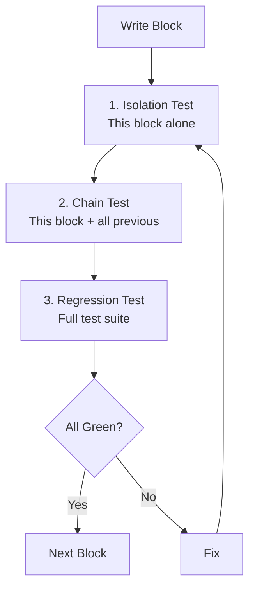
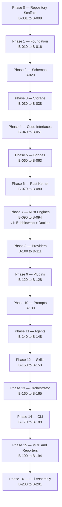
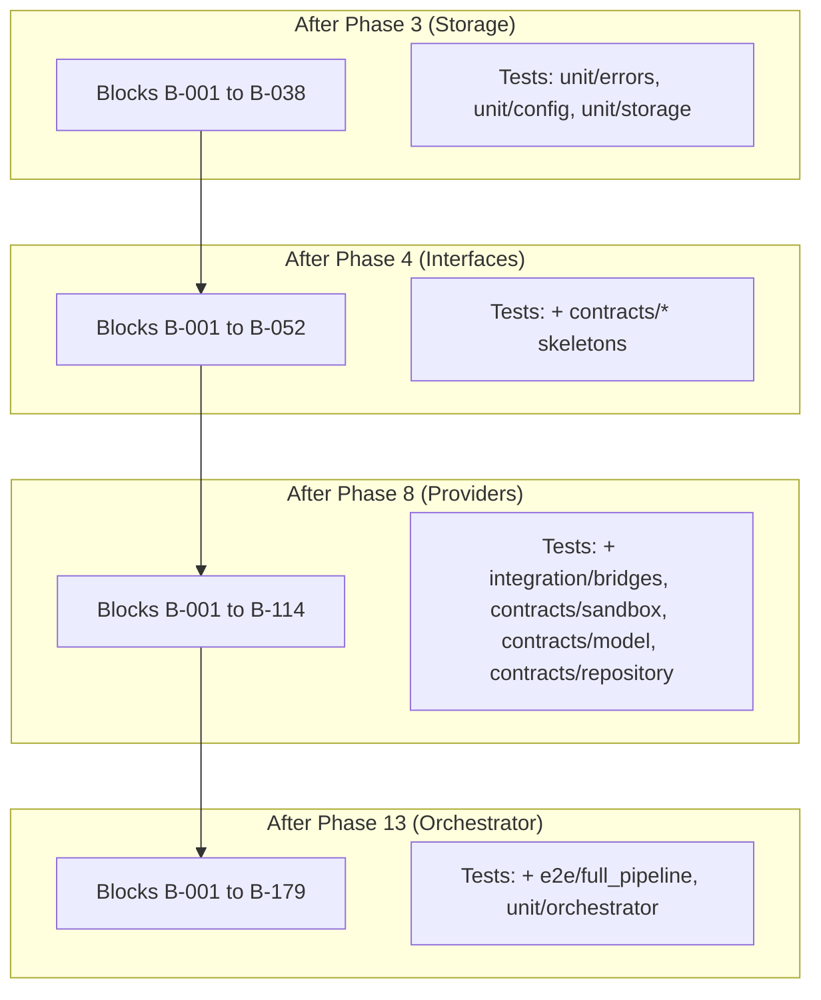

# BUILD_ORDER.md

**The complete file-by-file implementation sequence for CodeGuardian — from the empty tree to the full assembled system.**

---

## 1. Purpose

This document defines the **exact order** in which every file in the CodeGuardian repository is written. It is not a roadmap. It is not a design document. It is the **build order** — which file to write, which test to run, and when to move on.

Every block in this document is a **testable unit**. A block may contain one file or several files that form a coherent module. You do not move to the next block until the current block passes isolation, chain, and regression.

---

## 2. Two Meanings of "Interface"

The word "interface" appears twice in this project.

| Term | Meaning | When Built |
|---|---|---|
| **Code interface** | A contract — a Protocol, an abstract class. Defines *what* a component does, not *how*. | Early. Phase 4. |
| **User interface (UI)** | The CLI, the TUI. What the human sees and types. | Late. Phase 14. |

When this document says "interface," it means **code interface**. The CLI is built last.

---

## 3. The Three-Test Gate

Every block passes three gates before the next block begins.

| Gate | What It Tests | Scope |
|---|---|---|
| **Isolation** | The block works on its own | Just this block |
| **Chain** | The block works with everything built before it | This block + all previous |
| **Regression** | Nothing that worked before is now broken | The full test suite |

**Rule:** If any gate fails, fix the block. Do not move to the next block.

---

## 4. The Full Build Chain

---

## 5. Phase 0 — Repository Scaffold

These files configure the project. They have no tests. They must exist before any code.

### Block B-001 — Root Configuration

| File | Purpose |
|---|---|
| `pyproject.toml` | Python project metadata, dependencies, build config |
| `Cargo.toml` | Rust workspace metadata |
| `Cargo.lock` | Rust dependency lock |
| `rust-toolchain.toml` | Rust version pin |
| `rustfmt.toml` | Rust formatting rules |
| `clippy.toml` | Rust lint rules |
| `justfile` | Cross-platform task runner |
| `.gitignore` | Git exclusions |
| `.codeguardianignore` | CodeGuardian's own exclusion patterns |
| `.dockerignore` | Docker build exclusions |
| `.editorconfig` | Editor consistency |
| `.env.example` | Environment variable template |
| `.python-version` | Python version pin |
| `.pre-commit-config.yaml` | Pre-commit hooks |
| `mkdocs.yml` | Documentation site config |

**Exit gate:** `just --list` runs. Pre-commit hooks install. No syntax errors.

### Block B-002 — GitHub Configuration

| File | Purpose |
|---|---|
| `.github/CODEOWNERS` | Code ownership |
| `.github/dependabot.yml` | Dependency updates |
| `.github/PULL_REQUEST_TEMPLATE.md` | PR template |
| `.github/ISSUE_TEMPLATE/bug_report.md` | Bug template |
| `.github/ISSUE_TEMPLATE/feature_request.md` | Feature template |
| `.github/ISSUE_TEMPLATE/plugin_proposal.md` | Plugin proposal template |
| `.github/workflows/ci.yml` | CI pipeline |
| `.github/workflows/docs.yml` | Docs build |
| `.github/workflows/release.yml` | Release pipeline |
| `.github/workflows/security.yml` | Security scanning |

**Exit gate:** GitHub Actions parses all workflows without error.

### Block B-003 — Devcontainer

| File | Purpose |
|---|---|
| `.devcontainer/devcontainer.json` | Dev container config |
| `.devcontainer/Dockerfile` | Dev container image |

**Exit gate:** `devcontainer` builds successfully.

### Block B-004 — Docker Sandbox Images (Fallback)

These images are the Docker fallback for Windows, CI, and Linux systems without user namespaces. They are not the default local Linux backend — Bubblewrap is. Docker is built here so the fallback path exists from day one.

| File | Purpose |
|---|---|
| `docker/Dockerfile.python-sandbox` | Python sandbox base image (Docker fallback) |
| `docker/Dockerfile.typescript-sandbox` | TypeScript sandbox base image (Docker fallback) |

**Exit gate:** Both images build. Each contains the right runtime and test runner.

### Block B-005 — Benchmarks Scaffold

| File | Purpose |
|---|---|
| `benchmarks/README.md` | Benchmarks documentation |
| `benchmarks/fixtures/.gitkeep` | Placeholder |
| `benchmarks/baselines/.gitkeep` | Placeholder |

**Exit gate:** Directories exist. README explains the benchmark process.

### Block B-006 — Project Documentation Files

| File | Purpose |
|---|---|
| `LICENSE` | Apache 2.0 license text |
| `README.md` | Project front door |
| `skills.md` | Agent operating manual |
| `CHANGELOG.md` | Release history |
| `CONTRIBUTING.md` | Contribution guide |
| `CODE_OF_CONDUCT.md` | Community guidelines |
| `SECURITY.md` | Security policy |

**Exit gate:** All files exist. README renders correctly.

### Block B-007 — Examples

| File | Purpose |
|---|---|
| `examples/configs/minimal.toml` | Minimal config example |
| `examples/configs/local_models.toml` | Local model config example |
| `examples/configs/multi_provider.toml` | Multi-provider config example |
| `examples/configs/enterprise.toml` | Enterprise config example |
| `examples/skills/python-add-type-hints/SKILL.md` | Example skill |
| `examples/skills/typescript-extract-interface/SKILL.md` | Example skill |

**Exit gate:** Configs validate against the config schema. Skills parse.

### Block B-008 — Bundled Skills

| File | Purpose |
|---|---|
| `skills/README.md` | Bundled skills documentation |

**Exit gate:** Directory exists. README explains the bundled skills.

---

## 6. Phase 1 — Foundation

No dependencies. Everything depends on these.

### Block B-010 — Version

| File | Purpose |
|---|---|
| `python/codeguardian/version.py` | Version string |
| `python/codeguardian/__init__.py` | Package init |
| `python/pyproject.toml` | Python package metadata |

**Test file:** None (trivial).
**Exit gate:** `from codeguardian import version` works.

### Block B-011 — Error Codes and Taxonomy

| File | Purpose |
|---|---|
| `python/codeguardian/core/errors/__init__.py` | Package init |
| `python/codeguardian/core/errors/codes.py` | All error code constants |
| `python/codeguardian/core/errors/taxonomy.py` | Error categories, retry semantics |

**Test file:** `tests/unit/core/test_errors.py`
**Exit gate:** All error codes defined. Taxonomy maps codes to categories. Tests pass.

### Block B-012 — Error Retry and Redaction

| File | Purpose |
|---|---|
| `python/codeguardian/core/errors/retry.py` | Backoff logic |
| `python/codeguardian/core/errors/redaction.py` | Secret redaction rules |

**Test file:** `tests/unit/core/test_errors.py` (extended)
**Exit gate:** Retry backoff computed correctly. Known secrets are redacted.

### Block B-013 — Config Schema

| File | Purpose |
|---|---|
| `python/codeguardian/core/config/__init__.py` | Package init |
| `python/codeguardian/core/config/schema.py` | Config schema definition |

**Test file:** `tests/unit/core/test_config.py`
**Exit gate:** Schema validates a sample config. Invalid configs rejected.

### Block B-014 — Config Defaults

| File | Purpose |
|---|---|
| `python/codeguardian/core/config/defaults.py` | Default config values |

**Test file:** `tests/unit/core/test_config.py` (extended)
**Exit gate:** Defaults populate a schema instance. All required fields present.

### Block B-015 — Config Loader

| File | Purpose |
|---|---|
| `python/codeguardian/core/config/loader.py` | TOML config loader |

**Test file:** `tests/unit/core/test_config.py` (extended)
**Exit gate:** `config.toml` loads. Missing file falls back to defaults. Invalid TOML produces a clear error.

### Block B-016 — Config Secrets

| File | Purpose |
|---|---|
| `python/codeguardian/core/config/secrets.py` | OS keychain access |

**Test file:** `tests/unit/core/test_config.py` (extended)
**Exit gate:** Key set and retrieved from OS keychain. Missing key returns None.

---

## 7. Phase 2 — Schemas

### Block B-020 — All JSON Schemas

| File | Purpose |
|---|---|
| `schemas/cpg.json` | Code Property Graph metadata |
| `schemas/runtime-contract-map.json` | Runtime contract map |
| `schemas/recon.json` | Reconnaissance manifest |
| `schemas/blast-radius.json` | Blast radius report |
| `schemas/contract-assertions.json` | Contract assertions |
| `schemas/context-pack.json` | Context pack |
| `schemas/verification.json` | Verification result |
| `schemas/plan-approval.json` | Plan approval record |
| `schemas/consent.json` | Apply consent record |
| `schemas/checkpoint.json` | Checkpoint state |
| `schemas/audit-entry.json` | Audit entry |
| `schemas/plugin-manifest.json` | Plugin manifest |
| `schemas/skill.json` | Skill frontmatter |
| `schemas/run-summary.json` | Run summary |

**Test file:** `scripts/validate_schemas.py` (validates all schemas against the JSON Schema meta-schema)
**Exit gate:** Every schema validates. Every schema has a `$id`. Every schema has a `schema_version`.

---

## 8. Phase 3 — Storage

### Block B-030 — Migrations

| File | Purpose |
|---|---|
| `python/codeguardian/core/storage/migrations/__init__.py` | Migration loader |
| `python/codeguardian/core/storage/migrations/001_initial.sql` | Initial schema |

**Test file:** `tests/unit/core/test_storage.py`
**Exit gate:** Migration loads. SQL executes without error.

### Block B-031 — SQLite Store

| File | Purpose |
|---|---|
| `python/codeguardian/core/storage/__init__.py` | Storage facade |
| `python/codeguardian/core/storage/sqlite_store.py` | WAL-mode SQLite access |

**Test file:** `tests/unit/core/test_storage.py`, `tests/unit/core/test_sqlite_wal.py`
**Exit gate:** Connection opens in WAL mode. All PRAGMAs applied. CRUD works. Concurrent reads work.

### Block B-032 — Filesystem Store

| File | Purpose |
|---|---|
| `python/codeguardian/core/storage/filesystem_store.py` | Artifact read/write |

**Test file:** `tests/unit/core/test_storage.py` (extended)
**Exit gate:** Artifacts written and read. Atomic rename on write. Missing files produce clear errors.

### Block B-033 — Graph Store

| File | Purpose |
|---|---|
| `python/codeguardian/core/storage/graph_store.py` | CPG binary file access |

**Test file:** `tests/unit/core/test_storage.py` (extended)
**Exit gate:** Binary CPG file memory-mapped. Read and write work.

### Block B-034 — Cache

| File | Purpose |
|---|---|
| `python/codeguardian/core/storage/cache.py` | LRU + disk cache |

**Test file:** `tests/unit/core/test_storage.py` (extended)
**Exit gate:** LRU evicts correctly. Disk cache persists. Cache hit and miss tracked.

### Block B-035 — Skill Store

| File | Purpose |
|---|---|
| `python/codeguardian/core/storage/skill_store.py` | Markdown + FTS5 + sqlite-vec |

**Test file:** `tests/unit/core/test_storage.py` (extended)
**Exit gate:** Skill saved as Markdown. FTS5 index updated. Vector embedding stored. Retrieval works.

### Block B-036 — Migrations Runner

| File | Purpose |
|---|---|
| `python/codeguardian/core/storage/migrations.py` | Apply schema migrations |

**Test file:** `tests/unit/core/test_storage.py` (extended)
**Exit gate:** Migrations run in order. Applied migrations tracked. Idempotent.

### Block B-037 — Cleanup

| File | Purpose |
|---|---|
| `python/codeguardian/core/storage/cleanup.py` | Background retention |

**Test file:** `tests/unit/core/test_storage.py` (extended)
**Exit gate:** Old artifacts removed. Audit logs retained. Cache evicted.

---

## 9. Phase 4 — Code Interfaces

All 12 Protocols. No implementations.

### Block B-040 to B-051 — All Interfaces

| Block | File | Interface For |
|---|---|---|
| **B-040** | `python/codeguardian/interfaces/__init__.py` | Package init |
| **B-041** | `python/codeguardian/interfaces/repository.py` | Local, GitHub, GitLab |
| **B-042** | `python/codeguardian/interfaces/apply.py` | Apply Provider |
| **B-043** | `python/codeguardian/interfaces/model.py` | All model providers |
| **B-044** | `python/codeguardian/interfaces/sandbox.py` | All sandbox backends |
| **B-045** | `python/codeguardian/interfaces/orchestrator.py` | LangGraph (v1) |
| **B-046** | `python/codeguardian/interfaces/agent.py` | 9 agents |
| **B-047** | `python/codeguardian/interfaces/tool.py` | MCP tools |
| **B-048** | `python/codeguardian/interfaces/verifier.py` | 3 verifiers |
| **B-049** | `python/codeguardian/interfaces/reporter.py` | JSON, SARIF, Markdown |
| **B-050** | `python/codeguardian/interfaces/language.py` | Python, TypeScript |
| **B-051** | `python/codeguardian/interfaces/mcp_client.py` | External MCP tools |
| **B-052** | `python/codeguardian/interfaces/mcp_server.py` | Exposed tools |

**Test files:** `tests/contracts/test_*_contract.py` (skeletons — they fail without implementations)
**Exit gate:** All Protocols import. Type checkers pass. Contract test skeletons exist.

---

## 10. Phase 5 — Bridges

### Block B-060 — Bridge Protocol

| File | Purpose |
|---|---|
| `python/codeguardian/core/bridges/__init__.py` | Package init |
| `python/codeguardian/core/bridges/protocol.py` | Message schemas |

**Test file:** `tests/integration/test_pyo3_bridge.py`, `tests/integration/test_jsonrpc_bridge.py`
**Exit gate:** Message schemas validate.

### Block B-061 — PyO3 Bridge

| File | Purpose |
|---|---|
| `python/codeguardian/core/bridges/pyo3_bridge.py` | Batched PyO3 calls |

**Test file:** `tests/integration/test_pyo3_bridge.py`
**Exit gate:** Python calls a stub Rust function via PyO3. Batch of 500 items in one call.

### Block B-062 — JSON-RPC Bridge

| File | Purpose |
|---|---|
| `python/codeguardian/core/bridges/jsonrpc_bridge.py` | JSON-RPC over stdio |

**Test file:** `tests/integration/test_jsonrpc_bridge.py`
**Exit gate:** Python calls a stub Rust function via JSON-RPC. Batch of 10 items in one call.

### Block B-063 — Rust RPC Crate

| File | Purpose |
|---|---|
| `rust/crates/codeguardian-rpc/Cargo.toml` | Crate metadata |
| `rust/crates/codeguardian-rpc/src/lib.rs` | Crate entry |
| `rust/crates/codeguardian-rpc/src/protocol.rs` | Message types |
| `rust/crates/codeguardian-rpc/src/server.rs` | Server side |
| `rust/crates/codeguardian-rpc/src/client.rs` | Client side |

**Test file:** Rust `#[cfg(test)]` modules
**Exit gate:** Server and client communicate over stdio. Round-trip works.

---

## 11. Phase 6 — Rust Kernel

### Block B-070 — Kernel Crate Setup

| File | Purpose |
|---|---|
| `rust/crates/codeguardian-kernel/Cargo.toml` | Crate metadata |
| `rust/crates/codeguardian-kernel/src/lib.rs` | Crate entry |

**Test file:** Rust `#[cfg(test)]`
**Exit gate:** `cargo build --workspace` succeeds.

### Block B-071 — Parser

| File | Purpose |
|---|---|
| `rust/crates/codeguardian-kernel/src/parser.rs` | Tree-sitter wrapper |

**Test file:** Rust `#[cfg(test)]`
**Exit gate:** Parses Python and TypeScript files. Returns valid AST.

### Block B-072 — AST Builder

| File | Purpose |
|---|---|
| `rust/crates/codeguardian-kernel/src/ast.rs` | AST nodes |

**Test file:** Rust `#[cfg(test)]`
**Exit gate:** AST contains expected node types. Traversal works.

### Block B-073 — CFG Builder

| File | Purpose |
|---|---|
| `rust/crates/codeguardian-kernel/src/cfg.rs` | Control flow graph |

**Test file:** Rust `#[cfg(test)]`
**Exit gate:** CFG edges for a function are correct.

### Block B-074 — PDG Builder

| File | Purpose |
|---|---|
| `rust/crates/codeguardian-kernel/src/pdg.rs` | Program dependence graph |

**Test file:** Rust `#[cfg(test)]`
**Exit gate:** Data and control dependencies correct.

### Block B-075 — Call Graph

| File | Purpose |
|---|---|
| `rust/crates/codeguardian-kernel/src/call_graph.rs` | Caller/callee edges |

**Test file:** Rust `#[cfg(test)]`
**Exit gate:** Direct callers and callees resolved.

### Block B-076 — Symbol Table

| File | Purpose |
|---|---|
| `rust/crates/codeguardian-kernel/src/symbol_table.rs` | Symbol extraction |

**Test file:** Rust `#[cfg(test)]`
**Exit gate:** Symbols extracted with correct types.

### Block B-077 — CPG Merge

| File | Purpose |
|---|---|
| `rust/crates/codeguardian-kernel/src/cpg.rs` | Merged graph |

**Test file:** Rust `#[cfg(test)]`
**Exit gate:** CPG contains AST, CFG, PDG, call graph edges.

### Block B-078 — Incremental Update

| File | Purpose |
|---|---|
| `rust/crates/codeguardian-kernel/src/incremental.rs` | Incremental updates |

**Test file:** Rust `#[cfg(test)]`
**Exit gate:** File change updates only the affected portion. Faster than full rebuild.

### Block B-079 — Query

| File | Purpose |
|---|---|
| `rust/crates/codeguardian-kernel/src/query.rs` | Graph queries |

**Test file:** Rust `#[cfg(test)]`
**Exit gate:** `resolve_callers`, `resolve_callees`, `query_graph` return correct results.

### Block B-080 — PyO3 Kernel Bindings

| File | Purpose |
|---|---|
| `rust/crates/codeguardian-pyo3/Cargo.toml` | Crate metadata |
| `rust/crates/codeguardian-pyo3/src/lib.rs` | PyO3 module |
| `rust/crates/codeguardian-pyo3/src/kernel.rs` | Kernel bindings |

**Test file:** `tests/unit/rust/test_kernel.py`
**Exit gate:** Python calls kernel functions via PyO3. 500-file batch in one call. GIL released.

---

## 12. Phase 7 — Rust Engines

### Block B-090 — Blast Crate

| File | Purpose |
|---|---|
| `rust/crates/codeguardian-blast/Cargo.toml` | Crate metadata |
| `rust/crates/codeguardian-blast/src/lib.rs` | Crate entry |
| `rust/crates/codeguardian-blast/src/callers.rs` | Direct + transitive callers |
| `rust/crates/codeguardian-blast/src/contracts.rs` | Contract violation detection |
| `rust/crates/codeguardian-blast/src/coverage.rs` | Coverage gap detection |
| `rust/crates/codeguardian-blast/src/score.rs` | Blast score |
| `rust/crates/codeguardian-blast/src/recommendation.rs` | Proceed/review/block |

**Test file:** `tests/unit/rust/test_blast.py`, Rust `#[cfg(test)]`
**Exit gate:** Blast radius computed. Contract violations detected. Score bounded 0–100. Recommendation correct.

### Block B-091 — Sandbox Crate

**v1 implements two backends: Bubblewrap (local Linux default) and Docker (fallback).**
Seatbelt is M4 (macOS). Firecracker is M7 (cloud). The crate is built with all four
files present so the trait is proven, but only two are wired into the v1 pipeline.

Files in build order:

| Order | File | Purpose |
|---|---|---|
| 1 | `rust/crates/codeguardian-sandbox/Cargo.toml` | Crate metadata |
| 2 | `rust/crates/codeguardian-sandbox/src/lib.rs` | Crate entry |
| 3 | `rust/crates/codeguardian-sandbox/src/backend.rs` | Backend trait (the contract) |
| 4 | `rust/crates/codeguardian-sandbox/src/quotas.rs` | cgroups v2 wiring (Bubblewrap resource limits) |
| 5 | `rust/crates/codeguardian-sandbox/src/network.rs` | Network isolation rules |
| 6 | `rust/crates/codeguardian-sandbox/src/bubblewrap.rs` | Bubblewrap backend (v1 local Linux default) |
| 7 | `rust/crates/codeguardian-sandbox/src/docker.rs` | Docker backend (v1 fallback) |
| 8 | `rust/crates/codeguardian-sandbox/src/pool.rs` | Warm container pool (Docker only) |
| 9 | `rust/crates/codeguardian-sandbox/src/seatbelt.rs` | Seatbelt backend (stub in v1, M4 complete) |
| 10 | `rust/crates/codeguardian-sandbox/src/firecracker.rs` | Firecracker backend (stub in v1, M7 complete) |

**Test file:** `tests/unit/rust/test_sandbox.py`, Rust `#[cfg(test)]`
**Exit gate:** Bubblewrap creates a sandbox. Docker creates a sandbox. Network isolated. cgroups v2 resource limits enforced. Both pass the shared contract test suite.

### Block B-092 — Audit Crate

| File | Purpose |
|---|---|
| `rust/crates/codeguardian-audit/Cargo.toml` | Crate metadata |
| `rust/crates/codeguardian-audit/src/lib.rs` | Crate entry |
| `rust/crates/codeguardian-audit/src/writer.rs` | Append-only writer |
| `rust/crates/codeguardian-audit/src/hash_chain.rs` | Hash chain |
| `rust/crates/codeguardian-audit/src/verify.rs` | Chain verification |
| `rust/crates/codeguardian-audit/src/export.rs` | Export formats |

**Test file:** `tests/unit/rust/test_audit.py`, Rust `#[cfg(test)]`
**Exit gate:** Entry written. Hash chain valid. Tampering detected. Export works.

### Block B-093 — Policy Crate

| File | Purpose |
|---|---|
| `rust/crates/codeguardian-policy/Cargo.toml` | Crate metadata |
| `rust/crates/codeguardian-policy/src/lib.rs` | Crate entry |
| `rust/crates/codeguardian-policy/src/sandbox_policy.rs` | Sandbox policy enforcement |
| `rust/crates/codeguardian-policy/src/plugin_permissions.rs` | Plugin permission enforcement |
| `rust/crates/codeguardian-policy/src/resource_limits.rs` | Resource limit enforcement |

**Test file:** Rust `#[cfg(test)]`
**Exit gate:** Undeclared plugin access blocked. Resource limits enforced.

### Block B-094 — PyO3 Blast and Policy Bindings

| File | Purpose |
|---|---|
| `rust/crates/codeguardian-pyo3/src/blast.rs` | Blast engine bindings |
| `rust/crates/codeguardian-pyo3/src/policy.rs` | Policy engine bindings |

**Test file:** `tests/unit/rust/test_blast.py` (extended)
**Exit gate:** Python calls blast and policy via PyO3.

---

## 13. Phase 8 — Providers

### Block B-100 to B-111 — All Providers

| Block | File | Purpose |
|---|---|---|
| **B-100** | `python/codeguardian/core/providers/__init__.py` | Package init |
| **B-101** | `python/codeguardian/core/providers/local_repository.py` | LocalProvider |
| **B-102** | `python/codeguardian/core/providers/github_repository.py` | GitHubProvider |
| **B-103** | `python/codeguardian/core/providers/gitlab_repository.py` | GitLabProvider |
| **B-104** | `python/codeguardian/core/providers/apply_provider.py` | ApplyProvider |
| **B-105** | `python/codeguardian/core/providers/anthropic_model.py` | Anthropic provider |
| **B-106** | `python/codeguardian/core/providers/openai_model.py` | OpenAI provider |
| **B-107** | `python/codeguardian/core/providers/deepseek_model.py` | DeepSeek provider |
| **B-108** | `python/codeguardian/core/providers/openai_compatible.py` | OpenAI-compatible |
| **B-109** | `python/codeguardian/core/sandbox/__init__.py` | Package init |
| **B-110** | `python/codeguardian/core/sandbox/backend_selector.py` | Backend chooser (auto-detect, explicit override, fallback chain) |
| **B-111** | `python/codeguardian/core/sandbox/bubblewrap_backend.py` | Bubblewrap (v1 local Linux default) |
| **B-112** | `python/codeguardian/core/sandbox/docker_backend.py` | Docker (v1 fallback: Windows, CI, Linux without user namespaces) |
| **B-113** | `python/codeguardian/core/sandbox/seatbelt_backend.py` | Seatbelt (M4 — stub in v1) |
| **B-114** | `python/codeguardian/core/sandbox/firecracker_backend.py` | Firecracker (M7 — stub in v1) |

**Test files:** `tests/contracts/test_repository_contract.py`, `test_model_contract.py`, `test_sandbox_contract.py`
**Exit gate:** All implementations pass their contract tests.

---

## 14. Phase 9 — Plugins

### Block B-120 to B-128 — Plugin System

| Block | File | Purpose |
|---|---|---|
| **B-120** | `python/codeguardian/core/plugins/__init__.py` | Package init |
| **B-121** | `python/codeguardian/core/plugins/manifest.py` | Manifest schema + validation |
| **B-122** | `python/codeguardian/core/plugins/registry.py` | Plugin registry |
| **B-123** | `python/codeguardian/core/plugins/loader.py` | Entry-point discovery |
| **B-124** | `python/codeguardian/core/plugins/fault_barrier.py` | Fault isolation |
| **B-125** | `python/codeguardian/core/plugins/versioning.py` | N and N-1 compatibility |
| **B-126** | `python/codeguardian/plugins_bundled/__init__.py` | Package init |
| **B-127** | `python/codeguardian/plugins_bundled/languages/__init__.py` | Package init |
| **B-128** | `python/codeguardian/plugins_bundled/languages/python/plugin.py` | Python language plugin |
| **B-129** | `python/codeguardian/plugins_bundled/languages/python/pyproject.toml` | Plugin metadata |
| **B-130** | `python/codeguardian/plugins_bundled/languages/typescript/plugin.py` | TypeScript language plugin |
| **B-131** | `python/codeguardian/plugins_bundled/languages/typescript/pyproject.toml` | Plugin metadata |
| **B-132** | `python/codeguardian/plugins_bundled/tools/__init__.py` | Package init |
| **B-133** | `python/codeguardian/plugins_bundled/tools/ast_grep/plugin.py` | ast-grep plugin |
| **B-134** | `python/codeguardian/plugins_bundled/tools/ast_grep/pyproject.toml` | Plugin metadata |
| **B-135** | `python/codeguardian/plugins_bundled/tools/code_analysis/plugin.py` | Code analysis plugin |
| **B-136** | `python/codeguardian/plugins_bundled/tools/code_analysis/pyproject.toml` | Plugin metadata |
| **B-137** | `python/codeguardian/plugins_bundled/reporters/__init__.py` | Package init |
| **B-138** | `python/codeguardian/plugins_bundled/reporters/sarif_reporter/plugin.py` | SARIF reporter plugin |
| **B-139** | `python/codeguardian/plugins_bundled/reporters/sarif_reporter/pyproject.toml` | Plugin metadata |

**Test files:** `tests/integration/test_plugin_loading.py`, `tests/contracts/test_language_contract.py`, `test_tool_contract.py`, `test_reporter_contract.py`
**Exit gate:** Dummy plugin discovered via entry point. Faulty plugin isolated. Contract tests pass.

---

## 15. Phase 10 — Prompts

### Block B-140 — All Prompt Files

| File | Purpose |
|---|---|
| `prompts/analyst/v1.0.0.md` | Analyst prompt |
| `prompts/tester/v1.0.0.md` | Tester prompt |
| `prompts/writer/v1.0.0.md` | Writer prompt |
| `prompts/correctness_verifier/v1.0.0.md` | Correctness verifier prompt |
| `prompts/security_verifier/v1.0.0.md` | Security verifier prompt |
| `prompts/contract_verifier/v1.0.0.md` | Contract verifier prompt |
| `prompts/skill_curator/v1.0.0.md` | Skill curator prompt |

**Test file:** None (validated at runtime by schema).
**Exit gate:** All prompts render with test variables. Version metadata present.

---

## 16. Phase 11 — Agents

### Block B-150 to B-158 — All Agents

| Block | File | Purpose |
|---|---|---|
| **B-150** | `python/codeguardian/core/agents/__init__.py` | Package init |
| **B-151** | `python/codeguardian/core/agents/recon.py` | Recon Agent (deterministic) |
| **B-152** | `python/codeguardian/core/agents/blast.py` | Blast Radius Agent (deterministic) |
| **B-153** | `python/codeguardian/core/agents/analyst.py` | Analyst |
| **B-154** | `python/codeguardian/core/agents/tester.py` | Tester |
| **B-155** | `python/codeguardian/core/agents/writer.py` | Writer |
| **B-156** | `python/codeguardian/core/agents/correctness_verifier.py` | Correctness Verifier |
| **B-157** | `python/codeguardian/core/agents/security_verifier.py` | Security Verifier |
| **B-158** | `python/codeguardian/core/agents/contract_verifier.py` | Contract Verifier |
| **B-159** | `python/codeguardian/core/agents/skill_curator.py` | Skill Curator |

**Test file:** `tests/unit/core/test_agents.py`, `tests/e2e/test_blast_radius.py`
**Exit gate:** Recon produces `recon.json`. Blast produces `blast-radius.json`. Analyst produces Context Pack. Tester produces tests. Writer produces diff. All three verifiers return verdicts.

---

## 17. Phase 12 — Skills Module

### Block B-160 to B-163 — Skills

| Block | File | Purpose |
|---|---|---|
| **B-160** | `python/codeguardian/core/skills/__init__.py` | Package init |
| **B-161** | `python/codeguardian/core/skills/library.py` | Skill library |
| **B-162** | `python/codeguardian/core/skills/indexer.py` | FTS5 indexer |
| **B-163** | `python/codeguardian/core/skills/retriever.py` | Semantic retrieval |
| **B-164** | `python/codeguardian/core/skills/embeddings.py` | Vector embeddings |

**Test file:** `tests/unit/core/test_skills.py`
**Exit gate:** Skill stored, indexed, retrieved. Library rebuildable from Markdown.

---

## 18. Phase 13 — Orchestrator

### Block B-170 to B-175 — Orchestrator

| Block | File | Purpose |
|---|---|---|
| **B-170** | `python/codeguardian/core/orchestrator/__init__.py` | Package init |
| **B-171** | `python/codeguardian/core/orchestrator/phase_gates.py` | Entry/exit conditions |
| **B-172** | `python/codeguardian/core/orchestrator/consent.py` | Plan + apply consent |
| **B-173** | `python/codeguardian/core/orchestrator/verification_prompt.py` | Per-run prompt |
| **B-174** | `python/codeguardian/core/orchestrator/checkpointing.py` | Resume-from-last |
| **B-175** | `python/codeguardian/core/orchestrator/langgraph_orchestrator.py` | Full pipeline |

**Test files:** `tests/unit/core/test_orchestrator.py`, `test_phase_gates.py`, `test_checkpointing.py`, `test_consent.py`
**Exit gate:** Full pipeline runs end-to-end. Checkpointing resumes after crash. Consent gates enforced.

### Block B-176 to B-178 — Telemetry

| Block | File | Purpose |
|---|---|---|
| **B-176** | `python/codeguardian/core/telemetry/__init__.py` | Package init |
| **B-177** | `python/codeguardian/core/telemetry/metrics.py` | Metrics collection |
| **B-178** | `python/codeguardian/core/telemetry/tracing.py` | LangSmith tracing |
| **B-179** | `python/codeguardian/core/telemetry/langsmith.py` | LangSmith integration |

**Test file:** `tests/unit/core/test_telemetry.py`
**Exit gate:** Metrics collected. Traces sent to LangSmith.

---

## 19. Phase 14 — CLI

### Block B-180 to B-187 — CLI Commands

| Block | File | Purpose |
|---|---|---|
| **B-180** | `python/codeguardian/cli/__init__.py` | Package init |
| **B-181** | `python/codeguardian/cli/main.py` | CLI entry point |
| **B-182** | `python/codeguardian/cli/commands/__init__.py` | Package init |
| **B-183** | `python/codeguardian/cli/commands/run.py` | `codeguardian run` |
| **B-184** | `python/codeguardian/cli/commands/recon.py` | `codeguardian recon` |
| **B-185** | `python/codeguardian/cli/commands/blast.py` | `codeguardian blast` |
| **B-186** | `python/codeguardian/cli/commands/verify.py` | `codeguardian verify` |
| **B-187** | `python/codeguardian/cli/commands/skill.py` | `codeguardian skill` |
| **B-188** | `python/codeguardian/cli/commands/serve.py` | `codeguardian serve` |
| **B-189** | `python/codeguardian/cli/commands/config.py` | `codeguardian config` |

**Test file:** `tests/unit/cli/test_commands.py`
**Exit gate:** Every command runs. Exit codes correct.

### Block B-190 to B-194 — CLI Views

| Block | File | Purpose |
|---|---|---|
| **B-190** | `python/codeguardian/cli/views/__init__.py` | Package init |
| **B-191** | `python/codeguardian/cli/views/recon_view.py` | Reconnaissance dashboard |
| **B-192** | `python/codeguardian/cli/views/blast_view.py` | Blast radius visualization |
| **B-193** | `python/codeguardian/cli/views/plan_view.py` | Plan approval view |
| **B-194** | `python/codeguardian/cli/views/diff_view.py` | Diff preview |
| **B-195** | `python/codeguardian/cli/views/verify_view.py` | Verification report |

**Test file:** `tests/unit/cli/test_views.py`
**Exit gate:** Every view renders correctly.

### Block B-196 to B-199 — CLI UI

| Block | File | Purpose |
|---|---|---|
| **B-196** | `python/codeguardian/cli/ui/__init__.py` | Package init |
| **B-197** | `python/codeguardian/cli/ui/rich_output.py` | Rich panels |
| **B-198** | `python/codeguardian/cli/ui/textual_app.py` | Textual TUI |
| **B-199** | `python/codeguardian/cli/ui/prompts.py` | prompt_toolkit input |
| **B-200** | `python/codeguardian/cli/ui/progress.py` | Progress bars |

**Test file:** `tests/unit/cli/test_output.py`
**Exit gate:** Rich, Textual, prompt_toolkit all work.

### Block B-201 to B-203 — CLI Output

| Block | File | Purpose |
|---|---|---|
| **B-201** | `python/codeguardian/cli/output/__init__.py` | Package init |
| **B-202** | `python/codeguardian/cli/output/human.py` | Human-readable output |
| **B-203** | `python/codeguardian/cli/output/json.py` | JSON output |
| **B-204** | `python/codeguardian/cli/output/sarif.py` | SARIF output |

**Test file:** `tests/unit/cli/test_output.py`
**Exit gate:** All three output modes produce valid output.

---

## 20. Phase 15 — MCP and Reporters

### Block B-210 to B-213 — MCP

| Block | File | Purpose |
|---|---|---|
| **B-210** | `python/codeguardian/core/mcp/__init__.py` | Package init |
| **B-211** | `python/codeguardian/core/mcp/client.py` | Dynamic MCP client |
| **B-212** | `python/codeguardian/core/mcp/server.py` | MCP server |
| **B-213** | `python/codeguardian/core/mcp/tools.py` | Tool definitions |
| **B-214** | `python/codeguardian/core/mcp/transports.py` | stdio + HTTP |

**Test file:** `tests/integration/test_mcp_integration.py`, `tests/contracts/test_mcp_client_contract.py`, `test_mcp_server_contract.py`
**Exit gate:** Third-party client calls CodeGuardian tools. CodeGuardian consumes external MCP tools.

### Block B-215 to B-222 — Reporting

| Block | File | Purpose |
|---|---|---|
| **B-215** | `python/codeguardian/core/reporting/__init__.py` | Package init |
| **B-216** | `python/codeguardian/core/reporting/diff.py` | Diff generation |
| **B-217** | `python/codeguardian/core/reporting/pr_description.py` | PR description |
| **B-218** | `python/codeguardian/core/reporting/blast_summary.py` | Blast radius summary |
| **B-219** | `python/codeguardian/core/reporting/run_summary.py` | Run summary |
| **B-220** | `python/codeguardian/core/reporting/json_reporter.py` | JSON output |
| **B-221** | `python/codeguardian/core/reporting/sarif_reporter.py` | SARIF output |
| **B-222** | `python/codeguardian/core/reporting/markdown_reporter.py` | Markdown output |

**Test file:** `tests/contracts/test_reporter_contract.py`
**Exit gate:** All reporters produce valid output.

---

## 21. Phase 16 — Full Assembly

### Block B-230 — Entry Point

| File | Purpose |
|---|---|
| `python/codeguardian/__main__.py` | `python -m codeguardian` |

**Test file:** `tests/e2e/test_full_pipeline.py`
**Exit gate:** `python -m codeguardian --help` works.

### Block B-231 — Scripts

| File | Purpose |
|---|---|
| `scripts/build_rust.py` | Build Rust crates |
| `scripts/build_pyo3.py` | Build PyO3 bindings |
| `scripts/build_docs.py` | Build documentation |
| `scripts/package.py` | Package distribution |
| `scripts/release.py` | Release automation |
| `scripts/benchmark.py` | Performance benchmarks |
| `scripts/migrate.py` | Schema migration runner |
| `scripts/validate_schemas.py` | Schema validation |

**Test file:** None.
**Exit gate:** All scripts run without error.

### Block B-232 — End-to-End Tests

| File | Purpose |
|---|---|
| `tests/e2e/test_full_pipeline.py` | Full pipeline |
| `tests/e2e/test_legacy_refactor.py` | Legacy refactor |
| `tests/e2e/test_blast_radius.py` | Blast radius accuracy |
| `tests/e2e/fixtures/sample_python_repo/` | Test fixture |
| `tests/e2e/fixtures/sample_typescript_repo/` | Test fixture |
| `tests/e2e/fixtures/sample_multi_language_repo/` | Test fixture |

**Exit gate:** All E2E tests pass.

### Block B-233 — Test Fixtures

| File | Purpose |
|---|---|
| `tests/__init__.py` | Package init |
| `tests/conftest.py` | Shared fixtures |
| `tests/fixtures/__init__.py` | Package init |
| `tests/fixtures/repositories.py` | Repository fixtures |
| `tests/fixtures/models.py` | Model fixtures |
| `tests/fixtures/sandboxes.py` | Sandbox fixtures |

**Exit gate:** All fixtures load.

---

## 22. The Cumulative Chain Example

At every stage, the full suite is green. That is the invariant.

---

## 23. The Rule

> **One block at a time. Isolation. Chain. Regression. Green. Commit. Next.**

No skipping. No batching. No "I'll test it later." Every block is a proven unit before the next block begins.

---

## 24. Summary

| Phase | Blocks | Files Covered |
|---|---|---|
| Phase 0 — Scaffold | 8 | 40 |
| Phase 1 — Foundation | 7 | 12 |
| Phase 2 — Schemas | 1 | 14 |
| Phase 3 — Storage | 8 | 12 |
| Phase 4 — Interfaces | 13 | 13 |
| Phase 5 — Bridges | 4 | 8 |
| Phase 6 — Rust Kernel | 11 | 15 |
| Phase 7 — Rust Engines | 5 | 28 |
| Phase 8 — Providers | 15 | 15 |
| Phase 9 — Plugins | 20 | 20 |
| Phase 10 — Prompts | 1 | 7 |
| Phase 11 — Agents | 10 | 10 |
| Phase 12 — Skills | 5 | 5 |
| Phase 13 — Orchestrator | 10 | 10 |
| Phase 14 — CLI | 25 | 25 |
| Phase 15 — MCP + Reporters | 13 | 17 |
| Phase 16 — Full Assembly | 4 | 15 |
| **Total** | **160** | **266** |

---

## 25. Related Documents

- `docs/04-architecture.md` — what each block does
- `docs/05-data-model.md` — schemas each block produces or consumes
- `docs/06-api-contracts.md` — interfaces each block implements
- `docs/08-repository-structure.md` — where each file lives
- `docs/08A-module-relationships.md` — how blocks depend on each other
- `docs/10-testing-cicd-deployment.md` — how tests run in CI
- `docs/12-roadmap.md` — milestones that group blocks
