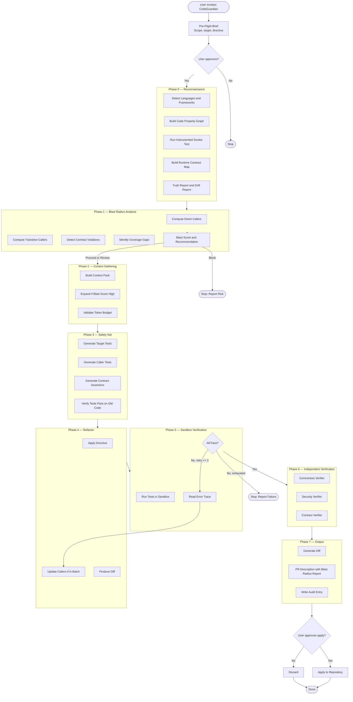
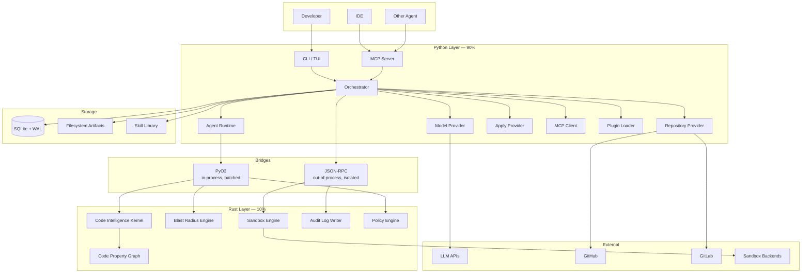
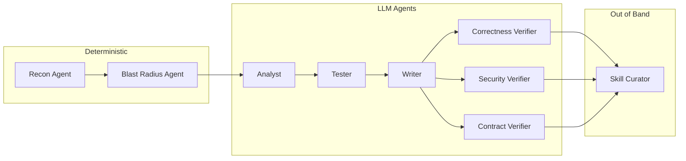
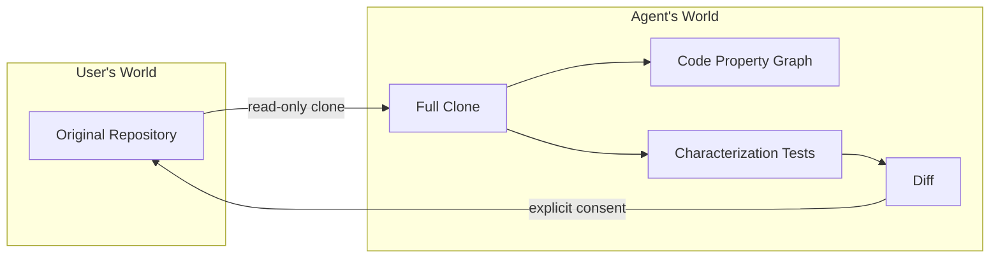
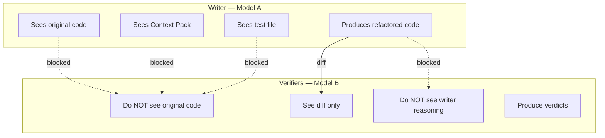
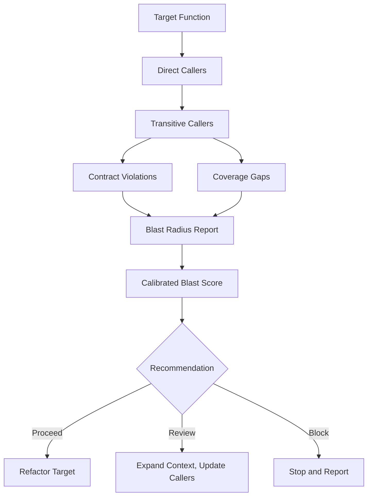

# CodeGuardian

**An open-source, safety-first refactoring agent that understands your codebase structurally before touching it, proves it didn't break anything with independent cross-model verification, and never modifies your real code without explicit consent.**

[](LICENSE)
[](https://www.python.org/)
[](https://www.rust-lang.org/)
[](docs/12-roadmap.md)

---

```
┌─────────────────────────────────────────────────────────────────────────┐
│                                                                         │
│  CodeGuardian Run                                                       │
│  ─────────────────                                                      │
│                                                                         │
│  Phase 0 — Reconnaissance............. ✓ 2m 14s                         │
│    → Detected: python, typescript                                       │
│    → CPG: 12,847 nodes, 34,291 edges                                    │
│    → Truth Report: 2 documentation mismatches                           │
│                                                                         │
│  Phase 1 — Blast Radius Analysis...... ✓ 28s                            │
│    → Direct callers: 14                                                 │
│    → Transitive callers: 47                                             │
│    → Contract violations: 2                                             │
│    → Blast score: 72 / 100  [REVIEW]                                    │
│                                                                         │
│  Phase 2 — Context Gathering.......... ✓ 1m 02s                         │
│  Phase 3 — Safety Net................. ✓ 2m 41s                         │
│    → 18 characterization tests, 2 contract assertions                   │
│  Phase 4 — Refactor................... ✓ 3m 18s                         │
│  Phase 5 — Sandbox Verification....... ✓ 1m 07s                         │
│  Phase 6 — Independent Verification... ✓ 2m 44s                         │
│    → Correctness: PASS   (different model family)                       │
│    → Security:    PASS   (different model family)                       │
│    → Contract:    PASS   (different model family)                       │
│                                                                         │
│  Phase 7 — Output..................... ✓                                │
│                                                                         │
│  Apply changes? (y/N)                                                   │
│                                                                         │
└─────────────────────────────────────────────────────────────────────────┘
```

---

## The Problem

Enterprises run on millions of lines of legacy code. It works, but nobody wants to touch it.

| The Reality | The Consequence |
|---|---|
| **No tests.** The code was written before testing was standard. | Engineers are afraid to refactor. One wrong change breaks production. |
| **No structural understanding.** Nobody knows what depends on what. | Changes ripple outward in ways nobody can predict. |
| **No proof.** Even when a refactor is done, there's no evidence behavior was preserved. | Only hope. |
| **AI agents make it worse.** They refactor, tests pass, but behavior drifts silently. | The 31.7% problem: self-review silently endorses its own semantic drift. |
| **No audit trail.** When an AI agent changes code, there's no record of why. | No accountability. No review. No rollback. |

---

## What Makes CodeGuardian Different

This is not another coding agent. It is a **structural intelligence and verification layer** built around models that already exist.

| Dimension | General Coding Agent | CodeGuardian |
|---|---|---|
| **Understanding before action** | Reads the target file | Builds a Code Property Graph — AST, control flow, and data dependence merged into one model |
| **Blast radius awareness** | Discovers breakage after the fact | Computes direct callers, transitive callers, contract violations, coverage gaps, and a calibrated blast score **before any change** |
| **Order of operations** | May refactor first, then test | **Must** write characterization tests first |
| **Safety net scope** | Tests the target function | Tests the target **and every caller it affects**, with contract assertions |
| **Safety gate** | Tests are optional | Tests **must pass on old code** before any change |
| **Isolation** | May run on your machine | **Always** runs in a sandbox — Bubblewrap, Seatbelt, Firecracker, or Docker |
| **Consent** | Writes to the working tree freely | **Never** touches real code without explicit approval. Full clone first. |
| **Evidence** | Produces new code | Produces **proof** behavior did not change |
| **Self-correction** | Retries until it works | Retries at most three times, then stops and reports |
| **Verification** | Same model reviews its own work | **Three independent verifiers** on a **different model family**, with diff-only context |
| **Audit trail** | None | Tamper-evident hash-chained log written by a separate Rust process |
| **Multi-language** | Often Python-first | Any Tree-sitter language, with tiered reliability |
| **Repository support** | Usually one provider | Local, GitHub, and GitLab |
| **Contribution** | Closed | Fully open source, plugin-based |

---

## Quick Start

```bash
# Install
pip install codeguardian

# Configure (creates ~/.codeguardian/config.toml)
codeguardian config init

# Set your API key (stored in OS keychain, never in config file)
codeguardian config set-key anthropic

# Run reconnaissance on a repository
codeguardian recon --url https://github.com/example/legacy-project

# Refactor a target
codeguardian run \
  --url https://github.com/example/legacy-project \
  --target utils/parser.py:parse_config \
  --directive "add type hints and extract long functions"
```

**No API keys required for local models.** Point CodeGuardian at Ollama, vLLM, llama.cpp, or LM Studio via OpenAI-compatible endpoints. Cost becomes electricity, not tokens.

---

## The Pipeline

Eight phases. Each is a checkpointed, gated step. No phase runs until the previous phase passes.



---

## The Guarantees

CodeGuardian makes ten promises. Each is enforced architecturally, not by convention.

### 1. No code is modified without explicit user consent.
The Repository Provider has no write method. Applying changes is a separate, consent-gated step. The consent record is written to the audit log with a timestamp.

### 2. No untrusted code runs outside the sandbox.
Every execution goes through the sandbox backend. Network is isolated except during dependency resolution. CPU, memory, and process quotas are enforced.

### 3. No refactor is applied without a passing characterization test on the old code.
The orchestrator enforces the safety net as a mandatory phase. If the tests do not pass on the original code, the pipeline stops and reports the code as broken.

### 4. Every refactor is verified by a model instance that did not write it.
Three verifiers — correctness, security, and contract — run on a fresh model instance from a different family, with diff-only context. No original code. No writer reasoning.

### 5. Every target is analyzed for blast radius before any change.
Direct callers, transitive callers, contract violations, coverage gaps, and a calibrated blast score are computed in Phase 1. A block recommendation stops the pipeline unless the user overrides.

### 6. Every run produces a structured audit trail.
Hash-chained JSONL, written by a separate Rust process. Python never has a file handle to the log. Every prompt, diff, verdict, and consent record is captured.

### 7. The system never sends the full repository to a model.
The Context Pack contains only the target and its required dependencies. The full repository is never sent.

### 8. A failed refactor is reported honestly.
Retries are capped at three. Exhaustion produces a failure report with the error trace and the last attempted diff.

### 9. Documentation drift is surfaced, not silently inherited.
The Truth Report flags every claim the code contradicts. The Drift Report flags every version mismatch.

### 10. Adding a language, provider, tool, verifier, reporter, or sandbox backend never requires a core change.
All extensions are plugins with declared interfaces and contract tests.

---

## Architecture at a Glance

Python for orchestration and AI. Rust for safety and performance. Two bridges. One pipeline.



### The Language Boundary

| Layer | Language | Owns | Why |
|---|---|---|---|
| **AI & Orchestration** | Python | Orchestrator, agents, model calls, CLI, plugins, MCP | The AI ecosystem is Python-first. Iteration speed matters more than raw execution speed. |
| **Safety & Performance** | Rust | Sandbox, Code Property Graph, Blast Radius Engine, Audit Writer, Policy Engine | Memory safety, determinism, and speed where untrusted code is parsed or executed. |

**The rule:** If it touches untrusted code, or must be fast and deterministic, it is Rust. If it touches an AI model, or changes frequently, it is Python.

### The Sandbox Tiers

| Context | Backend | Isolation |
|---|---|---|
| **Local Linux** | Bubblewrap | Linux namespaces. No daemon required. |
| **Local macOS** | Seatbelt | Kernel-enforced SBPL profiles. |
| **Cloud / Multi-tenant** | Firecracker | Hardware virtualization. Each execution gets its own kernel. |
| **CI / Windows / Fallback** | Docker | OS-level namespaces and cgroups. |

All backends enforce network isolation, CPU quotas, memory quotas, process limits, and swap disabled. The sandbox is destroyed after each run.

---

## The Agent Model

Nine agents. Two are deterministic. Seven use language models. One runs out of band.



| Agent | Type | Responsibility |
|---|---|---|
| **Recon** | Deterministic | Builds the CPG, runs the smoke test, produces Truth and Drift reports |
| **Blast Radius** | Deterministic | Computes callers, contract violations, coverage gaps, blast score |
| **Analyst** | LLM | Builds the Context Pack |
| **Tester** | LLM | Writes characterization tests and contract assertions |
| **Writer** | LLM | Refactors code according to the directive |
| **Correctness Verifier** | LLM | Independent behavioral equivalence check |
| **Security Verifier** | LLM | Independent vulnerability check |
| **Contract Verifier** | LLM | Independent caller contract check |
| **Skill Curator** | LLM | Extracts reusable patterns on user approval |

---

## The Trust Model



**The agent never has a path to write to the original repository.** Not through a bug, not through a plugin, not through a compromised process. The only way a change reaches the user's repository is through the Apply Provider, which requires explicit consent.

---

## Why Independent Verification Matters

When the same model writes code and then reviews it, it silently endorses its own errors at a measurable rate. Research across production language models found that **31.7% of semantic drift cases are silently endorsed by the same model that produced them**. The failure is structural, not a matter of model quality.

CodeGuardian solves this with three independent verifiers. Each runs on a fresh model instance from a different family, with no access to the original code or the writer's reasoning.



---

## Why Blast Radius Matters

The most dangerous failure mode in agentic refactoring is **cross-file context blindness**. An agent modifies a function and discovers the blast radius after the fact — through broken tests, type errors, or incomplete grep-based call-site search.

CodeGuardian computes the blast radius before any change.



The Blast Radius Report includes direct callers, transitive callers, contract violations, coverage gaps, and a calibrated blast score with a proceed/review/block recommendation. The block gate is enforced — the pipeline does not proceed past a block recommendation without explicit user override.

---

## Status

| Component | Status |
|---|---|
| Documentation | Complete |
| Repository scaffold | In progress |
| Vertical slice (M1) | In progress |
| Blast radius engine (M2) | Planned |
| Full pipeline (M3) | Planned |
| Multi-language + multi-repo (M4) | Planned |
| MCP + IDE (M5) | Planned |
| Skills + greenfield (M6) | Planned |
| Cloud + enterprise (M7) | Planned |

See [`docs/12-roadmap.md`](docs/12-roadmap.md) for the full milestone breakdown.

---

## Documentation

| Document | What It Covers |
|---|---|
| [`docs/00-index.md`](docs/00-index.md) | Documentation index and reading paths |
| [`docs/01-project-overview.md`](docs/01-project-overview.md) | Vision, problem, positioning, core guarantees |
| [`docs/02-goals-non-goals-metrics.md`](docs/02-goals-non-goals-metrics.md) | Goals, non-goals, success metrics, anti-metrics |
| [`docs/03-requirements.md`](docs/03-requirements.md) | Functional and non-functional requirements |
| [`docs/04-architecture.md`](docs/04-architecture.md) | Full system design |
| [`docs/05-data-model.md`](docs/05-data-model.md) | Schemas, storage, lifecycle |
| [`docs/06-api-contracts.md`](docs/06-api-contracts.md) | Interface contracts |
| [`docs/07-tech-stack.md`](docs/07-tech-stack.md) | Technology decisions |
| [`docs/08-repository-structure.md`](docs/08-repository-structure.md) | Directory layout and conventions |
| [`docs/08A-module-relationships.md`](docs/08A-module-relationships.md) | Module dependency map |
| [`docs/09-environment-setup.md`](docs/09-environment-setup.md) | Prerequisites, installation, configuration |
| [`docs/10-testing-cicd-deployment.md`](docs/10-testing-cicd-deployment.md) | Testing, CI/CD, deployment |
| [`docs/11-security-performance-observability.md`](docs/11-security-performance-observability.md) | Security, performance, observability |
| [`docs/12-roadmap.md`](docs/12-roadmap.md) | Milestones and dependencies |
| [`docs/13-risks-assumptions-decisions.md`](docs/13-risks-assumptions-decisions.md) | Risks, assumptions, decision log |
| [`docs/14-model-strategy.md`](docs/14-model-strategy.md) | Model roles and provider abstraction |
| [`docs/15-verification-architecture.md`](docs/15-verification-architecture.md) | Independent verifiers |
| [`docs/16-context-engineering.md`](docs/16-context-engineering.md) | Context Pack and token budgeting |
| [`skills.md`](skills.md) | Agent operating manual |

---

## Contributing

CodeGuardian is fully open source under the Apache 2.0 license. Contributions are welcome.

- **Languages, providers, tools, verifiers, reporters, sandbox backends** — all are plugins. Adding one never requires a core change.
- **Contract tests** — every interface has a shared contract test suite. A new implementation must pass it.
- **Documentation** — every decision has a rationale. Every risk has a mitigation.

See [`CONTRIBUTING.md`](CONTRIBUTING.md) for the full guide.

---

## The Analogy

GitHub Actions is not a better Git. It is a workflow engine around Git.

CodeGuardian is a workflow engine around coding models, with a specific guarantee:

> **"We will not change your code until we have proven we can detect if we break it — and you said yes."**

---

## License

Apache 2.0. See [`LICENSE`](LICENSE).
