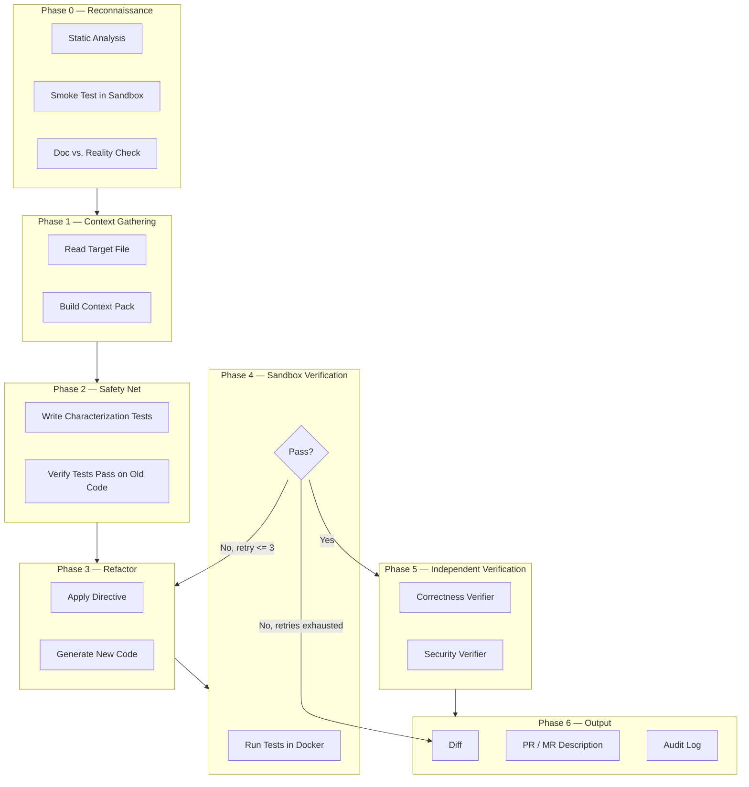
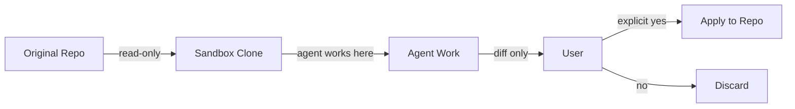
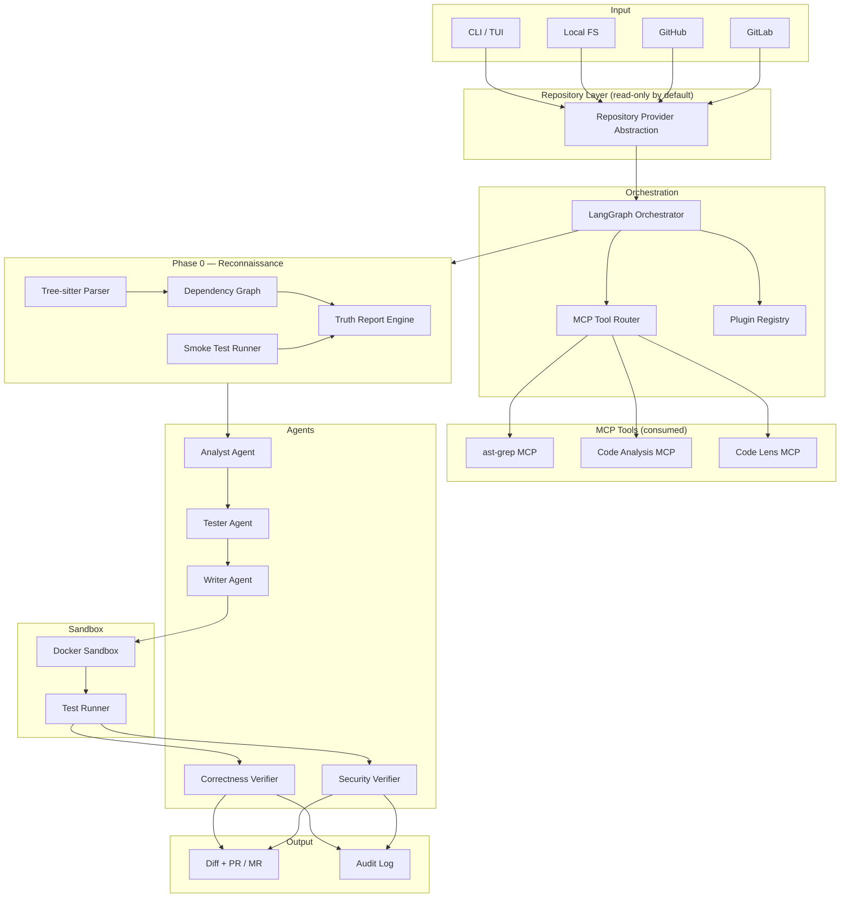

# 01 — Project Overview & Vision

> **Status:** Draft
> **Last updated:** 2026-10-04
> **Owner:** Project lead
> **License:** Apache 2.0
> **Target ship:** 2027-01-15
> **Related docs:** `02-goals-non-goals-metrics.md`, `04-architecture.md`, `14-model-strategy.md`, `15-verification-architecture.md`, `16-context-engineering.md`

---

## 1. One-Sentence Pitch

**CodeGuardian is an open-source, safety-first refactoring agent that understands any codebase, writes characterization tests before touching anything, verifies every change in an isolated sandbox with independent cross-model review, and produces a tamper-evident audit trail — so engineers can modernize legacy code without fear.**

---

## 2. The Problem

### 2.1 The Pain Point

Enterprises run on millions of lines of legacy code — old Python, untyped JavaScript, Java from a previous decade, Go from a startup acquisition. This code works, but it is dangerous to touch.

- **Fear.** Engineers avoid refactoring legacy code because there are no tests, and one wrong change can break production.
- **Cost.** Migrating from old patterns to modern standards takes months of manual, repetitive work.
- **Risk.** Junior developers introduce bugs when they "clean up" code without understanding hidden dependencies.
- **Opacity.** Nobody knows which parts of the codebase are safe to change and which are load-bearing.
- **No proof.** Even when a refactor is done, there is no evidence that behavior was preserved — only a hope that it was.
- **No accountability.** When an AI agent makes a change, there is no record of *why* it made that change, *what* it saw, or *who* approved it.

### 2.2 Why Existing Tools Don't Solve It

General-purpose coding agents — Codex, Claude Code, Cursor, Devin, and similar — can refactor code, write tests, run commands, and self-correct. But they share structural limitations that make them unsuitable for high-stakes legacy modernization:

| Limitation | Consequence |
|---|---|
| **Greenfield bias** | LLMs are optimized for writing new code, not surgically preserving behavior in tangled legacy systems. |
| **No runtime awareness** | Most tools reason statically. They cannot see how the system actually behaves at runtime. |
| **Context fragmentation** | Token limits prevent a coherent global model of a large codebase. |
| **No domain context** | Tools cannot decide what "correct" means for a specific business. |
| **Unreliable self-review** | A 2026 study found **31.7% of semantic drift cases are silently endorsed by the same model that produced them**. |
| **No audit trail** | Current tools produce "no review, no audit trail, just vibes and a prayer." |
| **Unbounded cost** | Token consumption is unpredictable and often wasteful. |
| **Single-language** | Most tools are Python-first. Java, Go, Rust, and C/C++ codebases are second-class citizens. |
| **No consent model** | Agents may write to the working tree without explicit user approval. |

The core problem: **existing tools optimize for speed and autonomy. Nobody optimizes for provable safety, auditability, and consent.**

### 2.3 The Gap CodeGuardian Fills

> **"I will understand your project before I touch it. I will clean up your code. I will prove I didn't break anything — by running tests I wrote myself, in a sandbox you control, verified by a model that didn't write the change. And I will leave an audit trail you can inspect."**

CodeGuardian is not a better model. It is a **verification, consent, and accountability layer** built around models that already exist.

---

## 3. The Solution

### 3.1 What CodeGuardian Does

CodeGuardian is a multi-phase agent workflow that operates on one target (file, function, or module) at a time:

1. **Reconnaissance (Phase 0)** — Understands the project before touching anything: detects languages, frameworks, dependencies, entrypoints, runs existing tests in a sandbox, and reconciles documentation against reality.
2. **Context Gathering (Phase 1)** — Reads the target file, builds a minimal Context Pack from the dependency graph, and assembles only what the model needs.
3. **Safety Net (Phase 2)** — Writes characterization tests that lock in the *current* behavior, even if that behavior is buggy. Verifies the tests pass on the old code. Stops if they don't.
4. **Refactor (Phase 3)** — Applies a specific directive (e.g., "add type hints, extract long functions, modernize syntax").
5. **Sandbox Verification (Phase 4)** — Runs the new code against the tests inside an isolated Docker sandbox. On failure, reads the error trace, rewrites, and retries — up to 3 times.
6. **Independent Verification (Phase 5)** — Two verifiers (correctness + security) inspect the result. Each is a fresh model instance with no access to the original code or the writer's reasoning.
7. **Output (Phase 6)** — Produces a diff, a PR/MR description, and a structured audit log.

**Nothing touches the user's real code without explicit consent.** The agent never writes to the original working tree. It clones or copies into the sandbox, does its work there, and only applies changes when the user approves.

### 3.2 The Phases at a Glance

---

## 4. What Makes CodeGuardian Different

This is the core of the project. Existing tools can refactor code. CodeGuardian makes specific guarantees that no existing tool makes.

| Dimension | General coding agent | CodeGuardian |
|---|---|---|
| **Order of operations** | May refactor first, then test | **Must** write characterization tests first |
| **Safety gate** | Tests are optional | Tests **must pass on old code** before any change |
| **Isolation** | May run on your machine | **Always** runs in a Docker sandbox |
| **Consent** | Writes to working tree freely | **Never** touches real code without explicit approval |
| **Scope** | Whole repo, any language | Target-level, any language, tiered reliability |
| **Evidence** | "Here's the new code" | "Here's proof behavior didn't change" |
| **Self-correction** | Retries until it works | Retries max 3, then stops and reports |
| **Verification** | Same model reviews its own work | **Independent verifiers** — fresh models that never saw the original |
| **Audit trail** | None | Every run logged: prompt, diff, test outcome, verdicts, retries |
| **Cost control** | Unbounded | Model-agnostic, user picks, per-run verification prompt |
| **Repo support** | Usually GitHub only | Local + GitHub + GitLab |
| **Contribution** | Closed | Fully open source (Apache 2.0), plugin-based |

### 4.1 Project Reconnaissance — Understand Before Touching

Most refactoring tools assume the project is healthy. CodeGuardian does not. Before refactoring anything, it runs a full **Project Reconnaissance** phase:

- **Detects languages** — via Tree-sitter, across any language present in the repo.
- **Detects frameworks** — from imports, manifests, and config files.
- **Builds a dependency graph** — who imports whom, at file and symbol level.
- **Finds entrypoints** — where execution starts.
- **Extracts declared versions** — from `pyproject.toml`, `package.json`, `pom.xml`, `go.mod`, etc.
- **Runs existing tests in the sandbox** — a *smoke test* that tells you what already passes and fails.
- **Reconciles docs against reality** — the **Project Truth Report** flags claims the code doesn't support.

The output is a deterministic, evidence-backed **`recon.json`** that every subsequent phase reads.

### 4.2 The Independent Verifiers

The single strongest differentiator. CodeGuardian uses **separate model instances** for writing and verifying:

- **Tester** writes characterization tests.
- **Writer** refactors the code.
- **Correctness Verifier** — a fresh model instance that never saw the original — checks behavioral equivalence.
- **Security Verifier** — a second fresh instance — checks for introduced vulnerabilities.

This directly addresses the 31.7% silent-endorsement failure rate of self-review.

**Cross-model verification is prompted per run.** Every run asks: *"Verify with a second model? (y/N)"*. The user chooses. Transparent, not forced.

### 4.3 The Consent Model

Non-negotiable. Enforced architecturally, not by convention.

- The Repository Provider is **read-only by default**.
- All agent work happens in a sandbox clone.
- The agent produces a **diff**, never a mutation.
- Changes are applied only on explicit user approval.

### 4.4 The Audit Trail

Every run produces a tamper-evident log containing:

- The prompt sent to each model
- The model ID and version
- The input context hash
- The output diff hash
- The test results
- Verifier verdicts
- Retry count
- Timestamp and agent identity
- Rollback reference

This is **not** a Git commit message. It's a structured provenance record designed for review, debugging, and — in regulated environments — compliance evidence.

> **Note:** In v1, the audit trail is a *structured provenance record*, not a cryptographic guarantee. Signing each run log is a documented future enhancement.

### 4.5 Multi-Language, Tiered by Reliability

CodeGuardian parses **any language Tree-sitter supports** (100+). But it is honest about reliability:

| Tier | Languages | Reliability |
|---|---|---|
| **High** | Python, TypeScript / JavaScript | Production-ready. Full pipeline. |
| **Best-effort** | Java, Go, Rust, C, C++, C#, Ruby, PHP, Kotlin, Swift, Elixir, and others | Supported. Lower success rate. CLI warns before proceeding. |

The CLI shows a **warning prompt** when a user targets a best-effort language, so expectations are set at the point of action — not buried in docs.

### 4.6 MCP — Both Client and Server

CodeGuardian participates in the Model Context Protocol ecosystem in both directions:

- **As a client** — consumes existing MCP tools (ast-grep, code analysis, code lens) instead of reinventing AST parsing, code search, or dependency analysis.
- **As a server** — exposes its own refactoring capability as an MCP tool, so IDEs, other agents, and orchestrators can call CodeGuardian.

This positions CodeGuardian as a first-class citizen in the agent ecosystem, not a silo.

### 4.7 Provider-Agnostic Model Strategy

The user picks the model. CodeGuardian does not force multi-model routing — but it makes cross-model verification available when the user wants it.

- **Cloud providers** — Anthropic, OpenAI, DeepSeek, Google, and any OpenAI-compatible endpoint.
- **Local models** — Ollama, llama.cpp, vLLM, LM Studio via OpenAI-compatible endpoints.
- **No API keys required** for local-model users. Cost becomes electricity, not tokens.

The per-run prompt ("Verify with a second model?") keeps the safety property available without multiplying cost on every run.

---

## 5. Who It's For

### 5.1 Primary Audience

| Audience | What they get |
|---|---|
| **Enterprise engineering teams** | A safe way to modernize legacy code without fear of breaking production. |
| **Platform / DevEx teams** | A reusable refactoring service with enforced safety guarantees. |
| **Regulated industries** (finance, healthcare, gov) | An auditable, reviewable change process with structured provenance. |
| **Consultancies** | A tool to accelerate legacy modernization engagements. |

### 5.2 Secondary Audience

| Audience | What they get |
|---|---|
| **Open-source maintainers** | A way to modernize old modules without manual test-writing. |
| **Solo developers inheriting legacy code** | A safety net for refactoring code they didn't write. |
| **Local-model users** | A fully offline, no-API-key refactoring pipeline. |
| **IDE and agent developers** | An MCP server they can call for safe refactoring. |
| **Hiring managers** *(for this project's author)* | Evidence of systems thinking: sandboxing, verification, consent, cost control, plugin architecture. |

> **Assumption:** The primary buyer is an engineering or platform team. The project is being built as a portfolio-grade open-source tool with real product potential, not a commercial launch by Jan 2027.

---

## 6. Business Value

### 6.1 Time Saved

- **Writing characterization tests** is the slowest, most tedious part of safely refactoring legacy code. Automating it saves hours per file.
- **Mechanical refactors** — type hints, renaming, function extraction — are easy to describe but boring to do. Automating them saves more hours.
- **The self-correction loop** means no babysitting every failed test run.
- **Reconnaissance** replaces the first week of manual project onboarding.

### 6.2 Cost Saved

For a typical 200–500 line legacy file, a human might spend 1–3 days writing tests and doing a careful refactor. CodeGuardian aims to do it in minutes, with a human reviewing the final diff.

For a 100k-line codebase, a full agent-driven refactor is estimated at **roughly $1,000–$2,000** in cloud-model costs — a fraction of manual developer time. With local models, the cost drops to electricity.

> **Assumption:** Cost estimate based on the model cascade described in `14-model-strategy.md`. Exact figures depend on model choice and retry rates. This is an estimate, not a guarantee.

### 6.3 Risk Reduced

- No change is made without a passing safety net.
- No code runs outside a sandbox.
- No mutation happens without explicit consent.
- Every change has an audit trail.
- Models that didn't write the change verify the change.
- Documentation drift is surfaced, not silently inherited.

---

## 7. What CodeGuardian Is Not (v1 Scope Boundaries)

Explicitly **out of scope for v1**:

- Refactoring an entire repository in one shot (works on targets).
- Upgrading dependencies, frameworks, or `requirements.txt` (reports drift, doesn't upgrade).
- Changing project architecture or splitting monoliths.
- Fixing bugs that are not covered by characterization tests.
- Deploying anything.
- Running code directly on the host machine (always sandboxed).
- Adding new libraries without checking the manifest.
- Guaranteeing it fixes real bugs — it preserves *current* behavior.
- Autonomous repo monitoring or scheduled refactors.
- Bitbucket and Azure DevOps providers (interface supports them; adapters are v2).
- Full runtime behavior discovery (v1 runs *existing* tests, doesn't discover new runtime paths).
- Cryptographic signing of audit logs (v2).

> **Open Question:** Exact v1 vs. v2 boundary for Bitbucket and Azure DevOps adapters. Defaulting to v2 for both.

---

## 8. The Demo Moment

The "wow" moment for CodeGuardian is the **self-correction loop with independent verification**. A 2-minute demo showing:

1. A messy, old Python file with no type hints and bad naming.
2. Running CodeGuardian.
3. Terminal: **"Reconnaissance: detecting languages, frameworks, tests..."**
4. Terminal: **"Truth Report: README claims Python 3.12, pyproject.toml says 3.9."**
5. Terminal: **"Writing characterization tests..."**
6. Terminal: **"Tests passed on legacy code. Starting refactor."**
7. Terminal: **"Refactor complete. Running verification."**
8. Terminal: **"Verify with a second model? (y/N)"** → user types `y`.
9. The final clean code with type hints.
10. **The kicker:** deliberately break the code in the refactor step to show the agent **catching the error, retrying, and fixing itself** — then the independent verifier confirms the fix.

---

## 9. Positioning

### 9.1 What This Project Is

- A **specialized safety pipeline** for legacy code refactoring, across any language.
- A **verification, consent, and accountability layer** around existing frontier models.
- A **plugin-based, open-source platform** (Apache 2.0) with a contribution model designed to scale.
- A **portfolio-grade system** demonstrating sandboxing, independent verification, cost control, and agentic workflow design.

### 9.2 What This Project Is Not

- A **general coding agent** competing with Claude Code, Codex, or Cursor.
- A **better model** — it uses existing models.
- A **wrapper** around an LLM with a refactoring prompt.
- A **closed-source product**.

### 9.3 The Analogy

GitHub Actions is not a better Git. It is a workflow engine around Git. CodeGuardian is a workflow engine around coding models, with a specific guarantee: **"We will not change your code until we have proven we can detect if we break it — and you said yes."**

---

## 10. High-Level Architecture (Preview)

Full details in `04-architecture.md`. Summary:

**Components:**

- **CLI / TUI** — user entry point. Rich + Textual. Stunning, fast, advanced.
- **Repository Provider** — abstraction over local, GitHub, GitLab. Read-only by default.
- **LangGraph Orchestrator** — controls the phase state machine.
- **MCP Tool Router** — routes to consumed MCP tools.
- **Plugin Registry** — discovers and loads language, provider, tool, verifier, and reporter plugins.
- **Reconnaissance Engine** — Tree-sitter parser, dependency graph builder, smoke test runner, truth report engine.
- **Agents** — Analyst, Tester, Writer, Correctness Verifier, Security Verifier.
- **Docker Sandbox** — isolated execution with hybrid dependency resolution.
- **Audit Log** — structured provenance for every run.
- **Output** — diff, PR/MR description, audit log.

---

## 11. Plugin Architecture (Preview)

CodeGuardian uses a **hybrid contribution model**:

| Layer | Model | Why |
|---|---|---|
| **Core** (orchestrator, sandbox, verification, audit) | Fork-and-PR | Safety-critical. Needs review. |
| **Languages** | Plugin | Self-contained. No core PR needed. |
| **Repository providers** | Plugin | API adapters. Independent. |
| **MCP tools** | Plugin | Dynamic discovery by design. |
| **Verifiers** | Plugin | New lenses addable without core changes. |
| **Reporters** | Plugin | New output formats (JSON, SARIF, etc.). |

Plugins declare capabilities via a manifest. They are discovered from bundled, user-installed, and registry locations. For v1, they run in-process with manifest-declared permissions enforced.

Full details in `04-architecture.md` and `08-repository-structure.md`.

---

## 12. Success Definition (Preview)

Full metrics in `02-goals-non-goals-metrics.md`. At a high level, CodeGuardian v1 is successful if it can:

- Detect languages and frameworks across a mixed-language repo.
- Run a Project Reconnaissance and produce `recon.json` with evidence.
- Produce a Truth Report that flags at least one real doc/code mismatch.
- Clone from local, GitHub, or GitLab without writing to the original tree.
- Write a passing characterization test for legacy code.
- Refactor the code according to a directive.
- Prove the new code passes the old tests in a sandbox.
- Run an independent correctness verifier and a security verifier.
- Demonstrate self-correction (deliberate break → catch → fix) in a 2-minute video.
- Log every run with structured provenance.

> **Open Question:** Are there quantitative success metrics (e.g., refactor success rate, average retries, cost per file, verifier agreement rate)? Not yet defined.

---

## 13. Target Ship Date

**2027-01-15**

---

## 14. Glossary (Preview)

Full glossary in `../skills.md`. Key terms:

| Term | Meaning |
|---|---|
| **Characterization test** | A test that locks in the *current* behavior of code, even if that behavior is buggy. |
| **Context Pack** | The minimal set of files sent to a model for a single task. |
| **Repo Map** | A compressed structural index of the codebase — both graph and hierarchy. |
| **Reconnaissance** | Phase 0: understanding the project before touching it. |
| **`recon.json`** | The deterministic, evidence-backed manifest produced by Reconnaissance. |
| **Truth Report** | A report comparing documentation claims against code reality. |
| **Drift Report** | A report comparing declared versions against actual usage and available versions. |
| **Sandbox** | An isolated Docker container where untrusted code runs. |
| **Verifier** | An independent model instance that checks the refactor (correctness, security). |
| **Model cascade** | Using different models for different roles to balance cost and quality. |
| **Semantic drift** | A behavior change introduced by a refactor that tests do not catch. |
| **Audit trail** | A structured, provenance-rich log of every action taken by the agent. |
| **Consent model** | The rule that nothing touches real code without explicit user approval. |
| **Plugin** | An extension that adds a language, provider, tool, verifier, or reporter. |
| **Contribution point** | A typed slot where plugins register functionality. |
| **Tiered reliability** | The distinction between high-reliability (Python/TS) and best-effort languages. |
| **MCP** | Model Context Protocol — CodeGuardian is both a client and a server. |

---

## 15. Open Questions

> **Open Question:** Are there quantitative success metrics (refactor success rate, average retries, cost per file, verifier agreement rate)?
> **Open Question:** Exact v1 vs. v2 boundary for Bitbucket and Azure DevOps adapters.
> **Open Question:** How strict should behavioral equivalence be in v1 — test-pass only, or output diff on captured traces?
> **Open Question:** Which specific cloud models are documented as default recommendations for Tester, Writer, and Verifiers?
> **Open Question:** Is there a per-run or per-file budget ceiling, and does the CLI enforce it?
> **Open Question:** Cryptographic signing of audit logs — v2 or later?

---

## 16. Assumptions

> **Assumption:** Primary buyer is an engineering team or platform team.
> **Assumption:** Cost estimate of $1,000–$2,000 per 100k lines is based on cloud-model pricing and retry rates. Not a guarantee.
> **Assumption:** The project is a portfolio-grade open-source tool with real product potential, not a commercial launch by Jan 2027.
> **Assumption:** v1 supports local + GitHub + GitLab. Bitbucket and Azure DevOps are v2.
> **Assumption:** v1 supports any Tree-sitter language for parsing, with Python + TypeScript as the high-reliability tier.
> **Assumption:** Cross-model verification is prompted per run, not forced.
> **Assumption:** Local model support is via OpenAI-compatible endpoints (Ollama, vLLM, llama.cpp, LM Studio).
> **Assumption:** Plugins run in-process in v1, with manifest-declared permissions enforced.
> **Assumption:** Truth Report is report-only, never blocking.

---

## 17. Related Documents

- `02-goals-non-goals-metrics.md` — what success looks like
- `03-requirements.md` — functional and non-functional requirements
- `04-architecture.md` — full system design, plugin architecture, phase details
- `05-data-model.md` — `recon.json`, Context Pack, audit log, run traces
- `06-api-contracts.md` — provider interfaces, MCP interfaces, CLI surface
- `07-tech-stack.md` — languages, frameworks, libraries, rationale
- `08-repository-structure.md` — directory layout, naming, conventions
- `09-environment-setup.md` — prerequisites, dependencies, configuration
- `10-testing-cicd-deployment.md` — testing strategy, CI pipeline, deployment
- `11-security-performance-observability.md` — sandbox security, metrics, tracing
- `12-roadmap.md` — milestones, task breakdown, dependencies
- `13-risks-assumptions-decisions.md` — risk register, decision log
- `14-model-strategy.md` — model cascade, cost analysis, local model support
- `15-verification-architecture.md` — independent verifiers, behavioral equivalence
- `16-context-engineering.md` — Repo Map, Context Pack, token budgeting
- `../skills.md` — agent operating manual and full glossary
