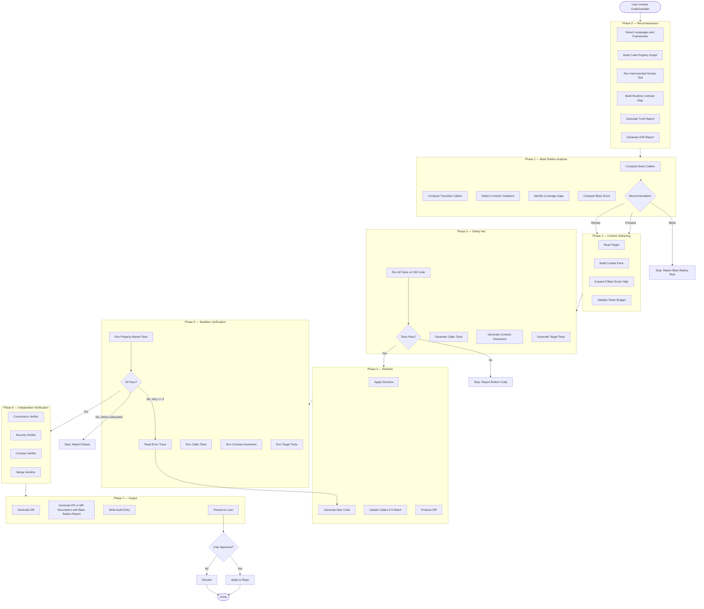
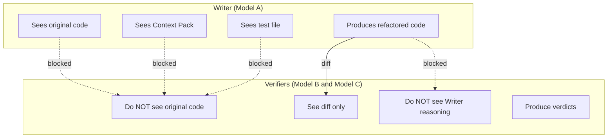
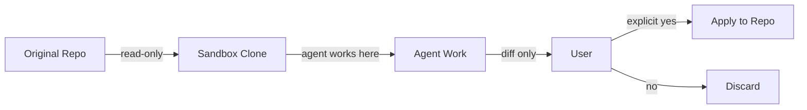

# 01 — Project Overview and Vision

---

## 1. The Project in One Sentence

**CodeGuardian is an open-source, safety-first refactoring agent that understands a codebase at the structural and runtime level before touching anything, writes characterization tests for the target and its callers, verifies every change in an isolated sandbox with independent cross-model review, and produces a tamper-evident audit trail — so engineers can modernize legacy code without fear.**

---

## 2. The Problem

### 2.1 Legacy Code Is Dangerous to Touch

Enterprises run on millions of lines of legacy code. Old Python scripts, untyped JavaScript, Java from a previous decade, Go from an acquisition that nobody remembers writing. This code works. But it is dangerous to change.

- **Fear.** Engineers avoid refactoring because there are no tests, and one wrong change can break production.
- **Cost.** Migrating from old patterns to modern standards takes months of manual, repetitive work.
- **Risk.** Junior developers introduce bugs when they clean up code they do not understand.
- **Opacity.** Nobody knows which parts of the codebase are load-bearing and which are safe to change.
- **No proof.** Even when a refactor is done, there is no evidence that behavior was preserved. Only a hope.
- **No accountability.** When an AI agent makes a change, there is no record of why it made that change, what it saw, or who approved it.

### 2.2 Why Existing Tools Do Not Solve This

General-purpose coding agents can refactor code, write tests, run commands, and self-correct. But they share structural limitations that make them unsuitable for high-stakes legacy modernization.

| Limitation | Consequence |
|---|---|
| **Greenfield bias** | Language models are optimized for writing new code, not surgically preserving behavior in tangled legacy systems. |
| **No runtime awareness** | Most tools reason statically. They cannot see how the system actually behaves. |
| **Context fragmentation** | Token limits prevent a coherent global model of a large codebase. |
| **No domain context** | Tools cannot decide what correct means for a specific business. |
| **Unreliable self-review** | When the same model writes and reviews code, it silently endorses its own errors at a high rate. |
| **No audit trail** | Current tools produce no review, no audit trail, no accountability. |
| **Unbounded cost** | Token consumption is unpredictable and often wasteful. |
| **Single-language** | Most tools are Python-first. Other languages are second-class citizens. |
| **No consent model** | Agents may write to the working tree without explicit user approval. |
| **No behavioral proof** | Tests passing is treated as equivalent to behavior preserved. It is not. |

### 2.3 The Structural Failure: Cross-File Context Blindness

The most dangerous failure mode in agentic refactoring is not model quality. It is **cross-file context blindness**.

When an agent modifies a function, it discovers the blast radius after the fact — through broken tests, type errors, or incomplete grep-based call-site search. It sees the target function in isolation. It does not see who calls it, what those callers assume, or what happens downstream when the function's behavior changes in a subtle way.

This produces a specific, catastrophic pattern:

1. The existing tests pass on the target function.
2. The characterization tests pass on the old code.
3. The agent refactors the function.
4. The tests pass on the new code.
5. **But the callers relied on an implicit contract that the refactor broke.**

The safety net was not deep enough. The smoke test passed because it tested the wrong thing. The characterization tests passed because they tested the wrong thing. The agent succeeded because it optimized for the wrong thing.

The root causes are well documented:

- **Implicit contracts.** Callers assume postconditions that are never written down. A function that always returns a non-null value, or always strips null bytes, or always fires a side effect in a specific order — these assumptions are invisible to static analysis.
- **Mock blindness.** Tests mock the function being refactored. They never see the real return value change.
- **Shape blindness.** Tests assert on a subset of fields. A caller that accesses a field that disappeared crashes at runtime, not in the test suite.
- **Transitive blindness.** Direct callers may be safe, but their callers may not. The blast radius is the full closure, not one hop.
- **Coverage gaps.** Callers with zero test coverage on the changed path are invisible. No test will fail because no test exists.

### 2.4 The Gap

Existing tools optimize for speed and autonomy. None of them optimize for **provable safety, structural understanding, auditability, and consent.**

CodeGuardian exists to fill that gap.

The promise is simple:

> **"I will understand your project before I touch it — structurally, not just syntactically. I will clean up your code. I will prove I did not break anything by running tests I wrote myself, for the target and its callers, in a sandbox you control, verified by a model that did not write the change. And I will leave an audit trail you can inspect."**

CodeGuardian is not a better model. It is a structural intelligence, verification, consent, and accountability layer built around models that already exist.

---

## 3. The Solution

### 3.1 What CodeGuardian Does

CodeGuardian is a multi-phase agent workflow that operates on one target at a time. A target is a file, a function, or a module.

The pipeline runs eight phases:

| Phase | Name | What Happens |
|---|---|---|
| **0** | **Reconnaissance** | The agent understands the project before touching anything. It builds a Code Property Graph, runs an instrumented smoke test, and produces a Truth Report and a Drift Report. |
| **1** | **Blast Radius Analysis** | For the selected target, the agent computes direct and transitive callers, detects contract violations, identifies coverage gaps, and produces a calibrated blast score with a proceed/review/block recommendation. |
| **2** | **Context Gathering** | The agent builds a minimal Context Pack from the graph. When the blast score is high, the Context Pack expands to include callers and their contract assertions. |
| **3** | **Safety Net** | The agent writes characterization tests for the target and, when required, for its callers. It verifies all tests pass on the old code. If they do not, it stops. |
| **4** | **Refactor** | The agent applies a specific directive to modernize or improve the code. When the blast score is high, it updates the callers in the same coherent change. |
| **5** | **Sandbox Verification** | The agent runs the new code against the target tests, caller tests, contract assertions, and property-based tests inside an isolated sandbox. On failure, it reads the error trace, rewrites, and retries up to three times. |
| **6** | **Independent Verification** | Three verifiers inspect the result. Each is a fresh model instance with no access to the original code or the writer's reasoning. |
| **7** | **Output** | The agent produces a diff, a pull or merge request description with the Blast Radius Report, and a structured audit log. |

**Nothing touches the user's real code without explicit consent.** The agent never writes to the original working tree. It clones or copies into the sandbox, does its work there, and only applies changes when the user approves.

### 3.2 The Phase Pipeline

### 3.3 What the Reconnaissance Phase Produces

Reconnaissance is mandatory. No refactor phase executes without it.

It produces four artifacts, each of which every subsequent phase reads.

#### 3.3.1 The Code Property Graph

The Code Property Graph is a unified representation that merges three classical program analyses into a single directed, edge-labeled, attributed multigraph.

| Layer | What It Captures | Why It Matters |
|---|---|---|
| **Abstract Syntax Tree** | Syntactic structure — statements, expressions, declarations | The baseline. What the code literally says. |
| **Control Flow Graph** | Execution paths — which blocks can follow which | Reveals ordering dependencies. A always calls B before C is a contract. |
| **Program Dependence Graph** | Control and data dependencies — which statements govern which, which definitions reach which uses | Reveals semantic dependencies that the call graph misses. |

The graph is built by the Code Intelligence Kernel, which is owned by the Rust layer. It is stored in a columnar, memory-efficient layout optimized for traversal speed and low memory footprint.

Construction is **incremental**. The full graph is built once per commit. When a single file changes, only the affected portions of the graph are updated, using parser-level incremental analysis. This means the first run on a large repository pays a one-time build cost, and every subsequent run is fast.

#### 3.3.2 The Runtime Contract Map

Static analysis is not enough. The recon phase also runs the project's existing tests under instrumentation and observes what actually happens at runtime.

The instrumented smoke test captures:

- **Call frequency** — functions called thousands of times are on the critical path.
- **Call ordering** — if A always calls B before C, that ordering is a contract.
- **Data shape transformations** — string to number to boolean sequences reveal type coercion assumptions.
- **Critical path membership** — which functions sit between input and output.

This produces a runtime contract map that supplements the static graph. It catches what static analysis misses: dynamic dispatch, dependency injection, event handlers, and framework routing.

#### 3.3.3 The Truth Report

The recon phase reads the project's documentation and compares it against the code.

For every claim in a README, setup guide, contribution guide, or configuration reference, the agent checks whether the code supports it. Mismatches are reported with evidence and a suggested correction.

This is not a blocker. It is context. The agent proceeds regardless, but the user sees the drift before any change is made.

#### 3.3.4 The Drift Report

The recon phase extracts declared versions from manifests, installed versions from lock files, and available versions from registries. It reports every discrepancy.

This is also not a blocker. It tells the user what state the project is actually in.

### 3.4 The Blast Radius Report

This is the phase that no other coding agent performs before touching code.

For the selected target, the agent computes five simultaneous analyses:

| Analysis | What It Answers |
|---|---|
| **Direct callers** | Which functions call the target directly. |
| **Transitive callers** | The full closure — every function reachable backward through the call graph. |
| **Contract violations** | Which callers rely on assumptions the refactor might break — not just type errors, but semantic assumptions. |
| **Coverage gaps** | Which callers have zero test coverage on the changed path. |
| **Calibrated blast score** | A weighted severity score from 0 to 100, not a raw count. |

The output includes a **recommendation gate**: `proceed`, `review`, or `block`.

- **Proceed** — the blast radius is small. The agent refactors the target alone.
- **Review** — the blast radius is moderate. The agent expands the Context Pack to include callers and their contract assertions, and updates them in the same change.
- **Block** — the blast radius is high. The agent stops and reports the risk. The user decides whether to continue with expanded scope or to select a different target.

Contract violations are the most important output. A caller that passes type checking but relies on a postcondition the refactor is removing is a silent regression that grep, type checkers, and coverage tools will all miss. The blast radius report surfaces these violations before any change is made.

### 3.5 The Context Pack

The Context Pack is the minimal set of files sent to a model for a single task.

In the default case, it contains the target and its direct dependencies. When the blast radius score is high, it expands to include the callers, their contract assertions, and the covering tests.

The Context Pack respects a token budget. It never sends the full repository. It sends only what the model needs to do the job safely.

---

## 4. What Makes CodeGuardian Different

This is the core of the project. Existing tools can refactor code. CodeGuardian makes specific guarantees that no existing tool makes.

| Dimension | General Coding Agent | CodeGuardian |
|---|---|---|
| **Understanding before action** | Reads the target file | Builds a Code Property Graph and a runtime contract map |
| **Blast radius awareness** | Discovers breakage after the fact | Computes direct callers, transitive callers, contract violations, and coverage gaps before any change |
| **Order of operations** | May refactor first, then test | Must write characterization tests first |
| **Safety net scope** | Tests the target function | Tests the target and its callers, with contract assertions |
| **Safety gate** | Tests are optional | Tests must pass on old code before any change |
| **Isolation** | May run on the host machine | Always runs in an isolated sandbox |
| **Consent** | Writes to the working tree freely | Never touches real code without explicit approval |
| **Evidence** | Produces new code | Produces proof behavior did not change |
| **Self-correction** | Retries until it works | Retries at most three times, then stops and reports |
| **Verification** | Same model reviews its own work | Independent verifiers on a different model family, plus a dedicated contract verifier |
| **Audit trail** | None | Structured provenance for every run |
| **Repository support** | Usually one provider | Local, GitHub, and GitLab |
| **Contribution** | Closed | Fully open source, plugin-based |

### 4.1 The Independent Verifiers

This is the single strongest differentiator.

When the same model writes code and then reviews it, it misses its own errors. The model that produced a mistake is the least likely to catch it. Research across production language models has shown that a large fraction of semantic drift cases are silently endorsed by the same model that produced them. The failure is structural, not a matter of model quality.

CodeGuardian solves this by using separate model instances for writing and verifying:

- **Tester** writes characterization tests.
- **Writer** refactors the code.
- **Correctness Verifier** — a fresh model instance that never saw the original code — checks behavioral equivalence.
- **Security Verifier** — a second fresh instance — checks for introduced vulnerabilities.
- **Contract Verifier** — a third fresh instance — checks that every caller's contract is preserved.

Each verifier is a fresh model instance. Each receives only the diff and the contract assertions. None receives the original code, the Context Pack, or the Writer's reasoning. Cross-model verification is prompted per run, so the user decides when the extra safety is worth the extra cost.

### 4.2 The Consent Model

Non-negotiable. Enforced architecturally, not by convention.

- The Repository Provider is read-only by default. It has no write method.
- All agent work happens in a sandbox clone.
- The agent produces a diff, never a mutation.
- Changes are applied only on explicit user approval.
- The consent record is written to the audit log with a timestamp.

### 4.3 The Audit Trail

Every run produces a structured, tamper-evident log. The log captures:

- The prompt sent to each model, by hash.
- The model ID and version.
- The input context hash.
- The output diff hash.
- The test results.
- Verifier verdicts, including which model produced each.
- The blast radius report.
- Retry count.
- Timestamp and agent identity.
- The consent record.
- A rollback reference.

Each entry includes a hash of its own content and the hash of the previous entry. If any entry is modified, the chain breaks. The log is written by a separate process that the Python orchestrator never has a file handle to.

This is not a Git commit message. It is a structured provenance record designed for review, debugging, and — in regulated environments — compliance evidence.

### 4.4 Multi-Language, Tiered by Reliability

CodeGuardian parses any language Tree-sitter supports, which is over one hundred languages. But it is honest about reliability.

| Tier | Languages | Reliability |
|---|---|---|
| **High** | Python, TypeScript, JavaScript | Production-ready. Full pipeline. |
| **Best-effort** | Java, Go, Rust, C, C++, C#, Ruby, PHP, Kotlin, Swift, Elixir, and others | Supported. Lower success rate. The CLI warns before proceeding. |

The CLI shows a warning when a user targets a best-effort language, so expectations are set at the point of action, not buried in documentation.

### 4.5 MCP — Both Client and Server

CodeGuardian participates in the Model Context Protocol ecosystem in both directions.

- **As a client**, it consumes existing MCP tools such as ast-grep, code analysis, and code lens, instead of reinventing AST parsing, code search, or dependency analysis.
- **As a server**, it exposes its own refactoring capability as an MCP tool, so IDEs, other agents, and orchestrators can call CodeGuardian.

This positions CodeGuardian as a first-class citizen in the agent ecosystem, not a silo.

### 4.6 Provider-Agnostic Model Strategy

The user picks the model. CodeGuardian does not force multi-model routing, but it makes cross-model verification available when the user wants it.

- **Cloud providers** — Anthropic, OpenAI, DeepSeek, Google, and any OpenAI-compatible endpoint.
- **Local models** — Ollama, vLLM, llama.cpp, and LM Studio via OpenAI-compatible endpoints.
- **No API keys required** for local-model users. Cost becomes electricity, not tokens.

The per-run prompt keeps the safety property available without multiplying cost on every run.

### 4.7 Self-Improving Skill Library

After a successful run, the Skill Curator proposes a reusable pattern. The user reviews it. If approved, the pattern is stored in a global skill library as a Markdown file with structured metadata.

The skill library works in three layers:

| Layer | Technology | Role |
|---|---|---|
| **Markdown** | Filesystem | Source of truth. Human-readable, editable by hand, trackable in version control. |
| **SQLite** | Full-text search | Structured index. Fast keyword search, metadata, effectiveness scores. |
| **Embeddings** | Vector search | Semantic retrieval. Finds skills by meaning, not keywords. |

The Markdown files are the truth. The indexes are derived and can be rebuilt from the Markdown at any time. Skills are global — a pattern learned from one project helps every future project.

Every skill is proposed, never auto-stored. This is the same consent principle that governs code changes, applied to knowledge.

### 4.8 Greenfield Mode

CodeGuardian operates in two modes with the same architecture.

| Mode | Starting Point | Safety Net | Status |
|---|---|---|---|
| **Legacy** | Existing code with unknown behavior | Characterization tests for the target and its callers | v1 |
| **Greenfield** | A specification or requirement | Specification tests | v1.5 |

In legacy mode, the agent locks in what exists before changing it. In greenfield mode, the agent builds from a specification. Both modes use the same sandbox, the same verifiers, the same audit trail, the same blast radius analysis, and the same consent model. Only the prompts and phase configuration differ.

---

## 5. The Agent Model

CodeGuardian uses a centralized orchestrator with seven specialized agents. Five use language models. One is deterministic. One runs out of band.

| Agent | Type | Responsibility |
|---|---|---|
| **Recon Agent** | Deterministic | Builds the Code Property Graph, runs the instrumented smoke test, produces the Truth Report and Drift Report. Uses Tree-sitter, not a language model. |
| **Blast Radius Agent** | Deterministic | Computes direct and transitive callers, detects contract violations, identifies coverage gaps, produces the calibrated blast score. Uses the graph, not a language model. |
| **Analyst** | LLM | Reads the target and builds the Context Pack. Expands it when the blast score is high. |
| **Tester** | LLM | Writes characterization tests for the target and, when required, for its callers. |
| **Writer** | LLM | Refactors or implements code according to the directive. Updates callers when they are in the batch. |
| **Correctness Verifier** | LLM | Independently checks behavioral equivalence. |
| **Security Verifier** | LLM | Independently checks for introduced vulnerabilities. |
| **Contract Verifier** | LLM | Independently checks that every caller's contract is preserved. |
| **Skill Curator** | LLM | Extracts reusable patterns from successful runs, on user approval. Runs after the main pipeline. |

The default configuration runs all LLM roles on a single model. Cross-model verification is prompted per run and is the recommended setting for production use.

The architecture is centralized, not peer-to-peer. The orchestrator controls the state machine. Agents do not delegate to each other. Structured artifacts — the Code Property Graph, the Blast Radius Report, Context Packs, diffs — are passed between phases, not free-form conversation.

---

## 6. The Sandbox Tiers

Sandbox execution is tiered by deployment context. The architecture abstracts the backend behind a single interface, so the same pipeline runs on any of them.

| Context | Sandbox Backend | Purpose |
|---|---|---|
| **Local CLI** | Bubblewrap on Linux, Seatbelt on macOS | Fast, lightweight, single-user. No daemon required. |
| **Cloud / multi-tenant** | Firecracker microVMs | Hardware-level isolation for untrusted code. Each execution gets its own kernel. |
| **CI / Windows / fallback** | Docker | Portability where the other backends are unavailable. |

All backends enforce the same guarantees:

- Untrusted code never executes on the host.
- Network is isolated except during a controlled dependency-resolution phase.
- CPU and memory quotas are enforced.
- The sandbox is destroyed after each run.
- The workspace is reset between targets.

---

## 7. The Language Boundary

CodeGuardian is built on two languages, each chosen for the property it provides.

| Layer | Language | What It Owns | Why |
|---|---|---|---|
| **AI and orchestration** | Python | Orchestrator, agent runtime, model calls, CLI, plugin loading, MCP client and server, report generation | The AI ecosystem is Python-first. Iteration speed matters more than raw execution speed at this layer. |
| **Safety and performance** | Rust | Sandbox engine, Code Intelligence Kernel, Code Property Graph, audit log writer, policy engine | Memory safety, deterministic behavior, and speed are required where untrusted code is parsed or executed. |

The boundary is defined by property, not preference.

- **If it touches untrusted code, or must be fast and deterministic, it is Rust.**
- **If it touches an AI model, or changes frequently, it is Python.**

The Code Intelligence Kernel owns the Code Property Graph. It uses incremental construction: the full graph is built once per commit, and subsequent file changes update only the affected portions. This means the first run on a large repository pays a one-time build cost, and every subsequent run is fast.

Two bridge technologies connect the layers:

- **In-process calls** for the Code Intelligence Kernel and the policy engine. These are trusted, high-volume, and latency-sensitive. Calls are batched per phase, not per operation.
- **Out-of-process calls** for the sandbox engine and the audit log writer. These must survive a compromise of the Python process. They communicate over a standard inter-process protocol.

---

## 8. The Plugin Architecture

CodeGuardian uses a hybrid contribution model. Core changes go through the main repository. Extensions are plugins.

| Layer | Contribution Model | Why |
|---|---|---|
| **Core** — orchestrator, sandbox, verification, audit | Pull request to the main repository | Safety-critical. Needs review. |
| **Languages** | Plugin | Self-contained. Adding a language does not require a core change. |
| **Repository providers** | Plugin | Each provider is an API adapter. |
| **MCP tools** | Plugin | Dynamic discovery by design. |
| **Verifiers** | Plugin | New verification lenses can be added without core changes. |
| **Reporters** | Plugin | New output formats, such as SARIF, are addable. |
| **Sandbox backends** | Plugin | New isolation technologies are addable. |

Plugins declare their capabilities and permissions in a manifest. They are discovered at runtime. A plugin failure does not crash the core.

---

## 9. Who CodeGuardian Is For

### Primary Audience

| Audience | What They Get |
|---|---|
| **Enterprise engineering teams** | A safe way to modernize legacy code without fear of breaking production. |
| **Platform and developer-experience teams** | A reusable refactoring service with enforced safety guarantees and structural analysis. |
| **Regulated industries** — finance, healthcare, government | An auditable, reviewable change process with structured provenance. |
| **Consultancies** | A tool to accelerate legacy modernization engagements. |

### Secondary Audience

| Audience | What They Get |
|---|---|
| **Open-source maintainers** | A way to modernize old modules without manual test-writing. |
| **Solo developers inheriting legacy code** | A safety net for refactoring code they did not write. |
| **Local-model users** | A fully offline, no-API-key refactoring pipeline. |
| **IDE and agent developers** | An MCP server they can call for safe refactoring. |

---

## 10. What CodeGuardian Is Not

Explicitly out of scope for v1:

- Refactoring an entire repository in one shot. It works on targets with blast radius awareness.
- Upgrading dependencies or frameworks. It reports drift, it does not upgrade.
- Changing project architecture or splitting monoliths.
- Fixing bugs that are not covered by characterization tests.
- Deploying anything.
- Running code directly on the host machine.
- Adding new libraries without checking the manifest.
- Guaranteeing it fixes real bugs. It preserves current behavior.
- Autonomous repository monitoring or scheduled refactors.
- Cryptographic signing of audit logs in v1.

---

## 11. The Positioning

### What This Project Is

- A structural intelligence and safety pipeline for legacy code refactoring, across any language.
- A verification, consent, and accountability layer around existing frontier models.
- A plugin-based, open-source platform with a contribution model designed to scale.
- A system that gets better over time through a curated skill library.

### What This Project Is Not

- A general coding agent competing with existing assistants.
- A better model. It uses existing models.
- A wrapper around a language model with a refactoring prompt.
- A closed-source product.

### The Analogy

GitHub Actions is not a better Git. It is a workflow engine around Git. CodeGuardian is a workflow engine around coding models, with a specific guarantee:

> **"We will not change your code until we have proven we can detect if we break it — and you said yes."**

---

## 12. The Demo Moment

The moment that proves the project works is the self-correction loop with independent verification and blast radius awareness.

A two-minute demonstration shows:

1. A messy, old Python file with no type hints and bad naming.
2. Running CodeGuardian.
3. The terminal reports: **"Reconnaissance: building Code Property Graph..."**
4. The terminal reports: **"Truth Report: README claims Python 3.12, pyproject.toml says 3.9."**
5. The terminal reports: **"Blast Radius: 14 direct callers, 47 transitive callers, 2 contract violations, 1 coverage gap. Score: 72. Recommendation: review."**
6. The terminal reports: **"Writing characterization tests for target and 14 callers..."**
7. The terminal reports: **"All tests passed on legacy code. Starting refactor."**
8. The terminal reports: **"Refactor complete. Running verification."**
9. The terminal prompts: **"Verify with a second model? (y/N)"** — the user types `y`.
10. The final clean code appears with type hints and updated callers.
11. The kicker: the code is deliberately broken in the refactor step to show the agent catching the error, retrying, and fixing itself. The independent verifiers confirm the fix.

This is the moment that shows what makes CodeGuardian different from every other coding agent.

---

## 13. The Core Guarantees

These are the promises CodeGuardian makes to every user.

| Guarantee | How It Is Enforced |
|---|---|
| **No code is modified without explicit user consent.** | The Repository Provider has no write method. Applying changes is a separate, consent-gated step. |
| **No untrusted code runs outside the sandbox.** | All execution goes through the sandbox backend. Verified by policy tests. |
| **No refactor is applied without a passing characterization test on the old code.** | The orchestrator enforces the safety net as a mandatory phase. |
| **Every refactor is verified by a model instance that did not write it.** | Cross-model verification is prompted per run. Verifiers receive only the diff and contract assertions. |
| **Every target is analyzed for blast radius before any change.** | The Blast Radius Report is computed in Phase 1, before the safety net is built. |
| **Every run produces a structured audit trail.** | The audit log is written by a separate process and hash-chained. |
| **The system never sends the full repository to a model.** | The Context Pack contains only the target and its required dependencies. |
| **A failed refactor is reported honestly, not hidden.** | Retries are capped at three. Exhaustion produces a failure report with evidence. |
| **Documentation drift is surfaced, not silently inherited.** | The Truth Report flags every claim the code contradicts. |
| **Skills enter the library only on user approval.** | The Skill Curator proposes; the user disposes. |
| **Adding a language, provider, tool, verifier, reporter, or sandbox backend does not require a core change.** | All extensions are plugins with declared interfaces and contract tests. |
| **The system understands the project structurally, not just syntactically.** | The Code Property Graph merges AST, control flow, and data dependence into one model. |

---

## 14. Glossary

| Term | Meaning |
|---|---|
| **Characterization test** | A test that locks in the current behavior of code, even if that behavior is buggy. |
| **Context Pack** | The minimal set of files sent to a model for a single task. |
| **Code Property Graph** | A unified graph merging AST, control flow, and program dependence. |
| **Control Flow Graph** | A graph of execution paths within a function. |
| **Program Dependence Graph** | A graph of control and data dependencies between statements. |
| **Blast Radius Report** | The output of Phase 1. Direct callers, transitive callers, contract violations, coverage gaps, and a calibrated blast score. |
| **Calibrated blast score** | A weighted severity score from 0 to 100, not a raw count. |
| **Contract violation** | A caller whose semantic assumption breaks — not just a type error. |
| **Runtime Contract Map** | A map of call frequency, ordering, and data-shape transformations, derived from the instrumented smoke test. |
| **Reconnaissance** | Phase 0. Understanding the project before touching it. |
| **Truth Report** | A report comparing documentation claims against code reality. |
| **Drift Report** | A report comparing declared, installed, and available versions. |
| **Sandbox** | An isolated environment where untrusted code runs. |
| **Verifier** | An independent model instance that checks the refactor. |
| **Semantic drift** | A behavior change introduced by a refactor that tests do not catch. |
| **Audit trail** | A structured, provenance-rich log of every action taken by the agent. |
| **Consent model** | The rule that nothing touches real code without explicit user approval. |
| **Plugin** | An extension that adds a language, provider, tool, verifier, reporter, or sandbox backend. |
| **Contribution point** | A typed slot where plugins register functionality. |
| **Tiered reliability** | The distinction between high-reliability and best-effort languages. |
| **MCP** | Model Context Protocol. CodeGuardian is both a client and a server. |
| **Skill library** | A global, user-curated collection of reusable refactoring patterns. |
| **Skill Curator** | The agent that proposes skills for user approval after a successful run. |
| **Legacy mode** | Refactoring existing code with unknown behavior. |
| **Greenfield mode** | Building new code from a specification. |
| **Orchestrator** | The central coordinator that controls the phase state machine. |
| **Per-run verification prompt** | The prompt that asks the user whether to enable cross-model verification for this run. |

---

## 15. Related Documents

- `02-goals-non-goals-metrics.md` — goals, non-goals, success metrics, and anti-metrics.
- `03-requirements.md` — functional and non-functional requirements.
- `04-architecture.md` — full system design, components, phases, plugin architecture, sandbox backends, and the language boundary.
- `05-data-model.md` — entities, relationships, schemas, storage architecture, lifecycle, and versioning.
- `06-api-contracts.md` — provider interfaces, MCP interfaces, CLI surface, and the `SandboxBackend` interface.
- `07-tech-stack.md` — languages, frameworks, libraries, and rationale.
- `08-repository-structure.md` — directory layout, naming, and conventions.
- `09-environment-setup.md` — prerequisites, dependencies, and configuration.
- `10-testing-cicd-deployment.md` — testing strategy, CI pipeline, and deployment.
- `11-security-performance-observability.md` — threat model, performance budgets, logging, and metrics.
- `12-roadmap.md` — milestones, task breakdown, and dependencies.
- `13-risks-assumptions-decisions.md` — risk register and decision log.
- `14-model-strategy.md` — model roles, selection, and provider abstraction.
- `15-verification-architecture.md` — independent verifiers and behavioral equivalence.
- `16-context-engineering.md` — Repo Map, Context Pack, and token budgeting.
- `../skills.md` — agent operating manual for anyone building this project.
