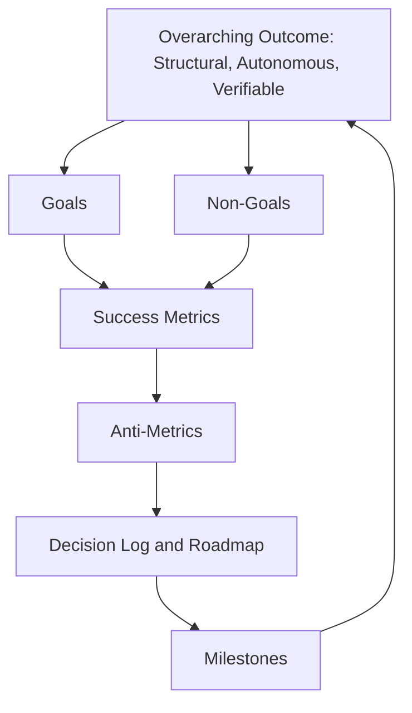

# 02 — Goals, Non-Goals, and Success Metrics

---

## 1. Purpose of This Document

This document is the commitment document for CodeGuardian. It answers four questions:

1. **What are we trying to achieve?** — Goals
2. **What are we explicitly not trying to achieve?** — Non-Goals
3. **How do we know we succeeded?** — Success Metrics
4. **How do we know we failed, even if other signals look good?** — Anti-Metrics

If a future feature, decision, or pull request does not serve a goal listed here, or violates a non-goal, it does not belong in v1. This document is the guardrail against scope creep.

All metrics in this document are **qualitative**. They describe what must be true and how it will be judged. Concrete numeric thresholds are set per release, not per document, and are tracked in the roadmap and the decision log.

---

## 2. The Overarching Outcome

CodeGuardian exists to demonstrate that an autonomous, safety-first agent can understand a codebase at the structural and runtime level before touching it, refactor real legacy code across real languages on real repositories, preserve behavior with provable evidence, respect explicit user consent, and leave a structured record of everything it did.

Three words capture the ambition.

| Word | What it means for CodeGuardian |
|---|---|
| **Structural** | The agent builds a Code Property Graph — syntax, control flow, and data dependence merged into one model — and computes the blast radius of every target before any change. It does not reason from syntax alone. |
| **Autonomous** | The agent runs the full pipeline — reconnaissance, blast radius analysis, testing, refactoring, verification — without step-by-step human hand-holding. Human approval happens at the boundaries, not inside the loop. |
| **Verifiable** | The agent produces evidence, not assertions. Characterization tests, independent verifier verdicts, contract assertions, and a tamper-evident audit trail. Every change can be inspected, replayed, and rolled back. |

---

## 3. Goals

Goals are outcomes, not features. Each goal is specific to CodeGuardian and can be judged at the end of a release.

### 3.1 Structural Understanding Goals

These are the goals that distinguish CodeGuardian from every other coding agent. They describe what the agent must understand before it acts.

| # | Goal | Why it matters |
|---|---|---|
| **G-ST1** | **The agent builds a Code Property Graph that merges syntax, control flow, and data dependence into a single model.** | A call graph answers who calls what. A Code Property Graph answers who calls what, what data flows through, and what breaks if semantics change. |
| **G-ST2** | **The agent computes direct and transitive callers for any target.** | One hop is not enough. The blast radius is the full backward closure of the call graph. |
| **G-ST3** | **The agent detects contract violations, not just type errors.** | A caller that passes type checking but relies on a postcondition that is being removed is a silent regression. Type checkers, linters, and grep all miss it. |
| **G-ST4** | **The agent builds a runtime contract map from an instrumented smoke test.** | Static analysis cannot see dynamic dispatch, dependency injection, event handlers, or framework routing. Runtime observation catches what static analysis misses. |
| **G-ST5** | **The agent produces a calibrated blast score and a proceed, review, or block recommendation for every target.** | A raw count of callers is not a risk assessment. A calibrated score with an explicit recommendation turns the analysis into a decision. |
| **G-ST6** | **The agent expands the Context Pack to include callers and their contract assertions when the blast score requires it.** | The safety net must match the risk. A high blast radius means the target cannot be safely refactored in isolation. |
| **G-ST7** | **The Code Property Graph is built incrementally.** | The first run on a large repository pays a one-time build cost. Every subsequent run updates only the affected portions of the graph. |

### 3.2 Safety Goals

| # | Goal | Why it matters |
|---|---|---|
| **G-S1** | **No code is modified without explicit user consent.** | The trust contract. Non-negotiable. |
| **G-S2** | **No untrusted code runs outside the sandbox.** | Prevents host compromise. |
| **G-S3** | **No refactor is applied without a passing characterization test on the old code.** | The safety net must exist before any change. |
| **G-S4** | **Every refactor is verified by at least one model instance that did not write it.** | Directly addresses the structural failure of self-review. |
| **G-S5** | **Every target is analyzed for blast radius before any change.** | Breakage is discovered before the change, not after. |
| **G-S6** | **Every caller's contract is checked by a dedicated verifier.** | Behavioral equivalence of the target is not enough. The callers must still work. |

### 3.3 Autonomy Goals

| # | Goal | Why it matters |
|---|---|---|
| **G-A1** | **The full pipeline runs end-to-end without human intervention inside the loop.** | Human approval is at the boundaries, not inside every step. |
| **G-A2** | **The agent self-corrects on test failure up to a hard retry limit, then stops and reports.** | Autonomy means trying to fix itself. It also means knowing when to stop. |
| **G-A3** | **The agent reports its own failures clearly, with evidence.** | Autonomy includes honest failure, not silent surrender. |

### 3.4 Understanding-Before-Action Goals

| # | Goal | Why it matters |
|---|---|---|
| **G-U1** | **Reconnaissance is mandatory. No refactor phase executes without it.** | The agent understands the project before it touches anything. |
| **G-U2** | **Every fact produced by reconnaissance carries evidence.** | Guesses are not facts. Evidence is a file and line reference. |
| **G-U3** | **Documentation drift is surfaced in a Truth Report.** | Claims the code contradicts are reported, with suggested corrections. |
| **G-U4** | **Version drift is surfaced in a Drift Report.** | Declared, installed, and available versions are compared and reported. |
| **G-U5** | **The agent builds both a dependency graph and a hierarchical index of the codebase.** | What depends on this and where is this are different questions. Both must be answered. |

### 3.5 Quality Goals

| # | Goal | Why it matters |
|---|---|---|
| **G-Q1** | **Characterization tests pass on the old code before any refactor begins.** | If they do not, the code is already broken. Report, do not touch. |
| **G-Q2** | **The refactored code passes the same characterization tests.** | The minimum bar for success. |
| **G-Q3** | **Callers of the target are covered by the safety net when the blast score requires it.** | The target is never the unit of safety. The target and its callers are the unit of safety. |
| **G-Q4** | **Contract assertions are generated and verified for every caller in the batch.** | Implicit contracts are what break silently. |
| **G-Q5** | **Python and TypeScript are the high-reliability tier. Other languages are best-effort and labeled as such.** | Honesty about reliability. |
| **G-Q6** | **Every run produces a diff, a pull or merge request description, and a structured audit log.** | Evidence, not vibes. |

### 3.6 Openness Goals

| # | Goal | Why it matters |
|---|---|---|
| **G-O1** | **The project is fully open source under a permissive license.** | Enterprise-friendly, patent-protected, no vendor lock-in. |
| **G-O2** | **Languages, providers, tools, verifiers, reporters, and sandbox backends are all plugins.** | Adding an extension never requires a core pull request. |
| **G-O3** | **The agent is provider-agnostic: cloud APIs and local models via OpenAI-compatible endpoints.** | Offline use is a first-class path, not an afterthought. |
| **G-O4** | **CodeGuardian is both an MCP client and an MCP server.** | It participates in the agent ecosystem in both directions. |

### 3.7 Usability Goals

| # | Goal | Why it matters |
|---|---|---|
| **G-X1** | **The CLI is fast, advanced, and visually clear.** | Developer tools compete on feel. |
| **G-X2** | **The agent warns the user at the point of action when targeting a best-effort language.** | Expectations are set where they matter, not buried in documentation. |
| **G-X3** | **Cross-model verification is prompted per run, not forced.** | Transparency over coercion. |
| **G-X4** | **A short demonstration exists showing the self-correction loop, the blast radius report, and independent verification.** | Portfolio-grade proof of the differentiator. |

### 3.8 Self-Improvement Goals

| # | Goal | Why it matters |
|---|---|---|
| **G-I1** | **The agent proposes reusable patterns after successful runs.** | Knowledge compounds. |
| **G-I2** | **Skills enter the library only on explicit user approval.** | The consent principle applies to knowledge, not just code. |
| **G-I3** | **The skill library is portable, human-readable, and rebuildable from its Markdown source.** | No lock-in to a database or a service. |

---

## 4. Non-Goals

Non-goals are the guardrails. They are what v1 explicitly will not do, even when it would be easy or tempting.

### 4.1 Product Non-Goals

| # | Non-Goal | Why it is excluded |
|---|---|---|
| **NG-P1** | **Not a general coding agent.** | It does not compete with existing assistants on breadth. |
| **NG-P2** | **Not a better model.** | It uses existing models. The value is structural and architectural. |
| **NG-P3** | **Not a dependency upgrader.** | It reports drift. It does not run package managers or migrate manifests. |
| **NG-P4** | **Not a bug fixer.** | It preserves current behavior. Bug discovery is out of scope. |
| **NG-P5** | **Not a deployment tool.** | It stops at the diff and the pull or merge request. |
| **NG-P6** | **Not a monolith splitter.** | Architecture-level refactoring is out of scope. |
| **NG-P7** | **Not a commercial product in v1.** | Open source and portfolio-grade. |

### 4.2 Scope Non-Goals

| # | Non-Goal | Why it is excluded |
|---|---|---|
| **NG-S1** | **No whole-repository refactor in one shot.** | The agent works on targets with blast radius awareness. |
| **NG-S2** | **No full-repository Code Property Graph by default.** | The default is an on-demand scoped graph — the target and its transitive callers. A full-repo graph is available on request, but it is not the default path. |
| **NG-S3** | **No Code Property Graph for languages without a registered parser plugin.** | Parsing is a prerequisite. Unsupported languages are rejected at the point of action. |
| **NG-S4** | **No runtime instrumentation of production systems.** | The runtime contract map is built from the sandbox smoke test, not from production traffic. |
| **NG-S5** | **No formal verification of contract preservation.** | Contract detection is heuristic. The agent surfaces suspected violations. It does not guarantee zero false negatives. |
| **NG-S6** | **No replacement for human judgment on architectural decisions.** | The blast radius report informs the decision. The user makes it. |
| **NG-S7** | **No Bitbucket or Azure DevOps adapters in v1.** | The provider interface supports them. The adapters are future work. |
| **NG-S8** | **No cryptographic signing of audit logs in v1.** | Structured provenance and hash chaining only. |
| **NG-S9** | **No scheduled or autonomous repository monitoring.** | Manual invocation only. |
| **NG-S10** | **No applying changes without explicit approval, ever.** | Enforced architecturally. |

### 4.3 Quality Non-Goals

| # | Non-Goal | Why it is excluded |
|---|---|---|
| **NG-Q1** | **No claim of equal reliability across all languages.** | Tiered reliability is documented and enforced at the point of action. |
| **NG-Q2** | **No guarantee of refactor success on every target.** | The agent reports failure honestly. |
| **NG-Q3** | **No silent mutations.** | Every change is visible, diffed, and approved. |
| **NG-Q4** | **No over-claiming of behavioral equivalence.** | Tests and contract assertions are the v1 mechanism. Formal proof is future work. |
| **NG-Q5** | **No claim that the blast score is a certainty.** | It is a calibrated estimate. The recommendation is guidance, not truth. |

---

## 5. Success Metrics

Metrics describe what must be true for the release to be considered successful. They are qualitative: they state the property, the mechanism, and the evidence.

### 5.1 Structural Metrics

| # | Metric | What must be true | How it is judged |
|---|---|---|---|
| **M-ST1** | Code Property Graph construction | The graph builds for a scoped target and for a full repository. | A scoped build completes interactively. A full build completes without exhausting memory. |
| **M-ST2** | Incremental graph update | After a single file change, only the affected portion of the graph is updated. | The update is visibly faster than a full rebuild on the same repository. |
| **M-ST3** | Caller resolution | Direct and transitive callers are resolved for every target, across every high-reliability language. | Spot checks against a hand-verified sample produce no misses. |
| **M-ST4** | Contract violation detection | Contract violations are detected and reported with evidence. | On a curated benchmark of known contract breaks, the report includes them. |
| **M-ST5** | Contract violation precision | Flagged violations are genuinely at risk. | On the same benchmark, most flags correspond to real risk. |
| **M-ST6** | Blast score calibration | The score correlates with actual breakage. | Higher scores correspond to more observed breakage across runs. |
| **M-ST7** | Runtime contract map coverage | Critical-path functions are captured by the instrumented smoke test. | Functions observed during the smoke test appear in the map. |
| **M-ST8** | Recommendation gate | Every target receives a proceed, review, or block recommendation. | No target proceeds without a recommendation. |

### 5.2 Functional Metrics

| # | Metric | What must be true | How it is judged |
|---|---|---|---|
| **M-F1** | Language detection | Every language present in a multi-language repository is detected. | Detection output matches manual inspection. |
| **M-F2** | Evidence for every fact | Every fact in the reconnaissance output carries a file and line reference. | Schema validation passes. |
| **M-F3** | Truth Report | At least one real documentation contradiction is surfaced on a known-inconsistent repository. | Manual review of the report. |
| **M-F4** | Safety net on old code | Characterization tests pass on the old code before any refactor. | Run logs. |
| **M-F5** | Refactored code passes the same tests | The refactored code passes the target tests and the caller tests. | Run logs. |
| **M-F6** | Complete run output | Every run produces a diff, a pull or merge request description, and an audit entry. | Audit log validation. |
| **M-F7** | Per-run verification prompt | Every run prompts for cross-model verification. | CLI trace. |

### 5.3 Safety Metrics

| # | Metric | What must be true | How it is judged |
|---|---|---|---|
| **M-S1** | Consent | No mutation occurs without explicit approval. | Architectural test and audit log inspection. |
| **M-S2** | Sandbox isolation | No code executes on the host outside the sandbox. | Policy tests. |
| **M-S3** | Safety net | No refactor is applied without a passing safety net on the old code. | Orchestrator invariant tests. |
| **M-S4** | Independent verification | When requested, no refactor is applied without independent verifier verdicts. | Audit log validation. |
| **M-S5** | Blast radius gate | No refactor proceeds past a block recommendation without explicit user override. | Run logs and audit entries. |
| **M-S6** | Contract verifier | No caller contract is left unchecked in the batch. | Verification output. |

### 5.4 Quality Metrics

| # | Metric | What must be true | How it is judged |
|---|---|---|---|
| **M-Q1** | Verifier agreement | Correctness, security, and contract verifiers agree on accepted refactors. | Run logs. |
| **M-Q2** | Retry efficiency | The average number of retries per successful refactor stays low. | Run logs. |
| **M-Q3** | Security verifier precision | The Security Verifier does not flag safe refactors at a high rate. | Curated benchmark. |
| **M-Q4** | Self-review failures caught | Independent verifiers catch at least one self-review failure during the demonstration. | Demonstration script and run logs. |
| **M-Q5** | Contract coverage | Every caller in the batch has at least one contract assertion. | Verification output. |

### 5.5 Performance Metrics

| # | Metric | What must be true | How it is judged |
|---|---|---|---|
| **M-P1** | Reconnaissance | Reconnaissance completes on a moderate repository within a reasonable interactive window. | Timed run. |
| **M-P2** | Blast radius | Blast radius computation returns interactively for any target. | Timed run. |
| **M-P3** | Refactor | Refactor of a moderately sized target, including tests and verification, completes within a reasonable window. | Timed run. |
| **M-P4** | Sandbox start | Sandbox start is imperceptible on the local backend. | Timed run. |
| **M-P5** | CLI responsiveness | The CLI responds immediately to interactive commands. | Timed run. |
| **M-P6** | Incremental update | Graph updates after a file change are noticeably faster than a full rebuild. | Timed run. |

### 5.6 Openness and Adoption Metrics

| # | Metric | What must be true | How it is judged |
|---|---|---|---|
| **M-A1** | Language plugin | At least one language plugin exists outside the bundled set. | Contributor history. |
| **M-A2** | Provider plugin | At least one repository provider plugin exists outside the bundled set. | Contributor history. |
| **M-A3** | MCP server | A third-party MCP client can call CodeGuardian. | Demonstration. |
| **M-A4** | MCP client | CodeGuardian consumes at least two external MCP tools. | Run logs. |
| **M-A5** | Public demonstration | A short public demonstration exists. | Published link. |
| **M-A6** | Fresh-contributor onboarding | A new contributor can understand the project from the documentation alone. | Contributor feedback. |

### 5.7 Self-Improvement Metrics

| # | Metric | What must be true | How it is judged |
|---|---|---|---|
| **M-I1** | Skill proposal | The Skill Curator proposes at least one reusable pattern after a successful run. | Run logs. |
| **M-I2** | Skill approval | No skill enters the library without explicit user approval. | Library inspection. |
| **M-I3** | Skill reuse | At least one skill is retrieved and applied in a later run. | Run logs. |
| **M-I4** | Library portability | The skill library is fully reconstructable from its Markdown source. | Rebuild test. |

---

## 6. Anti-Metrics

Anti-metrics describe states that indicate failure, even when other metrics look healthy. Any one of these is a release blocker.

| # | Anti-Metric | What it signals |
|---|---|---|
| **A-1** | A refactor is applied without a passing safety net. | The core promise is broken. |
| **A-2** | A run occurs without an audit log entry. | Accountability is broken. |
| **A-3** | The agent writes to the original working tree at any point. | The consent model is broken. |
| **A-4** | Any code runs on the host machine outside the sandbox. | The isolation model is broken. |
| **A-5** | The documentation claims a capability the code does not deliver. | Honesty is broken. This is the failure the project exists to prevent. |
| **A-6** | The project ships without a working self-correction demonstration. | The differentiator is unproven. |
| **A-7** | A language, provider, tool, verifier, reporter, or sandbox backend requires a core pull request to add. | The plugin architecture has failed. |
| **A-8** | The blast radius report misses a contract violation that a later runtime test catches. | Structural understanding is incomplete. |
| **A-9** | The Contract Verifier approves a change that breaks a caller's contract. | The verification gate is not working. |
| **A-10** | The agent proceeds past a block recommendation without explicit user override. | The recommendation gate is not enforced. |
| **A-11** | A skill enters the library without user approval. | The knowledge consent model is broken. |
| **A-12** | The Code Property Graph produces a fact without evidence. | The structural understanding is a guess, not a fact. |

---

## 7. How Goals, Non-Goals, Metrics, and Anti-Metrics Relate

- **Goals** define what the project moves toward.
- **Non-Goals** define what the project refuses to move toward.
- **Metrics** define how we know we arrived.
- **Anti-Metrics** define how we know we failed, even if the metrics look good.

The four exist together. A release is not successful unless every metric is satisfied **and** no anti-metric is true.

---

## 8. Scope Boundaries

The following items are explicitly inside v1 and outside v1.

### Inside v1

- Legacy mode refactoring.
- Code Property Graph with incremental construction.
- Blast radius analysis for every target.
- Contract detection and a Contract Verifier.
- Runtime contract map from the instrumented smoke test.
- Multi-language support through parser plugins, with tiered reliability.
- Local, GitHub, and GitLab repository providers.
- Tiered sandbox backends.
- Independent correctness, security, and contract verification.
- Per-run verification prompt.
- Structured audit trail with hash chaining.
- Skill library with user-approved entries.
- MCP both as client and as server.
- Plugin architecture for languages, providers, tools, verifiers, reporters, and sandbox backends.

### Outside v1

- Greenfield mode. It is planned for the release after v1.
- Bitbucket and Azure DevOps providers.
- Cryptographic signing of audit logs.
- Scheduled or autonomous repository monitoring.
- Formal verification of contract preservation.
- Production runtime instrumentation.
- Whole-repository refactor in one shot.
- Dependency upgrades or framework migration.
- Architecture-level refactoring.

---

## 9. Related Documents

- `01-project-overview.md` — vision, problem, positioning, and the core guarantees.
- `03-requirements.md` — functional and non-functional requirements derived from these goals.
- `04-architecture.md` — the system design that satisfies these goals.
- `12-roadmap.md` — milestones that move toward these goals.
- `13-risks-assumptions-decisions.md` — decision log for open questions.
- `../skills.md` — agent operating manual and glossary.
