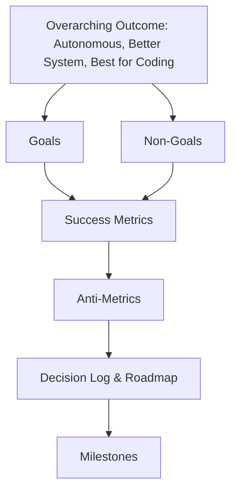

# 02 — Goals, Non-Goals, and Success Metrics

> **Status:** Draft
> **Last updated:** 2026-10-04
> **Owner:** Project lead
> **Related docs:** `01-project-overview.md`, `03-requirements.md`, `12-roadmap.md`, `13-risks-assumptions-decisions.md`

---

## 1. Purpose of This Document

This document is the **commitment document** for CodeGuardian v1. It answers three questions:

1. **What are we trying to achieve?** — Goals
2. **What are we explicitly NOT trying to achieve?** — Non-Goals
3. **How do we know we succeeded?** — Success Metrics

If a future feature, decision, or PR does not serve a goal listed here, or violates a non-goal, it does not belong in v1. This document is the guardrail against scope creep.

> **Note:** All numeric targets below are marked as **proposed**. They are suggestions for v1, not final commitments. They will be confirmed or adjusted in the decision log (`13-risks-assumptions-decisions.md`) before Milestone 1 begins.

---

## 2. The Overarching Outcome

> **CodeGuardian v1 exists to demonstrate that an autonomous, safety-first agent can refactor real legacy code across real languages, on real repositories, with provable behavior preservation, explicit user consent, and structured accountability — and do it better than any existing general-purpose coding agent.**

Three words capture the ambition:

| Word | What it means for CodeGuardian |
|---|---|
| **Autonomous** | The agent runs the full pipeline — reconnaissance, testing, refactoring, verification — without step-by-step human hand-holding. Human approval happens at the boundaries (consent to apply, prompt to verify), not inside the loop. |
| **Better system** | Not a better model. A better *system*: sandboxed, verified, audited, plugin-based, multi-language, multi-repo, MCP-native. The value is architectural, not model-dependent. |
| **Best for coding** | Best-in-class for the specific task of **safe legacy refactoring**. Not best at writing new code. Not best at answering questions. Best at the one job it is built to do. |

---

## 3. Goals

Goals are outcomes, not features. Each goal is specific to CodeGuardian and falsifiable — we can judge at the end of v1 whether it was met.

### 3.1 Safety Goals

| # | Goal | Why it matters |
|---|---|---|
| **G-S1** | **No code is ever modified without explicit user consent.** | The trust contract. Non-negotiable. |
| **G-S2** | **No untrusted code runs outside the Docker sandbox.** | Prevents host compromise. |
| **G-S3** | **No refactor is applied without a passing characterization test on the old code.** | The safety net must exist before any change. |
| **G-S4** | **Every refactor is verified by at least one independent model instance that did not write it.** | Directly addresses the 31.7% self-review failure rate. |

### 3.2 Autonomy Goals

| # | Goal | Why it matters |
|---|---|---|
| **G-A1** | **The full pipeline — reconnaissance → test → refactor → verify — runs end-to-end without human intervention inside the loop.** | Human approval is at boundaries, not inside every step. |
| **G-A2** | **The agent self-corrects on test failure up to 3 retries before giving up.** | Autonomy means "tries to fix itself," not "stops at first error." |
| **G-A3** | **The agent reports its own failures clearly, with evidence, when it cannot succeed.** | Autonomy includes honest failure, not silent surrender. |

### 3.3 Understanding Goals

| # | Goal | Why it matters |
|---|---|---|
| **G-U1** | **The agent understands a project before touching it.** | Reconnaissance is mandatory, not optional. |
| **G-U2** | **The agent detects all languages present in a repo, with evidence.** | Multi-language detection via Tree-sitter. |
| **G-U3** | **The agent surfaces documentation drift — where docs disagree with code.** | Truth Report is a first-class output. |
| **G-U4** | **The agent builds both a dependency graph and a hierarchical index of the codebase.** | "What depends on this?" and "Where is this?" are different questions. |

### 3.4 Quality Goals

| # | Goal | Why it matters |
|---|---|---|
| **G-Q1** | **Characterization tests pass on the old code before any refactor begins.** | If they don't, the code is already broken — report, don't touch. |
| **G-Q2** | **The refactored code passes the same characterization tests.** | The minimum bar for success. |
| **G-Q3** | **Python and TypeScript/JavaScript reach high reliability; other languages are best-effort and labeled as such.** | Honesty about tiered reliability. |
| **G-Q4** | **The agent produces a diff, a PR/MR description, and a structured audit log for every run.** | Evidence, not vibes. |

### 3.5 Openness Goals

| # | Goal | Why it matters |
|---|---|---|
| **G-O1** | **The project is fully open source under Apache 2.0.** | Permissive, patent-protected, enterprise-friendly. |
| **G-O2** | **Languages, providers, MCP tools, verifiers, and reporters are all plugins — addable without core PRs.** | Extensibility without bottleneck. |
| **G-O3** | **The agent is provider-agnostic: cloud APIs and local models via OpenAI-compatible endpoints.** | No vendor lock-in. Offline use is first-class. |
| **G-O4** | **CodeGuardian is both an MCP client and an MCP server.** | First-class citizen in the agent ecosystem. |

### 3.6 Usability Goals

| # | Goal | Why it matters |
|---|---|---|
| **G-X1** | **The CLI is fast, advanced, and visually stunning** — Rich + Textual based. | Developer tools compete on feel. |
| **G-X2** | **The agent warns the user at the point of action when targeting best-effort languages.** | Expectations are set where they matter, not buried in docs. |
| **G-X3** | **Cross-model verification is prompted per run, not forced.** | Transparency over coercion. |
| **G-X4** | **A 2-minute demo exists showing the self-correction loop.** | Portfolio-grade proof of the differentiator. |

---

## 4. Non-Goals

Non-goals are just as important as goals. They are the things v1 will **explicitly not do**, even if tempting.

### 4.1 Product Non-Goals

| # | Non-Goal | Why it's excluded |
|---|---|---|
| **NG-P1** | **Not a general coding agent.** | We do not compete with Claude Code, Codex, Cursor, or Devin. |
| **NG-P2** | **Not a better model.** | We use existing models. The value is architectural. |
| **NG-P3** | **Not a dependency upgrader.** | We report drift; we do not run `pip install -U` or migrate `requirements.txt`. |
| **NG-P4** | **Not a bug fixer.** | We preserve *current* behavior, even if buggy. Bug discovery is out of scope. |
| **NG-P5** | **Not a deployment tool.** | We stop at diff / PR / MR. We never deploy. |
| **NG-P6** | **Not a monolith splitter.** | Architecture-level refactoring is out of scope. |
| **NG-P7** | **Not a commercial product (in v1).** | Open source, portfolio-grade. Commercialization is a future question. |

### 4.2 Scope Non-Goals

| # | Non-Goal | Why it's excluded |
|---|---|---|
| **NG-S1** | **No whole-repo refactor in one shot.** | The agent works on targets (file, function, module). |
| **NG-S2** | **No full runtime behavior discovery in v1.** | v1 runs *existing* tests (smoke test); it does not discover new runtime paths. |
| **NG-S3** | **No Bitbucket or Azure DevOps adapters in v1.** | Interface supports them; adapters are v2. |
| **NG-S4** | **No cryptographic signing of audit logs in v1.** | Structured provenance only. Signing is a v2 enhancement. |
| **NG-S5** | **No scheduled or autonomous repo monitoring.** | Manual invocation only. |
| **NG-S6** | **No applying changes to the user's real working tree without explicit approval — ever.** | Enforced architecturally. |

### 4.3 Quality Non-Goals

| # | Non-Goal | Why it's excluded |
|---|---|---|
| **NG-Q1** | **No claim of equal reliability across all languages.** | Tiered reliability is documented and enforced in the CLI. |
| **NG-Q2** | **No guarantee of refactor success on every target.** | The agent reports failure honestly. |
| **NG-Q3** | **No silent mutations.** | Every change is visible, diffed, and approved. |
| **NG-Q4** | **No over-claiming of behavioral equivalence.** | v1 verifies via characterization tests. Formal equivalence proof is future work. |

---

## 5. Success Metrics

Metrics are the concrete, checkable outcomes that tell us v1 succeeded. All numeric targets are **proposed** and pending confirmation.

### 5.1 Functional Metrics

| # | Metric | Proposed Target | How measured |
|---|---|---|---|
| **M-F1** | Reconnaissance detects all languages present in a test repo | 100% detection across a curated multi-language corpus | Automated recon tests |
| **M-F2** | Reconnaissance produces `recon.json` with evidence for every fact | 100% of facts carry `file:line` evidence | Schema validation |
| **M-F3** | Truth Report flags at least one real doc/code mismatch on a known-lying repo | ≥1 mismatch on the `LyingDocs`-style test repo | Manual + automated check |
| **M-F4** | Characterization tests pass on old code before any refactor | ≥95% of targets where the code is not already broken | Run logs |
| **M-F5** | Refactored code passes the same characterization tests | ≥80% of targets on first attempt; ≥90% within 3 retries | Run logs |
| **M-F6** | Every run produces a diff, PR/MR description, and audit log | 100% of runs | Audit log validation |
| **M-F7** | Every run prompts for cross-model verification | 100% of runs | CLI trace |

### 5.2 Safety Metrics

| # | Metric | Proposed Target | How measured |
|---|---|---|---|
| **M-S1** | Mutations to real code without explicit consent | **0** | Architectural test + audit log inspection |
| **M-S2** | Code execution outside the Docker sandbox | **0** | Sandbox policy tests |
| **M-S3** | Refactors applied without a passing safety net | **0** | Orchestrator invariant tests |
| **M-S4** | Refactors applied without independent verification when the user requested it | **0** | Audit log validation |

### 5.3 Quality Metrics

| # | Metric | Proposed Target | How measured |
|---|---|---|---|
| **M-Q1** | Verifier agreement rate (correctness + security) on accepted refactors | ≥90% | Run logs |
| **M-Q2** | Average retries per successful refactor | ≤1.5 | Run logs |
| **M-Q3** | False positive rate of the Security Verifier on known-safe refactors | ≤10% | Curated benchmark |
| **M-Q4** | Self-review failure cases caught by independent verifiers | ≥1 caught in the demo | Demo script |

### 5.4 Performance Metrics

| # | Metric | Proposed Target | How measured |
|---|---|---|---|
| **M-P1** | Reconnaissance completes for a 50k-line repo | ≤5 minutes | Timer |
| **M-P2** | Refactor of a 500-line file (including tests + verification) | ≤10 minutes | Timer |
| **M-P3** | Sandbox cold-start time | ≤15 seconds | Timer |
| **M-P4** | CLI responsiveness (command → first output) | ≤500 ms | Timer |

### 5.5 Cost Metrics

| # | Metric | Proposed Target | How measured |
|---|---|---|---|
| **M-C1** | Cloud-model cost per 500-line refactor (single-model default) | ≤$2.00 | Token accounting |
| **M-C2** | Cloud-model cost per 500-line refactor (cross-model verification enabled) | ≤$5.00 | Token accounting |
| **M-C3** | Local-model cost per refactor | $0 (electricity only) | Documented, not measured |

> **Assumption:** Cost targets are estimates based on current cloud pricing. They will be re-validated in Milestone 1.

### 5.6 Adoption & Openness Metrics

| # | Metric | Proposed Target | How measured |
|---|---|---|---|
| **M-A1** | External contributor adds a language plugin | ≥1 by v1 ship | GitHub contributor history |
| **M-A2** | External contributor adds a repo provider plugin | ≥1 by v1 ship | GitHub contributor history |
| **M-A3** | CodeGuardian is callable as an MCP server by a third-party client | Verified in demo | Manual + automated |
| **M-A4** | CodeGuardian consumes at least 2 external MCP tools | Verified in run logs | Run logs |
| **M-A5** | A public demo video exists | 1 published | YouTube / repo link |

### 5.7 Portfolio Metrics (for the project author)

These metrics exist because this project is also a hiring signal. They are documented honestly, not hidden.

| # | Metric | Proposed Target | How measured |
|---|---|---|---|
| **M-PF1** | Project demonstrates systems thinking (sandbox, verification, consent, plugins) | Qualitative review | Self-assessment + external feedback |
| **M-PF2** | Project is cited or referenced in an interview / portfolio context | ≥1 | Author's record |
| **M-PF3** | Codebase is understandable by a fresh contributor using only the docs | ≥1 external contributor confirms | GitHub issues / discussions |

---

## 6. Anti-Metrics

Things that, if true, would indicate failure — even if other metrics look good.

| # | Anti-Metric | What it signals |
|---|---|---|
| **A-1** | A refactor is applied without a passing safety net. | The core promise is broken. |
| **A-2** | A run occurs without an audit log entry. | Accountability is broken. |
| **A-3** | The agent writes to the original working tree at any point. | The consent model is broken. |
| **A-4** | Any code runs on the host machine outside the sandbox. | The isolation model is broken. |
| **A-5** | The docs claim a capability the code does not deliver. | Honesty is broken — the same failure we exist to prevent. |
| **A-6** | The project ships without a working self-correction demo. | The differentiator is unproven. |
| **A-7** | A language or provider requires a core PR to add. | The plugin architecture failed. |

---

## 7. How Goals, Non-Goals, and Metrics Relate

- **Goals** define what we move toward.
- **Non-Goals** define what we refuse to move toward.
- **Metrics** define how we know we arrived.
- **Anti-Metrics** define how we know we failed even if we arrived.

---

## 8. Open Questions

> **Open Question:** Are the proposed numeric targets in §5 acceptable, or should they be revised before Milestone 1?
> **Open Question:** Should the cost targets be per-file, per-run, or per-1000-lines?
> **Open Question:** Is M-PF3 (fresh contributor understands docs) measured formally, or informally?
> **Open Question:** Is there a metric for "the agent refuses to refactor when the old code is broken"? Not yet defined.
> **Open Question:** Should local-model runs be benchmarked at all, or only documented?

---

## 9. Assumptions

> **Assumption:** All numeric targets in §5 are proposals pending confirmation in the decision log.
> **Assumption:** Cost targets assume cloud-model pricing as of late 2026.
> **Assumption:** The author is a solo developer; some adoption metrics (external contributions) may be aspirational for v1.
> **Assumption:** The demo video is a required deliverable for v1, not optional.
> **Assumption:** Anti-metrics are treated as release blockers, not warnings.

---

## 10. Related Documents

- `01-project-overview.md` — vision, problem, positioning
- `03-requirements.md` — functional and non-functional requirements derived from these goals
- `12-roadmap.md` — milestones that move toward these goals
- `13-risks-assumptions-decisions.md` — decision log for numeric targets
- `../skills.md` — agent operating manual
