# 04 — System Architecture

> **Status:** Draft
> **Last updated:** 2026-10-04
> **Owner:** Project lead
> **Related docs:** `03-requirements.md`, `05-data-model.md`, `06-api-contracts.md`, `07-tech-stack.md`, `08-repository-structure.md`, `14-model-strategy.md`, `15-verification-architecture.md`, `16-context-engineering.md`

---

## 1. Purpose

This document defines how CodeGuardian is structured to satisfy the requirements in `03-requirements.md`. It covers components, their responsibilities, their interfaces, the phase pipeline, agent roles, the plugin system, the sandbox, and the language boundary between Python and Rust.

Every requirement in `03` maps to a component or a phase described here. The traceability matrix at the end of this document confirms the mapping.

---

## 2. Architectural Principles

These are the rules that govern every design decision. If a design choice conflicts with a principle, the principle wins.

| # | Principle | Consequence |
|---|---|---|
| **P1** | **Safety before speed.** | Nothing touches real code without consent. Nothing runs outside the sandbox. No exception. |
| **P2** | **Understanding before action.** | Reconnaissance is mandatory. No refactor phase executes without `recon.json`. |
| **P3** | **Isolation by default.** | Untrusted code runs in a separate process, in a separate container. Trusted code runs in-process. |
| **P4** | **Interfaces over implementations.** | The core never imports a concrete plugin. Every component is defined by an abstract interface. |
| **P5** | **Evidence over assertion.** | Every fact carries `file:line` evidence. Every run produces an audit entry. |
| **P6** | **Independence in verification.** | The verifier never sees the original code or the writer's reasoning. |
| **P7** | **Locality of change.** | A change to one module does not require changes to unrelated modules. |
| **P8** | **Language follows property.** | Rust where memory safety and determinism are required. Python where AI ecosystem and iteration speed are required. |

---

## 3. System Context

This is what CodeGuardian looks like from the outside.

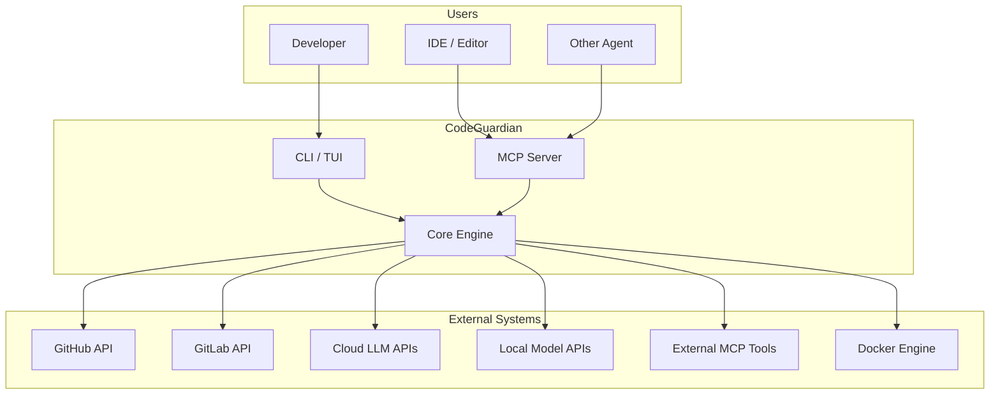

**External boundaries:**

- **Users** interact via CLI, TUI, or MCP.
- **CodeGuardian** is the system.
- **External systems** are things CodeGuardian depends on, not things it owns.

---

## 4. Component Inventory

Every component, its responsibility, its language, and its interface.

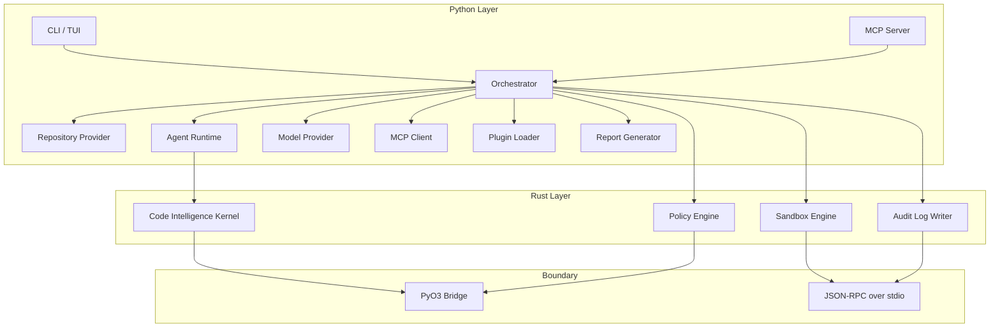

### 4.1 Component Table

| Component | Language | Responsibility | Interface |
|---|---|---|---|
| **CLI / TUI** | Python | User entry point. Renders reconnaissance, plan, diff, verification. | `codeguardian` command |
| **Orchestrator** | Python | Controls the phase state machine. Enforces consent and verification prompts. | `Orchestrator` Protocol |
| **Repository Provider** | Python | Reads from local, GitHub, GitLab. Read-only by default. | `RepositoryProvider` Protocol |
| **Agent Runtime** | Python | Executes Analyst, Tester, Writer, Verifiers. | `Agent` Protocol |
| **Model Provider** | Python | Abstracts cloud and local LLM APIs. | `ModelProvider` Protocol |
| **MCP Client** | Python | Consumes external MCP tools. | `MCPClient` Protocol |
| **MCP Server** | Python | Exposes CodeGuardian as an MCP tool. | MCP protocol |
| **Plugin Loader** | Python | Discovers and loads plugins via entry points. | `PluginLoader` Protocol |
| **Report Generator** | Python | Produces diff, PR/MR description, audit entry. | `Reporter` Protocol |
| **Code Intelligence Kernel** | Rust | Tree-sitter parsing, dependency graph, symbol extraction, repo map. | PyO3 functions |
| **Sandbox Engine** | Rust | Spawns Docker, enforces quotas, monitors resources, kills runaway processes. | JSON-RPC methods |
| **Audit Log Writer** | Rust | Append-only, tamper-evident log. | JSON-RPC methods |
| **Policy Engine** | Rust | Enforces sandbox policy, plugin permissions, resource limits. | PyO3 functions |
| **PyO3 Bridge** | Rust/Python | In-process, zero-copy data transfer for trusted, high-volume calls. | `#[pyfunction]` |
| **JSON-RPC Bridge** | Rust/Python | Out-of-process, isolated communication for untrusted or isolation-critical calls. | JSON-RPC 2.0 over stdio |

---

## 5. Phase Pipeline

The pipeline is composed of **per-phase subgraphs** composed into a **parent graph**. Each phase is independently testable and independently replaceable.

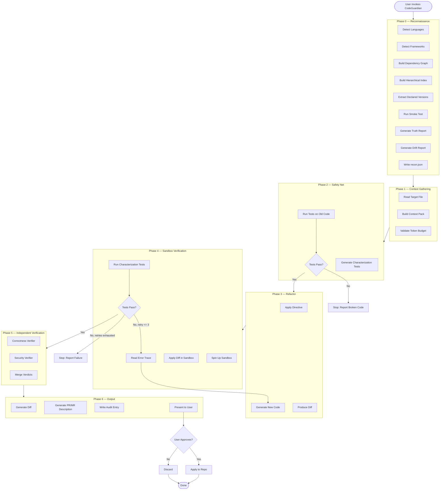

### 5.1 Phase Entry and Exit Conditions

| Phase | Entry Condition | Exit Condition |
|---|---|---|
| **Phase 0** | User invokes CodeGuardian with a repo URL or path. | `recon.json` is written and validated. |
| **Phase 1** | `recon.json` exists. Target file is specified. | Context Pack is built and within token budget. |
| **Phase 2** | Context Pack exists. | Characterization tests pass on old code, OR the phase stops and reports broken code. |
| **Phase 3** | Safety net is valid. | A diff is produced. |
| **Phase 4** | A diff exists. | Tests pass in the sandbox, OR retries are exhausted. |
| **Phase 5** | Tests pass in the sandbox. | Verifier verdicts are merged. |
| **Phase 6** | Verifier verdicts exist. | Diff, PR/MR description, and audit entry are written. User consent is requested. |

---

## 6. Agent Roles

Each agent is a component with defined inputs, outputs, and model roles. Agents run out-of-graph from the orchestrator's perspective — they are called as separate steps, not embedded as nodes.

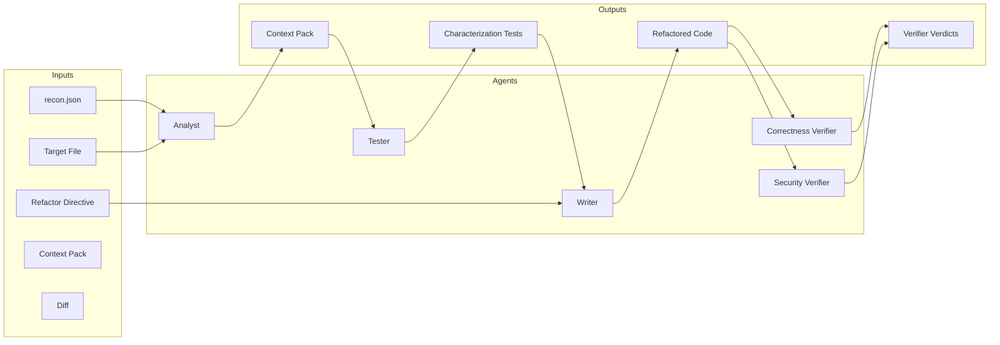

### 6.1 Agent Table

| Agent | Role | Model Role | Inputs | Outputs | Failure Behavior |
|---|---|---|---|---|---|
| **Analyst** | Reads target, builds Context Pack from `recon.json`. | Cheap/mid-tier model. | `recon.json`, target file. | Context Pack. | Returns error; orchestrator stops. |
| **Tester** | Writes characterization tests against old code. | Frontier model. | Context Pack. | Test file. | Returns error; orchestrator stops. |
| **Writer** | Refactors code according to directive. | Frontier model. | Context Pack, directive, test file. | Refactored code + diff. | On test failure, receives error trace and retries (max 3). |
| **Correctness Verifier** | Independently checks behavioral equivalence. | Frontier model (different family from Writer). | Diff only. No original code. No Writer reasoning. | Verdict. | Returns `pass`, `fail`, or `uncertain`. |
| **Security Verifier** | Independently checks for introduced vulnerabilities. | Frontier model (different family from Writer). | Diff only. No original code. No Writer reasoning. | Verdict. | Returns `pass`, `fail`, or `uncertain`. |

### 6.2 Verifier Independence

This is the strongest architectural guarantee in CodeGuardian.

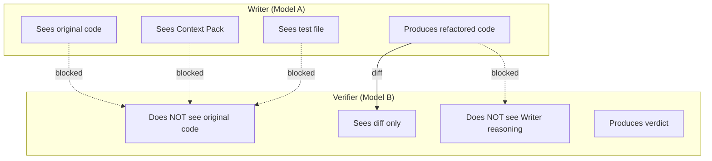

**Enforcement:** The verifier is called with a fresh model instance. Its context is constructed from scratch — only the diff and the characterization tests. It never receives the original file, the Context Pack, or the Writer's chain of thought.

---

## 7. Repository Provider Abstraction

The Repository Provider is read-only by default. It has no write method. Applying changes is a separate, explicit step.

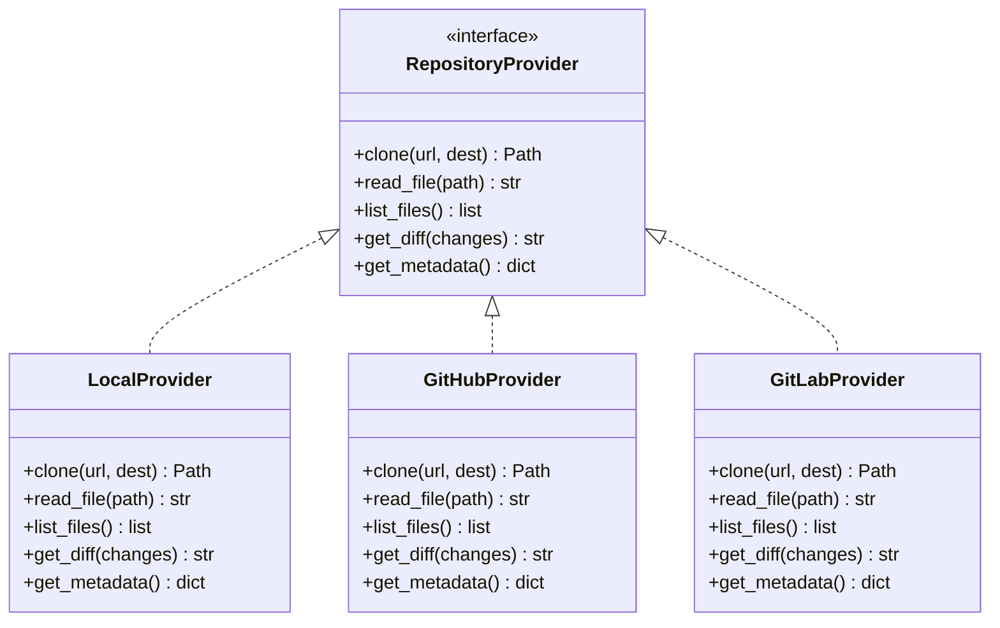

**Enforcement of read-only:**

- The interface has no `write_file`, `apply_diff`, or `mutate` method.
- Applying changes is a separate `ApplyProvider` that requires explicit consent.
- No provider is instantiated with write credentials during agent execution.
- The original working tree is never opened for writing.

**Consent flow:**

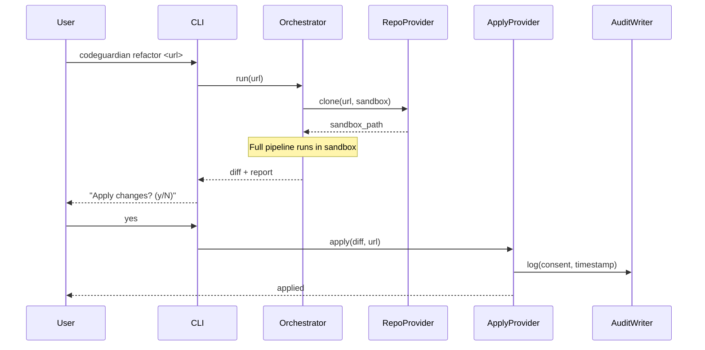

---

## 8. Plugin Architecture

Plugins are discovered at runtime via entry points. Adding a language, provider, tool, verifier, or reporter does not require a core change.

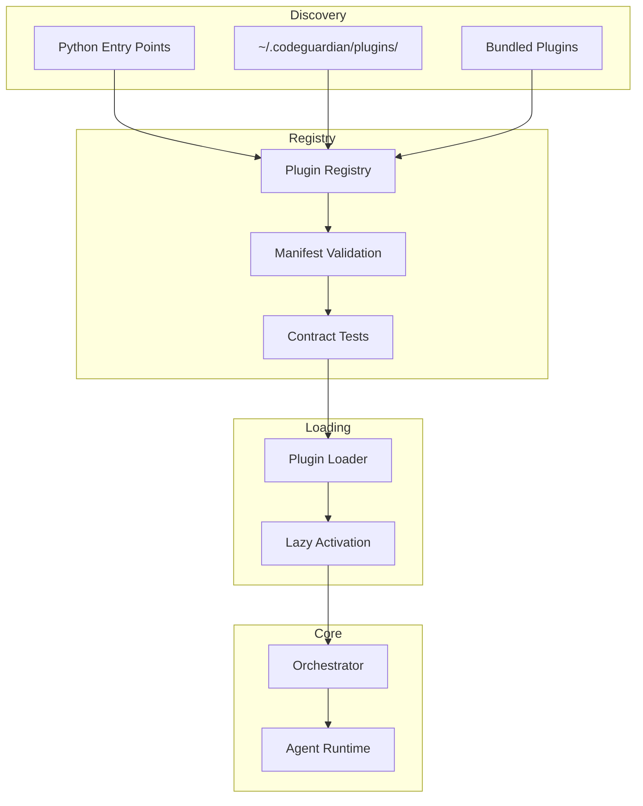

### 8.1 Contribution Points

| Contribution Point | What it registers | Contract Test |
|---|---|---|
| `codeguardian.languages` | Tree-sitter grammar, test runner, refactor rules, reliability tier. | `LanguagePluginContract` |
| `codeguardian.providers` | Clone, read, list, diff for a repo source. | `RepositoryProviderContract` |
| `codeguardian.tools` | MCP tool or custom analysis tool. | `ToolContract` |
| `codeguardian.verifiers` | New verification lens. | `VerifierContract` |
| `codeguardian.reporters` | New output format (JSON, SARIF, etc.). | `ReporterContract` |

### 8.2 Plugin Manifest

Every plugin declares its capabilities and permissions.

```json
{
  "name": "codeguardian-lang-kotlin",
  "version": "1.0.0",
  "type": "language",
  "language": "kotlin",
  "tree_sitter_grammar": "tree-sitter-kotlin",
  "test_runner": "gradle test",
  "refactor_rules": ["add_type_annotations", "extract_functions"],
  "reliability_tier": "best-effort",
  "permissions": {
    "filesystem": "sandbox_only",
    "network": false,
    "process_spawn": true
  },
  "interface_version": "1.0"
}
```

### 8.3 Plugin Trust Model

| Plugin Source | Trust Level | Execution |
|---|---|---|
| **Bundled** | Full | In-process (PyO3 or Python) |
| **User-installed** | Medium | In-process, permissions enforced |
| **Registry** | Lower | In-process, permissions enforced; separate process as v2 option |

**Rule:** A plugin failure must not crash the core. Plugins are wrapped in a fault barrier. On failure, the plugin is disabled for the run and the failure is logged.

---

## 9. MCP Integration

CodeGuardian is both an MCP client and an MCP server.

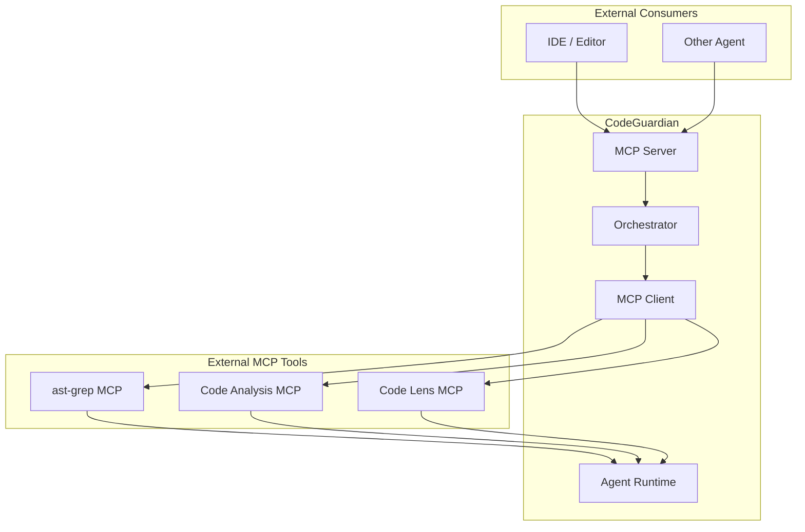

### 9.1 Consumed MCP Tools (v1)

| Tool | Purpose | Used By |
|---|---|---|
| **ast-grep MCP** | Structural code search, refactoring, complexity analysis. | Analyst, Writer |
| **Code Analysis MCP** | Semantic search, dependency analysis, knowledge graphs. | Analyst |
| **Code Lens MCP** | Diff analysis, PR review, code smell detection. | Verifiers |

### 9.2 Exposed MCP Tools

| Tool | Purpose | Input | Output |
|---|---|---|---|
| `codeguardian.refactor` | Refactor a target file. | Repo URL, file path, directive. | Diff + report. |
| `codeguardian.recon` | Run reconnaissance on a repo. | Repo URL. | `recon.json`. |
| `codeguardian.verify` | Verify a diff. | Diff, test results. | Verdict. |

---

## 10. Model Provider Layer

The Model Provider abstracts cloud and local LLM APIs. The user chooses models per role.

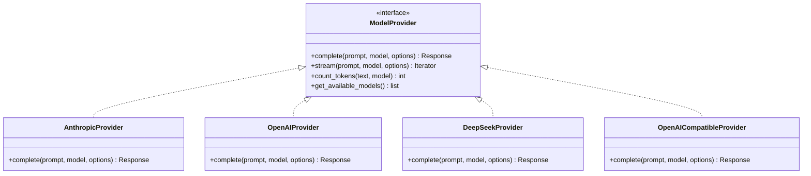

### 10.1 Per-Role Model Selection

| Role | Default | User-Configurable |
|---|---|---|
| **Analyst** | Cheap/mid-tier cloud model | Yes |
| **Tester** | Frontier cloud model | Yes |
| **Writer** | Frontier cloud model | Yes |
| **Correctness Verifier** | Frontier model (different family from Writer) | Yes |
| **Security Verifier** | Frontier model (different family from Writer) | Yes |

### 10.2 Verification Prompt Enforcement

The per-run prompt is enforced in the **orchestrator layer**, before the verification phase.

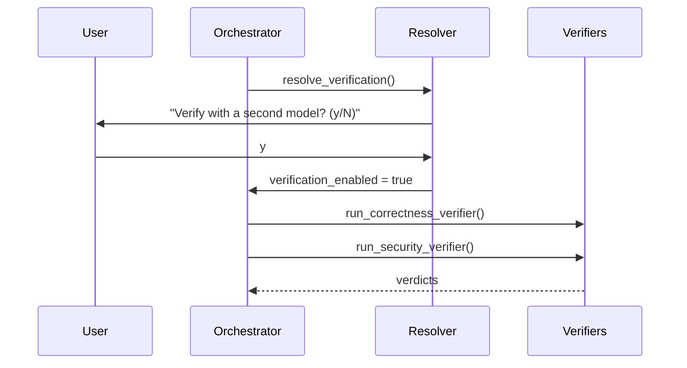

**Rule:** The prompt is a policy decision. Policy belongs in the orchestrator. The CLI triggers the orchestrator; the orchestrator triggers the prompt.

### 10.3 Local Model Support

Local models are accessed via **OpenAI-compatible endpoints**. Ollama, vLLM, llama.cpp, and LM Studio all expose this interface. No custom adapter is required.

| Local Runtime | Endpoint | Verified |
|---|---|---|
| Ollama | `http://localhost:11434/v1` | v1 |
| vLLM | `http://localhost:8000/v1` | v1 |
| llama.cpp | `http://localhost:8080/v1` | v1 |
| LM Studio | `http://localhost:1234/v1` | v1 |

**Cost reporting:** Local-model runs report `$0` cloud cost. Token count is still recorded for observability.

---

## 11. Sandbox Architecture

The sandbox is the safety boundary. It is a Rust-owned component that communicates with Python via JSON-RPC over stdio.

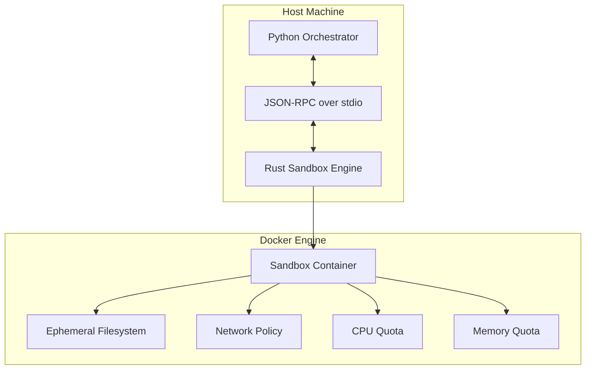

### 11.1 Sandbox Lifecycle

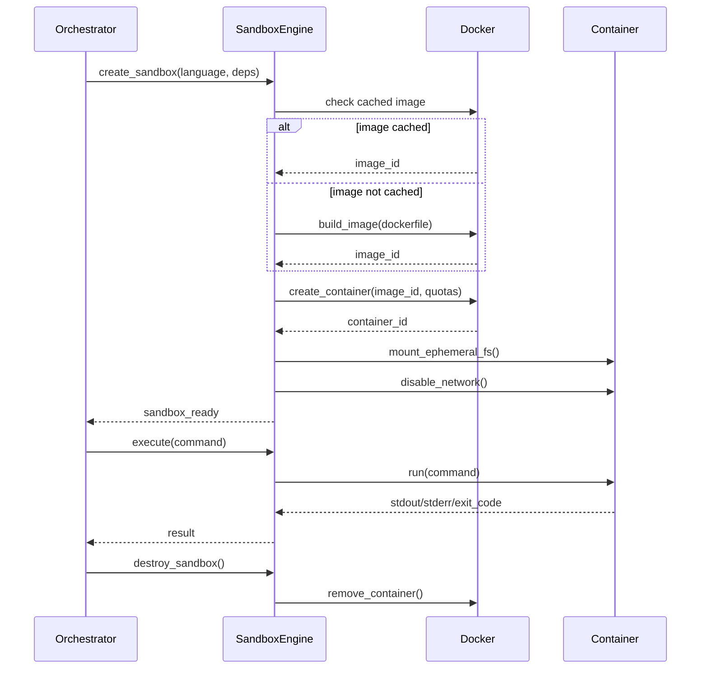

### 11.2 Hybrid Dependency Resolution

Dependencies are resolved in a controlled network phase, then the sandbox is sealed.

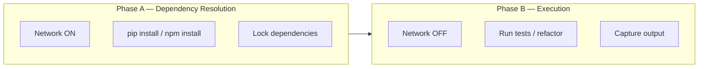

**Rule:** Network is enabled only during dependency resolution. The main execution sandbox is network-isolated.

### 11.3 Language Base Images

| Language | Base Image | Test Runner | Build Strategy |
|---|---|---|---|
| Python | `python:3.12-slim` | `pytest` | On-demand + cache |
| TypeScript / JavaScript | `node:22-slim` | `vitest` / `jest` | On-demand + cache |
| Java | `eclipse-temurin:21-jre` | `mvn test` | On-demand + cache |
| Go | `golang:1.23` | `go test` | On-demand + cache |
| Rust | `rust:1.83` | `cargo test` | On-demand + cache |

**Cache invalidation:** When the project's dependency manifest changes (`pyproject.toml`, `package.json`, `pom.xml`, `go.mod`, `Cargo.toml`), the cache is invalidated and the image is rebuilt.

---

## 12. Reconnaissance Engine

The Reconnaissance Engine is the Rust-owned Code Intelligence Kernel. It produces the `recon.json` that every subsequent phase reads.

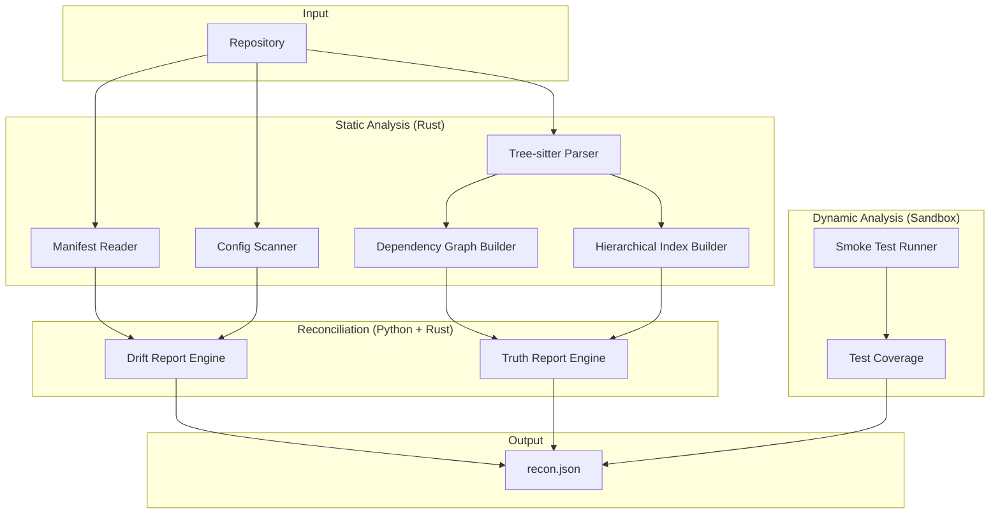

### 12.1 `recon.json` Structure

```json
{
  "schema_version": "1.0",
  "repo": {
    "url": "https://github.com/example/legacy",
    "commit": "abc123",
    "detected_at": "2026-10-04T12:00:00Z"
  },
  "languages": [
    {"name": "python", "files": 120, "percentage": 65.0, "tier": "high"},
    {"name": "typescript", "files": 40, "percentage": 25.0, "tier": "high"},
    {"name": "go", "files": 15, "percentage": 10.0, "tier": "best-effort"}
  ],
  "frameworks": [
    {"name": "django", "version": "4.2", "evidence": "requirements.txt:3"}
  ],
  "dependency_graph": {
    "nodes": ["utils/parser.py", "models/user.py"],
    "edges": [{"from": "utils/parser.py", "to": "models/user.py"}]
  },
  "hierarchical_index": {
    "utils/": ["parser.py", "helpers.py"],
    "models/": ["user.py"]
  },
  "entrypoints": [
    {"file": "main.py", "line": 1, "type": "script"}
  ],
  "versions": {
    "declared": {"python": ">=3.9", "django": "4.2"},
    "actual": {"python": "3.11", "django": "4.2.1"},
    "available": {"python": "3.12", "django": "5.0"}
  },
  "smoke_test": {
    "status": "partial",
    "passed": 45,
    "failed": 3,
    "errored": 2,
    "duration_seconds": 120
  },
  "truth_report": [
    {
      "claim": "Python 3.12+ required",
      "source": "README.md:5",
      "reality": "pyproject.toml:8 says requires-python = \">=3.9\"",
      "severity": "warning",
      "suggestion": "Update README to match pyproject.toml"
    }
  ],
  "drift_report": [
    {
      "package": "django",
      "declared": "4.2",
      "actual": "4.2.1",
      "available": "5.0",
      "severity": "info",
      "suggestion": "Consider upgrading to Django 5.0"
    }
  ]
}
```

---

## 13. Audit Trail Architecture

The Audit Log Writer is a Rust-owned, append-only, tamper-evident component. It runs as a separate process, isolated from Python.

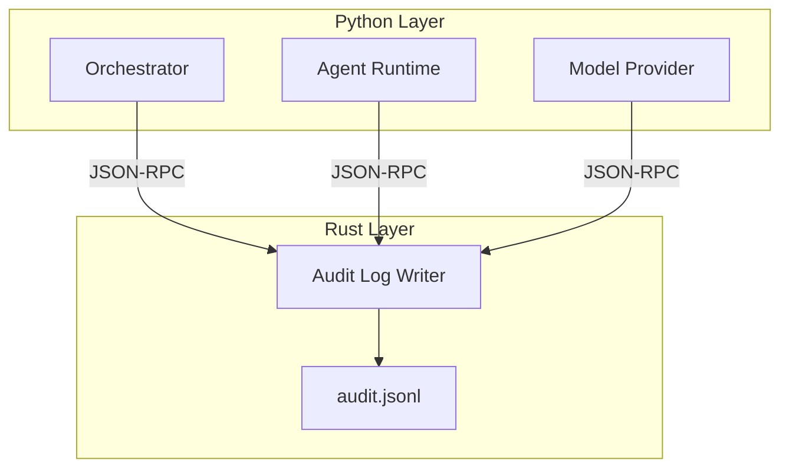

### 13.1 Audit Entry Schema

Every entry is a JSON object on its own line (JSONL).

```json
{
  "entry_id": "uuid",
  "run_id": "uuid",
  "timestamp": "2026-10-04T12:00:00Z",
  "phase": "refactor",
  "agent": "writer",
  "model": {
    "id": "claude-opus-5.5",
    "version": "2026-09-15",
    "provider": "anthropic"
  },
  "input": {
    "prompt_hash": "sha256:...",
    "context_hash": "sha256:...",
    "directive": "add type hints"
  },
  "output": {
    "diff_hash": "sha256:...",
    "tokens_in": 4500,
    "tokens_out": 1200
  },
  "result": {
    "status": "success",
    "tests_passed": 12,
    "tests_failed": 0,
    "retries": 0
  },
  "verification": {
    "correctness": {"verdict": "pass", "model": "gpt-6-astra"},
    "security": {"verdict": "pass", "model": "gpt-6-astra"}
  },
  "consent": {
    "requested": true,
    "granted": true,
    "granted_at": "2026-10-04T12:05:00Z"
  },
  "rollback_ref": "git:abc123"
}
```

### 13.2 Tamper Evidence

| Property | How It's Enforced |
|---|---|
| **Append-only** | The Rust writer opens the file in append mode. No truncate, no seek, no overwrite. |
| **Isolation** | Python never has a file handle to the log. All writes go through JSON-RPC. |
| **Integrity** | Each entry includes a hash of its content. The next entry includes the previous entry's hash (hash chain). |
| **Export** | The log can be exported as JSONL for external analysis. |

> **Note:** Cryptographic signing (GPG) is a v2 enhancement. v1 provides structured provenance and hash-chaining.

---

## 14. Language Boundary — Python and Rust

The boundary is defined by property, not preference.

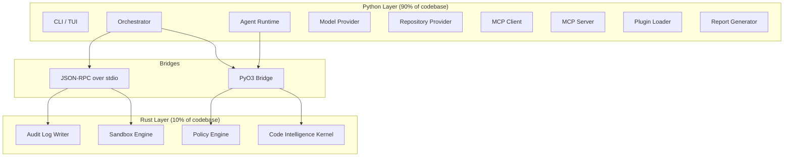

### 14.1 Bridge Selection Matrix

| Zone | Bridge | Rationale |
|---|---|---|
| **Code Intelligence Kernel** | PyO3 | Trusted, high-volume, latency-sensitive. Batched calls. Zero-copy data transfer. |
| **Policy Engine** | PyO3 | Trusted, frequent calls. Low latency matters. |
| **Sandbox Engine** | JSON-RPC | Untrusted input. Must survive Python compromise. Separate process boundary. |
| **Audit Log Writer** | JSON-RPC | Tamper-evidence requires isolation. Python must not have a file handle to the log. |

### 14.2 Batching Rule

Cross-boundary calls are batched. The rule:

> **Cross the boundary once per phase, not once per operation.**

| Bad | Good |
|---|---|
| Parse one file, return AST. Parse next file, return AST. | Parse 50 files, return all ASTs. |
| Check policy for one tool call. | Check policy for all tool calls in a phase. |
| Write one audit entry. | Write all audit entries for a phase. |

---

## 15. Data Flow

### 15.1 End-to-End Data Flow

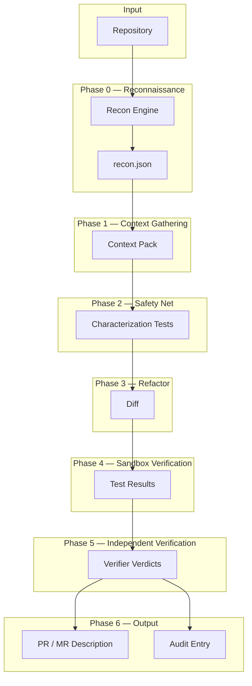

### 15.2 Key Sequence: Refactor with Verification

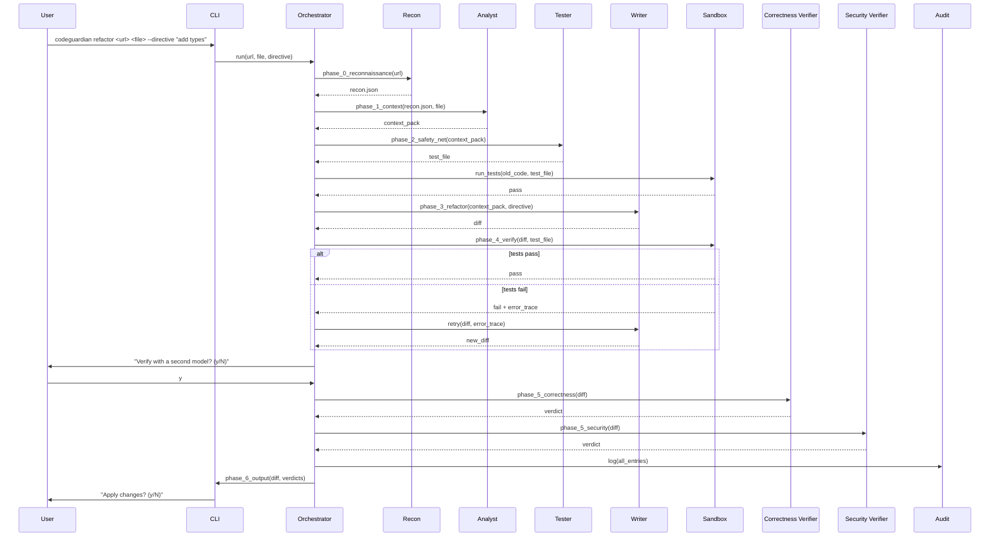

---

## 16. Deployment Topology

### 16.1 v1 — CLI-First

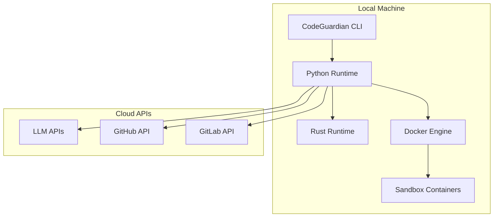

### 16.2 v2 — IDE and Agent Integration

```mermaid
flowchart TB
    subgraph Consumers
        IDE[IDE / Editor]
        Agent[Other Agent]
    end

    subgraph CodeGuardian
        MCPServer[MCP Server]
        Core[Core Engine]
    end

    subgraph Infrastructure
        Docker[Docker Engine]
        LLM[LLM APIs]
    end

    IDE --> MCPServer
    Agent --> MCPServer
    MCPServer --> Core
    Core --> Docker
    Core --> LLM
```

---

## 17. Traceability Matrix

Every requirement in `03` maps to a component or phase in this document.

| Requirement | Component / Phase | Section |
|---|---|---|
| **FR-R1–R7** | Repository Provider | §7 |
| **FR-N1–N10** | Reconnaissance Engine | §12 |
| **FR-C1–C3** | Agent Runtime (Analyst) | §6 |
| **FR-T1–T4** | Agent Runtime (Tester) | §6 |
| **FR-F1–F4** | Agent Runtime (Writer) | §6 |
| **FR-V1–V6** | Agent Runtime (Verifiers) | §6, §10.2 |
| **FR-A1–A4** | Orchestrator + ApplyProvider | §7 |
| **FR-O1–O5** | Report Generator | §4 |
| **FR-M1–M5** | Model Provider | §10 |
| **FR-MCP1–MCP3** | MCP Client + MCP Server | §9 |
| **FR-P1–P4** | Plugin Loader | §8 |
| **FR-CLI1–CLI5** | CLI / TUI | §4 |
| **NFR-M1–M11** | Plugin Architecture | §8 |
| **NFR-P1** | Code Intelligence Kernel (Rust) | §14 |
| **NFR-S1–S6** | Sandbox Engine (Rust) | §11 |
| **NFR-O1–O5** | Audit Log Writer (Rust) | §13 |
| **NFR-PT1–PT3** | Sandbox + Model Provider | §11, §10 |
| **NFR-T1–T4** | Contract Tests + CI | §8 |
| **NFR-E1–E4** | Orchestrator + Fault Barrier | §8.3 |
| **NFR-C1–C3** | Model Provider + Cost Tracking | §10 |

---

## 18. Open Questions

> **Open Question:** Is the hash-chain in the audit log sufficient for v1, or is GPG signing required?
> **Open Question:** Should the Sandbox Engine expose a health check endpoint for external monitors?
> **Open Question:** Is the Policy Engine called per tool invocation, or per phase (batched)?
> **Open Question:** Should the MCP Server be started automatically with the CLI, or only on demand?
> **Open Question:** For Tier 3 languages, does the CLI require typed confirmation, or is a warning sufficient?

---

## 19. Assumptions

> **Assumption:** PyO3 is used for the Code Intelligence Kernel and Policy Engine. JSON-RPC over stdio is used for the Sandbox Engine and Audit Log Writer.
> **Assumption:** LangGraph is the v1 orchestrator implementation, behind an abstract Orchestrator interface.
> **Assumption:** Verifiers run out-of-graph as separate calls.
> **Assumption:** Docker images are built on demand and cached.
> **Assumption:** The hash chain in the audit log is sufficient for v1 tamper evidence.
> **Assumption:** All diagrams use Mermaid and render in GitHub, GitLab, and standard Markdown viewers.

---

## 20. Related Documents

- `03-requirements.md` — functional and non-functional requirements
- `05-data-model.md` — schemas for `recon.json`, audit log, context pack
- `06-api-contracts.md` — provider interfaces, MCP interfaces, CLI surface
- `07-tech-stack.md` — language and framework decisions
- `08-repository-structure.md` — directory layout and conventions
- `10-testing-cicd-deployment.md` — testing strategy and CI
- `11-security-performance-observability.md` — sandbox security and metrics
- `14-model-strategy.md` — model cascade and cost analysis
- `15-verification-architecture.md` — verifier independence and behavioral equivalence
- `16-context-engineering.md` — Repo Map, Context Pack, token budgeting
