# 04 — System Architecture

---

## 1. Purpose

This document defines how CodeGuardian is structured to satisfy the requirements in `03-requirements.md`. It covers components, their responsibilities, their interfaces, the phase pipeline, agent roles, the plugin system, the sandbox backends, and the language boundary between Python and Rust.

Every requirement in `03` maps to a component or a phase described here. The traceability matrix at the end of this document confirms the mapping.

---

## 2. Architectural Principles

These are the rules that govern every design decision. If a design choice conflicts with a principle, the principle wins.

| # | Principle | Consequence |
|---|---|---|
| **P1** | **Safety before speed.** | Nothing touches real code without consent. Nothing runs outside the sandbox. No exception. |
| **P2** | **Understanding before action.** | Reconnaissance and blast radius analysis are mandatory. No refactor phase executes without them. |
| **P3** | **Isolation by default.** | Untrusted code runs in a separate process, in a separate sandbox. Trusted code runs in-process. |
| **P4** | **Interfaces over implementations.** | The core never imports a concrete plugin. Every component is defined by an abstract interface. |
| **P5** | **Evidence over assertion.** | Every fact carries a file and line reference. Every run produces an audit entry. |
| **P6** | **Independence in verification.** | The verifier never sees the original code or the writer's reasoning. |
| **P7** | **Locality of change.** | A change to one module does not require changes to unrelated modules. |
| **P8** | **Language follows property.** | Rust where memory safety and determinism are required. Python where AI ecosystem and iteration speed are required. |
| **P9** | **Never restart.** | Every phase is checkpointed. A run resumes from the last successful checkpoint after any failure. |
| **P10** | **Consent at every boundary.** | The user approves the plan before execution. The user approves the change before apply. The user approves the skill before it enters the library. |

---

## 3. System Context

This is what CodeGuardian looks like from the outside.

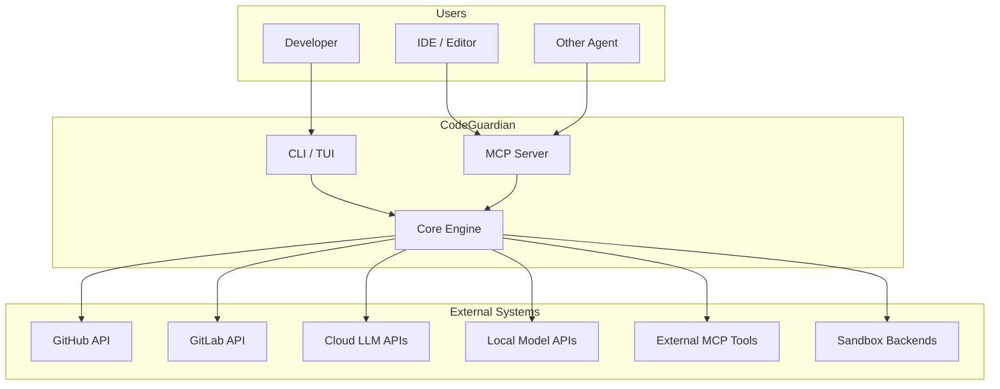

**External boundaries:**

- **Users** interact via CLI, TUI, or MCP.
- **CodeGuardian** is the system.
- **External systems** are things CodeGuardian depends on, not things it owns.

---

## 4. Component Inventory

Every component, its responsibility, its language, and its interface.

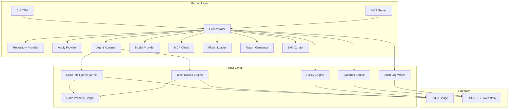

### 4.1 Component Table

| Component | Language | Responsibility | Interface |
|---|---|---|---|
| **CLI / TUI** | Python | User entry point. Renders reconnaissance, blast radius, plan, diff, verification. | `codeguardian` command |
| **Orchestrator** | Python | Controls the phase state machine. Enforces consent, phase gates, and verification prompts. Checkpointing. | `Orchestrator` Protocol |
| **Repository Provider** | Python | Reads from local, GitHub, GitLab. Read-only by default. Full clone first. | `RepositoryProvider` Protocol |
| **Apply Provider** | Python | Separate component for applying changes. Only instantiated after consent. | `ApplyProvider` Protocol |
| **Agent Runtime** | Python | Executes Analyst, Tester, Writer, Verifiers, Skill Curator. | `Agent` Protocol |
| **Model Provider** | Python | Abstracts cloud and local LLM APIs. | `ModelProvider` Protocol |
| **MCP Client** | Python | Consumes external MCP tools with dynamic discovery. | `MCPClient` Protocol |
| **MCP Server** | Python | Exposes CodeGuardian as an MCP tool. | MCP protocol |
| **Plugin Loader** | Python | Discovers and loads plugins via entry points. | `PluginLoader` Protocol |
| **Report Generator** | Python | Produces diff, PR/MR description, audit entry. | `Reporter` Protocol |
| **Skill Curator** | Python | Extracts and proposes reusable patterns after successful runs. Runs out of band. | `SkillCurator` Protocol |
| **Code Intelligence Kernel** | Rust | Tree-sitter parsing, dependency graph, symbol extraction, hierarchical index. Builds the CPG. | PyO3 functions |
| **Code Property Graph** | Rust | Merged AST, CFG, and PDG. Incremental construction. | Internal to Code Intelligence Kernel |
| **Blast Radius Engine** | Rust | Direct and transitive callers, contract violations, coverage gaps, blast score. | PyO3 functions |
| **Sandbox Engine** | Rust | Manages tiered sandbox backends. Enforces quotas. Kills runaway processes. | JSON-RPC methods |
| **Audit Log Writer** | Rust | Append-only, tamper-evident log with hash chain. | JSON-RPC methods |
| **Policy Engine** | Rust | Enforces sandbox policy, plugin permissions, resource limits. | PyO3 functions |
| **PyO3 Bridge** | Rust/Python | In-process, batched data transfer for trusted, high-volume calls. | `#[pyfunction]` |
| **JSON-RPC Bridge** | Rust/Python | Out-of-process, isolated communication for untrusted or isolation-critical calls. | JSON-RPC 2.0 over stdio |

---

## 5. Phase Pipeline

The pipeline is composed of **per-phase subgraphs** composed into a **parent graph**. Each phase is independently testable, independently replaceable, and independently checkpointed.

### 5.1 The Eight Phases

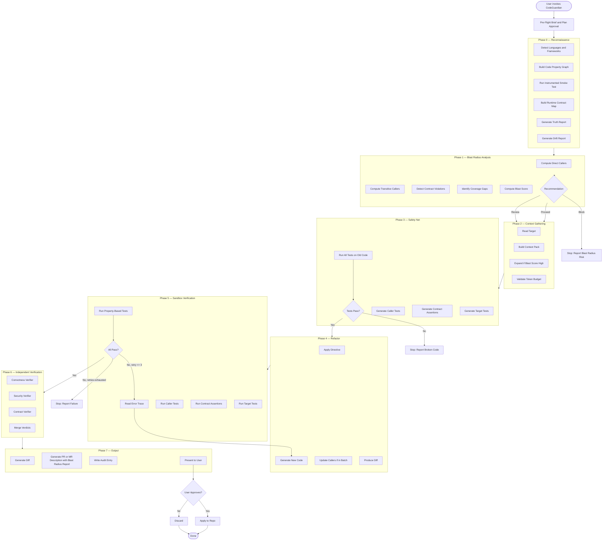

### 5.2 Phase Entry and Exit Conditions

| Phase | Entry Condition | Exit Condition |
|---|---|---|
| **Pre-Flight** | User invokes CodeGuardian with a target. | User approves the brief and the plan. Scope is locked. |
| **Phase 0** | Brief approved. Full repository cloned. | The CPG is built. The runtime contract map is captured. The Truth Report and Drift Report are written. `recon.json` validates. |
| **Phase 1** | `recon.json` exists. Target is specified. | The Blast Radius Report is written. A recommendation is produced. If block, the pipeline stops unless the user overrides. |
| **Phase 2** | Blast Radius Report exists. Recommendation is proceed or review. | The Context Pack is built and within token budget. Expanded if required. |
| **Phase 3** | Context Pack exists. | Characterization tests for the target and required callers pass on the old code. If they do not, the phase stops and reports broken code. |
| **Phase 4** | Safety net is valid. | A diff is produced. Callers are updated if in the batch. |
| **Phase 5** | A diff exists. | All tests pass in the sandbox. Contract assertions pass. Property-based tests pass. Retries are exhausted. |
| **Phase 6** | Tests pass in the sandbox. | Verifier verdicts are merged. Correctness, security, and contract verdicts are recorded. |
| **Phase 7** | Verifier verdicts exist. | Diff, PR/MR description, and audit entry are written. User consent is requested. |
| **Apply** | User consents. | Changes are applied atomically. Rollback reference is recorded. |

### 5.3 Checkpointing and Resume

Every phase is checkpointed after each significant step. If a run crashes, it resumes from the last successful checkpoint, not from the beginning.

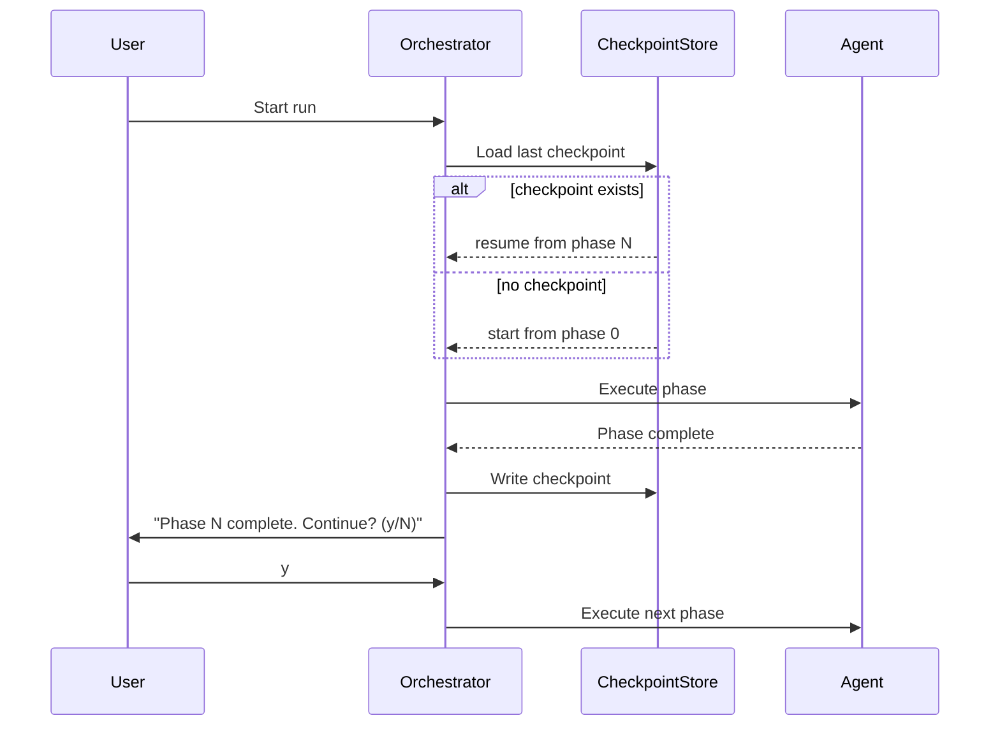

**Checkpoint contents:**

- Current phase
- Phase-specific state
- Completed phases and their outputs
- Pending phase queue
- User consent records
- Retry counts
- Model call history
- Cost accumulation

**Resume rule:** A run never restarts. It always resumes from the last successful checkpoint. This is critical when a user's credits are exhausted mid-run, or when a new model becomes available and the user wants to continue with it.

**Plan approval gate:** The pre-flight brief is presented once. The user approves the scope. After that, the pipeline runs autonomously through all phases until the final apply gate. This balances control with autonomy.

---

## 6. Agent Roles

Each agent is a component with defined inputs, outputs, and model roles. Agents run out-of-graph from the orchestrator's perspective. They are called as separate steps, not embedded as nodes.

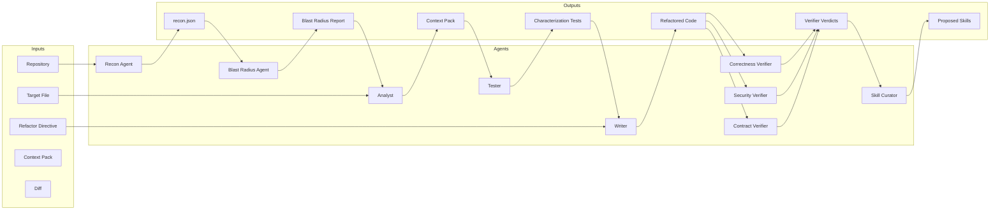

### 6.1 Agent Table

| Agent | Type | Model Role | Inputs | Outputs | Failure Behavior |
|---|---|---|---|---|---|
| **Recon Agent** | Deterministic (Tree-sitter) | No LLM | Repository | `recon.json`, Code Property Graph, Runtime Contract Map, Truth Report, Drift Report | Returns error. Orchestrator stops. |
| **Blast Radius Agent** | Deterministic (Graph traversal) | No LLM | `recon.json`, target | Blast Radius Report (callers, contract violations, coverage gaps, blast score, recommendation) | Returns error. Orchestrator stops. |
| **Analyst** | LLM | Cheap or mid-tier model | `recon.json`, Blast Radius Report, target | Context Pack | Returns error. Orchestrator stops. |
| **Tester** | LLM | Frontier model | Context Pack | Characterization tests for target and callers, contract assertions | Returns error. Orchestrator stops. |
| **Writer** | LLM | Frontier model | Context Pack, directive, test file | Refactored code, diff | On test failure, receives error trace and retries (max 3). |
| **Correctness Verifier** | LLM | Frontier model (different family from Writer) | Diff only. No original code. No Writer reasoning. | Verdict | Returns `pass`, `fail`, or `uncertain`. |
| **Security Verifier** | LLM | Frontier model (different family from Writer) | Diff only. No original code. No Writer reasoning. | Verdict | Returns `pass`, `fail`, or `uncertain`. |
| **Contract Verifier** | LLM | Frontier model (different family from Writer) | Diff only, contract assertions. No original code. No Writer reasoning. | Verdict | Returns `pass`, `fail`, or `uncertain`. |
| **Skill Curator** | LLM | Cheap model | Run trajectory, verifier verdicts, test results | Proposed skills | Runs out of band after successful runs. Proposes only. User approves. |

### 6.2 Verifier Independence

This is the strongest architectural guarantee in CodeGuardian.

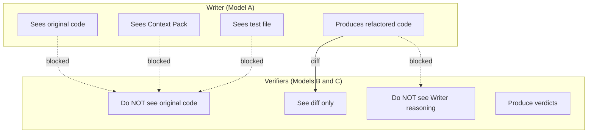

**Enforcement:** Each verifier is called with a fresh model instance. Its context is constructed from scratch — only the diff and the relevant contract assertions. It never receives the original file, the Context Pack, or the Writer's chain of thought.

**Cross-model verification is prompted per run.** Every run asks: *"Verify with a second model? (y/N)"*. The user chooses. When enabled, the verifiers run on a different model family from the Writer. When disabled, the single model runs all roles.

**Progressive loading:** MCP tool definitions and verifier schemas are loaded on first use, not at startup. This saves context and improves performance.

---

## 7. Repository Layer

The Repository Provider is read-only by default. It has no write method. Applying changes is a separate, explicit step.

### 7.1 Provider Interface

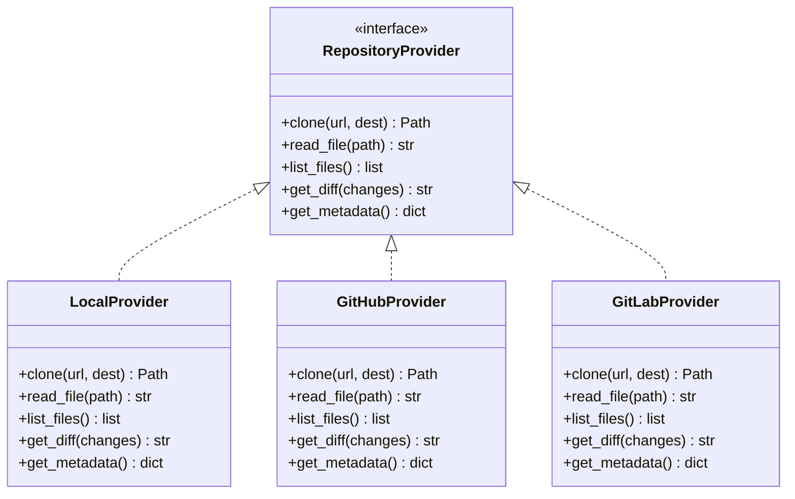

**Enforcement of read-only:**

- The interface has no `write_file`, `apply_diff`, or `mutate` method.
- Applying changes is a separate `ApplyProvider` that requires explicit consent.
- No provider is instantiated with write credentials during agent execution.
- The original working tree is never opened for writing.
- The full repository is cloned before any analysis begins.
- No file in the original repository is written until every phase has passed and the user has approved.

### 7.2 Consent Flow

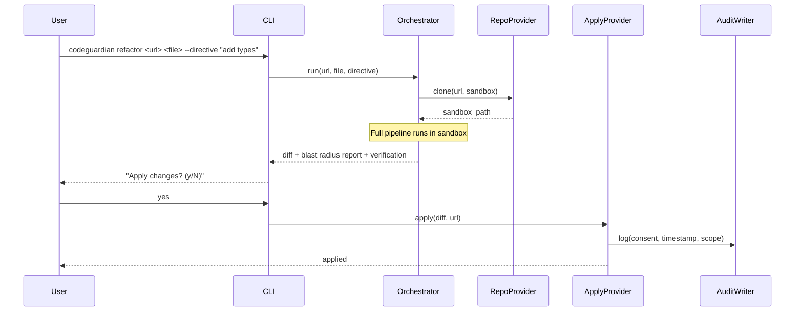

---

## 8. Code Property Graph

The Code Property Graph is the foundation of structural understanding. It is a Rust-owned, incrementally constructed, memory-efficient graph that merges three classical program analyses into a single model.

### 8.1 What the Graph Contains

| Layer | What It Captures | Edge Types |
|---|---|---|
| **Abstract Syntax Tree** | Syntactic structure — statements, expressions, declarations | `AST` |
| **Control Flow Graph** | Execution paths — which blocks can follow which | `CFG` |
| **Program Dependence Graph** | Control and data dependencies — which statements govern which, which definitions reach which uses | `PDG`, `REACHING_DEF` |
| **Call Graph** | Function-level calls, imports, inheritance | `CALL`, `IMPORT`, `INHERIT` |
| **Symbol Table** | Declarations, definitions, references | `CONTAINS`, `DEFINES`, `USES` |

### 8.2 Graph Construction

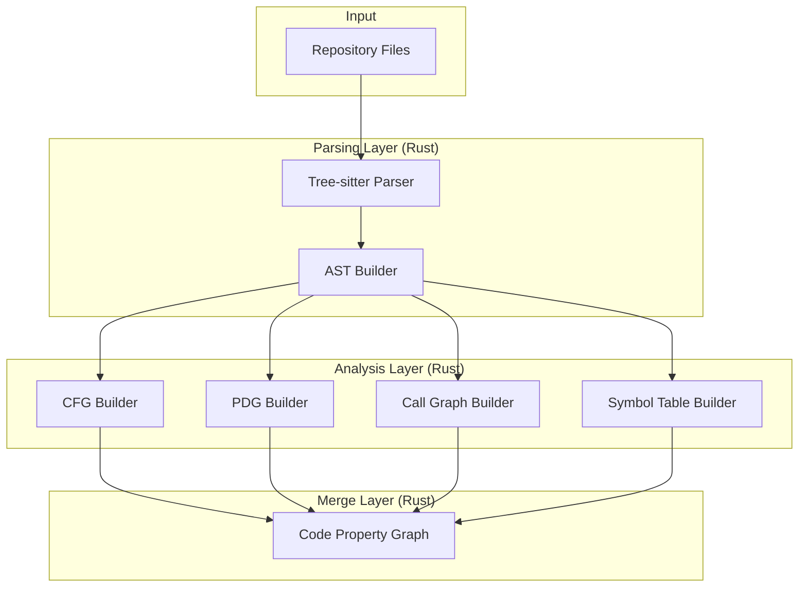

**Incremental construction:**

| Operation | Cost | When |
|---|---|---|
| Full CPG build | Minutes for large repos | First run per commit, or on cache miss |
| Incremental update | Milliseconds per changed file | After a file change |

When a file changes, only the affected portions of the graph are updated. Tree-sitter's incremental parsing reuses unchanged subtrees. The graph update is proportional to the edit size, not the file size.

### 8.3 Graph Storage

The graph is stored in a columnar, memory-efficient layout. This follows the `flatgraph` pattern:

- **Nodes** are typed (METHOD, LOCAL, CALL, LITERAL, IDENTIFIER) with key-value attributes.
- **Edges** carry different meanings (AST, CFG, REACHING_DEF, CALL, CONTAINS, etc.).
- **Serialization** supports fast load and save.
- **Memory footprint** is optimized for developer machines, not just servers.

---

## 9. Blast Radius Engine

The Blast Radius Engine is a Rust-owned component that computes the safety analysis for any target. It reads from the Code Property Graph and produces a Blast Radius Report.

### 9.1 What It Computes

| Analysis | What It Answers | Source |
|---|---|---|
| **Direct callers** | Syntactic references to the target | Call graph |
| **Transitive callers** | The full backward closure — every function reachable through the call graph | BFS traversal |
| **Contract violations** | Callers whose semantic assumptions break — not just type errors | CPG + mined contracts |
| **Coverage gaps** | Callers with zero test coverage on the changed path | Coverage index mapped to call graph |
| **Calibrated blast score** | Weighted severity from 0 to 100 | Composite of all above |

### 9.2 The Blast Radius Report

```json
{
  "target": "utils/parser.py:parse_config",
  "change_kind": "semantic",
  "direct_callers": [...],
  "transitive_callers": [...],
  "contract_violations": [
    {
      "caller": "services/loader.py:load_settings",
      "assumption": "parse_config never returns None",
      "risk": "critical"
    }
  ],
  "coverage_gaps": [
    "controllers/api.py:handle_request has no test covering this path"
  ],
  "blast_score": 72,
  "recommendation": "review"
}
```

### 9.3 The Recommendation Gate

| Recommendation | Meaning | Action |
|---|---|---|
| **Proceed** | Blast radius is small. | Refactor the target alone. |
| **Review** | Blast radius is moderate. | Expand the Context Pack to include callers and contract assertions. Update callers in the same change. |
| **Block** | Blast radius is high. | Stop and report the risk. The user decides whether to continue with expanded scope or select a different target. |

**The block gate is enforced.** The pipeline does not proceed past a block recommendation without explicit user override.

---

## 10. Plugin Architecture

Plugins are discovered at runtime via entry points. Adding a language, provider, tool, verifier, reporter, or sandbox backend does not require a core change.

### 10.1 Plugin Discovery

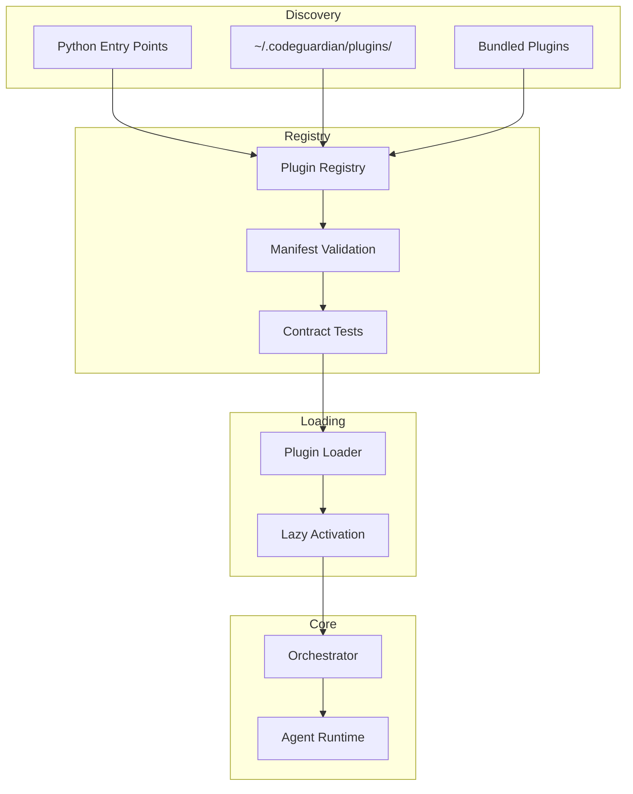

### 10.2 Contribution Points

| Contribution Point | What It Registers | Contract Test |
|---|---|---|
| `codeguardian.languages` | Tree-sitter grammar, test runner, refactor rules, reliability tier. | `LanguagePluginContract` |
| `codeguardian.providers` | Clone, read, list, diff for a repository source. | `RepositoryProviderContract` |
| `codeguardian.tools` | MCP tool or custom analysis tool. | `ToolContract` |
| `codeguardian.verifiers` | New verification lens. | `VerifierContract` |
| `codeguardian.reporters` | New output format (JSON, SARIF, etc.). | `ReporterContract` |
| `codeguardian.sandboxes` | New sandbox backend. | `SandboxBackendContract` |

### 10.3 Plugin Manifest

Every plugin declares its capabilities and permissions.

```json
{
  "name": "codeguardian-lang-kotlin",
  "version": "1.0.0",
  "type": "language",
  "language": "kotlin",
  "tree_sitter_grammar": "tree-sitter-kotlin",
  "test_runner": "gradle test",
  "refactor_rules": ["add_type_annotations", "extract_functions"],
  "reliability_tier": "best-effort",
  "permissions": {
    "filesystem": "sandbox_only",
    "network": false,
    "process_spawn": true
  },
  "interface_version": "1.0"
}
```

### 10.4 Plugin Trust Model

| Plugin Source | Trust Level | Execution |
|---|---|---|
| **Bundled** | Full | In-process (PyO3 or Python) |
| **User-installed** | Medium | In-process, permissions enforced |
| **Registry** | Lower | In-process, permissions enforced; separate process as future option |

**Rule:** A plugin failure must not crash the core. Plugins are wrapped in a fault barrier. On failure, the plugin is disabled for the run and the failure is logged.

---

## 11. MCP Integration

CodeGuardian is both an MCP client and an MCP server.

### 11.1 MCP as Client

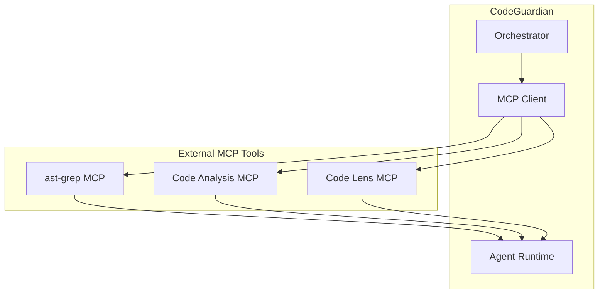

**Dynamic discovery:** The agent discovers available MCP tools at runtime by querying MCP servers. It does not have a static, pre-loaded list. This allows it to adapt to new capabilities without being reconfigured.

**Progressive loading:** Tool definitions are loaded on demand, not all upfront. This saves context and improves performance.

**Agent-initiated calls:** The orchestrator decides which MCP tool to call and when, based on the task at hand.

### 11.2 MCP as Server

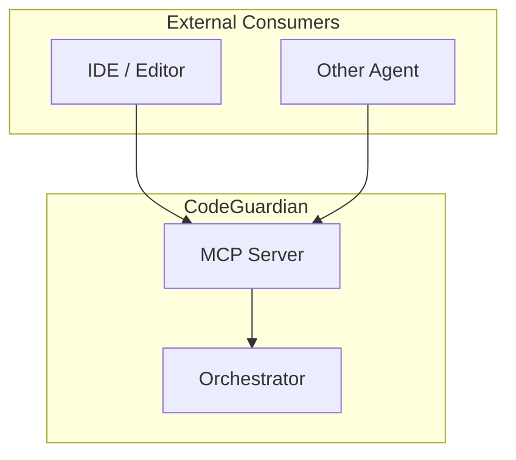

**Exposed tools:**

| Tool | Purpose | Input | Output |
|---|---|---|---|
| `codeguardian.refactor` | Refactor a target file. | Repo URL, file path, directive. | Diff + blast radius report + verification. |
| `codeguardian.recon` | Run reconnaissance on a repo. | Repo URL. | `recon.json`. |
| `codeguardian.blast` | Compute blast radius for a target. | Repo URL, file path. | Blast Radius Report. |
| `codeguardian.verify` | Verify a diff. | Diff, test results. | Verdict. |

**MCP server lifecycle:** The MCP server is started on demand, not automatically with the CLI. This keeps the default CLI lightweight.

---

## 12. Model Provider Layer

The Model Provider abstracts cloud and local LLM APIs. The user chooses models per role.

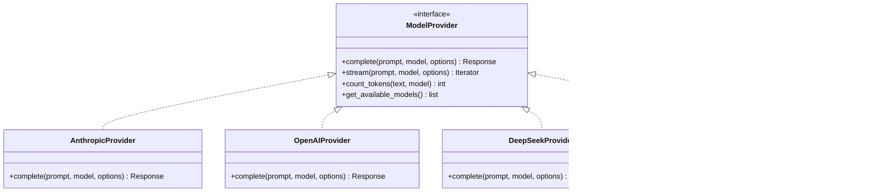

### 12.1 Per-Role Model Selection

| Role | Default | User-Configurable |
|---|---|---|
| **Analyst** | Cheap or mid-tier cloud model | Yes |
| **Tester** | Frontier cloud model | Yes |
| **Writer** | Frontier cloud model | Yes |
| **Correctness Verifier** | Frontier model (different family from Writer) | Yes |
| **Security Verifier** | Frontier model (different family from Writer) | Yes |
| **Contract Verifier** | Frontier model (different family from Writer) | Yes |
| **Skill Curator** | Cheap model | Yes |

### 12.2 Verification Prompt Enforcement

The per-run prompt is enforced in the **orchestrator layer**, before the verification phase.

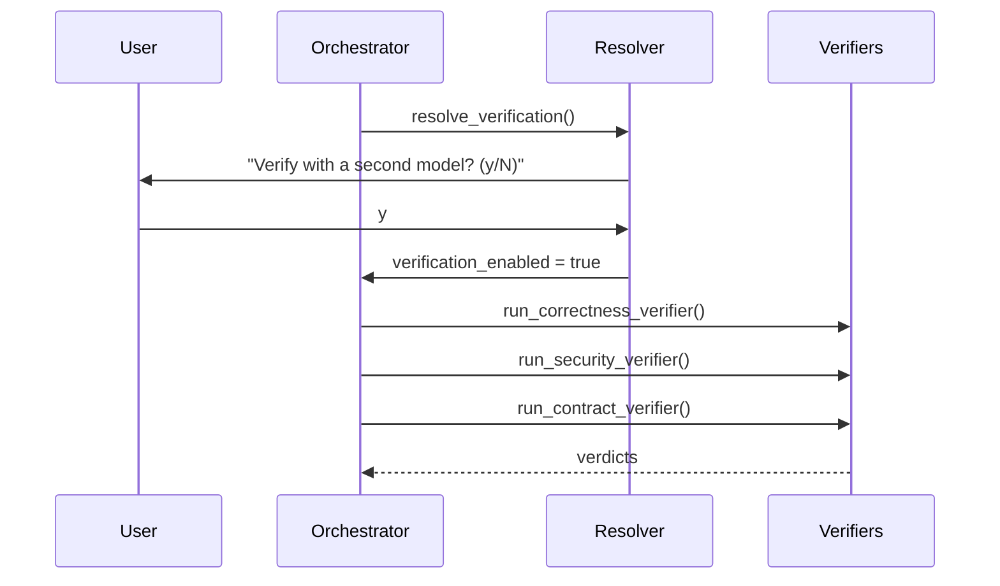

**Rule:** The prompt is a policy decision. Policy belongs in the orchestrator. The CLI triggers the orchestrator. The orchestrator triggers the prompt.

### 12.3 Local Model Support

Local models are accessed via **OpenAI-compatible endpoints**. Ollama, vLLM, llama.cpp, and LM Studio all expose this interface. No custom adapter is required.

| Local Runtime | Endpoint | Verified |
|---|---|---|
| Ollama | `http://localhost:11434/v1` | v1 |
| vLLM | `http://localhost:8000/v1` | v1 |
| llama.cpp | `http://localhost:8080/v1` | v1 |
| LM Studio | `http://localhost:1234/v1` | v1 |

**Cost reporting:** Local-model runs report zero cloud cost. Token count is still recorded for observability.

---

## 13. Sandbox Architecture

The sandbox is the safety boundary. It is a Rust-owned component that communicates with Python via JSON-RPC over stdio.

### 13.1 Tiered Backends

The architecture abstracts the backend behind a single `SandboxBackend` interface. The same pipeline runs on any backend.

| Context | Sandbox Backend | Isolation | Purpose |
|---|---|---|---|
| **Local CLI (Linux)** | Bubblewrap | Linux namespaces | Fast, lightweight, single-user. No daemon required. |
| **Local CLI (macOS)** | Seatbelt | SBPL policy profiles | Fast, lightweight, single-user. |
| **Cloud / multi-tenant** | Firecracker | Hardware (KVM) — dedicated guest kernel per VM | Hardware-level isolation for untrusted code. |
| **CI / Windows / fallback** | Docker | OS-level (namespaces, cgroups) | Portability where other backends are unavailable. |

### 13.2 Sandbox Backend Interface

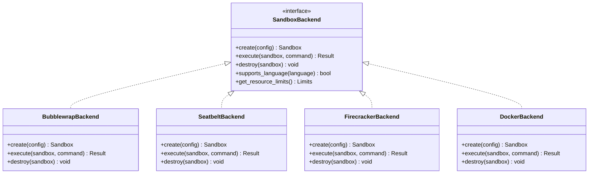

### 13.3 Sandbox Lifecycle

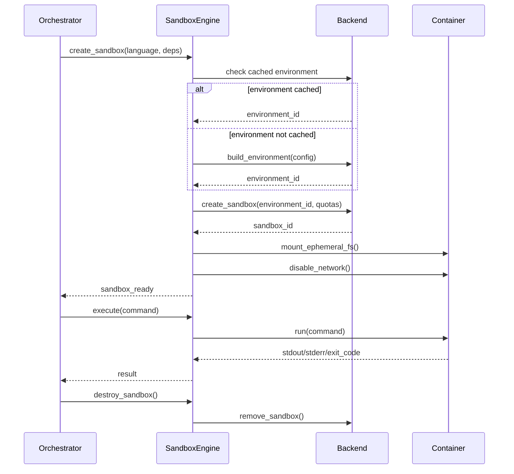

### 13.4 Hybrid Dependency Resolution

Dependencies are resolved in a controlled network phase, then the sandbox is sealed.

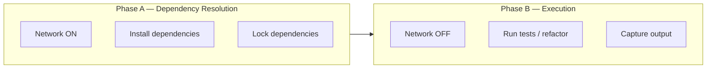

**Rule:** Network is enabled only during dependency resolution. The main execution sandbox is network-isolated.

### 13.5 Language Environment Selection

The sandbox backend is selected based on the **detected primary language** of the target project.

| Language | Local Backend Environment | Test Runner |
|---|---|---|
| Python | Python virtual environment with pip, uv, pytest | pytest |
| TypeScript / JavaScript | Node.js environment with npm, vitest, jest | vitest / jest |
| Java | JRE with Maven, JUnit | mvn test |
| Go | Go toolchain | go test |
| Rust | Rust toolchain with Cargo | cargo test |

**Rule:** If the project is predominantly Python, the agent provisions a Python sandbox with the correct toolchain pre-installed. For a Node.js project, it provisions a Node.js environment. The Reconnaissance phase detects the primary language and its ecosystem, and the Sandbox Manager uses this information to select the appropriate environment.

### 13.6 Resource Limits

All backends enforce:

| Resource | Mechanism | Default |
|---|---|---|
| **Memory** | cgroups v2 (`memory.max`) on Linux; rlimit on macOS; VM quotas on Firecracker | 1 GiB |
| **CPU** | cgroups v2 (CPU quota) on Linux; rlimit on macOS; VM quotas on Firecracker | 2 cores |
| **Processes** | cgroups v2 (`pids.max`) on Linux; rlimit on macOS | 256 |
| **Swap** | Disabled | 0 |
| **Network** | Isolated except during dependency resolution | Off |

---

## 14. Orchestration

The orchestrator controls the phase state machine. It is abstracted behind an `Orchestrator` interface, with LangGraph as the v1 implementation.

### 14.1 Orchestrator Interface

```python
class Orchestrator(Protocol):
    def run(self, config: RunConfig) -> RunResult: ...
    def resume(self, run_id: str) -> RunResult: ...
    def pause(self, run_id: str) -> None: ...
    def get_state(self, run_id: str) -> RunState: ...
```

### 14.2 LangGraph Implementation

LangGraph provides:

- **Durable execution:** State is checkpointed after every step. A run can pause, resume, branch, or roll back to any earlier point.
- **Per-phase subgraphs:** Each phase is a subgraph. The parent graph composes them.
- **Human-in-the-loop:** The plan approval gate and the apply consent gate are interrupt points.
- **Streaming:** Phase progress is streamed to the CLI.
- **Observability:** LangSmith traces every node, every model call, and every tool call.

**Checkpointing backend:** SQLite or PostgreSQL, keyed by `thread_id`. A crash frees the lease and another worker continues from the last successful checkpoint. Pending writes from the failed step are preserved so successful nodes do not re-run.

### 14.3 Per-Phase Subgraphs

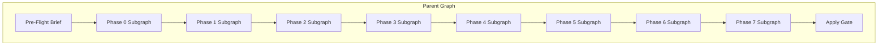

**Rule:** Each subgraph is independently testable. Each subgraph has its own checkpoint. A failure in Phase 5 does not invalidate Phases 0 through 4.

### 14.4 Out-of-Graph Verifiers

Verifiers run as separate calls, not as nodes inside the same graph. This ensures true independence.

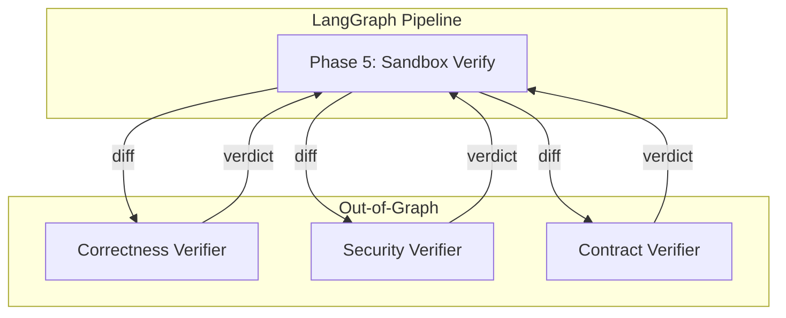

**Rule:** The verifier model instance never sees the graph state. Its context is constructed explicitly from the diff and the contract assertions. This is the strongest possible enforcement of the independent verification guarantee.

### 14.5 Multi-Framework Integration

LangGraph orchestrates. Other frameworks execute within nodes.

| Agent | Framework | Why |
|---|---|---|
| **Analyst** | OpenAI Agents SDK or equivalent | Lightweight, fast, minimal abstraction. Reading files and building context is simple. |
| **Tester** | LangGraph node | Needs checkpointing for long test-generation sessions. |
| **Writer** | LangGraph node | Needs human-in-the-loop for directive approval. |
| **Correctness Verifier** | Anthropic SDK or equivalent | Direct model access, independent context. |
| **Security Verifier** | OpenAI Agents SDK or equivalent | Different framework from Writer ensures independence. |
| **Contract Verifier** | Direct model call | Fresh context, contract assertions only. |
| **Skill Curator** | Custom Python | Simple extraction loop. No framework needed. |

**Observability:** LangSmith traces everything. It is framework-agnostic, so it captures LangGraph nodes, OpenAI SDK calls, and custom Python uniformly.

---

## 15. Observability

### 15.1 Audit Trail

Every run produces a structured, tamper-evident log. The log is written by a separate Rust process that the Python orchestrator never has a file handle to.

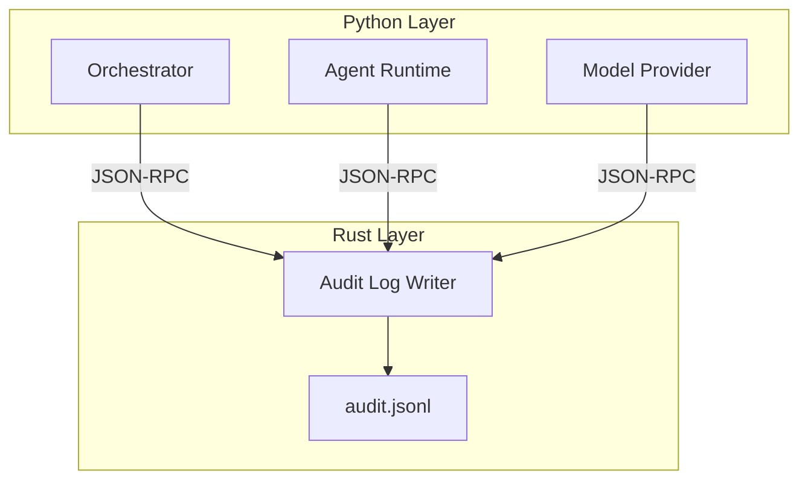

### 15.2 Audit Entry Schema

Every entry is a JSON object on its own line.

```json
{
  "entry_id": "uuid",
  "run_id": "uuid",
  "timestamp": "2026-10-06T12:00:00Z",
  "phase": "refactor",
  "agent": "writer",
  "model": {
    "id": "claude-opus-5.5",
    "version": "2026-09-15",
    "provider": "anthropic"
  },
  "input": {
    "prompt_hash": "sha256:...",
    "context_hash": "sha256:...",
    "directive": "add type hints"
  },
  "output": {
    "diff_hash": "sha256:...",
    "tokens_in": 4500,
    "tokens_out": 1200
  },
  "result": {
    "status": "success",
    "tests_passed": 12,
    "tests_failed": 0,
    "retries": 0
  },
  "blast_radius": {
    "direct_callers": 14,
    "transitive_callers": 47,
    "contract_violations": 2,
    "coverage_gaps": 1,
    "blast_score": 72,
    "recommendation": "review"
  },
  "verification": {
    "correctness": {"verdict": "pass", "model": "gpt-6-astra"},
    "security": {"verdict": "pass", "model": "gpt-6-astra"},
    "contract": {"verdict": "pass", "model": "gpt-6-astra"}
  },
  "consent": {
    "requested": true,
    "granted": true,
    "granted_at": "2026-10-06T12:05:00Z"
  },
  "rollback_ref": "git:abc123",
  "payload_hash": "sha256:...",
  "prev_hash": "sha256:...",
  "entry_hash": "sha256:..."
}
```

### 15.3 Hash Chain

Each entry includes a hash of its own content and the hash of the previous entry. If any entry is modified, the chain breaks.

```
entry_1: prev_hash = "GENESIS", entry_hash = sha256("GENESIS" + payload_hash_1)
entry_2: prev_hash = entry_1.entry_hash, entry_hash = sha256(entry_1.entry_hash + payload_hash_2)
entry_n: prev_hash = entry_(n-1).entry_hash, entry_hash = sha256(entry_(n-1).entry_hash + payload_hash_n)
```

### 15.4 LangSmith Tracing

LangSmith provides:

- **Per-node traces:** Every phase, every agent, every model call.
- **Token accounting:** Input tokens, output tokens, cost per call.
- **Latency measurement:** Duration per phase, per agent, per model.
- **Error capture:** Stack traces, error messages, retry context.
- **Framework-agnostic:** Traces LangGraph, OpenAI SDK, Anthropic SDK, and custom Python uniformly.

---

## 16. Data Flow

### 16.1 End-to-End Data Flow

```mermaid
flowchart TB
    subgraph Input
        Repo[Repository]
    end

    subgraph Recon["Phase 0 — Reconnaissance"]
        ReconEngine[Recon Engine]
        CPG[Code Property Graph]
        RuntimeMap[Runtime Contract Map]
        ReconJSON[recon.json]
    end

    subgraph Blast["Phase 1 — Blast Radius"]
        BlastEngine[Blast Radius Engine]
        BlastReport[Blast Radius Report]
    end

    subgraph Context["Phase 2 — Context Gathering"]
        ContextPack[Context Pack]
    end

    subgraph Test["Phase 3 — Safety Net"]
        TestFile[Characterization Tests]
        ContractAssert[Contract Assertions]
    end

    subgraph Refactor["Phase 4 — Refactor"]
        Diff[Diff]
    end

    subgraph Verify["Phase 5 — Sandbox Verification"]
        TestResult[Test Results]
    end

    subgraph Independent["Phase 6 — Independent Verification"]
        Verdicts[Verifier Verdicts]
    end

    subgraph Output["Phase 7 — Output"]
        PRDesc[PR / MR Description]
        AuditEntry[Audit Entry]
    end

    Repo --> ReconEngine
    ReconEngine --> CPG
    ReconEngine --> RuntimeMap
    ReconEngine --> ReconJSON
    ReconJSON --> BlastEngine
    BlastEngine --> BlastReport
    BlastReport --> ContextPack
    ReconJSON --> ContextPack
    ContextPack --> TestFile
    ContextPack --> ContractAssert
    TestFile --> Diff
    ContractAssert --> Diff
    Diff --> TestResult
    TestResult --> Verdicts
    Verdicts --> PRDesc
    Verdicts --> AuditEntry
```

### 16.2 Key Sequence: Refactor with Verification

```mermaid
sequenceDiagram
    participant User
    participant CLI
    participant Orchestrator
    participant Recon
    participant Blast
    participant Analyst
    participant Tester
    participant Writer
    participant Sandbox
    participant CV as Correctness Verifier
    participant SV as Security Verifier
    participant CtV as Contract Verifier
    participant Audit

    User->>CLI: codeguardian refactor <url> <file> --directive "add types"
    CLI->>Orchestrator: run(url, file, directive)
    Orchestrator->>User: "Pre-flight brief: scope, target, directive. Approve? (y/N)"
    User->>Orchestrator: y
    Orchestrator->>Recon: phase_0_reconnaissance(url)
    Recon-->>Orchestrator: recon.json + CPG + runtime contract map
    Orchestrator->>Blast: phase_1_blast_radius(target)
    Blast-->>Orchestrator: Blast Radius Report (score: 72, recommendation: review)
    Orchestrator->>Analyst: phase_2_context(recon.json, blast_report, file)
    Analyst-->>Orchestrator: context_pack (expanded)
    Orchestrator->>Tester: phase_3_safety_net(context_pack)
    Tester-->>Orchestrator: test_file + contract_assertions
    Orchestrator->>Sandbox: run_tests(old_code, test_file)
    Sandbox-->>Orchestrator: pass
    Orchestrator->>Writer: phase_4_refactor(context_pack, directive)
    Writer-->>Orchestrator: diff (target + callers)
    Orchestrator->>Sandbox: phase_5_verify(diff, test_file, contract_assertions)
    alt tests pass
        Sandbox-->>Orchestrator: pass
    else tests fail
        Sandbox-->>Orchestrator: fail + error_trace
        Orchestrator->>Writer: retry(diff, error_trace)
        Writer-->>Orchestrator: new_diff
    end
    Orchestrator->>User: "Verify with a second model? (y/N)"
    User->>Orchestrator: y
    Orchestrator->>CV: phase_6_correctness(diff)
    CV-->>Orchestrator: verdict
    Orchestrator->>SV: phase_6_security(diff)
    SV-->>Orchestrator: verdict
    Orchestrator->>CtV: phase_6_contract(diff, contract_assertions)
    CtV-->>Orchestrator: verdict
    Orchestrator->>Audit: log(all_entries)
    Orchestrator->>CLI: phase_7_output(diff, blast_report, verdicts)
    CLI->>User: "Apply changes? (y/N)"
```

---

## 17. Language Boundary

The boundary is defined by property, not preference.

```mermaid
flowchart TB
    subgraph Python["Python Layer (90% of codebase)"]
        CLI[CLI / TUI]
        Orchestrator[Orchestrator]
        AgentRuntime[Agent Runtime]
        ModelProvider[Model Provider]
        RepoProvider[Repository Provider]
        ApplyProvider[Apply Provider]
        MCPClient[MCP Client]
        MCPServer[MCP Server]
        PluginLoader[Plugin Loader]
        ReportGenerator[Report Generator]
        SkillCurator[Skill Curator]
    end

    subgraph Rust["Rust Layer (10% of codebase)"]
        CodeKernel[Code Intelligence Kernel]
        CPG[Code Property Graph]
        BlastEngine[Blast Radius Engine]
        SandboxEngine[Sandbox Engine]
        AuditWriter[Audit Log Writer]
        PolicyEngine[Policy Engine]
    end

    subgraph Bridges["Bridges"]
        PyO3[PyO3 Bridge]
        JSONRPC[JSON-RPC over stdio]
    end

    Orchestrator --> PyO3
    Orchestrator --> JSONRPC
    AgentRuntime --> PyO3
    PyO3 --> CodeKernel
    PyO3 --> BlastEngine
    PyO3 --> PolicyEngine
    JSONRPC --> SandboxEngine
    JSONRPC --> AuditWriter
```

### 17.1 Bridge Selection Matrix

| Zone | Bridge | Rationale |
|---|---|---|
| **Code Intelligence Kernel** | PyO3 | Trusted, high-volume, latency-sensitive. Batched calls. Zero-copy data transfer. |
| **Blast Radius Engine** | PyO3 | Trusted, high-volume, latency-sensitive. Batched calls. |
| **Policy Engine** | PyO3 | Trusted, frequent calls. Low latency matters. |
| **Sandbox Engine** | JSON-RPC | Untrusted input. Must survive Python compromise. Separate process boundary. |
| **Audit Log Writer** | JSON-RPC | Tamper-evidence requires isolation. Python must not have a file handle to the log. |

### 17.2 Batching Rule

Cross-boundary calls are batched. The rule:

> **Cross the boundary once per phase, not once per operation.**

| Bad | Good |
|---|---|
| Parse one file, return AST. Repeat 500 times. | Parse 500 files in one call, return all ASTs. |
| Check policy for one tool call. | Check policy for all tool calls in a phase. |
| Write one audit entry. | Write all audit entries for a phase in one JSON-RPC call. |

---

## 18. Deployment Topology

### 18.1 v1 — CLI-First

```mermaid
flowchart TB
    subgraph LocalMachine["Local Machine"]
        CLI[CodeGuardian CLI]
        Python[Python Runtime]
        Rust[Rust Runtime]
        Sandbox[Sandbox Backends]
        CPG[Code Property Graph]
    end

    subgraph Cloud["Cloud APIs"]
        LLM[LLM APIs]
        GitHub[GitHub API]
        GitLab[GitLab API]
    end

    CLI --> Python
    Python --> Rust
    Python --> Sandbox
    Python --> CPG
    Python --> LLM
    Python --> GitHub
    Python --> GitLab
```

### 18.2 v2 — IDE and Agent Integration

```mermaid
flowchart TB
    subgraph Consumers
        IDE[IDE / Editor]
        Agent[Other Agent]
    end

    subgraph CodeGuardian
        MCPServer[MCP Server]
        Core[Core Engine]
        CPG[Code Property Graph]
    end

    subgraph Infrastructure
        Sandbox[Sandbox Backends]
        LLM[LLM APIs]
    end

    IDE --> MCPServer
    Agent --> MCPServer
    MCPServer --> Core
    Core --> Sandbox
    Core --> CPG
    Core --> LLM
```

---

## 19. Traceability Matrix

Every requirement in `03` maps to a component or phase in this document.

| Requirement | Component / Phase | Section |
|---|---|---|
| **FR-R1–R10** | Repository Provider, Apply Provider | §7 |
| **FR-N1–N12** | Recon Agent, Code Intelligence Kernel, CPG | §6, §8 |
| **FR-B1–B8** | Blast Radius Agent, Blast Radius Engine | §6, §9 |
| **FR-C1–C4** | Analyst, Context Pack | §6 |
| **FR-T1–T6** | Tester | §6 |
| **FR-F1–F5** | Writer | §6 |
| **FR-V1–V7** | Correctness, Security, Contract Verifiers | §6, §12.2 |
| **FR-A1–A5** | Orchestrator, Apply Provider | §7, §14 |
| **FR-O1–O5** | Report Generator | §4 |
| **FR-M1–M5** | Model Provider | §12 |
| **FR-MCP1–MCP3** | MCP Client, MCP Server | §11 |
| **FR-P1–P4** | Plugin Loader | §10 |
| **FR-SB1–SB5** | Sandbox Engine, Sandbox Backend | §13 |
| **FR-CLI1–CLI5** | CLI / TUI | §4 |
| **NFR-MT1–MT11** | Plugin Architecture | §10 |
| **NFR-PE1** | Code Intelligence Kernel (Rust) | §17 |
| **NFR-PE7** | Incremental CPG Construction | §8 |
| **NFR-PE8** | Batched PyO3 Calls | §17.2 |
| **NFR-SE1–SE9** | Sandbox Engine (Rust), Audit Writer (Rust) | §13, §15 |
| **NFR-RE1–RE6** | Orchestrator, Checkpointing | §5.3, §14 |
| **NFR-US1–US5** | CLI / TUI | §4 |
| **NFR-FS1–FS3** | All components | — |

---

## 20. Related Documents

- `03-requirements.md` — functional and non-functional requirements
- `05-data-model.md` — schemas for `recon.json`, Blast Radius Report, audit log, Context Pack
- `06-api-contracts.md` — provider interfaces, MCP interfaces, CLI surface, `SandboxBackend` interface
- `07-tech-stack.md` — language and framework decisions
- `08-repository-structure.md` — directory layout and conventions
- `10-testing-cicd-deployment.md` — testing strategy and CI
- `11-security-performance-observability.md` — sandbox security and metrics
- `14-model-strategy.md` — model roles and provider abstraction
- `15-verification-architecture.md` — verifier independence and behavioral equivalence
- `16-context-engineering.md` — Repo Map, Context Pack, token budgeting
- `../skills.md` — agent operating manual
