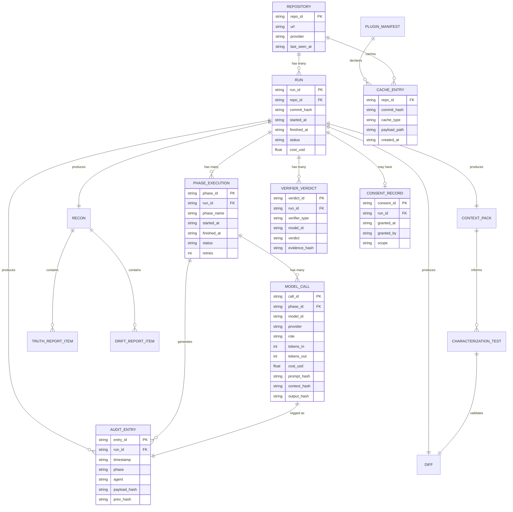
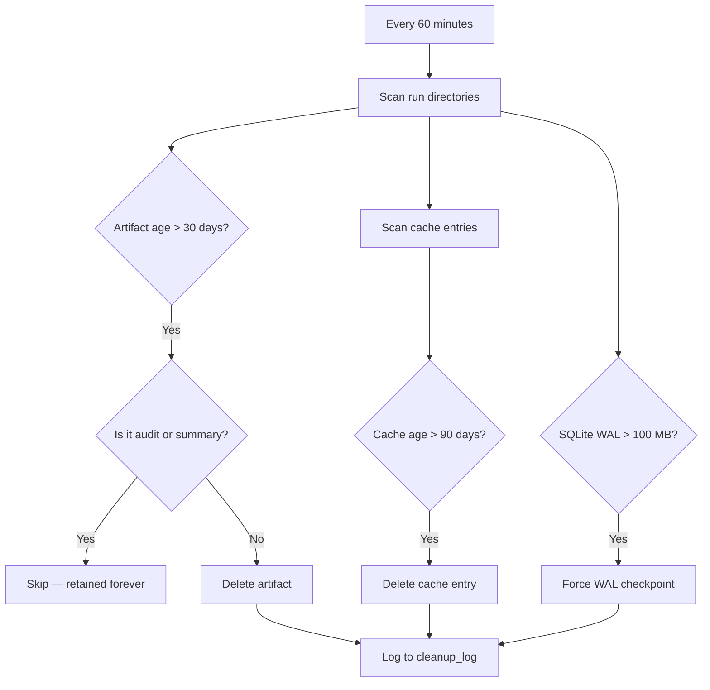
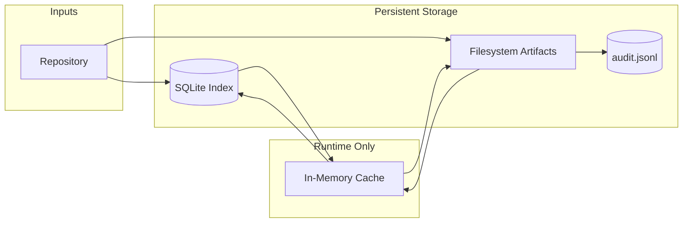

# 05 — Data Model

> **Status:** Draft
> **Last updated:** 2026-10-04
> **Owner:** Project lead
> **Related docs:** `04-architecture.md`, `06-api-contracts.md`, `11-security-performance-observability.md`

---

## 1. Purpose

This document defines every structured entity CodeGuardian reads, writes, or passes between components. It covers schemas, relationships, storage locations, lifecycle, and versioning.

Everything here is concrete: field names, types, required vs. optional, validation rules.

---

## 2. Storage Architecture

CodeGuardian uses a **hybrid storage model**. No single backend serves every need.

| Storage Layer | Technology | What It Holds | Why |
|---|---|---|---|
| **Structured index** | SQLite + WAL mode | Run history, cached recon, session state, query index | Concurrent-safe, embedded, fast reads |
| **Immutable artifacts** | Filesystem (JSON/JSONL/Markdown) | `recon.json`, context packs, diffs, audit logs, summaries | Append-only, portable, human-readable |
| **Hot session data** | In-memory LRU cache | Parsed ASTs, dependency graph fragments, file contents | Zero-latency, process-local |
| **Secrets** | OS Keychain (`keyring`) | API keys, tokens | Encrypted at OS level |

### 2.1 Why Not Filesystem Only

- Slow to query across runs ("which runs failed on this file?" requires reading every JSON)
- No concurrency guarantees
- No atomic transactions

### 2.2 Why Not SQLite Only

- Audit logs must be append-only and portable — JSONL is the export standard
- SQLite is not human-readable without tooling
- Large JSON blobs (context packs, diffs) bloat the database

### 2.3 Why Not a Database Server

- Overkill for a local-first tool
- Requires running a service
- Breaks the "no containers, no network" principle
- Adds an install step for users

### 2.4 Filesystem Layout

```
~/.codeguardian/
├── codeguardian.db              # SQLite index (WAL mode)
├── codeguardian.db-wal          # WAL file (auto-managed)
├── codeguardian.db-shm          # Shared memory file (auto-managed)
├── config.toml                  # User configuration
├── plugins/                     # User-installed plugins
│   ├── lang-kotlin/
│   ├── provider-bitbucket/
│   └── verifier-accessibility/
└── repos/
    └── <repo-id>/               # sha256 of repo URL, truncated to 16 chars
        ├── meta.json            # repo metadata (url, provider, last_seen)
        ├── cache/
        │   ├── recon-<commit>.json         # cached recon per commit
        │   └── depgraph-<commit>.json      # cached dependency graph
        └── runs/
            └── <run-id>/
                ├── recon.json            # immutable artifact
                ├── context_pack.json
                ├── test_target.py
                ├── refactored_target.py
                ├── diff.patch
                ├── verification.json
                ├── audit.jsonl           # append-only hash chain
                └── summary.md            # AI-generated human summary
```

**Rule:** The SQLite index never stores large payloads. It stores metadata and pointers. Large payloads live on the filesystem, keyed by `repo_id` and `run_id`.

---

## 3. Entity Inventory

Every structured entity in the system.

| Entity | Storage | Purpose |
|---|---|---|
| **Repository** | SQLite + `meta.json` | A source of code (local, GitHub, GitLab) |
| **Run** | SQLite | One invocation of CodeGuardian |
| **Phase Execution** | SQLite | One phase within a run |
| **Model Call** | SQLite | One LLM call, with tokens and cost |
| **`recon.json`** | Filesystem | Reconnaissance output |
| **Context Pack** | Filesystem | Minimal set of files sent to a model |
| **Characterization Test** | Filesystem | Generated tests locking current behavior |
| **Diff** | Filesystem | The proposed code change |
| **Verifier Verdict** | Filesystem + SQLite | Correctness or security result |
| **Audit Entry** | Filesystem (`audit.jsonl`) | One line in the tamper-evident log |
| **Consent Record** | SQLite + audit log | User approval to apply changes |
| **Plugin Manifest** | Filesystem (in plugin package) | Capabilities and permissions |
| **Truth Report Item** | Inside `recon.json` | One doc-vs-code mismatch |
| **Drift Report Item** | Inside `recon.json` | One version drift finding |
| **Cache Entry** | SQLite + filesystem | Cached recon, depgraph, AST |

---

## 4. Entity Relationship Diagram



---

## 5. Schemas

Each schema is defined as **JSON Schema (draft 2020-12)**. Implementations must validate against it.

### 5.1 `recon.json` — Schema v1.0

The reconnaissance output. Every fact carries `file:line` evidence where applicable.

```json
{
  "$schema": "https://json-schema.org/draft/2020-12/schema",
  "$id": "https://codeguardian.dev/schemas/recon/v1.0.json",
  "title": "Reconnaissance Output",
  "type": "object",
  "required": ["schema_version", "repo", "languages", "dependency_graph", "hierarchical_index", "entrypoints", "versions", "smoke_test", "truth_report", "drift_report"],
  "properties": {
    "schema_version": {"type": "string", "const": "1.0"},
    "repo": {
      "type": "object",
      "required": ["url", "commit", "detected_at"],
      "properties": {
        "url": {"type": "string", "format": "uri"},
        "provider": {"type": "string", "enum": ["local", "github", "gitlab"]},
        "commit": {"type": "string"},
        "detected_at": {"type": "string", "format": "date-time"}
      }
    },
    "languages": {
      "type": "array",
      "items": {
        "type": "object",
        "required": ["name", "files", "percentage", "tier"],
        "properties": {
          "name": {"type": "string"},
          "files": {"type": "integer", "minimum": 0},
          "lines": {"type": "integer", "minimum": 0},
          "percentage": {"type": "number", "minimum": 0, "maximum": 100},
          "tier": {"type": "string", "enum": ["high", "best-effort"]}
        }
      }
    },
    "frameworks": {
      "type": "array",
      "items": {
        "type": "object",
        "required": ["name", "evidence"],
        "properties": {
          "name": {"type": "string"},
          "version": {"type": "string"},
          "evidence": {"type": "string", "description": "file:line reference"}
        }
      }
    },
    "dependency_graph": {
      "type": "object",
      "required": ["nodes", "edges"],
      "properties": {
        "nodes": {
          "type": "array",
          "items": {
            "type": "object",
            "required": ["id", "type"],
            "properties": {
              "id": {"type": "string"},
              "type": {"type": "string", "enum": ["file", "module", "package"]},
              "language": {"type": "string"}
            }
          }
        },
        "edges": {
          "type": "array",
          "items": {
            "type": "object",
            "required": ["from", "to", "kind"],
            "properties": {
              "from": {"type": "string"},
              "to": {"type": "string"},
              "kind": {"type": "string", "enum": ["import", "call", "inherit"]}
            }
          }
        }
      }
    },
    "hierarchical_index": {
      "type": "object",
      "description": "Map of directory path to symbol list",
      "additionalProperties": {
        "type": "array",
        "items": {"type": "string"}
      }
    },
    "entrypoints": {
      "type": "array",
      "items": {
        "type": "object",
        "required": ["file", "line", "type"],
        "properties": {
          "file": {"type": "string"},
          "line": {"type": "integer", "minimum": 1},
          "type": {"type": "string", "enum": ["script", "function", "class", "route", "cli"]}
        }
      }
    },
    "versions": {
      "type": "object",
      "required": ["declared", "actual", "available"],
      "properties": {
        "declared": {"type": "object", "additionalProperties": {"type": "string"}},
        "actual": {"type": "object", "additionalProperties": {"type": "string"}},
        "available": {"type": "object", "additionalProperties": {"type": "string"}}
      }
    },
    "smoke_test": {
      "type": "object",
      "required": ["status", "passed", "failed", "errored"],
      "properties": {
        "status": {"type": "string", "enum": ["passed", "partial", "failed", "skipped"]},
        "passed": {"type": "integer", "minimum": 0},
        "failed": {"type": "integer", "minimum": 0},
        "errored": {"type": "integer", "minimum": 0},
        "duration_seconds": {"type": "number", "minimum": 0},
        "reason": {"type": "string", "description": "Why skipped, if applicable"}
      }
    },
    "truth_report": {
      "type": "array",
      "items": {
        "type": "object",
        "required": ["claim", "source", "reality", "severity", "suggestion"],
        "properties": {
          "claim": {"type": "string"},
          "source": {"type": "string", "description": "file:line"},
          "reality": {"type": "string"},
          "severity": {"type": "string", "enum": ["info", "warning", "critical"]},
          "suggestion": {"type": "string"}
        }
      }
    },
    "drift_report": {
      "type": "array",
      "items": {
        "type": "object",
        "required": ["package", "declared", "actual", "severity"],
        "properties": {
          "package": {"type": "string"},
          "declared": {"type": "string"},
          "actual": {"type": "string"},
          "available": {"type": "string"},
          "severity": {"type": "string", "enum": ["info", "warning", "critical"]},
          "suggestion": {"type": "string"}
        }
      }
    }
  }
}
```

### 5.2 Context Pack — Schema v1.0

The minimal set of files sent to a model for a single task.

```json
{
  "$schema": "https://json-schema.org/draft/2020-12/schema",
  "$id": "https://codeguardian.dev/schemas/context-pack/v1.0.json",
  "title": "Context Pack",
  "type": "object",
  "required": ["schema_version", "target", "files", "token_budget", "token_count"],
  "properties": {
    "schema_version": {"type": "string", "const": "1.0"},
    "target": {
      "type": "object",
      "required": ["path", "language"],
      "properties": {
        "path": {"type": "string"},
        "language": {"type": "string"},
        "symbol": {"type": "string", "description": "Optional: specific function/class"},
        "line_range": {
          "type": "array",
          "items": {"type": "integer"},
          "minItems": 2,
          "maxItems": 2
        }
      }
    },
    "files": {
      "type": "array",
      "items": {
        "type": "object",
        "required": ["path", "content_hash", "reason"],
        "properties": {
          "path": {"type": "string"},
          "content_hash": {"type": "string"},
          "reason": {"type": "string", "enum": ["target", "direct_import", "caller", "test", "config"]},
          "content": {"type": "string", "description": "Only present in ephemeral packs; not persisted"}
        }
      }
    },
    "token_budget": {"type": "integer", "minimum": 1},
    "token_count": {"type": "integer", "minimum": 0},
    "truncated": {"type": "boolean", "default": false},
    "truncation_strategy": {"type": "string", "enum": ["none", "summarize", "drop_oldest", "sliding_window"]}
  }
}
```

### 5.3 Verification Result — Schema v1.0

The output of one verifier (correctness or security).

```json
{
  "$schema": "https://json-schema.org/draft/2020-12/schema",
  "$id": "https://codeguardian.dev/schemas/verification/v1.0.json",
  "title": "Verifier Verdict",
  "type": "object",
  "required": ["schema_version", "verifier_type", "model", "verdict", "timestamp"],
  "properties": {
    "schema_version": {"type": "string", "const": "1.0"},
    "verifier_type": {"type": "string", "enum": ["correctness", "security"]},
    "model": {
      "type": "object",
      "required": ["id", "provider"],
      "properties": {
        "id": {"type": "string"},
        "provider": {"type": "string"},
        "version": {"type": "string"}
      }
    },
    "verdict": {"type": "string", "enum": ["pass", "fail", "uncertain"]},
    "confidence": {"type": "number", "minimum": 0, "maximum": 1},
    "findings": {
      "type": "array",
      "items": {
        "type": "object",
        "required": ["severity", "message"],
        "properties": {
          "severity": {"type": "string", "enum": ["info", "warning", "critical"]},
          "message": {"type": "string"},
          "location": {"type": "string", "description": "file:line if applicable"},
          "evidence_hash": {"type": "string"}
        }
      }
    },
    "context_hash": {"type": "string", "description": "Hash of the diff-only context sent to the verifier"},
    "timestamp": {"type": "string", "format": "date-time"}
  }
}
```

### 5.4 Audit Entry — Schema v1.0

One line in `audit.jsonl`. Each entry includes a hash chain link.

```json
{
  "$schema": "https://json-schema.org/draft/2020-12/schema",
  "$id": "https://codeguardian.dev/schemas/audit-entry/v1.0.json",
  "title": "Audit Entry",
  "type": "object",
  "required": ["entry_id", "run_id", "timestamp", "phase", "payload_hash", "prev_hash", "entry_hash"],
  "properties": {
    "entry_id": {"type": "string", "format": "uuid"},
    "run_id": {"type": "string", "format": "uuid"},
    "timestamp": {"type": "string", "format": "date-time"},
    "phase": {"type": "string", "enum": ["reconnaissance", "context", "safety_net", "refactor", "sandbox_verify", "independent_verify", "output", "consent", "apply"]},
    "agent": {"type": "string", "enum": ["analyst", "tester", "writer", "correctness_verifier", "security_verifier", "orchestrator", "cli"]},
    "model": {
      "type": "object",
      "properties": {
        "id": {"type": "string"},
        "provider": {"type": "string"},
        "version": {"type": "string"}
      }
    },
    "input": {
      "type": "object",
      "properties": {
        "prompt_hash": {"type": "string"},
        "context_hash": {"type": "string"},
        "directive": {"type": "string"}
      }
    },
    "output": {
      "type": "object",
      "properties": {
        "diff_hash": {"type": "string"},
        "tokens_in": {"type": "integer", "minimum": 0},
        "tokens_out": {"type": "integer", "minimum": 0},
        "cost_usd": {"type": "number", "minimum": 0}
      }
    },
    "result": {
      "type": "object",
      "properties": {
        "status": {"type": "string", "enum": ["success", "failure", "skipped", "stopped"]},
        "tests_passed": {"type": "integer", "minimum": 0},
        "tests_failed": {"type": "integer", "minimum": 0},
        "retries": {"type": "integer", "minimum": 0},
        "error": {"type": "string"}
      }
    },
    "verification": {
      "type": "object",
      "properties": {
        "correctness": {"type": "object"},
        "security": {"type": "object"}
      }
    },
    "consent": {
      "type": "object",
      "properties": {
        "requested": {"type": "boolean"},
        "granted": {"type": "boolean"},
        "granted_at": {"type": "string", "format": "date-time"},
        "scope": {"type": "string", "enum": ["apply", "verify"]}
      }
    },
    "rollback_ref": {"type": "string", "description": "Reference for rollback (e.g., git commit hash)"},
    "payload_hash": {"type": "string", "description": "sha256 of the canonical JSON payload (this object minus the hash fields)"},
    "prev_hash": {"type": "string", "description": "entry_hash of the previous entry, or 'GENESIS' for the first"},
    "entry_hash": {"type": "string", "description": "sha256(prev_hash + payload_hash)"}
  }
}
```

**Hash chain verification:**

```
entry_1: prev_hash = "GENESIS", entry_hash = sha256("GENESIS" + payload_hash_1)
entry_2: prev_hash = entry_1.entry_hash, entry_hash = sha256(entry_1.entry_hash + payload_hash_2)
entry_n: prev_hash = entry_(n-1).entry_hash, entry_hash = sha256(entry_(n-1).entry_hash + payload_hash_n)
```

If any entry is modified, its `entry_hash` no longer matches the next entry's `prev_hash`, and the chain breaks.

### 5.5 Plugin Manifest — Schema v1.0

Declared by every plugin. Validated at load time.

```json
{
  "$schema": "https://json-schema.org/draft/2020-12/schema",
  "$id": "https://codeguardian.dev/schemas/plugin-manifest/v1.0.json",
  "title": "Plugin Manifest",
  "type": "object",
  "required": ["name", "version", "type", "interface_version", "permissions"],
  "properties": {
    "name": {"type": "string", "pattern": "^[a-z0-9-]+$"},
    "version": {"type": "string", "pattern": "^\\d+\\.\\d+\\.\\d+$"},
    "type": {"type": "string", "enum": ["language", "provider", "tool", "verifier", "reporter"]},
    "interface_version": {"type": "string", "pattern": "^\\d+\\.\\d+$"},
    "description": {"type": "string"},
    "author": {"type": "string"},
    "license": {"type": "string"},
    "language": {
      "type": "object",
      "properties": {
        "name": {"type": "string"},
        "tree_sitter_grammar": {"type": "string"},
        "test_runner": {"type": "string"},
        "refactor_rules": {"type": "array", "items": {"type": "string"}},
        "reliability_tier": {"type": "string", "enum": ["high", "best-effort"]}
      }
    },
    "provider": {
      "type": "object",
      "properties": {
        "name": {"type": "string"},
        "api_version": {"type": "string"}
      }
    },
    "permissions": {
      "type": "object",
      "required": ["filesystem", "network"],
      "properties": {
        "filesystem": {"type": "string", "enum": ["none", "sandbox_only", "read_only", "full"]},
        "network": {"type": "boolean"},
        "process_spawn": {"type": "boolean"},
        "env_read": {"type": "array", "items": {"type": "string"}}
      }
    }
  }
}
```

### 5.6 Run Summary — Schema v1.0

The AI-generated human-readable summary. Also stored as `summary.md`.

```json
{
  "$schema": "https://json-schema.org/draft/2020-12/schema",
  "$id": "https://codeguardian.dev/schemas/run-summary/v1.0.json",
  "title": "Run Summary",
  "type": "object",
  "required": ["schema_version", "run_id", "status", "headline", "key_findings"],
  "properties": {
    "schema_version": {"type": "string", "const": "1.0"},
    "run_id": {"type": "string", "format": "uuid"},
    "status": {"type": "string", "enum": ["success", "failure", "stopped", "dry_run"]},
    "headline": {"type": "string", "description": "One-sentence summary of the run"},
    "key_findings": {
      "type": "array",
      "items": {
        "type": "object",
        "required": ["type", "message"],
        "properties": {
          "type": {"type": "string", "enum": ["truth_report", "drift_report", "test_result", "verifier_verdict", "refactor_result"]},
          "message": {"type": "string"},
          "severity": {"type": "string", "enum": ["info", "warning", "critical"]}
        }
      }
    },
    "cost_usd": {"type": "number", "minimum": 0},
    "duration_seconds": {"type": "number", "minimum": 0},
    "next_steps": {
      "type": "array",
      "items": {"type": "string"},
      "description": "Suggested actions for the user"
    }
  }
}
```

---

## 6. SQLite Schema

The SQLite index stores metadata and pointers. It never stores large payloads.

```sql
-- Enable WAL mode and performance PRAGMAs on every connection
PRAGMA journal_mode = WAL;
PRAGMA synchronous = NORMAL;
PRAGMA wal_autocheckpoint = 10000;
PRAGMA mmap_size = 268435456;
PRAGMA busy_timeout = 5000;
PRAGMA cache_size = -64000;

-- Repositories
CREATE TABLE IF NOT EXISTS repos (
    repo_id TEXT PRIMARY KEY,
    url TEXT NOT NULL,
    provider TEXT NOT NULL CHECK (provider IN ('local', 'github', 'gitlab')),
    default_branch TEXT,
    last_seen_at TEXT NOT NULL,
    meta_json TEXT
);

-- Runs
CREATE TABLE IF NOT EXISTS runs (
    run_id TEXT PRIMARY KEY,
    repo_id TEXT NOT NULL REFERENCES repos(repo_id),
    commit_hash TEXT NOT NULL,
    target_path TEXT,
    directive TEXT,
    started_at TEXT NOT NULL,
    finished_at TEXT,
    status TEXT CHECK (status IN ('running', 'success', 'failure', 'stopped', 'dry_run')),
    cost_usd REAL DEFAULT 0,
    verification_enabled INTEGER DEFAULT 0,
    artifact_dir TEXT NOT NULL
);

CREATE INDEX idx_runs_repo ON runs(repo_id, started_at DESC);
CREATE INDEX idx_runs_status ON runs(status);

-- Phase executions
CREATE TABLE IF NOT EXISTS phase_executions (
    phase_id TEXT PRIMARY KEY,
    run_id TEXT NOT NULL REFERENCES runs(run_id),
    phase_name TEXT NOT NULL,
    started_at TEXT NOT NULL,
    finished_at TEXT,
    status TEXT CHECK (status IN ('running', 'success', 'failure', 'stopped')),
    retries INTEGER DEFAULT 0,
    error_message TEXT
);

CREATE INDEX idx_phases_run ON phase_executions(run_id, started_at);

-- Model calls
CREATE TABLE IF NOT EXISTS model_calls (
    call_id TEXT PRIMARY KEY,
    phase_id TEXT NOT NULL REFERENCES phase_executions(phase_id),
    role TEXT NOT NULL CHECK (role IN ('analyst', 'tester', 'writer', 'correctness_verifier', 'security_verifier')),
    model_id TEXT NOT NULL,
    provider TEXT NOT NULL,
    tokens_in INTEGER NOT NULL,
    tokens_out INTEGER NOT NULL,
    cost_usd REAL NOT NULL,
    prompt_hash TEXT NOT NULL,
    context_hash TEXT NOT NULL,
    output_hash TEXT,
    started_at TEXT NOT NULL,
    finished_at TEXT,
    status TEXT
);

CREATE INDEX idx_calls_phase ON model_calls(phase_id);

-- Verifier verdicts
CREATE TABLE IF NOT EXISTS verifier_verdicts (
    verdict_id TEXT PRIMARY KEY,
    run_id TEXT NOT NULL REFERENCES runs(run_id),
    verifier_type TEXT NOT NULL CHECK (verifier_type IN ('correctness', 'security')),
    model_id TEXT NOT NULL,
    verdict TEXT NOT NULL CHECK (verdict IN ('pass', 'fail', 'uncertain')),
    confidence REAL,
    context_hash TEXT,
    evidence_path TEXT,
    created_at TEXT NOT NULL
);

CREATE INDEX idx_verdicts_run ON verifier_verdicts(run_id);

-- Consent records
CREATE TABLE IF NOT EXISTS consent_records (
    consent_id TEXT PRIMARY KEY,
    run_id TEXT NOT NULL REFERENCES runs(run_id),
    granted_at TEXT NOT NULL,
    granted_by TEXT,
    scope TEXT NOT NULL CHECK (scope IN ('apply', 'verify')),
    session_id TEXT
);

CREATE INDEX idx_consent_run ON consent_records(run_id);

-- Cache entries
CREATE TABLE IF NOT EXISTS cache_entries (
    repo_id TEXT NOT NULL REFERENCES repos(repo_id),
    commit_hash TEXT NOT NULL,
    cache_type TEXT NOT NULL CHECK (cache_type IN ('recon', 'depgraph', 'ast', 'mcp_response')),
    payload_path TEXT,
    payload_inline BLOB,
    created_at TEXT NOT NULL,
    last_accessed_at TEXT NOT NULL,
    access_count INTEGER DEFAULT 1,
    PRIMARY KEY (repo_id, commit_hash, cache_type)
);

CREATE INDEX idx_cache_accessed ON cache_entries(last_accessed_at);

-- Plugin registry (loaded plugins per session)
CREATE TABLE IF NOT EXISTS plugin_registry (
    plugin_name TEXT NOT NULL,
    plugin_version TEXT NOT NULL,
    plugin_type TEXT NOT NULL,
    manifest_json TEXT NOT NULL,
    loaded_at TEXT NOT NULL,
    enabled INTEGER DEFAULT 1,
    PRIMARY KEY (plugin_name, plugin_version)
);

-- Cleanup tracking
CREATE TABLE IF NOT EXISTS cleanup_log (
    cleanup_id TEXT PRIMARY KEY,
    ran_at TEXT NOT NULL,
    artifacts_removed INTEGER DEFAULT 0,
    cache_entries_removed INTEGER DEFAULT 0,
    bytes_freed INTEGER DEFAULT 0
);
```

---

## 7. Lifecycle & Retention

### 7.1 Retention Policy

| Artifact | Retention | Rationale |
|---|---|---|
| **Audit logs** (`audit.jsonl`) | **Forever** | Compliance artifact. Never deleted. |
| **Run summary** (`summary.md`) | **Forever** | Cheap; human-readable record. |
| **Run artifacts** (context pack, diff, test file, refactored file, verification.json) | **30 days** | Debug data. Pruned by background cleanup. |
| **Cached recon** (`cache/recon-*.json`) | **90 days** or until commit changes | Performance cache, not compliance data. |
| **Cached dependency graph** | **90 days** or until commit changes | Same. |
| **SQLite metadata** (runs, phases, model_calls, verdicts) | **Forever** | Small; supports querying. |
| **In-memory cache** | **Session lifetime** | Process-local. Lost on exit. |
| **Plugin registry** | **Rebuilt per session** | Discovered at startup. |

### 7.2 Cleanup Mechanism

A background thread in the orchestrator runs cleanup every hour.



### 7.3 Disk Usage Guarantees

| Component | Bounded By |
|---|---|
| SQLite database | Metadata only; grows linearly with run count. ~10 KB per run. |
| SQLite WAL | `wal_autocheckpoint = 10000` keeps it under ~40 MB. |
| Filesystem artifacts | 30-day retention. Under normal use, <1 GB. |
| Cache directory | 90-day retention + commit-hash invalidation. |

**Rule:** No storage component grows unbounded. The audit log is the only thing retained forever, and it's compact (JSONL, one line per entry).

---

## 8. Schema Versioning

### 8.1 Independent Versioning

Each schema has its own version, independent of the app version and of other schemas.

| Schema | Current Version | Location |
|---|---|---|
| `recon.json` | 1.0 | `$id: .../recon/v1.0.json` |
| Context Pack | 1.0 | `$id: .../context-pack/v1.0.json` |
| Verification Result | 1.0 | `$id: .../verification/v1.0.json` |
| Audit Entry | 1.0 | `$id: .../audit-entry/v1.0.json` |
| Plugin Manifest | 1.0 | `$id: .../plugin-manifest/v1.0.json` |
| Run Summary | 1.0 | `$id: .../run-summary/v1.0.json` |

### 8.2 Compatibility Rule

> **The core reads version N and N-1 of every schema. Older versions are rejected with a clear error.**

Example: If the current `recon.json` schema is 2.0, the core reads 2.0 and 1.0. A 0.9 file is rejected with:

```
Error: recon.json schema version 0.9 is not supported.
Supported versions: 1.0, 2.0.
Upgrade path: run `codeguardian recon --upgrade` to regenerate.
```

### 8.3 Breaking vs. Non-Breaking Changes

| Change Type | Version Bump | Example |
|---|---|---|
| Add optional field | Minor (1.0 → 1.1) | Adding `confidence` to a verifier verdict |
| Add required field | Major (1.x → 2.0) | Adding `model.version` as required |
| Remove field | Major | Removing `drift_report` |
| Rename field | Major | `repo_url` → `url` |
| Change field type | Major | `files: int` → `files: string` |
| Change enum values | Minor if additive, Major if removing | Adding `uncertain` to verdict |
| Change validation rules | Minor if loosening, Major if tightening | New regex constraint |

### 8.4 Migration

When a schema version changes:

1. The new schema is published at a new `$id` URL.
2. The core adds support for the new version.
3. Old versions are supported for N-1.
4. A migration script is provided: `codeguardian migrate --schema recon --from 1.0 --to 2.0`.
5. Migration is idempotent — running it twice is safe.

---

## 9. Data Flow Summary



| Data | Written To | When |
|---|---|---|
| Repo metadata | SQLite (`repos`) | On first access |
| Run record | SQLite (`runs`) | At run start |
| Phase record | SQLite (`phase_executions`) | At phase start/end |
| Model call record | SQLite (`model_calls`) | After each call |
| Verifier verdict | SQLite + filesystem | After each verifier |
| Consent record | SQLite + audit log | On user approval |
| `recon.json` | Filesystem + cache | After Phase 0 |
| Context Pack | Filesystem | After Phase 1 |
| Test file | Filesystem | After Phase 2 |
| Diff | Filesystem | After Phase 3 |
| Verification result | Filesystem | After Phase 5 |
| Audit entry | `audit.jsonl` | After each phase |
| Run summary | Filesystem (`summary.md`) | At run end |

---

## 10. Security Considerations

| Concern | Mitigation |
|---|---|
| **Secrets in logs** | Redaction filter strips API keys, tokens, and passwords before any write. Verified by tests. |
| **Audit log tampering** | Hash chain detects modifications. A Rust writer process owns the file handle. Python never touches it. |
| **SQLite corruption** | WAL mode + atomic transactions. Backups via `.backup` command on shutdown. |
| **Cache poisoning** | Cache entries keyed by commit hash. A new commit invalidates the cache. |
| **Plugin manifest spoofing** | Manifests are validated against the schema before the plugin is loaded. |
| **Path traversal** | All file paths are validated against the repo root. Symlinks are resolved and checked. |

---

## 11. Open Questions

> **Open Question:** Should the SQLite index be per-repo or global? (Current design: global.)
> **Open Question:** Should `summary.md` be regenerated if the user requests a different summary length?
> **Open Question:** Should the audit log include a Merkle root at the end of each run for external verification?
> **Open Question:** Should cache entries store the full payload or just a pointer to the filesystem?
> **Open Question:** Should the plugin registry persist across sessions, or be rebuilt every startup?

---

## 12. Assumptions

> **Assumption:** SQLite is the index; filesystem holds large artifacts; in-memory holds hot data.
> **Assumption:** One `audit.jsonl` per run, per repo.
> **Assumption:** Recon is cached per commit hash with a `--force-recon` override.
> **Assumption:** Artifacts are pruned after 30 days; audit logs are forever.
> **Assumption:** Each schema is independently versioned; the core supports N and N-1.
> **Assumption:** The hash chain uses `sha256(prev_hash + payload_hash)` for each entry.
> **Assumption:** JSON + Markdown summary is the v1 output format.

---

## 13. Related Documents

- `04-architecture.md` — components that read and write this data
- `06-api-contracts.md` — interfaces that produce and consume these schemas
- `11-security-performance-observability.md` — performance tuning for storage
- `14-model-strategy.md` — model call records
- `15-verification-architecture.md` — verifier verdict schema in context
- `16-context-engineering.md` — Context Pack construction
