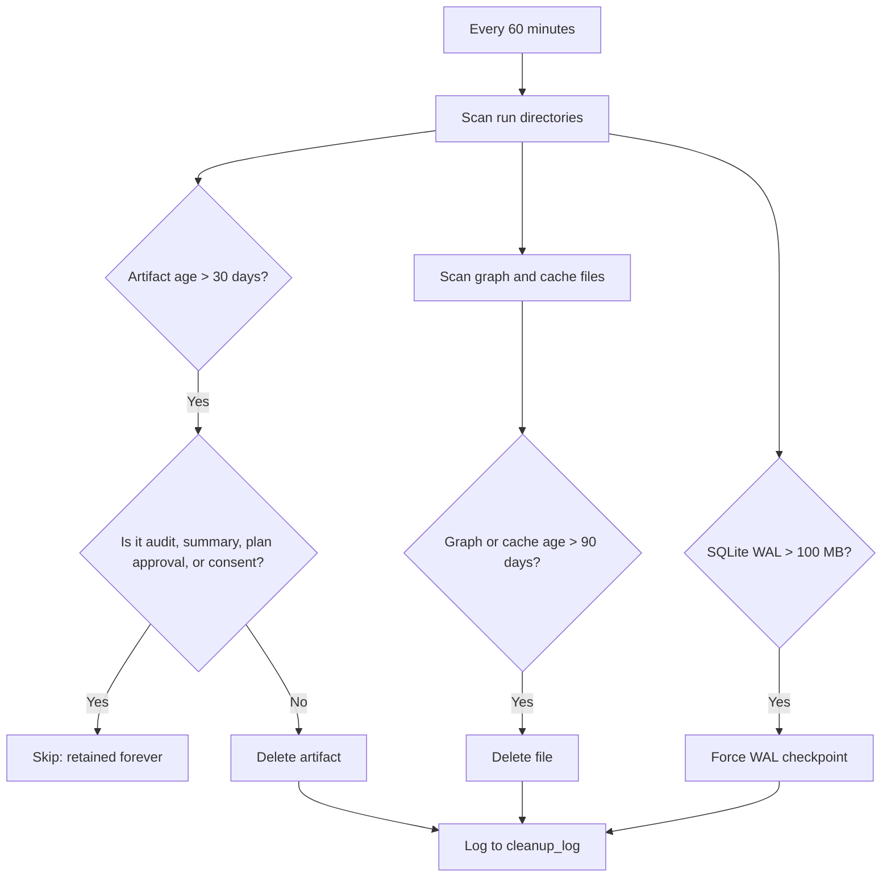
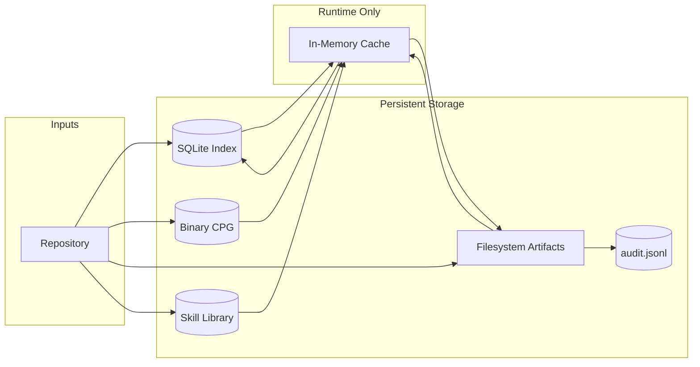

# 05 — Data Model

---

## 1. Purpose

This document defines every structured entity CodeGuardian reads, writes, or passes between components. It covers schemas, relationships, storage locations, lifecycle, and versioning.

Everything here is concrete: field names, types, required versus optional, validation rules.

---

## 2. Storage Architecture

CodeGuardian uses a hybrid storage model. No single backend serves every need.

| Storage Layer | Technology | What It Holds | Why |
|---|---|---|---|
| **Structured index** | SQLite with WAL mode | Run history, checkpoints, skills index, blast radius metadata, MCP call log | Concurrent-safe, embedded, fast reads, atomic transactions |
| **Graph store** | Binary columnar file, memory-mapped | The Code Property Graph per repository per commit | The graph is too large for SQLite blobs. Columnar memory-mapped layout gives fast traversal and low memory usage. |
| **Immutable artifacts** | Filesystem (JSON, JSONL, Markdown) | Reconnaissance manifest, blast radius report, context packs, diffs, audit logs, summaries | Append-only, portable, human-readable |
| **Skill source** | Filesystem (Markdown with YAML frontmatter) | The source of truth for every skill | Human-readable, editable by hand, trackable in version control |
| **Hot session data** | In-memory LRU cache | Parsed ASTs, graph fragments, file contents | Zero-latency, process-local |
| **Secrets** | OS Keychain | API keys, tokens | Encrypted at OS level, never in config files |

### 2.1 Why Not Filesystem Only

- Slow to query across runs.
- No concurrency guarantees.
- No atomic transactions.
- No crash resilience.

### 2.2 Why Not SQLite Only

- Audit logs must be append-only and portable. JSONL is the export standard.
- SQLite is not human-readable without tooling.
- Large JSON blobs and binary graphs bloat the database.
- Skills must be portable. Markdown files are the truth; the database is a derived index.

### 2.3 Why Not a Database Server

- Overkill for a local-first tool.
- Requires running a service.
- Breaks the no-container, no-network principle for local use.
- Adds an install step for users.

### 2.4 Filesystem Layout

```
~/.codeguardian/
├── codeguardian.db                    # SQLite index (WAL mode)
├── codeguardian.db-wal                # WAL file (auto-managed)
├── codeguardian.db-shm                # Shared memory file (auto-managed)
├── config.toml                        # User configuration
├── skills/                            # Global skill library (Markdown source)
│   ├── python-add-type-hints/
│   │   └── SKILL.md
│   ├── typescript-extract-interface/
│   │   └── SKILL.md
│   └── java-add-generics/
│       └── SKILL.md
├── plugins/                           # User-installed plugins
│   ├── lang-kotlin/
│   ├── provider-bitbucket/
│   └── verifier-accessibility/
└── repos/
    └── <repo-id>/                     # sha256 of repo URL, truncated to 16 chars
        ├── meta.json                  # repo metadata
        ├── graph/
        │   └── cpg-<commit>.bin       # Code Property Graph (binary, memory-mapped)
        ├── cache/
        │   ├── recon-<commit>.json
        │   ├── runtime-contract-<commit>.json
        │   └── blast-<target>-<commit>.json
        └── runs/
            └── <run-id>/
                ├── recon.json
                ├── blast_radius.json
                ├── context_pack.json
                ├── contract_assertions.json
                ├── test_target.py
                ├── refactored_target.py
                ├── diff.patch
                ├── verification.json
                ├── audit.jsonl
                ├── checkpoint.json     # Export of the live checkpoint
                └── summary.md
```

**Rule:** SQLite stores metadata, checkpoints, and indexes. Large payloads live on the filesystem. The graph lives in a binary file. No component grows unbounded.

---

## 3. Entity Inventory

| Entity | Storage | Purpose |
|---|---|---|
| **Repository** | SQLite + `meta.json` | A source of code (local, GitHub, GitLab) |
| **Run** | SQLite | One invocation of CodeGuardian |
| **Phase Execution** | SQLite | One phase within a run |
| **Checkpoint** | SQLite + `checkpoint.json` | Resume state after each phase |
| **Plan Approval** | SQLite + audit log | The user's approval of scope before execution |
| **Model Call** | SQLite | One LLM call, with tokens and cost |
| **MCP Tool Call** | SQLite | One MCP tool call, with input and output hashes |
| **Code Property Graph** | Binary file + SQLite metadata | The merged AST, CFG, and PDG |
| **Runtime Contract Map** | Filesystem + cache | Call frequency, ordering, and data-shape transformations |
| **Reconnaissance Manifest** | Filesystem | The evidence-backed reconnaissance output |
| **Blast Radius Report** | Filesystem | Direct and transitive callers, contract violations, coverage gaps, blast score |
| **Contract Assertion** | Filesystem | One caller assumption, in natural language and as a test expression |
| **Context Pack** | Filesystem | The minimal set of files sent to a model |
| **Characterization Test** | Filesystem | Generated tests locking current behavior |
| **Diff** | Filesystem | The proposed code change |
| **Verification Result** | Filesystem + SQLite | Correctness, security, and contract verdicts |
| **Consent Record** | SQLite + audit log | The user's approval to apply changes |
| **Audit Entry** | Filesystem (`audit.jsonl`) | One line in the tamper-evident log |
| **Plugin Manifest** | Filesystem (in plugin package) | Capabilities and permissions |
| **Skill** | Filesystem (Markdown) + SQLite index | A reusable pattern |
| **Skill Embedding** | SQLite (sqlite-vec) | Vector representation for semantic retrieval |
| **Skill Feedback** | SQLite | Outcome of each skill use |
| **Run Summary** | Filesystem (`summary.md`) | AI-generated human-readable summary |
| **Cache Entry** | SQLite + filesystem | Cached reconnaissance, graph, blast reports |

---

## 4. Entity Relationship Diagram

```mermaid
erDiagram
    REPOSITORY ||--o{ RUN : "has many"
    REPOSITORY ||--o{ CPG : "has one per commit"
    REPOSITORY ||--o{ CACHE_ENTRY : "caches"
    RUN ||--o{ PHASE_EXECUTION : "has many"
    RUN ||--o{ CHECKPOINT : "has many"
    RUN ||--|| PLAN_APPROVAL : "has one"
    RUN ||--|| RECON : "produces"
    RUN ||--|| BLAST_RADIUS_REPORT : "produces"
    RUN ||--|| CONTEXT_PACK : "produces"
    RUN ||--o{ CONTRACT_ASSERTION : "has many"
    RUN ||--|| DIFF : "produces"
    RUN ||--o{ VERIFICATION_RESULT : "has many"
    RUN ||--o{ AUDIT_ENTRY : "produces"
    RUN ||--o| CONSENT_RECORD : "may have"
    RUN ||--o{ SKILL_FEEDBACK : "generates"
    RUN ||--o{ MCP_TOOL_CALL : "has many"
    PHASE_EXECUTION ||--o{ MODEL_CALL : "has many"
    PHASE_EXECUTION ||--o{ MCP_TOOL_CALL : "has many"
    BLAST_RADIUS_REPORT ||--o{ CONTRACT_VIOLATION : "contains"
    BLAST_RADIUS_REPORT ||--o{ COVERAGE_GAP : "contains"
    CPG ||--|| RUNTIME_CONTRACT_MAP : "informs"
    SKILL ||--|| SKILL_EMBEDDING : "has one"
    SKILL ||--o{ SKILL_FEEDBACK : "has many"
    PLUGIN_MANIFEST ||--o{ CACHE_ENTRY : "declares"

    REPOSITORY {
        string repo_id PK
        string url
        string provider
        string last_seen_at
    }

    RUN {
        string run_id PK
        string repo_id FK
        string commit_hash
        string target_path
        string mode
        string directive
        string started_at
        string finished_at
        string status
        string sandbox_backend
        string plan_approval_id FK
        string blast_score
        string recommendation
    }

    PHASE_EXECUTION {
        string phase_id PK
        string run_id FK
        string phase_name
        string agent_name
        string started_at
        string finished_at
        string status
        int retries
        string resumed_from
    }

    CHECKPOINT {
        string checkpoint_id PK
        string run_id FK
        string phase
        string state_json
        string created_at
    }

    PLAN_APPROVAL {
        string approval_id PK
        string run_id FK
        string approved_at
        string scope
        string plan_hash
    }

    MODEL_CALL {
        string call_id PK
        string phase_id FK
        string agent_name
        string model_id
        string provider
        int tokens_in
        int tokens_out
        string prompt_hash
        string context_hash
        string output_hash
    }

    MCP_TOOL_CALL {
        string call_id PK
        string phase_id FK
        string tool_name
        string input_hash
        string output_hash
        int duration_ms
        string status
    }

    CPG {
        string cpg_id PK
        string repo_id FK
        string commit_hash
        int node_count
        int edge_count
        int build_duration_ms
        string binary_path
    }

    RUNTIME_CONTRACT_MAP {
        string map_id PK
        string repo_id FK
        string commit_hash
        string path
    }

    RECON {
        string recon_id PK
        string run_id FK
        string path
        string schema_version
    }

    BLAST_RADIUS_REPORT {
        string report_id PK
        string run_id FK
        string target
        int direct_callers
        int transitive_callers
        int contract_violations
        int coverage_gaps
        int blast_score
        string recommendation
    }

    CONTRACT_VIOLATION {
        string violation_id PK
        string report_id FK
        string caller
        string assumption
        string risk
    }

    COVERAGE_GAP {
        string gap_id PK
        string report_id FK
        string caller
        string reason
    }

    CONTRACT_ASSERTION {
        string assertion_id PK
        string run_id FK
        string caller
        string assumption
        string test_expression
        string severity
    }

    CONTEXT_PACK {
        string pack_id PK
        string run_id FK
        string path
        int token_count
        boolean truncated
    }

    DIFF {
        string diff_id PK
        string run_id FK
        string path
        string diff_hash
    }

    VERIFICATION_RESULT {
        string result_id PK
        string run_id FK
        string verifier_type
        string model_id
        string verdict
        string evidence_path
    }

    CONSENT_RECORD {
        string consent_id PK
        string run_id FK
        string granted_at
        string scope
    }

    AUDIT_ENTRY {
        string entry_id PK
        string run_id FK
        string timestamp
        string phase
        string agent
        string payload_hash
        string prev_hash
        string entry_hash
    }

    PLUGIN_MANIFEST {
        string name PK
        string version
        string type
        string interface_version
    }

    SKILL {
        string name PK
        string path
        string description
        string trigger
        string skill_type
        string language
        float effectiveness
        int total_uses
        int total_successes
        string state
    }

    SKILL_EMBEDDING {
        string name PK
        string skill_name FK
        string embedding
    }

    SKILL_FEEDBACK {
        string feedback_id PK
        string skill_name FK
        string run_id FK
        string outcome
        string task_description
    }

    CACHE_ENTRY {
        string repo_id FK
        string commit_hash
        string cache_type
        string payload_path
    }
```



---

## 5. Schemas

Each schema is defined as JSON Schema. Implementations must validate against it.

### 5.1 Code Property Graph Metadata — Schema v1.0

The graph itself is a binary columnar file. This schema describes its metadata.

```json
{
  "$schema": "https://json-schema.org/draft/2020-12/schema",
  "$id": "https://codeguardian.dev/schemas/cpg/v1.0.json",
  "title": "Code Property Graph Metadata",
  "type": "object",
  "required": ["schema_version", "repo_id", "commit_hash", "node_count", "edge_count", "binary_path", "built_at"],
  "properties": {
    "schema_version": {"type": "string", "const": "1.0"},
    "repo_id": {"type": "string"},
    "commit_hash": {"type": "string"},
    "node_count": {"type": "integer", "minimum": 0},
    "edge_count": {"type": "integer", "minimum": 0},
    "build_duration_ms": {"type": "integer", "minimum": 0},
    "built_at": {"type": "string", "format": "date-time"},
    "incremental": {"type": "boolean"},
    "binary_path": {"type": "string"},
    "languages": {
      "type": "array",
      "items": {
        "type": "object",
        "required": ["name", "file_count"],
        "properties": {
          "name": {"type": "string"},
          "file_count": {"type": "integer", "minimum": 0},
          "node_count": {"type": "integer", "minimum": 0}
        }
      }
    },
    "edge_types": {
      "type": "object",
      "additionalProperties": {"type": "integer", "minimum": 0}
    }
  }
}
```

### 5.2 Runtime Contract Map — Schema v1.0

The output of the instrumented smoke test.

```json
{
  "$schema": "https://json-schema.org/draft/2020-12/schema",
  "$id": "https://codeguardian.dev/schemas/runtime-contract-map/v1.0.json",
  "title": "Runtime Contract Map",
  "type": "object",
  "required": ["schema_version", "repo_id", "commit_hash", "functions"],
  "properties": {
    "schema_version": {"type": "string", "const": "1.0"},
    "repo_id": {"type": "string"},
    "commit_hash": {"type": "string"},
    "functions": {
      "type": "array",
      "items": {
        "type": "object",
        "required": ["qualified_name", "call_count"],
        "properties": {
          "qualified_name": {"type": "string"},
          "file": {"type": "string"},
          "line": {"type": "integer", "minimum": 1},
          "call_count": {"type": "integer", "minimum": 0},
          "critical_path": {"type": "boolean"},
          "calls_before": {
            "type": "array",
            "items": {"type": "string"}
          },
          "calls_after": {
            "type": "array",
            "items": {"type": "string"}
          },
          "data_shapes": {
            "type": "array",
            "items": {
              "type": "object",
              "properties": {
                "input": {"type": "string"},
                "output": {"type": "string"},
                "count": {"type": "integer", "minimum": 0}
              }
            }
          }
        }
      }
    }
  }
}
```

### 5.3 Reconnaissance Manifest — Schema v1.1

The reconnaissance output. This is an upgrade of the earlier version, adding references to the Code Property Graph and the Runtime Contract Map, plus a structural section.

```json
{
  "$schema": "https://json-schema.org/draft/2020-12/schema",
  "$id": "https://codeguardian.dev/schemas/recon/v1.1.json",
  "title": "Reconnaissance Output",
  "type": "object",
  "required": ["schema_version", "repo", "languages", "structural", "dependency_graph", "hierarchical_index", "entrypoints", "versions", "smoke_test", "truth_report", "drift_report"],
  "properties": {
    "schema_version": {"type": "string", "const": "1.1"},
    "repo": {
      "type": "object",
      "required": ["url", "commit", "detected_at"],
      "properties": {
        "url": {"type": "string", "format": "uri"},
        "provider": {"type": "string", "enum": ["local", "github", "gitlab"]},
        "commit": {"type": "string"},
        "detected_at": {"type": "string", "format": "date-time"}
      }
    },
    "structural": {
      "type": "object",
      "required": ["cpg"],
      "properties": {
        "cpg": {
          "type": "object",
          "required": ["binary_path", "node_count", "edge_count", "built_at"],
          "properties": {
            "binary_path": {"type": "string"},
            "node_count": {"type": "integer", "minimum": 0},
            "edge_count": {"type": "integer", "minimum": 0},
            "built_at": {"type": "string", "format": "date-time"},
            "incremental": {"type": "boolean"}
          }
        },
        "runtime_contract_map": {
          "type": "object",
          "properties": {
            "path": {"type": "string"},
            "functions_captured": {"type": "integer", "minimum": 0},
            "critical_path_functions": {"type": "integer", "minimum": 0}
          }
        }
      }
    },
    "languages": {
      "type": "array",
      "items": {
        "type": "object",
        "required": ["name", "files", "percentage", "tier"],
        "properties": {
          "name": {"type": "string"},
          "files": {"type": "integer", "minimum": 0},
          "lines": {"type": "integer", "minimum": 0},
          "percentage": {"type": "number", "minimum": 0, "maximum": 100},
          "tier": {"type": "string", "enum": ["high", "best-effort"]}
        }
      }
    },
    "frameworks": {
      "type": "array",
      "items": {
        "type": "object",
        "required": ["name", "evidence"],
        "properties": {
          "name": {"type": "string"},
          "version": {"type": "string"},
          "evidence": {"type": "string"}
        }
      }
    },
    "dependency_graph": {
      "type": "object",
      "required": ["nodes", "edges"],
      "properties": {
        "nodes": {
          "type": "array",
          "items": {
            "type": "object",
            "required": ["id", "type"],
            "properties": {
              "id": {"type": "string"},
              "type": {"type": "string", "enum": ["file", "module", "package"]},
              "language": {"type": "string"}
            }
          }
        },
        "edges": {
          "type": "array",
          "items": {
            "type": "object",
            "required": ["from", "to", "kind"],
            "properties": {
              "from": {"type": "string"},
              "to": {"type": "string"},
              "kind": {"type": "string", "enum": ["import", "call", "inherit"]}
            }
          }
        }
      }
    },
    "hierarchical_index": {
      "type": "object",
      "additionalProperties": {
        "type": "array",
        "items": {"type": "string"}
      }
    },
    "entrypoints": {
      "type": "array",
      "items": {
        "type": "object",
        "required": ["file", "line", "type"],
        "properties": {
          "file": {"type": "string"},
          "line": {"type": "integer", "minimum": 1},
          "type": {"type": "string", "enum": ["script", "function", "class", "route", "cli"]}
        }
      }
    },
    "versions": {
      "type": "object",
      "required": ["declared", "actual", "available"],
      "properties": {
        "declared": {"type": "object", "additionalProperties": {"type": "string"}},
        "actual": {"type": "object", "additionalProperties": {"type": "string"}},
        "available": {"type": "object", "additionalProperties": {"type": "string"}}
      }
    },
    "smoke_test": {
      "type": "object",
      "required": ["status", "passed", "failed", "errored"],
      "properties": {
        "status": {"type": "string", "enum": ["passed", "partial", "failed", "skipped"]},
        "passed": {"type": "integer", "minimum": 0},
        "failed": {"type": "integer", "minimum": 0},
        "errored": {"type": "integer", "minimum": 0},
        "duration_seconds": {"type": "number", "minimum": 0},
        "reason": {"type": "string"}
      }
    },
    "truth_report": {
      "type": "array",
      "items": {
        "type": "object",
        "required": ["claim", "source", "reality", "severity", "suggestion"],
        "properties": {
          "claim": {"type": "string"},
          "source": {"type": "string"},
          "reality": {"type": "string"},
          "severity": {"type": "string", "enum": ["info", "warning", "critical"]},
          "suggestion": {"type": "string"}
        }
      }
    },
    "drift_report": {
      "type": "array",
      "items": {
        "type": "object",
        "required": ["package", "declared", "actual", "severity"],
        "properties": {
          "package": {"type": "string"},
          "declared": {"type": "string"},
          "actual": {"type": "string"},
          "available": {"type": "string"},
          "severity": {"type": "string", "enum": ["info", "warning", "critical"]},
          "suggestion": {"type": "string"}
        }
      }
    }
  }
}
```

### 5.4 Blast Radius Report — Schema v1.0

The output of Phase 1. This is the document that no other coding agent produces before touching code.

```json
{
  "$schema": "https://json-schema.org/draft/2020-12/schema",
  "$id": "https://codeguardian.dev/schemas/blast-radius/v1.0.json",
  "title": "Blast Radius Report",
  "type": "object",
  "required": ["schema_version", "run_id", "target", "change_kind", "direct_callers", "transitive_callers", "contract_violations", "coverage_gaps", "blast_score", "recommendation", "generated_at"],
  "properties": {
    "schema_version": {"type": "string", "const": "1.0"},
    "run_id": {"type": "string", "format": "uuid"},
    "target": {
      "type": "object",
      "required": ["path", "qualified_name"],
      "properties": {
        "path": {"type": "string"},
        "qualified_name": {"type": "string"},
        "language": {"type": "string"}
      }
    },
    "change_kind": {"type": "string", "enum": ["syntactic", "semantic", "contract", "signature"]},
    "direct_callers": {
      "type": "array",
      "items": {
        "type": "object",
        "required": ["qualified_name", "path", "line"],
        "properties": {
          "qualified_name": {"type": "string"},
          "path": {"type": "string"},
          "line": {"type": "integer", "minimum": 1},
          "call_kind": {"type": "string", "enum": ["direct", "inherited", "decorated", "dynamic"]}
        }
      }
    },
    "transitive_callers": {
      "type": "array",
      "items": {
        "type": "object",
        "required": ["qualified_name", "path", "depth"],
        "properties": {
          "qualified_name": {"type": "string"},
          "path": {"type": "string"},
          "depth": {"type": "integer", "minimum": 1}
        }
      }
    },
    "contract_violations": {
      "type": "array",
      "items": {
        "type": "object",
        "required": ["caller", "assumption", "risk"],
        "properties": {
          "caller": {"type": "string"},
          "assumption": {"type": "string"},
          "risk": {"type": "string", "enum": ["info", "warning", "critical"]},
          "evidence": {"type": "string"}
        }
      }
    },
    "coverage_gaps": {
      "type": "array",
      "items": {
        "type": "object",
        "required": ["caller", "reason"],
        "properties": {
          "caller": {"type": "string"},
          "reason": {"type": "string"}
        }
      }
    },
    "blast_score": {"type": "integer", "minimum": 0, "maximum": 100},
    "recommendation": {"type": "string", "enum": ["proceed", "review", "block"]},
    "generated_at": {"type": "string", "format": "date-time"}
  }
}
```

### 5.5 Contract Assertions — Schema v1.0

Generated by the Tester. Checked by the sandbox and the Contract Verifier.

```json
{
  "$schema": "https://json-schema.org/draft/2020-12/schema",
  "$id": "https://codeguardian.dev/schemas/contract-assertions/v1.0.json",
  "title": "Contract Assertions",
  "type": "object",
  "required": ["schema_version", "run_id", "assertions"],
  "properties": {
    "schema_version": {"type": "string", "const": "1.0"},
    "run_id": {"type": "string", "format": "uuid"},
    "assertions": {
      "type": "array",
      "items": {
        "type": "object",
        "required": ["caller", "assumption", "severity"],
        "properties": {
          "caller": {"type": "string", "description": "The caller whose contract is at risk"},
          "assumption": {"type": "string", "description": "Natural language description of the assumption"},
          "test_expression": {"type": "string", "description": "Optional runnable expression that validates the assumption"},
          "severity": {"type": "string", "enum": ["info", "warning", "critical"]},
          "source": {"type": "string", "description": "file:line where the assumption is visible"}
        }
      }
    }
  }
}
```

### 5.6 Context Pack — Schema v1.1

Upgraded to include contract assertions and blast radius context when the score is high.

```json
{
  "$schema": "https://json-schema.org/draft/2020-12/schema",
  "$id": "https://codeguardian.dev/schemas/context-pack/v1.1.json",
  "title": "Context Pack",
  "type": "object",
  "required": ["schema_version", "target", "files", "token_budget", "token_count", "blast_aware"],
  "properties": {
    "schema_version": {"type": "string", "const": "1.1"},
    "target": {
      "type": "object",
      "required": ["path", "language"],
      "properties": {
        "path": {"type": "string"},
        "language": {"type": "string"},
        "symbol": {"type": "string"},
        "line_range": {
          "type": "array",
          "items": {"type": "integer"},
          "minItems": 2,
          "maxItems": 2
        }
      }
    },
    "blast_aware": {"type": "boolean"},
    "files": {
      "type": "array",
      "items": {
        "type": "object",
        "required": ["path", "content_hash", "reason"],
        "properties": {
          "path": {"type": "string"},
          "content_hash": {"type": "string"},
          "reason": {"type": "string", "enum": ["target", "direct_import", "caller", "callee", "test", "config", "contract"]},
          "content": {"type": "string", "description": "Only present in ephemeral packs; not persisted"}
        }
      }
    },
    "contract_assertions": {
      "type": "array",
      "items": {"type": "object"}
    },
    "token_budget": {"type": "integer", "minimum": 1},
    "token_count": {"type": "integer", "minimum": 0},
    "truncated": {"type": "boolean", "default": false},
    "truncation_strategy": {"type": "string", "enum": ["none", "summarize", "drop_oldest", "sliding_window"]}
  }
}
```

### 5.7 Verification Result — Schema v1.1

Upgraded to include the contract verifier alongside correctness and security.

```json
{
  "$schema": "https://json-schema.org/draft/2020-12/schema",
  "$id": "https://codeguardian.dev/schemas/verification/v1.1.json",
  "title": "Verifier Verdict",
  "type": "object",
  "required": ["schema_version", "verifier_type", "model", "verdict", "timestamp"],
  "properties": {
    "schema_version": {"type": "string", "const": "1.1"},
    "verifier_type": {"type": "string", "enum": ["correctness", "security", "contract"]},
    "model": {
      "type": "object",
      "required": ["id", "provider"],
      "properties": {
        "id": {"type": "string"},
        "provider": {"type": "string"},
        "version": {"type": "string"}
      }
    },
    "verdict": {"type": "string", "enum": ["pass", "fail", "uncertain"]},
    "confidence": {"type": "number", "minimum": 0, "maximum": 1},
    "findings": {
      "type": "array",
      "items": {
        "type": "object",
        "required": ["severity", "message"],
        "properties": {
          "severity": {"type": "string", "enum": ["info", "warning", "critical"]},
          "message": {"type": "string"},
          "location": {"type": "string"},
          "evidence_hash": {"type": "string"}
        }
      }
    },
    "context_hash": {"type": "string"},
    "timestamp": {"type": "string", "format": "date-time"}
  }
}
```

### 5.8 Plan Approval — Schema v1.0

The user's approval of scope before execution. Separate from apply consent.

```json
{
  "$schema": "https://json-schema.org/draft/2020-12/schema",
  "$id": "https://codeguardian.dev/schemas/plan-approval/v1.0.json",
  "title": "Plan Approval Record",
  "type": "object",
  "required": ["schema_version", "approval_id", "run_id", "approved_at", "scope", "plan_hash"],
  "properties": {
    "schema_version": {"type": "string", "const": "1.0"},
    "approval_id": {"type": "string", "format": "uuid"},
    "run_id": {"type": "string", "format": "uuid"},
    "approved_at": {"type": "string", "format": "date-time"},
    "approved_by": {"type": "string", "description": "Local session identifier"},
    "scope": {
      "type": "object",
      "required": ["kind", "targets"],
      "properties": {
        "kind": {"type": "string", "enum": ["single_target", "module", "project"]},
        "targets": {"type": "array", "items": {"type": "string"}},
        "directive": {"type": "string"}
      }
    },
    "plan_hash": {"type": "string", "description": "sha256 of the presented brief and plan"}
  }
}
```

### 5.9 Consent Record — Schema v1.0

The user's approval to apply changes. Separate from plan approval.

```json
{
  "$schema": "https://json-schema.org/draft/2020-12/schema",
  "$id": "https://codeguardian.dev/schemas/consent/v1.0.json",
  "title": "Apply Consent Record",
  "type": "object",
  "required": ["schema_version", "consent_id", "run_id", "granted_at", "scope"],
  "properties": {
    "schema_version": {"type": "string", "const": "1.0"},
    "consent_id": {"type": "string", "format": "uuid"},
    "run_id": {"type": "string", "format": "uuid"},
    "granted_at": {"type": "string", "format": "date-time"},
    "granted_by": {"type": "string"},
    "scope": {"type": "string", "enum": ["apply", "verify"]},
    "diff_hash": {"type": "string"},
    "rollback_ref": {"type": "string"}
  }
}
```

### 5.10 Checkpoint — Schema v1.0

The resume state. Stored in SQLite via the orchestrator's checkpointer and exportable to JSON.

```json
{
  "$schema": "https://json-schema.org/draft/2020-12/schema",
  "$id": "https://codeguardian.dev/schemas/checkpoint/v1.0.json",
  "title": "Checkpoint",
  "type": "object",
  "required": ["schema_version", "checkpoint_id", "run_id", "phase", "created_at"],
  "properties": {
    "schema_version": {"type": "string", "const": "1.0"},
    "checkpoint_id": {"type": "string", "format": "uuid"},
    "run_id": {"type": "string", "format": "uuid"},
    "phase": {"type": "string"},
    "created_at": {"type": "string", "format": "date-time"},
    "completed_phases": {"type": "array", "items": {"type": "string"}},
    "pending_phases": {"type": "array", "items": {"type": "string"}},
    "retries": {"type": "integer", "minimum": 0},
    "state": {"type": "object", "description": "Phase-specific state"},
    "artifacts": {
      "type": "object",
      "additionalProperties": {"type": "string"}
    }
  }
}
```

### 5.11 Audit Entry — Schema v1.1

Upgraded to include the blast radius section, three verifier verdicts, checkpoint reference, and plan approval reference.

```json
{
  "$schema": "https://json-schema.org/draft/2020-12/schema",
  "$id": "https://codeguardian.dev/schemas/audit-entry/v1.1.json",
  "title": "Audit Entry",
  "type": "object",
  "required": ["entry_id", "run_id", "timestamp", "phase", "payload_hash", "prev_hash", "entry_hash"],
  "properties": {
    "entry_id": {"type": "string", "format": "uuid"},
    "run_id": {"type": "string", "format": "uuid"},
    "timestamp": {"type": "string", "format": "date-time"},
    "phase": {"type": "string", "enum": ["preflight", "reconnaissance", "blast_radius", "context", "safety_net", "refactor", "sandbox_verify", "independent_verify", "output", "consent", "apply"]},
    "agent": {"type": "string", "enum": ["recon", "blast_radius", "analyst", "tester", "writer", "correctness_verifier", "security_verifier", "contract_verifier", "skill_curator", "orchestrator", "cli"]},
    "model": {
      "type": "object",
      "properties": {
        "id": {"type": "string"},
        "provider": {"type": "string"},
        "version": {"type": "string"}
      }
    },
    "input": {
      "type": "object",
      "properties": {
        "prompt_hash": {"type": "string"},
        "context_hash": {"type": "string"},
        "directive": {"type": "string"}
      }
    },
    "output": {
      "type": "object",
      "properties": {
        "diff_hash": {"type": "string"},
        "tokens_in": {"type": "integer", "minimum": 0},
        "tokens_out": {"type": "integer", "minimum": 0}
      }
    },
    "blast_radius": {
      "type": "object",
      "properties": {
        "direct_callers": {"type": "integer", "minimum": 0},
        "transitive_callers": {"type": "integer", "minimum": 0},
        "contract_violations": {"type": "integer", "minimum": 0},
        "coverage_gaps": {"type": "integer", "minimum": 0},
        "blast_score": {"type": "integer", "minimum": 0, "maximum": 100},
        "recommendation": {"type": "string", "enum": ["proceed", "review", "block"]}
      }
    },
    "result": {
      "type": "object",
      "properties": {
        "status": {"type": "string", "enum": ["success", "failure", "skipped", "stopped"]},
        "tests_passed": {"type": "integer", "minimum": 0},
        "tests_failed": {"type": "integer", "minimum": 0},
        "retries": {"type": "integer", "minimum": 0},
        "error": {"type": "string"}
      }
    },
    "verification": {
      "type": "object",
      "properties": {
        "correctness": {"type": "object"},
        "security": {"type": "object"},
        "contract": {"type": "object"}
      }
    },
    "consent": {
      "type": "object",
      "properties": {
        "requested": {"type": "boolean"},
        "granted": {"type": "boolean"},
        "granted_at": {"type": "string", "format": "date-time"},
        "scope": {"type": "string", "enum": ["apply", "verify"]}
      }
    },
    "plan_approval_id": {"type": "string"},
    "checkpoint_id": {"type": "string"},
    "rollback_ref": {"type": "string"},
    "payload_hash": {"type": "string"},
    "prev_hash": {"type": "string"},
    "entry_hash": {"type": "string"}
  }
}
```

**Hash chain verification:**

```
entry_1: prev_hash = "GENESIS", entry_hash = sha256("GENESIS" + payload_hash_1)
entry_2: prev_hash = entry_1.entry_hash, entry_hash = sha256(entry_1.entry_hash + payload_hash_2)
entry_n: prev_hash = entry_(n-1).entry_hash, entry_hash = sha256(entry_(n-1).entry_hash + payload_hash_n)
```

If any entry is modified, its `entry_hash` no longer matches the next entry's `prev_hash`, and the chain breaks.

### 5.12 Plugin Manifest — Schema v1.1

Upgraded to include the sandbox backend plugin type.

```json
{
  "$schema": "https://json-schema.org/draft/2020-12/schema",
  "$id": "https://codeguardian.dev/schemas/plugin-manifest/v1.1.json",
  "title": "Plugin Manifest",
  "type": "object",
  "required": ["name", "version", "type", "interface_version", "permissions"],
  "properties": {
    "name": {"type": "string", "pattern": "^[a-z0-9-]+$"},
    "version": {"type": "string", "pattern": "^\\d+\\.\\d+\\.\\d+$"},
    "type": {"type": "string", "enum": ["language", "provider", "tool", "verifier", "reporter", "sandbox"]},
    "interface_version": {"type": "string", "pattern": "^\\d+\\.\\d+$"},
    "description": {"type": "string"},
    "author": {"type": "string"},
    "license": {"type": "string"},
    "language": {
      "type": "object",
      "properties": {
        "name": {"type": "string"},
        "tree_sitter_grammar": {"type": "string"},
        "test_runner": {"type": "string"},
        "refactor_rules": {"type": "array", "items": {"type": "string"}},
        "reliability_tier": {"type": "string", "enum": ["high", "best-effort"]}
      }
    },
    "provider": {
      "type": "object",
      "properties": {
        "name": {"type": "string"},
        "api_version": {"type": "string"}
      }
    },
    "sandbox": {
      "type": "object",
      "properties": {
        "backend_type": {"type": "string", "enum": ["bubblewrap", "seatbelt", "firecracker", "docker", "custom"]},
        "supported_platforms": {"type": "array", "items": {"type": "string"}},
        "isolation_level": {"type": "string", "enum": ["os", "hardware"]}
      }
    },
    "permissions": {
      "type": "object",
      "required": ["filesystem", "network"],
      "properties": {
        "filesystem": {"type": "string", "enum": ["none", "sandbox_only", "read_only", "full"]},
        "network": {"type": "boolean"},
        "process_spawn": {"type": "boolean"},
        "env_read": {"type": "array", "items": {"type": "string"}}
      }
    }
  }
}
```

### 5.13 Skill Frontmatter — Schema v1.0

Every skill is a Markdown file with YAML frontmatter. The Markdown is the truth; the SQLite index is derived.

```json
{
  "$schema": "https://json-schema.org/draft/2020-12/schema",
  "$id": "https://codeguardian.dev/schemas/skill/v1.0.json",
  "title": "Skill Frontmatter",
  "type": "object",
  "required": ["name", "description", "trigger", "skill_type", "language", "state"],
  "properties": {
    "name": {"type": "string", "pattern": "^[a-z0-9-]+$"},
    "description": {"type": "string"},
    "trigger": {"type": "string", "description": "When to use this skill"},
    "skill_type": {"type": "string", "enum": ["refactor_pattern", "test_pattern", "language_rule", "project_convention"]},
    "language": {"type": "string"},
    "effectiveness": {"type": "number", "minimum": 0, "maximum": 1, "default": 0.5},
    "total_uses": {"type": "integer", "minimum": 0, "default": 0},
    "total_successes": {"type": "integer", "minimum": 0, "default": 0},
    "state": {"type": "string", "enum": ["active", "stale", "archived", "draft"]},
    "created_at": {"type": "string", "format": "date-time"},
    "last_used_at": {"type": "string", "format": "date-time"}
  }
}
```

The Markdown body contains the skill's steps, examples, and notes. Example file:

```markdown
---
name: python-add-type-hints
description: Add type hints to untyped Python functions
trigger: When refactoring Python code that lacks type annotations
skill_type: refactor_pattern
language: python
effectiveness: 0.87
total_uses: 42
total_successes: 38
state: active
created_at: 2026-10-06T10:00:00Z
last_used_at: 2026-10-06T14:22:00Z
---

# Add Type Hints to Python Functions

## When to use

- Functions with no type annotations
- Python 3.9 or later codebase

## Steps

1. Analyze the function signature and body.
2. Infer argument types from usage.
3. Infer return type from return statements.
4. Add `-> type` annotations.
5. Use `Optional[T]` for nullable values.

## Example

...
```

### 5.14 Run Summary — Schema v1.1

Upgraded to include blast radius, structural findings, and skill proposals.

```json
{
  "$schema": "https://json-schema.org/draft/2020-12/schema",
  "$id": "https://codeguardian.dev/schemas/run-summary/v1.1.json",
  "title": "Run Summary",
  "type": "object",
  "required": ["schema_version", "run_id", "status", "headline", "key_findings"],
  "properties": {
    "schema_version": {"type": "string", "const": "1.1"},
    "run_id": {"type": "string", "format": "uuid"},
    "status": {"type": "string", "enum": ["success", "failure", "stopped", "dry_run"]},
    "headline": {"type": "string"},
    "blast_radius_headline": {"type": "string"},
    "key_findings": {
      "type": "array",
      "items": {
        "type": "object",
        "required": ["type", "message"],
        "properties": {
          "type": {"type": "string", "enum": ["truth_report", "drift_report", "blast_radius", "contract_violation", "coverage_gap", "test_result", "verifier_verdict", "refactor_result", "skill_proposal"]},
          "message": {"type": "string"},
          "severity": {"type": "string", "enum": ["info", "warning", "critical"]}
        }
      }
    },
    "skill_proposals": {
      "type": "array",
      "items": {
        "type": "object",
        "properties": {
          "name": {"type": "string"},
          "description": {"type": "string"},
          "confidence": {"type": "number", "minimum": 0, "maximum": 1}
        }
      }
    },
    "duration_seconds": {"type": "number", "minimum": 0},
    "next_steps": {
      "type": "array",
      "items": {"type": "string"}
    }
  }
}
```

---

## 6. SQLite Schema

The SQLite index stores metadata, checkpoints, and indexes. It never stores large payloads.

```sql
-- Enable WAL mode and performance PRAGMAs on every connection
PRAGMA journal_mode = WAL;
PRAGMA synchronous = NORMAL;
PRAGMA wal_autocheckpoint = 10000;
PRAGMA mmap_size = 268435456;
PRAGMA busy_timeout = 5000;
PRAGMA cache_size = -64000;

-- Repositories
CREATE TABLE IF NOT EXISTS repos (
    repo_id TEXT PRIMARY KEY,
    url TEXT NOT NULL,
    provider TEXT NOT NULL CHECK (provider IN ('local', 'github', 'gitlab')),
    default_branch TEXT,
    last_seen_at TEXT NOT NULL,
    meta_json TEXT
);

-- Code Property Graph metadata
CREATE TABLE IF NOT EXISTS cpg_metadata (
    cpg_id TEXT PRIMARY KEY,
    repo_id TEXT NOT NULL REFERENCES repos(repo_id),
    commit_hash TEXT NOT NULL,
    node_count INTEGER NOT NULL,
    edge_count INTEGER NOT NULL,
    build_duration_ms INTEGER,
    built_at TEXT NOT NULL,
    incremental INTEGER DEFAULT 0,
    binary_path TEXT NOT NULL,
    UNIQUE(repo_id, commit_hash)
);

CREATE INDEX idx_cpg_repo ON cpg_metadata(repo_id, commit_hash);

-- Runs
CREATE TABLE IF NOT EXISTS runs (
    run_id TEXT PRIMARY KEY,
    repo_id TEXT NOT NULL REFERENCES repos(repo_id),
    commit_hash TEXT NOT NULL,
    target_path TEXT,
    mode TEXT CHECK (mode IN ('legacy', 'greenfield')),
    directive TEXT,
    started_at TEXT NOT NULL,
    finished_at TEXT,
    status TEXT CHECK (status IN ('running', 'success', 'failure', 'stopped', 'dry_run', 'paused')),
    sandbox_backend TEXT,
    plan_approval_id TEXT,
    blast_score INTEGER,
    recommendation TEXT CHECK (recommendation IN ('proceed', 'review', 'block')),
    verification_enabled INTEGER DEFAULT 0,
    artifact_dir TEXT NOT NULL
);

CREATE INDEX idx_runs_repo ON runs(repo_id, started_at DESC);
CREATE INDEX idx_runs_status ON runs(status);

-- Plan approvals
CREATE TABLE IF NOT EXISTS plan_approvals (
    approval_id TEXT PRIMARY KEY,
    run_id TEXT NOT NULL REFERENCES runs(run_id),
    approved_at TEXT NOT NULL,
    approved_by TEXT,
    scope_kind TEXT CHECK (scope_kind IN ('single_target', 'module', 'project')),
    scope_json TEXT NOT NULL,
    plan_hash TEXT NOT NULL
);

CREATE INDEX idx_plan_approvals_run ON plan_approvals(run_id);

-- Phase executions
CREATE TABLE IF NOT EXISTS phase_executions (
    phase_id TEXT PRIMARY KEY,
    run_id TEXT NOT NULL REFERENCES runs(run_id),
    phase_name TEXT NOT NULL,
    agent_name TEXT,
    started_at TEXT NOT NULL,
    finished_at TEXT,
    status TEXT CHECK (status IN ('running', 'success', 'failure', 'stopped', 'paused')),
    retries INTEGER DEFAULT 0,
    resumed_from TEXT,
    error_message TEXT
);

CREATE INDEX idx_phases_run ON phase_executions(run_id, started_at);

-- Checkpoints
CREATE TABLE IF NOT EXISTS checkpoints (
    checkpoint_id TEXT PRIMARY KEY,
    run_id TEXT NOT NULL REFERENCES runs(run_id),
    phase TEXT NOT NULL,
    state_json TEXT NOT NULL,
    created_at TEXT NOT NULL
);

CREATE INDEX idx_checkpoints_run ON checkpoints(run_id, created_at DESC);

-- Model calls
CREATE TABLE IF NOT EXISTS model_calls (
    call_id TEXT PRIMARY KEY,
    phase_id TEXT NOT NULL REFERENCES phase_executions(phase_id),
    agent_name TEXT NOT NULL CHECK (agent_name IN ('recon', 'blast_radius', 'analyst', 'tester', 'writer', 'correctness_verifier', 'security_verifier', 'contract_verifier', 'skill_curator')),
    model_id TEXT NOT NULL,
    provider TEXT NOT NULL,
    tokens_in INTEGER NOT NULL,
    tokens_out INTEGER NOT NULL,
    prompt_hash TEXT NOT NULL,
    context_hash TEXT NOT NULL,
    output_hash TEXT,
    started_at TEXT NOT NULL,
    finished_at TEXT,
    status TEXT
);

CREATE INDEX idx_calls_phase ON model_calls(phase_id);
CREATE INDEX idx_calls_agent ON model_calls(agent_name);

-- MCP tool calls
CREATE TABLE IF NOT EXISTS mcp_tool_calls (
    call_id TEXT PRIMARY KEY,
    phase_id TEXT NOT NULL REFERENCES phase_executions(phase_id),
    tool_name TEXT NOT NULL,
    input_hash TEXT NOT NULL,
    output_hash TEXT,
    duration_ms INTEGER,
    status TEXT,
    created_at TEXT NOT NULL
);

CREATE INDEX idx_mcp_phase ON mcp_tool_calls(phase_id);
CREATE INDEX idx_mcp_tool ON mcp_tool_calls(tool_name);

-- Blast radius reports
CREATE TABLE IF NOT EXISTS blast_radius_reports (
    report_id TEXT PRIMARY KEY,
    run_id TEXT NOT NULL REFERENCES runs(run_id),
    target_path TEXT NOT NULL,
    direct_callers INTEGER NOT NULL,
    transitive_callers INTEGER NOT NULL,
    contract_violations INTEGER NOT NULL,
    coverage_gaps INTEGER NOT NULL,
    blast_score INTEGER NOT NULL,
    recommendation TEXT NOT NULL CHECK (recommendation IN ('proceed', 'review', 'block')),
    report_path TEXT,
    created_at TEXT NOT NULL
);

CREATE INDEX idx_blast_run ON blast_radius_reports(run_id);

-- Contract violations
CREATE TABLE IF NOT EXISTS contract_violations (
    violation_id TEXT PRIMARY KEY,
    report_id TEXT NOT NULL REFERENCES blast_radius_reports(report_id),
    caller TEXT NOT NULL,
    assumption TEXT NOT NULL,
    risk TEXT NOT NULL CHECK (risk IN ('info', 'warning', 'critical')),
    evidence TEXT
);

CREATE INDEX idx_violations_report ON contract_violations(report_id);

-- Coverage gaps
CREATE TABLE IF NOT EXISTS coverage_gaps (
    gap_id TEXT PRIMARY KEY,
    report_id TEXT NOT NULL REFERENCES blast_radius_reports(report_id),
    caller TEXT NOT NULL,
    reason TEXT NOT NULL
);

CREATE INDEX idx_gaps_report ON coverage_gaps(report_id);

-- Verifier verdicts
CREATE TABLE IF NOT EXISTS verifier_verdicts (
    verdict_id TEXT PRIMARY KEY,
    run_id TEXT NOT NULL REFERENCES runs(run_id),
    verifier_type TEXT NOT NULL CHECK (verifier_type IN ('correctness', 'security', 'contract')),
    model_id TEXT NOT NULL,
    verdict TEXT NOT NULL CHECK (verdict IN ('pass', 'fail', 'uncertain')),
    confidence REAL,
    context_hash TEXT,
    evidence_path TEXT,
    created_at TEXT NOT NULL
);

CREATE INDEX idx_verdicts_run ON verifier_verdicts(run_id);
CREATE INDEX idx_verdicts_type ON verifier_verdicts(verifier_type);

-- Consent records (apply)
CREATE TABLE IF NOT EXISTS consent_records (
    consent_id TEXT PRIMARY KEY,
    run_id TEXT NOT NULL REFERENCES runs(run_id),
    granted_at TEXT NOT NULL,
    granted_by TEXT,
    scope TEXT NOT NULL CHECK (scope IN ('apply', 'verify')),
    diff_hash TEXT,
    rollback_ref TEXT
);

CREATE INDEX idx_consent_run ON consent_records(run_id);

-- Skills
CREATE TABLE IF NOT EXISTS skills (
    name TEXT PRIMARY KEY,
    path TEXT NOT NULL,
    description TEXT,
    trigger_text TEXT,
    skill_type TEXT,
    language TEXT,
    effectiveness REAL DEFAULT 0.5,
    total_uses INTEGER DEFAULT 0,
    total_successes INTEGER DEFAULT 0,
    state TEXT DEFAULT 'active' CHECK (state IN ('active', 'stale', 'archived', 'draft')),
    created_at TEXT,
    last_used_at TEXT
);

CREATE INDEX idx_skills_language ON skills(language);
CREATE INDEX idx_skills_state ON skills(state);

-- Skill full-text search
CREATE VIRTUAL TABLE IF NOT EXISTS skills_fts USING fts5(
    name,
    description,
    trigger_text,
    content='skills',
    content_rowid='rowid'
);

-- Skill embeddings (sqlite-vec extension)
CREATE VIRTUAL TABLE IF NOT EXISTS skill_embeddings USING vec0(
    name TEXT PRIMARY KEY,
    embedding float[384]
);

-- Skill feedback
CREATE TABLE IF NOT EXISTS skill_feedback (
    feedback_id TEXT PRIMARY KEY,
    skill_name TEXT NOT NULL REFERENCES skills(name),
    run_id TEXT REFERENCES runs(run_id),
    outcome TEXT CHECK (outcome IN ('success', 'partial', 'failure')),
    task_description TEXT,
    created_at TEXT NOT NULL
);

CREATE INDEX idx_feedback_skill ON skill_feedback(skill_name);
CREATE INDEX idx_feedback_run ON skill_feedback(run_id);

-- Cache entries
CREATE TABLE IF NOT EXISTS cache_entries (
    repo_id TEXT NOT NULL REFERENCES repos(repo_id),
    commit_hash TEXT NOT NULL,
    cache_type TEXT NOT NULL CHECK (cache_type IN ('recon', 'runtime_contract_map', 'blast', 'ast', 'mcp_response')),
    payload_path TEXT,
    payload_inline BLOB,
    created_at TEXT NOT NULL,
    last_accessed_at TEXT NOT NULL,
    access_count INTEGER DEFAULT 1,
    PRIMARY KEY (repo_id, commit_hash, cache_type)
);

CREATE INDEX idx_cache_accessed ON cache_entries(last_accessed_at);

-- Plugin registry
CREATE TABLE IF NOT EXISTS plugin_registry (
    plugin_name TEXT NOT NULL,
    plugin_version TEXT NOT NULL,
    plugin_type TEXT NOT NULL,
    manifest_json TEXT NOT NULL,
    loaded_at TEXT NOT NULL,
    enabled INTEGER DEFAULT 1,
    PRIMARY KEY (plugin_name, plugin_version)
);

-- Cleanup tracking
CREATE TABLE IF NOT EXISTS cleanup_log (
    cleanup_id TEXT PRIMARY KEY,
    ran_at TEXT NOT NULL,
    artifacts_removed INTEGER DEFAULT 0,
    cache_entries_removed INTEGER DEFAULT 0,
    bytes_freed INTEGER DEFAULT 0
);
```

---

## 7. Lifecycle and Retention

### 7.1 Retention Policy

| Artifact | Retention | Rationale |
|---|---|---|
| **Audit logs** (`audit.jsonl`) | Forever | Compliance artifact. Never deleted. |
| **Run summary** (`summary.md`) | Forever | Cheap, human-readable record. |
| **Plan approvals** | Forever | Consent record. Part of the audit trail. |
| **Apply consent records** | Forever | Consent record. Part of the audit trail. |
| **Skills** (Markdown) | Forever | Knowledge artifact. User-approved. |
| **Skill feedback** | Forever | Supports effectiveness scoring. |
| **Run artifacts** (context pack, diff, test file, refactored file, verification, contract assertions) | 30 days | Debug data. Pruned by background cleanup. |
| **Blast radius reports** | 30 days | Debug data. Rebuildable from the CPG. |
| **Checkpoints** | Until run completes successfully | Resume data. Deleted after apply or on discard. |
| **Code Property Graph** (`cpg-<commit>.bin`) | 90 days or until commit changes | Performance cache. Rebuildable from source. |
| **Runtime contract map** | 90 days or until commit changes | Performance cache. Rebuildable from an instrumented smoke test. |
| **Cached reconnaissance** | 90 days or until commit changes | Performance cache. |
| **SQLite metadata** | Forever | Small. Supports querying. |
| **In-memory cache** | Session lifetime | Process-local. |
| **Plugin registry** | Rebuilt per session | Discovered at startup. |

### 7.2 Cleanup Mechanism

A background thread in the orchestrator runs cleanup every hour.



### 7.3 Disk Usage Guarantees

| Component | Bounded By |
|---|---|
| SQLite database | Metadata only. Grows linearly with run count. |
| SQLite WAL | `wal_autocheckpoint = 10000` keeps it under ~40 MB. |
| Code Property Graph binary | One per commit. 90-day retention. |
| Filesystem artifacts | 30-day retention. |
| Skill library | Grows with approved skills only. Small. |

**Rule:** No storage component grows unbounded. The audit log and skills are the only things retained forever, and both are compact.

---

## 8. Schema Versioning

### 8.1 Independent Versioning

Each schema has its own version, independent of the application version and of other schemas.

| Schema | Current Version | Location |
|---|---|---|
| Code Property Graph metadata | 1.0 | `.../cpg/v1.0.json` |
| Runtime Contract Map | 1.0 | `.../runtime-contract-map/v1.0.json` |
| Reconnaissance Manifest | 1.1 | `.../recon/v1.1.json` |
| Blast Radius Report | 1.0 | `.../blast-radius/v1.0.json` |
| Contract Assertions | 1.0 | `.../contract-assertions/v1.0.json` |
| Context Pack | 1.1 | `.../context-pack/v1.1.json` |
| Verification Result | 1.1 | `.../verification/v1.1.json` |
| Plan Approval | 1.0 | `.../plan-approval/v1.0.json` |
| Apply Consent | 1.0 | `.../consent/v1.0.json` |
| Checkpoint | 1.0 | `.../checkpoint/v1.0.json` |
| Audit Entry | 1.1 | `.../audit-entry/v1.1.json` |
| Plugin Manifest | 1.1 | `.../plugin-manifest/v1.1.json` |
| Skill Frontmatter | 1.0 | `.../skill/v1.0.json` |
| Run Summary | 1.1 | `.../run-summary/v1.1.json` |

### 8.2 Compatibility Rule

The core reads version N and N-1 of every schema. Older versions are rejected with a clear error.

Example: if the current reconnaissance schema is 1.1, the core reads 1.1 and 1.0. A 0.9 file is rejected with a message explaining the supported versions and the upgrade path.

### 8.3 Breaking Versus Non-Breaking Changes

| Change Type | Version Bump | Example |
|---|---|---|
| Add optional field | Minor | Adding `confidence` to a verifier verdict |
| Add required field | Major | Adding `model.version` as required |
| Remove field | Major | Removing `drift_report` |
| Rename field | Major | `repo_url` to `url` |
| Change field type | Major | `files: int` to `files: string` |
| Change enum values | Minor if additive, major if removing | Adding `uncertain` to verdict |
| Change validation rules | Minor if loosening, major if tightening | New regex constraint |

### 8.4 Migration

When a schema version changes:

1. The new schema is published at a new `$id` URL.
2. The core adds support for the new version.
3. Old versions are supported for N-1.
4. A migration command is provided.
5. Migration is idempotent.

---

## 9. Data Flow Summary



| Data | Written To | When |
|---|---|---|
| Repository metadata | SQLite (`repos`) | On first access |
| Code Property Graph | Binary file + SQLite metadata | After Phase 0 |
| Runtime Contract Map | Filesystem + cache | After Phase 0 |
| Reconnaissance manifest | Filesystem + cache | After Phase 0 |
| Blast Radius Report | Filesystem + SQLite metadata | After Phase 1 |
| Contract Assertions | Filesystem | After Phase 3 |
| Context Pack | Filesystem | After Phase 2 |
| Test file | Filesystem | After Phase 3 |
| Diff | Filesystem | After Phase 4 |
| Verification result | Filesystem + SQLite | After Phase 6 |
| Plan approval | SQLite + audit log | Before Phase 0 |
| Consent record | SQLite + audit log | Before apply |
| Audit entry | `audit.jsonl` | After each phase |
| Checkpoint | SQLite + export to JSON | After each phase |
| Skill | Markdown file + SQLite index | On user approval |
| Skill embedding | SQLite (sqlite-vec) | On skill creation or update |
| Skill feedback | SQLite | After each skill use |
| Run summary | Filesystem | At run end |

---

## 10. Security Considerations

| Concern | Mitigation |
|---|---|
| **Secrets in logs** | Redaction filter strips API keys, tokens, and passwords before any write. Verified by tests. |
| **Audit log tampering** | Hash chain detects modifications. A Rust writer process owns the file handle. Python never touches it. |
| **SQLite corruption** | WAL mode and atomic transactions. Backups via the `.backup` command on shutdown. |
| **Cache poisoning** | Cache entries keyed by commit hash. A new commit invalidates the cache. |
| **Plugin manifest spoofing** | Manifests are validated against the schema before the plugin is loaded. |
| **Path traversal** | All file paths are validated against the repository root. Symlinks are resolved and checked. |
| **Skill poisoning** | Skills enter the library only on user approval. The Markdown source is the truth and can be inspected. |
| **Graph file tampering** | The graph is a cache, not a source of truth. It is rebuildable from source at any time. |

---

## 11. Related Documents

- `04-architecture.md` — components that read and write this data
- `06-api-contracts.md` — interfaces that produce and consume these schemas
- `11-security-performance-observability.md` — performance tuning for storage
- `14-model-strategy.md` — model call records
- `15-verification-architecture.md` — verifier verdict schemas in context
- `16-context-engineering.md` — Context Pack construction
