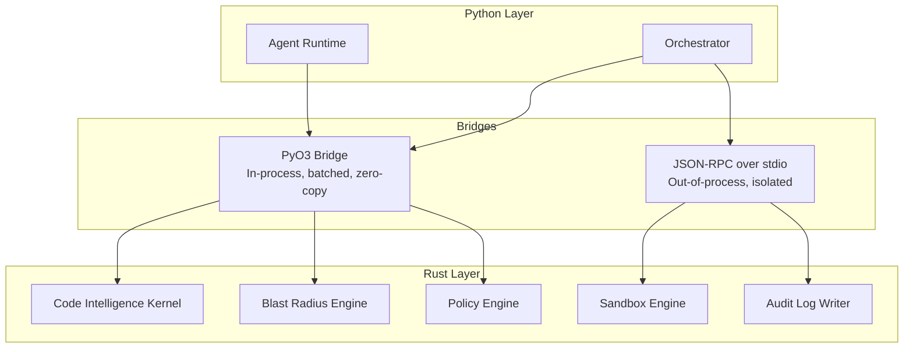
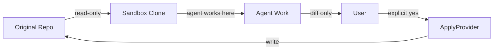
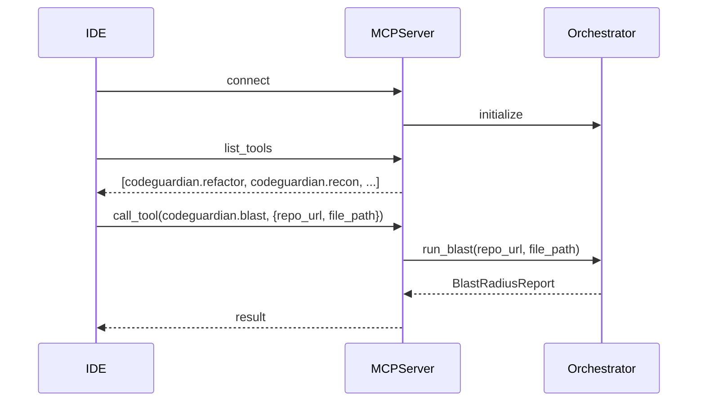

# 06 — API and Interface Contracts

---

## 1. Purpose

This document defines how every component of CodeGuardian talks to every other component, and how the outside world talks to CodeGuardian. It covers internal interfaces between Python and Rust, external interfaces for repository providers and model providers, the plugin contract system, the MCP client and server surfaces, and the CLI.

If `04-architecture.md` says what the components are, this document says exactly how they communicate. Every interface is a stable contract. Every payload has a schema. Every error has a code. Every interface is versioned.

---

## 2. Contract Design Principles

| # | Principle | Consequence |
|---|---|---|
| **C1** | **Contract-first.** | Interfaces are defined before implementations. Implementations conform to the contract, not the other way around. |
| **C2** | **Schema-validated.** | Every request and response payload validates against a JSON Schema. Invalid payloads are rejected at the boundary. |
| **C3** | **Versioned.** | Every interface declares a version. The core supports version N and N-1. |
| **C4** | **Agent-readable.** | Every interface has a machine-readable descriptor so agents can discover and use it without human translation. |
| **C5** | **Error-explicit.** | Every interface defines its error codes, retry semantics, and failure behavior. |
| **C6** | **Isolation by bridge.** | Trusted, high-volume calls use in-process bridges. Untrusted or isolation-critical calls use out-of-process bridges. |
| **C7** | **Batched by phase.** | Cross-boundary calls are batched per phase, not per operation. |
| **C8** | **Testable.** | Every interface has a shared contract test suite that every implementation must pass. |

---

## 3. Bridge Architecture

CodeGuardian uses two bridge technologies. The choice is determined by the trust and isolation requirements of the zone.



| Bridge | Used For | Rationale |
|---|---|---|
| **PyO3** | Code Intelligence Kernel, Blast Radius Engine, Policy Engine | Trusted, high-volume, latency-sensitive. Batched calls. Zero-copy data transfer. |
| **JSON-RPC over stdio** | Sandbox Engine, Audit Log Writer | Untrusted input or tamper-evidence requirement. Must survive a Python compromise. Separate process boundary. |

---

## 4. Repository Provider Interface

The Repository Provider reads code from local, GitHub, or GitLab. It is **read-only by default**. It has no write method.

### 4.1 Interface Definition

```python
class RepositoryProvider(Protocol):
    def clone(self, url: str, dest: Path) -> Path: ...
    def read_file(self, path: str) -> str: ...
    def list_files(self, pattern: str = "**/*") -> list[str]: ...
    def get_diff(self, changes: list[Change]) -> str: ...
    def get_metadata(self) -> RepoMetadata: ...
```

### 4.2 Methods

| Method | Input | Output | Error Codes |
|---|---|---|---|
| `clone` | `url: str`, `dest: Path` | `Path` (sandbox clone path) | `REPO_CLONE_FAILED`, `REPO_AUTH_FAILED`, `REPO_NOT_FOUND` |
| `read_file` | `path: str` | `str` (file contents) | `FILE_NOT_FOUND`, `FILE_TOO_LARGE`, `FILE_BINARY` |
| `list_files` | `pattern: str` | `list[str]` | `PATTERN_INVALID` |
| `get_diff` | `changes: list[Change]` | `str` (unified diff) | `DIFF_COMPUTE_FAILED` |
| `get_metadata` | — | `RepoMetadata` | `METADATA_UNAVAILABLE` |

### 4.3 Implementations

| Provider | Protocol | Auth |
|---|---|---|
| **LocalProvider** | Filesystem | None |
| **GitHubProvider** | GitHub REST API | PAT or GitHub App token |
| **GitLabProvider** | GitLab REST API | PAT or OAuth token |

### 4.4 Read-Only Enforcement

The interface has no `write_file`, `apply_diff`, or `mutate` method. Applying changes is a separate `ApplyProvider` that requires explicit consent.



### 4.5 Apply Provider Interface

The `ApplyProvider` is separate from the `RepositoryProvider`. It is never instantiated during agent execution. It runs only after the user approves the diff.

```python
class ApplyProvider(Protocol):
    def apply(self, repo_url: str, diff: str, consent: ConsentRecord) -> ApplyResult: ...
    def rollback(self, rollback_ref: str) -> RollbackResult: ...
```

| Method | Input | Output | Error Codes |
|---|---|---|---|
| `apply` | `repo_url`, `diff`, `consent` | `ApplyResult` | `APPLY_CONFLICT`, `APPLY_AUTH_FAILED`, `APPLY_PARTIAL` |
| `rollback` | `rollback_ref` | `RollbackResult` | `ROLLBACK_FAILED`, `ROLLBACK_REF_NOT_FOUND` |

---

## 5. Model Provider Interface

The Model Provider abstracts cloud and local LLM APIs. The user chooses models per role. The system is provider-agnostic.

### 5.1 Interface Definition

```python
class ModelProvider(Protocol):
    async def complete(self, prompt: str, model: str, options: ModelOptions) -> ModelResponse: ...
    async def stream(self, prompt: str, model: str, options: ModelOptions) -> AsyncIterator[ModelChunk]: ...
    def count_tokens(self, text: str, model: str) -> int: ...
    def get_available_models(self) -> list[ModelInfo]: ...
```

### 5.2 Methods

| Method | Input | Output | Error Codes |
|---|---|---|---|
| `complete` | `prompt`, `model`, `options` | `ModelResponse` | `MODEL_UNAVAILABLE`, `MODEL_RATE_LIMITED`, `MODEL_CONTEXT_EXCEEDED`, `MODEL_AUTH_FAILED` |
| `stream` | `prompt`, `model`, `options` | `AsyncIterator[ModelChunk]` | Same as `complete` |
| `count_tokens` | `text`, `model` | `int` | `MODEL_UNKNOWN` |
| `get_available_models` | — | `list[ModelInfo]` | `PROVIDER_UNAVAILABLE` |

### 5.3 Supported Providers

| Provider | Protocol | Models |
|---|---|---|
| **AnthropicProvider** | Anthropic API | Claude family |
| **OpenAIProvider** | OpenAI API | GPT family |
| **DeepSeekProvider** | DeepSeek API | DeepSeek family |
| **OpenAICompatibleProvider** | OpenAI-compatible | Ollama, vLLM, llama.cpp, LM Studio, any OpenAI-compatible endpoint |

### 5.4 Local Model Endpoints

| Local Runtime | Default Endpoint |
|---|---|
| Ollama | `http://localhost:11434/v1` |
| vLLM | `http://localhost:8000/v1` |
| llama.cpp | `http://localhost:8080/v1` |
| LM Studio | `http://localhost:1234/v1` |

---

## 6. Sandbox Backend Interface

The Sandbox Backend abstracts the isolation technology. The same pipeline runs on any backend.

### 6.1 Interface Definition

```python
class SandboxBackend(Protocol):
    def create(self, config: SandboxConfig) -> Sandbox: ...
    def execute(self, sandbox: Sandbox, command: str, timeout: int) -> ExecutionResult: ...
    def destroy(self, sandbox: Sandbox) -> None: ...
    def supports_language(self, language: str) -> bool: ...
    def get_resource_limits(self) -> ResourceLimits: ...
```

### 6.2 Methods

| Method | Input | Output | Error Codes |
|---|---|---|---|
| `create` | `config: SandboxConfig` | `Sandbox` | `SANDBOX_CREATE_FAILED`, `SANDBOX_IMAGE_UNAVAILABLE`, `SANDBOX_QUOTA_EXCEEDED` |
| `execute` | `sandbox`, `command`, `timeout` | `ExecutionResult` | `SANDBOX_TIMEOUT`, `SANDBOX_OOM`, `SANDBOX_EXEC_FAILED` |
| `destroy` | `sandbox` | `None` | `SANDBOX_NOT_FOUND` |
| `supports_language` | `language: str` | `bool` | — |
| `get_resource_limits` | — | `ResourceLimits` | — |

### 6.3 Implementations

| Backend | Platform | Isolation Level |
|---|---|---|
| **BubblewrapBackend** | Linux | OS-level (namespaces) |
| **SeatbeltBackend** | macOS | OS-level (SBPL policy) |
| **FirecrackerBackend** | Linux (KVM) | Hardware-level (microVM) |
| **DockerBackend** | Linux, macOS, Windows | OS-level (namespaces, cgroups) |

### 6.4 Resource Limits

All backends enforce:

| Resource | Mechanism | Default |
|---|---|---|
| **Memory** | cgroups v2, rlimit, or VM quotas | 1 GiB |
| **CPU** | cgroups v2, rlimit, or VM quotas | 2 cores |
| **Processes** | cgroups v2 or rlimit | 256 |
| **Swap** | Disabled | 0 |
| **Network** | Isolated except during dependency resolution | Off |

---

## 7. Code Intelligence Kernel Interface (PyO3)

The Code Intelligence Kernel is owned by Rust and exposed to Python via PyO3. It builds and queries the Code Property Graph.

### 7.1 PyO3 Functions

```rust
#[pyfunction]
fn parse_files(paths: Vec<String>, grammar: String) -> PyResult<Vec<AstNode>> { ... }

#[pyfunction]
fn build_graph(paths: Vec<String>, options: GraphOptions) -> PyResult<GraphMetadata> { ... }

#[pyfunction]
fn update_graph(graph_path: String, changed_files: Vec<String>) -> PyResult<GraphMetadata> { ... }

#[pyfunction]
fn query_graph(graph_path: String, query: GraphQuery) -> PyResult<GraphResult> { ... }

#[pyfunction]
fn resolve_callers(graph_path: String, target: String, depth: u32) -> PyResult<CallerSet> { ... }

#[pyfunction]
fn resolve_callees(graph_path: String, target: String, depth: u32) -> PyResult<CalleeSet> { ... }
```

### 7.2 Function Contracts

| Function | Input | Output | Notes |
|---|---|---|---|
| `parse_files` | List of paths, grammar name | List of AST nodes | Batched. One call per phase. |
| `build_graph` | List of paths, graph options | Graph metadata | Full build. Batched. |
| `update_graph` | Graph path, changed files | Updated graph metadata | Incremental. One call per file change. |
| `query_graph` | Graph path, query | Graph result | Batched by query type. |
| `resolve_callers` | Graph path, target, depth | Set of callers with evidence | Bounded BFS. |
| `resolve_callees` | Graph path, target, depth | Set of callees with evidence | Bounded BFS. |

**Batching rule:** Cross-boundary calls are batched per phase. `parse_files` receives a list, not a single path. `update_graph` receives a list of changed files, not one.

---

## 8. Blast Radius Engine Interface (PyO3)

The Blast Radius Engine is owned by Rust and exposed via PyO3. It computes the Blast Radius Report.

### 8.1 PyO3 Functions

```rust
#[pyfunction]
fn compute_blast_radius(graph_path: String, target: String, change_kind: String) -> PyResult<BlastRadiusReport> { ... }

#[pyfunction]
fn detect_contract_violations(graph_path: String, target: String, callers: Vec<String>) -> PyResult<Vec<ContractViolation>> { ... }

#[pyfunction]
fn identify_coverage_gaps(graph_path: String, callers: Vec<String>, test_index: String) -> PyResult<Vec<CoverageGap>> { ... }

#[pyfunction]
fn compute_blast_score(violations: Vec<ContractViolation>, gaps: Vec<CoverageGap>, caller_count: usize) -> PyResult<u8> { ... }
```

### 8.2 Function Contracts

| Function | Input | Output | Notes |
|---|---|---|---|
| `compute_blast_radius` | Graph path, target, change kind | Blast Radius Report | Batched. |
| `detect_contract_violations` | Graph path, target, callers | List of contract violations | Batched. |
| `identify_coverage_gaps` | Graph path, callers, test index | List of coverage gaps | Batched. |
| `compute_blast_score` | Violations, gaps, caller count | Score 0–100 | Deterministic. |

---

## 9. Audit Log Writer Interface (JSON-RPC)

The Audit Log Writer is owned by Rust and runs as a separate process. Communication is JSON-RPC over stdio.

### 9.1 JSON-RPC Methods

| Method | Input | Output | Notes |
|---|---|---|---|
| `audit.write` | Audit entry object | `{written: bool, entry_hash: str}` | Batched per phase. |
| `audit.verify` | Run ID | `{valid: bool, broken_at: str}` | Verifies the hash chain. |
| `audit.export` | Run ID, format | Exported log | JSONL or Markdown. |

### 9.2 Audit Entry Schema

See `05-data-model.md` §5.11 for the full schema.

---

## 10. Sandbox Engine Interface (JSON-RPC)

The Sandbox Engine is owned by Rust and runs as a separate process. Communication is JSON-RPC over stdio.

### 10.1 JSON-RPC Methods

| Method | Input | Output | Notes |
|---|---|---|---|
| `sandbox.create` | Sandbox config | `{sandbox_id: str}` | Creates or claims a sandbox. |
| `sandbox.execute` | Sandbox ID, command, timeout | `{stdout: str, stderr: str, exit_code: int}` | Runs a command. |
| `sandbox.destroy` | Sandbox ID | `{destroyed: bool}` | Destroys the sandbox. |
| `sandbox.health` | — | `{status: str, pool_size: int}` | Health check. |

---

## 11. Plugin Contracts

Every plugin type has a defined interface and a shared contract test suite. A plugin that does not pass its contract tests is rejected at load time.

### 11.1 Plugin Types

| Plugin Type | Contribution Point | Contract Test |
|---|---|---|
| **Language** | `codeguardian.languages` | `LanguagePluginContract` |
| **Provider** | `codeguardian.providers` | `RepositoryProviderContract` |
| **Tool** | `codeguardian.tools` | `ToolContract` |
| **Verifier** | `codeguardian.verifiers` | `VerifierContract` |
| **Reporter** | `codeguardian.reporters` | `ReporterContract` |
| **Sandbox** | `codeguardian.sandboxes` | `SandboxBackendContract` |

### 11.2 Language Plugin Contract

```python
class LanguagePlugin(Protocol):
    name: str
    tree_sitter_grammar: str
    test_runner: str
    refactor_rules: list[str]
    reliability_tier: str

    def detect(self, path: Path) -> bool: ...
    def parse(self, path: Path) -> AstNode: ...
    def generate_test(self, context: ContextPack) -> str: ...
    def run_tests(self, sandbox: Sandbox, test_path: str) -> TestResult: ...
```

### 11.3 Tool Plugin Contract

```python
class ToolPlugin(Protocol):
    name: str
    description: str
    input_schema: dict
    output_schema: dict

    async def call(self, input: dict) -> dict: ...
```

### 11.4 Verifier Plugin Contract

```python
class VerifierPlugin(Protocol):
    name: str
    verifier_type: str

    async def verify(self, diff: str, context: VerifierContext) -> VerifierVerdict: ...
```

### 11.5 Reporter Plugin Contract

```python
class ReporterPlugin(Protocol):
    name: str
    format: str

    def report(self, run_result: RunResult) -> str: ...
```

### 11.6 Plugin Manifest

See `05-data-model.md` §5.12 for the full schema.

---

## 12. MCP Client Interface

CodeGuardian consumes external MCP tools. It discovers tools dynamically and loads definitions progressively.

### 12.1 Client Interface

```python
class MCPClient(Protocol):
    async def discover_tools(self, server_name: str) -> list[ToolDescriptor]: ...
    async def call_tool(self, server_name: str, tool_name: str, input: dict) -> ToolResult: ...
    def list_servers(self) -> list[str]: ...
```

### 12.2 Methods

| Method | Input | Output | Error Codes |
|---|---|---|---|
| `discover_tools` | Server name | List of tool descriptors | `MCP_SERVER_UNAVAILABLE`, `MCP_PROTOCOL_ERROR` |
| `call_tool` | Server name, tool name, input | Tool result | `MCP_TOOL_NOT_FOUND`, `MCP_TOOL_TIMEOUT`, `MCP_TOOL_ERROR` |
| `list_servers` | — | List of registered server names | — |

### 12.3 Dynamic Discovery

The agent discovers available tools at runtime by querying MCP servers. It does not have a static, pre-loaded list.

**Progressive loading:** Tool definitions are loaded on first use, not at startup. This saves context and improves performance.

### 12.4 Starter Set

The following MCP tools ship with v1. This is a documented starter set, not a closed contract.

| MCP Tool | Purpose | Primary Consumer |
|---|---|---|
| **ast-grep** | Structural code search, refactoring, complexity analysis | Analyst, Writer |
| **Code Analysis** | Semantic search, dependency analysis, knowledge graphs | Analyst |
| **Code Lens** | Diff analysis, PR review, code smell detection | Verifiers |

### 12.5 MCP Server Registration

MCP servers are registered in the configuration file. Any MCP server that speaks the protocol can be added.

```toml
# config.toml
[mcp]
servers = [
  { name = "ast-grep", command = "npx", args = ["-y", "ast-grep-mcp"] },
  { name = "my-custom-tool", url = "http://localhost:3000/mcp" }
]
```

---

## 13. MCP Server Interface

CodeGuardian exposes its own capabilities as an MCP server. The MCP server starts on demand, not automatically with the CLI.

### 13.1 Transport

| Transport | Use Case | Status |
|---|---|---|
| **stdio** | Local CLI, local IDE integration | v1 |
| **Streamable HTTP** | Remote IDE, remote agent | v1 |

### 13.2 Exposed Tools

| Tool | Purpose | Input | Output |
|---|---|---|---|
| `codeguardian.refactor` | Refactor a target. | Repo URL, file path, directive. | Diff, Blast Radius Report, verification verdicts. |
| `codeguardian.recon` | Run reconnaissance. | Repo URL. | `recon.json`. |
| `codeguardian.blast` | Compute blast radius. | Repo URL, file path. | Blast Radius Report. |
| `codeguardian.verify` | Verify a diff. | Diff, test results. | Verdicts. |

### 13.3 Tool Input Schemas

#### `codeguardian.refactor`

```json
{
  "type": "object",
  "required": ["repo_url", "file_path", "directive"],
  "properties": {
    "repo_url": {"type": "string", "format": "uri"},
    "file_path": {"type": "string"},
    "directive": {"type": "string"},
    "verify": {"type": "boolean", "default": false}
  }
}
```

#### `codeguardian.recon`

```json
{
  "type": "object",
  "required": ["repo_url"],
  "properties": {
    "repo_url": {"type": "string", "format": "uri"},
    "force": {"type": "boolean", "default": false}
  }
}
```

#### `codeguardian.blast`

```json
{
  "type": "object",
  "required": ["repo_url", "file_path"],
  "properties": {
    "repo_url": {"type": "string", "format": "uri"},
    "file_path": {"type": "string"},
    "depth": {"type": "integer", "default": 10}
  }
}
```

#### `codeguardian.verify`

```json
{
  "type": "object",
  "required": ["diff", "tests"],
  "properties": {
    "diff": {"type": "string"},
    "tests": {"type": "string"},
    "verifiers": {
      "type": "array",
      "items": {"type": "string", "enum": ["correctness", "security", "contract"]}
    }
  }
}
```

### 13.4 MCP Server Lifecycle

The MCP server starts on demand, not automatically with the CLI. This keeps the default CLI lightweight.



---

## 14. CLI Surface

The CLI is the primary interface for human users.

### 14.1 Commands

| Command | Purpose | Key Flags |
|---|---|---|
| `codeguardian run` | Run the full pipeline. | `--url`, `--target`, `--directive`, `--mode`, `--verify`, `--apply`, `--dry-run` |
| `codeguardian recon` | Run reconnaissance only. | `--url`, `--force` |
| `codeguardian blast` | Compute blast radius only. | `--url`, `--target`, `--depth` |
| `codeguardian verify` | Verify a diff. | `--diff`, `--tests`, `--verifiers` |
| `codeguardian skill` | Manage the skill library. | `list`, `show`, `approve`, `reject`, `reindex` |
| `codeguardian serve` | Start the MCP server. | `--transport`, `--port` |
| `codeguardian config` | Manage configuration. | `show`, `set`, `reset` |

### 14.2 Output Modes

| Mode | Flag | Use Case |
|---|---|---|
| **Human** | (default) | Interactive terminal use. Rich panels, colors, progress bars. |
| **JSON** | `--json` | Machine parsing, scripting. |
| **SARIF** | `--sarif` | CI integration. Blast radius and verifier findings in SARIF format. |

### 14.3 Exit Codes

| Code | Meaning |
|---|---|
| **0** | Success. |
| **1** | General error. |
| **2** | Usage error. |
| **3** | Consent denied. |
| **4** | Blast radius blocked. |
| **5** | Safety net failed. |
| **6** | Verification failed. |
| **7** | Sandbox failure. |
| **8** | Model failure. |

---

## 15. Error Taxonomy

Every error has a code, a category, and a retry semantics.

### 15.1 Error Categories

| Category | Prefix | Retryable? |
|---|---|---|
| **User error** | `USER_` | No |
| **System error** | `SYS_` | Sometimes |
| **Model error** | `MODEL_` | Sometimes |
| **Sandbox error** | `SANDBOX_` | Sometimes |
| **Plugin error** | `PLUGIN_` | No |
| **Network error** | `NET_` | Yes |
| **Auth error** | `AUTH_` | No |

### 15.2 Error Response Schema

```json
{
  "type": "object",
  "required": ["code", "message", "category", "retryable"],
  "properties": {
    "code": {"type": "string"},
    "message": {"type": "string"},
    "category": {"type": "string", "enum": ["user", "system", "model", "sandbox", "plugin", "network", "auth"]},
    "retryable": {"type": "boolean"},
    "retry_after_ms": {"type": "integer"},
    "details": {"type": "object"},
    "evidence": {"type": "string"}
  }
}
```

### 15.3 Retry Semantics

| Error Category | Retry Behavior |
|---|---|
| **User** | Never retry. Report to user. |
| **System** | Retry up to 3 times with exponential backoff. |
| **Model** | Retry up to 3 times if rate-limited. Never retry if context exceeded. |
| **Sandbox** | Retry once with a fresh sandbox. |
| **Plugin** | Never retry. Disable the plugin for the run. |
| **Network** | Retry up to 5 times with exponential backoff. |
| **Auth** | Never retry. Report to user. |

---

## 16. Versioning

### 16.1 Interface Versions

Every interface declares a version. The core supports version N and N-1.

| Interface | Current Version |
|---|---|
| Repository Provider | 1.0 |
| Apply Provider | 1.0 |
| Model Provider | 1.0 |
| Sandbox Backend | 1.0 |
| Code Intelligence Kernel | 1.0 |
| Blast Radius Engine | 1.0 |
| Audit Writer | 1.0 |
| Plugin (all types) | 1.0 |
| MCP Client | 1.0 |
| MCP Server | 1.0 |
| CLI | 1.0 |

### 16.2 Compatibility Rule

The core reads version N and N-1 of every interface. Older versions are rejected with a clear error and an upgrade path.

### 16.3 Breaking Versus Non-Breaking Changes

| Change Type | Version Bump |
|---|---|
| Add optional method | Minor |
| Add required method | Major |
| Remove method | Major |
| Rename method | Major |
| Change method signature | Major |
| Change error codes | Major |

---

## 17. Contract Tests

Every interface has a shared contract test suite. Every implementation must pass it before it is accepted.

### 17.1 Contract Test Suites

| Contract | Suite | Covers |
|---|---|---|
| `RepositoryProviderContract` | `tests/contracts/repository.py` | Clone, read, list, diff, metadata, read-only enforcement |
| `ApplyProviderContract` | `tests/contracts/apply.py` | Apply, rollback, consent enforcement |
| `ModelProviderContract` | `tests/contracts/model.py` | Complete, stream, count tokens, error handling |
| `SandboxBackendContract` | `tests/contracts/sandbox.py` | Create, execute, destroy, resource limits, network isolation |
| `LanguagePluginContract` | `tests/contracts/language.py` | Detect, parse, generate test, run tests |
| `ToolPluginContract` | `tests/contracts/tool.py` | Call, input/output schema validation |
| `VerifierPluginContract` | `tests/contracts/verifier.py` | Verify, verdict shape |
| `ReporterPluginContract` | `tests/contracts/reporter.py` | Report, format validation |
| `MCPClientContract` | `tests/contracts/mcp_client.py` | Discover, call, error handling |
| `MCPServerContract` | `tests/contracts/mcp_server.py` | Tool listing, tool calling, transport |

### 17.2 Contract Test Invocation

Contract tests are invoked automatically when a plugin is loaded. A plugin that fails its contract tests is rejected with a clear error.

```
$ codeguardian plugin validate ./my-plugin
Running contract tests for language plugin...
  ✓ detect
  ✓ parse
  ✓ generate_test
  ✗ run_tests — FAILED
    Expected: TestResult with passed/failed/errored
    Got: None
Plugin validation failed: run_tests returned None
```

---

## 18. Summary of Interfaces

| Interface | Bridge | Version | Contract Test |
|---|---|---|---|
| Repository Provider | Python native | 1.0 | `RepositoryProviderContract` |
| Apply Provider | Python native | 1.0 | `ApplyProviderContract` |
| Model Provider | Python native | 1.0 | `ModelProviderContract` |
| Sandbox Backend | Python native | 1.0 | `SandboxBackendContract` |
| Code Intelligence Kernel | PyO3 | 1.0 | — |
| Blast Radius Engine | PyO3 | 1.0 | — |
| Audit Writer | JSON-RPC | 1.0 | — |
| Sandbox Engine | JSON-RPC | 1.0 | — |
| Language Plugin | Python entry point | 1.0 | `LanguagePluginContract` |
| Tool Plugin | Python entry point | 1.0 | `ToolPluginContract` |
| Verifier Plugin | Python entry point | 1.0 | `VerifierPluginContract` |
| Reporter Plugin | Python entry point | 1.0 | `ReporterPluginContract` |
| MCP Client | Python native | 1.0 | `MCPClientContract` |
| MCP Server | MCP protocol | 1.0 | `MCPServerContract` |
| CLI | Terminal | 1.0 | — |

---

## 19. Related Documents

- `04-architecture.md` — components that implement these interfaces
- `05-data-model.md` — schemas for every payload
- `07-tech-stack.md` — language and framework decisions
- `08-repository-structure.md` — where interfaces and contract tests live
- `10-testing-cicd-deployment.md` — how contract tests run in CI
- `14-model-strategy.md` — model roles and provider selection
- `15-verification-architecture.md` — verifier independence
- `16-context-engineering.md` — Context Pack construction
