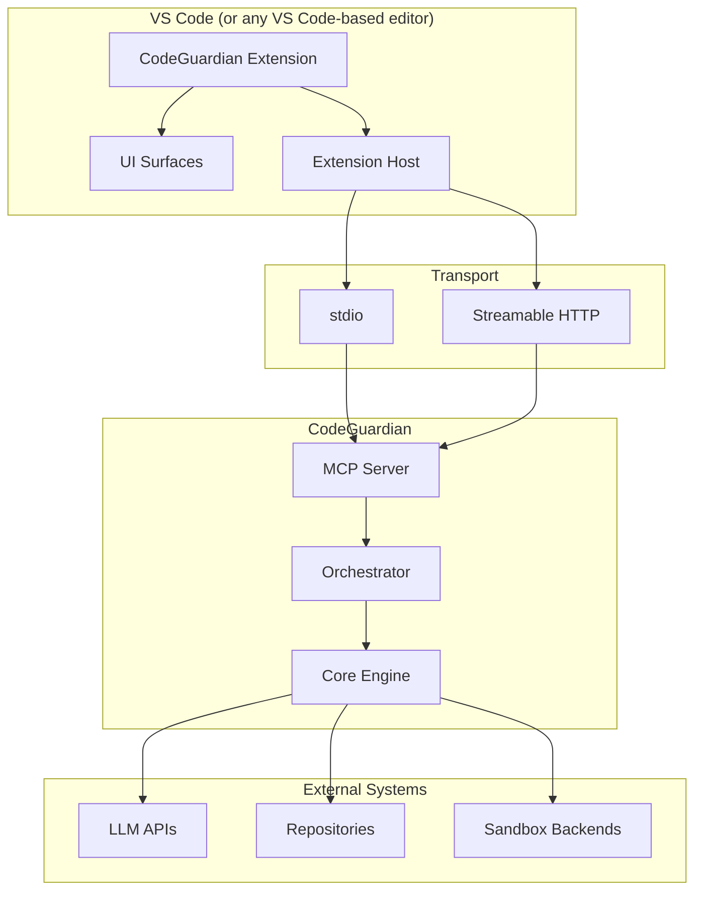
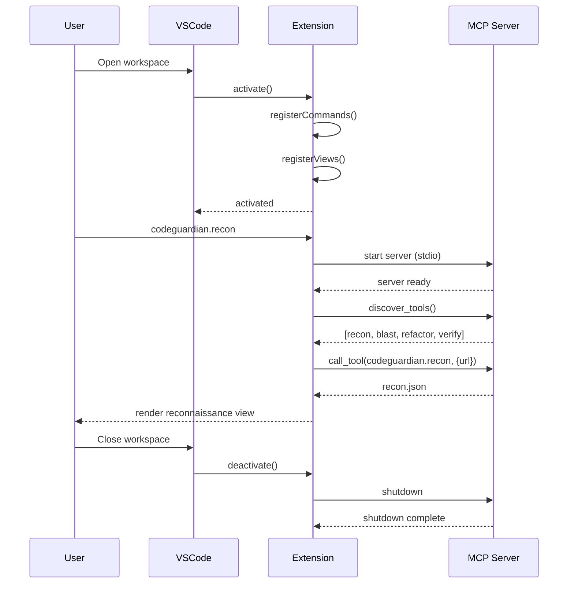
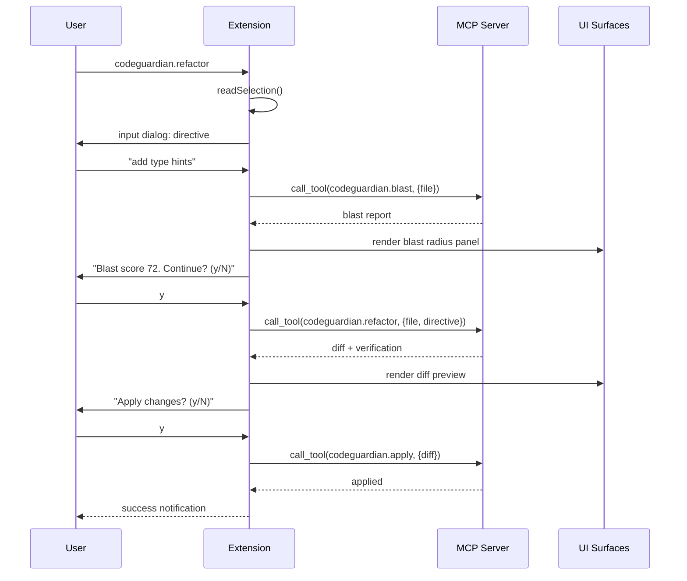
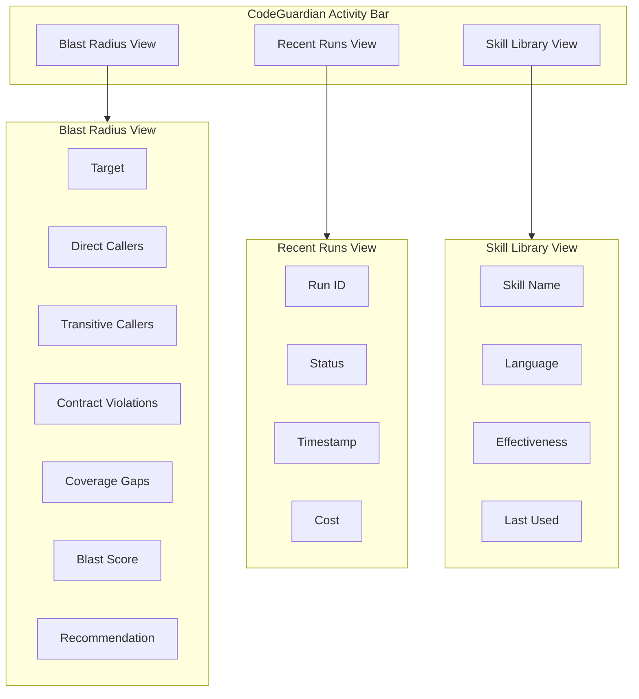
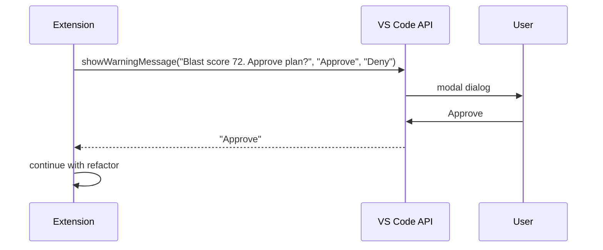
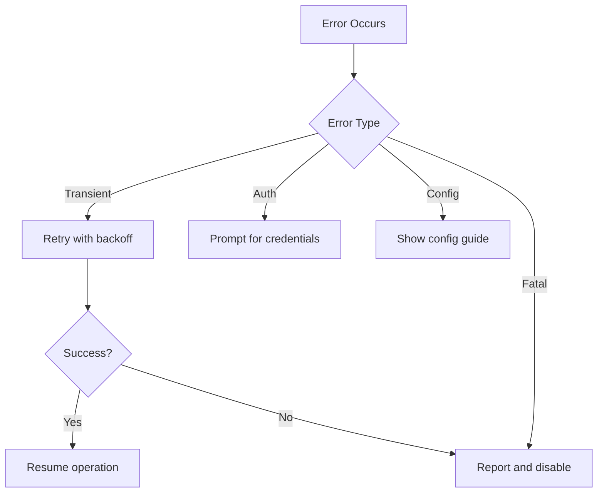
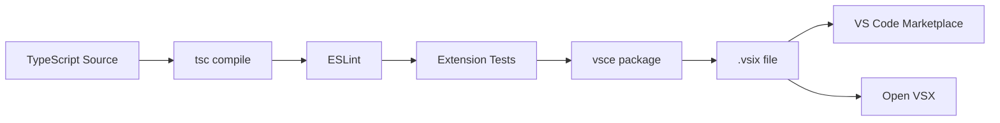
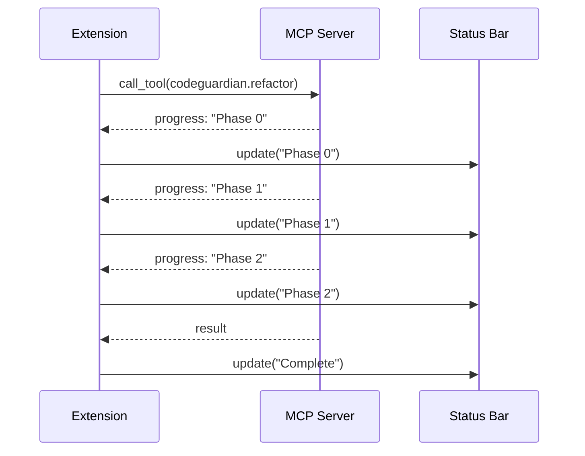

# 06.1 — VS Code Extension Contract

---

## 1. Purpose

This document defines the contract between CodeGuardian and the VS Code extension. It covers architecture, the MCP client integration, the extension manifest, commands, UI surfaces, consent flow, configuration, error handling, packaging, and testing.

The extension is a **thin client**. It does not contain refactoring logic, blast radius computation, or verification. All work happens in the CodeGuardian MCP server. The extension is the user interface.

This design means:

- The extension is small — estimated 5,000 to 10,000 lines of TypeScript.
- It works in VS Code, Cursor, Windsurf, Kiro, and any VS Code-based editor.
- It ships through the Open VSX and VS Code Marketplaces.
- It does not require forking VS Code.
- It does not require maintaining a 2-million-line codebase.

---

## 2. Architecture

The extension connects to the CodeGuardian MCP server. The server exposes tools. The extension calls them.



### 2.1 Design Principles

| # | Principle | Consequence |
|---|---|---|
| **E1** | **Thin client.** | The extension contains no business logic. It calls MCP tools and renders results. |
| **E2** | **MCP-first.** | Every capability is exposed as an MCP tool. The extension is one client among many. |
| **E3** | **Non-blocking.** | Long-running operations stream progress to the UI. The editor stays responsive. |
| **E4** | **Consent at the boundary.** | Plan approval and apply consent use native VS Code dialogs. No custom consent UI. |
| **E5** | **Portable.** | No VS Code-specific APIs beyond the public extension API. Works in any VS Code-based editor. |
| **E6** | **Fail-safe.** | If the MCP server is unavailable, the extension degrades gracefully and reports the reason. |

---

## 3. Extension Manifest

The `package.json` manifest declares the extension's identity, activation events, commands, views, and configuration.

```json
{
  "name": "codeguardian-vscode",
  "displayName": "CodeGuardian",
  "description": "Safety-first refactoring agent with blast radius analysis and independent verification.",
  "version": "1.0.0",
  "publisher": "codeguardian",
  "license": "Apache-2.0",
  "engines": {
    "vscode": "^1.90.0"
  },
  "categories": ["Other", "Linters", "Testing"],
  "keywords": ["refactoring", "ai", "agent", "mcp", "safety"],
  "activationEvents": [
    "onCommand:codeguardian.refactor",
    "onCommand:codeguardian.blast",
    "onCommand:codeguardian.recon",
    "onCommand:codeguardian.verify",
    "onCommand:codeguardian.showAudit",
    "onCommand:codeguardian.showSkills",
    "workspaceContains:.codeguardian.toml"
  ],
  "main": "./out/extension.js",
  "contributes": {
    "commands": [
      {
        "command": "codeguardian.refactor",
        "title": "CodeGuardian: Refactor Selection",
        "icon": "$(wand)"
      },
      {
        "command": "codeguardian.blast",
        "title": "CodeGuardian: Show Blast Radius",
        "icon": "$(pulse)"
      },
      {
        "command": "codeguardian.recon",
        "title": "CodeGuardian: Run Reconnaissance",
        "icon": "$(search)"
      },
      {
        "command": "codeguardian.verify",
        "title": "CodeGuardian: Verify Diff",
        "icon": "$(check)"
      },
      {
        "command": "codeguardian.showAudit",
        "title": "CodeGuardian: Show Audit Log",
        "icon": "$(history)"
      },
      {
        "command": "codeguardian.showSkills",
        "title": "CodeGuardian: Show Skill Library",
        "icon": "$(book)"
      }
    ],
    "menus": {
      "editor/context": [
        {
          "command": "codeguardian.refactor",
          "when": "editorHasSelection",
          "group": "codeguardian@1"
        },
        {
          "command": "codeguardian.blast",
          "when": "editorHasSelection",
          "group": "codeguardian@2"
        }
      ],
      "explorer/context": [
        {
          "command": "codeguardian.recon",
          "group": "codeguardian@1"
        }
      ]
    },
    "viewsContainers": {
      "activitybar": [
        {
          "id": "codeguardian",
          "title": "CodeGuardian",
          "icon": "resources/codeguardian.svg"
        }
      ]
    },
    "views": {
      "codeguardian": [
        {
          "id": "codeguardian.blastRadius",
          "name": "Blast Radius"
        },
        {
          "id": "codeguardian.runs",
          "name": "Recent Runs"
        },
        {
          "id": "codeguardian.skills",
          "name": "Skill Library"
        }
      ]
    },
    "configuration": {
      "title": "CodeGuardian",
      "properties": {
        "codeguardian.mcpServer.transport": {
          "type": "string",
          "enum": ["stdio", "http"],
          "default": "stdio",
          "description": "Transport for connecting to the CodeGuardian MCP server."
        },
        "codeguardian.mcpServer.command": {
          "type": "string",
          "default": "codeguardian",
          "description": "Command to start the MCP server when using stdio transport."
        },
        "codeguardian.mcpServer.url": {
          "type": "string",
          "default": "http://localhost:8765/mcp",
          "description": "URL of the MCP server when using HTTP transport."
        },
        "codeguardian.verification.promptOnRun": {
          "type": "boolean",
          "default": true,
          "description": "Prompt for cross-model verification on every run."
        },
        "codeguardian.blast.warnThreshold": {
          "type": "number",
          "default": 50,
          "description": "Blast score above which the extension shows a warning before refactoring."
        },
        "codeguardian.blast.blockThreshold": {
          "type": "number",
          "default": 80,
          "description": "Blast score above which the extension requires explicit override."
        },
        "codeguardian.ui.showStatusBar": {
          "type": "boolean",
          "default": true,
          "description": "Show CodeGuardian status in the status bar."
        },
        "codeguardian.ui.telemetry": {
          "type": "boolean",
          "default": false,
          "description": "Send anonymous usage telemetry."
        }
      }
    }
  },
  "scripts": {
    "vscode:prepublish": "npm run compile",
    "compile": "tsc -p ./",
    "watch": "tsc -watch -p ./",
    "test": "npm run compile && node ./out/test/runTest.js",
    "lint": "eslint src --ext ts",
    "package": "vsce package"
  },
  "devDependencies": {
    "@types/vscode": "^1.90.0",
    "@types/node": "^20.0.0",
    "typescript": "^5.4.0",
    "eslint": "^9.0.0",
    "@vscode/test-electron": "^2.4.0",
    "vsce": "^2.0.0"
  },
  "dependencies": {
    "@modelcontextprotocol/sdk": "^1.0.0"
  }
}
```

---

## 4. Activation and Lifecycle

### 4.1 Activation

The extension activates when:

- The user runs any CodeGuardian command.
- The workspace contains a `.codeguardian.toml` file.
- The user opens the CodeGuardian activity bar view.

Activation is **lazy**. The extension does not start the MCP server until the first command is invoked.

### 4.2 Lifecycle



### 4.3 Server Lifecycle Management

| Event | Extension Behavior |
|---|---|
| **First command** | Start the MCP server. |
| **Server crash** | Report the error. Offer to restart. |
| **Server unavailable** | Show a notification. Disable commands that require the server. |
| **Workspace close** | Shut down the server gracefully. |
| **Extension deactivate** | Shut down the server. Release all resources. |

---

## 5. MCP Client Integration

The extension uses the Model Context Protocol to talk to the CodeGuardian server.

### 5.1 Client Setup

```typescript
import { Client } from "@modelcontextprotocol/sdk/client/index.js";
import { StdioClientTransport } from "@modelcontextprotocol/sdk/client/stdio.js";
import { StreamableHTTPClientTransport } from "@modelcontextprotocol/sdk/client/streamableHttp.js";

async function connectToServer(config: ExtensionConfig): Promise<Client> {
    const transport = config.transport === "stdio"
        ? new StdioClientTransport({
            command: config.command,
            args: ["serve", "--transport", "stdio"],
        })
        : new StreamableHTTPClientTransport(new URL(config.url));

    const client = new Client(
        { name: "codeguardian-vscode", version: "1.0.0" },
        { capabilities: {} }
    );

    await client.connect(transport);
    return client;
}
```

### 5.2 Dynamic Tool Discovery

The extension discovers tools at connection time. It does not hardcode the tool list.

```typescript
const tools = await client.listTools();
// tools contains: codeguardian.refactor, codeguardian.recon,
//                 codeguardian.blast, codeguardian.verify
```

### 5.3 Tool Invocation

```typescript
async function runBlast(client: Client, repoUrl: string, filePath: string) {
    const result = await client.callTool({
        name: "codeguardian.blast",
        arguments: { repo_url: repoUrl, file_path: filePath },
    });
    return result;
}
```

### 5.4 Progress Streaming

Long-running tools stream progress notifications. The extension subscribes to them and updates the UI.

```typescript
client.setNotificationHandler("notifications/progress", (notification) => {
    updateProgressUI(notification.params);
});
```

---

## 6. Commands

Every command maps to an MCP tool call or a local UI action.

### 6.1 `codeguardian.refactor`

**Trigger:** Right-click on a selection, or Command Palette.

**Flow:**



### 6.2 `codeguardian.blast`

**Trigger:** Right-click on a selection, or Command Palette.

**Flow:**

1. Read the selected symbol.
2. Call `codeguardian.blast`.
3. Render the Blast Radius Report in the sidebar panel.

### 6.3 `codeguardian.recon`

**Trigger:** Right-click on the explorer, or Command Palette.

**Flow:**

1. Read the repository URL from the workspace.
2. Call `codeguardian.recon`.
3. Render the reconnaissance summary in a webview panel.

### 6.4 `codeguardian.verify`

**Trigger:** Command Palette.

**Flow:**

1. Read the diff from the active editor.
2. Call `codeguardian.verify`.
3. Render the verification verdicts.

### 6.5 `codeguardian.showAudit`

**Trigger:** Command Palette.

**Flow:**

1. Read the audit log from the current run.
2. Render the entries in a webview panel.

### 6.6 `codeguardian.showSkills`

**Trigger:** Command Palette.

**Flow:**

1. Read the skill library.
2. Render the skills in the sidebar view.

---

## 7. UI Surfaces

### 7.1 Sidebar Panels

Three views in the CodeGuardian activity bar.



### 7.2 Webview Panels

For rich content, the extension uses webview panels.

| Panel | Purpose | Content |
|---|---|---|
| **Blast Radius Detail** | Full blast radius report | Interactive graph, contract violations, coverage gaps |
| **Diff Preview** | Diff with verification overlay | Side-by-side diff, verdict badges per hunk |
| **Audit Log** | Full audit trail | Table of entries, hash chain status |
| **Recon Summary** | Full reconnaissance output | Languages, frameworks, truth report, drift report |

### 7.3 Status Bar

A status bar item shows the current CodeGuardian state.

| State | Icon | Tooltip |
|---|---|---|
| **Idle** | `$(check)` | CodeGuardian: Ready |
| **Running** | `$(sync~spin)` | CodeGuardian: Running phase X |
| **Warning** | `$(warning)` | CodeGuardian: Blast score above threshold |
| **Error** | `$(error)` | CodeGuardian: Error — click for details |

### 7.4 Notifications

The extension uses VS Code's native notification API.

| Event | Notification Type | Action |
|---|---|---|
| **Run complete** | Information | "View Diff" |
| **Blast score high** | Warning | "Show Blast Radius" |
| **Consent required** | Modal | "Approve" / "Deny" |
| **Server unavailable** | Error | "Retry" |

### 7.5 Consent Flow

Plan approval and apply consent use VS Code's native modal dialogs. No custom consent UI.



---

## 8. Configuration

### 8.1 Extension Settings

All settings are under the `codeguardian.*` namespace. They are declared in `package.json` and read at runtime.

| Setting | Type | Default | Purpose |
|---|---|---|---|
| `codeguardian.mcpServer.transport` | enum | `stdio` | Transport for the MCP server. |
| `codeguardian.mcpServer.command` | string | `codeguardian` | Command for stdio transport. |
| `codeguardian.mcpServer.url` | string | `http://localhost:8765/mcp` | URL for HTTP transport. |
| `codeguardian.verification.promptOnRun` | boolean | `true` | Prompt for cross-model verification. |
| `codeguardian.blast.warnThreshold` | number | `50` | Warn above this blast score. |
| `codeguardian.blast.blockThreshold` | number | `80` | Block above this blast score. |
| `codeguardian.ui.showStatusBar` | boolean | `true` | Show the status bar item. |
| `codeguardian.ui.telemetry` | boolean | `false` | Send anonymous telemetry. |

### 8.2 Workspace Configuration

The extension reads the workspace's `.codeguardian.toml` if it exists. This file is the same one the CLI uses.

```toml
# .codeguardian.toml (in the workspace root)

[general]
mode = "legacy"

[models.writer]
provider = "anthropic"
model = "claude-opus-5.5"

[exclusions]
patterns = ["docs/generated/"]
```

### 8.3 Server Discovery

The extension resolves the server command in this order:

1. The `codeguardian.mcpServer.command` setting.
2. The `codeguardian` binary on `PATH`.
3. The `python -m codeguardian` fallback.

If none are found, the extension shows an error with installation instructions.

---

## 9. Error Handling

### 9.1 Error Categories

| Category | Source | Extension Behavior |
|---|---|---|
| **Server unavailable** | MCP connection failure | Show notification with "Retry" action. Disable commands. |
| **Tool not found** | MCP discovery | Show error. Suggest updating the server. |
| **Tool timeout** | Long-running tool | Show progress. Offer to cancel. |
| **Tool error** | Server-side error | Show error message with the error code. |
| **Consent denied** | User action | Abort the operation. Log the denial. |
| **Blast block** | Blast score above threshold | Show modal. Require explicit override. |
| **Verification failed** | Verifier verdict | Show the verdicts. Offer to view the diff. |

### 9.2 Error Response Mapping

Every MCP error code maps to a user-facing message.

| Error Code | User Message |
|---|---|
| `REPO_CLONE_FAILED` | "Could not clone the repository. Check the URL and your credentials." |
| `FILE_NOT_FOUND` | "The target file was not found in the repository." |
| `SANDBOX_UNAVAILABLE` | "No sandbox backend is available. Install Bubblewrap, Docker, or another supported backend." |
| `MODEL_RATE_LIMITED` | "The model provider is rate-limiting requests. Retrying in X seconds." |
| `MODEL_CONTEXT_EXCEEDED` | "The context exceeded the model's limit. Try a smaller target." |
| `APPLY_CONFLICT` | "The diff could not be applied cleanly. The repository may have changed." |

### 9.3 Recovery



---

## 10. Packaging and Distribution

### 10.1 Build Output

```
codeguardian-vscode/
├── src/                         # TypeScript source
├── out/                         # Compiled JavaScript
├── resources/                   # Icons, SVGs
├── package.json                 # Manifest
├── tsconfig.json
├── .vscodeignore                # Files excluded from the package
├── README.md
├── CHANGELOG.md
├── LICENSE
└── codeguardian-vscode-1.0.0.vsix   # Built package
```

### 10.2 Publishing Targets

| Registry | Purpose |
|---|---|
| **VS Code Marketplace** | Primary distribution. |
| **Open VSX** | Distribution for editors that use Open VSX (VSCodium, Gitpod, Theia, etc.). |

### 10.3 Build and Publish Pipeline



### 10.4 Versioning

The extension version follows semantic versioning. It is independent of the CodeGuardian core version, but the extension declares a minimum compatible core version.

```json
{
  "codeguardian": {
    "minCoreVersion": "1.0.0",
    "maxCoreVersion": "2.0.0"
  }
}
```

---

## 11. Testing

### 11.1 Test Types

| Test Type | Location | What It Tests |
|---|---|---|
| **Unit** | `src/test/unit/` | Commands, config, MCP client wrapper. |
| **Integration** | `src/test/integration/` | Extension activation, command execution, MCP communication. |
| **E2E** | `src/test/e2e/` | Full flow in a real VS Code instance. |

### 11.2 Test Framework

The extension uses `@vscode/test-electron` for running tests in a real VS Code instance.

```typescript
import * as vscode from "vscode";
import * as assert from "assert";

suite("CodeGuardian Extension", () => {
    test("activates on command", async () => {
        await vscode.commands.executeCommand("codeguardian.recon");
        assert.ok(true);
    });

    test("connects to MCP server", async () => {
        const client = await connectToServer(defaultConfig);
        const tools = await client.listTools();
        assert.ok(tools.tools.length > 0);
    });
});
```

### 11.3 CI Matrix

| Platform | VS Code Version |
|---|---|
| Linux | Stable, Insiders |
| macOS | Stable |
| Windows | Stable |

---

## 12. Security

| Concern | Mitigation |
|---|---|
| **Malicious MCP server** | The extension connects only to the configured server. The command is validated. |
| **Credential leakage** | The extension never reads API keys. All credentials are managed by the CLI's OS keychain integration. |
| **Webview content injection** | All webview content is sanitized. No remote scripts. |
| **Workspace trust** | In untrusted workspaces, the extension disables all commands that execute code. |
| **Telemetry** | Disabled by default. When enabled, only anonymous usage counts are sent. No code, no file paths, no repository URLs. |

### 12.1 Workspace Trust

When the workspace is untrusted:

- `codeguardian.refactor` is disabled.
- `codeguardian.recon` is disabled.
- `codeguardian.blast` is disabled.
- `codeguardian.verify` is disabled.
- `codeguardian.showAudit` and `codeguardian.showSkills` remain enabled (read-only).

---

## 13. Performance

| Concern | Target | Implementation |
|---|---|---|
| **Activation time** | < 100 ms | Lazy activation. No work at startup. |
| **Server connection** | < 500 ms | Warm connection. Reused across commands. |
| **Tool discovery** | < 200 ms | Cached after first call. |
| **Blast radius render** | < 100 ms | Incremental rendering. |
| **Diff render** | < 200 ms | Virtualized diff for large files. |
| **Memory footprint** | < 50 MB | Streaming responses, no large buffers. |

### 13.1 Streaming

Long-running operations stream progress. The editor stays responsive.



---

## 14. Internationalization

The extension supports localization through VS Code's `l10n` API.

| String Category | Location |
|---|---|
| **Command titles** | `package.nls.json` |
| **Settings descriptions** | `package.nls.json` |
| **Runtime messages** | `l10n/bundle.l10n.<locale>.json` |

Initial locales: English. Additional locales are added on demand.

---

## 15. Accessibility

| Requirement | Implementation |
|---|---|
| **Keyboard navigation** | All commands are accessible via the Command Palette. |
| **Screen reader support** | All webview content uses semantic HTML with ARIA labels. |
| **High contrast** | All UI uses VS Code theme tokens. No hardcoded colors. |
| **Focus management** | Focus moves logically between panels and dialogs. |

---

## 16. Related Documents

- `04-architecture.md` — MCP server design that the extension consumes
- `06-api-contracts.md` — MCP tool schemas
- `07-tech-stack.md` — technology decisions
- `08-repository-structure.md` — where the extension lives in the repository
- `11-security-performance-observability.md` — security model
- `14-model-strategy.md` — model roles
