# 07 — Tech Stack

---

## 1. Purpose

This document defines every technology used in CodeGuardian, why it was chosen, and what was rejected. It also defines the **modular development workflow**: how each module is built, tested in isolation, and integrated only after it passes its contract tests.

Every choice here is traceable to a requirement in `03-requirements.md` or a principle in `04-architecture.md`.

---

## 2. Decision Principles

| # | Principle | Consequence |
|---|---|---|
| **T1** | **Language follows property.** | Rust where memory safety, determinism, and speed are required. Python where AI ecosystem and iteration speed are required. |
| **T2** | **Interfaces before implementations.** | Every module is defined by an abstract interface. Concrete implementations are swappable. |
| **T3** | **Test in isolation, integrate after.** | A module is not integrated until it passes its contract tests. |
| **T4** | **No lock-in.** | No single vendor, framework, or runtime is required. Every layer is replaceable. |
| **T5** | **Bridge at the property boundary.** | In-process for trusted, high-volume calls. Out-of-process for untrusted or isolation-critical calls. |

---

## 3. The Overall Architecture

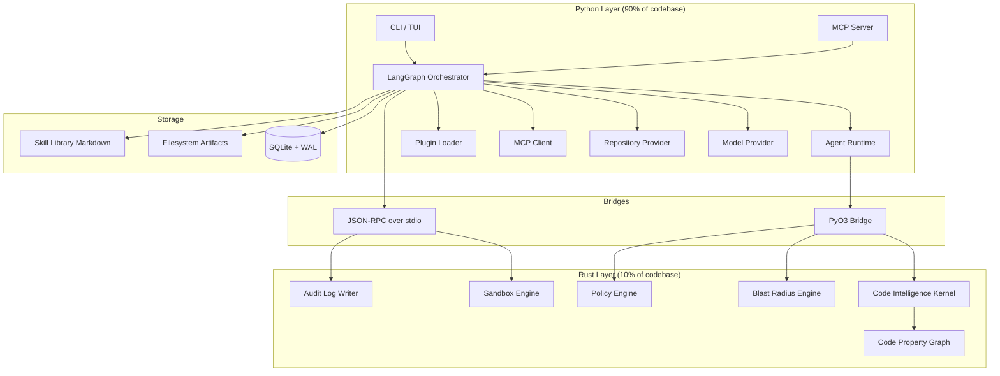

---

## 4. The Language Boundary

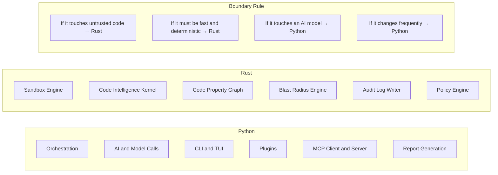

| Layer | Language | What It Owns | Why |
|---|---|---|---|
| **AI and orchestration** | Python | Orchestrator, agent runtime, model calls, CLI, plugin loading, MCP client and server, report generation | The AI ecosystem is Python-first. Iteration speed matters more than raw execution speed at this layer. |
| **Safety and performance** | Rust | Sandbox engine, Code Intelligence Kernel, Code Property Graph, Blast Radius Engine, audit log writer, policy engine | Memory safety, deterministic behavior, and speed are required where untrusted code is parsed or executed. |

**The boundary rule:**

- If it touches untrusted code, or must be fast and deterministic → **Rust**.
- If it touches an AI model, or changes frequently → **Python**.

---

## 5. The Bridge Architecture

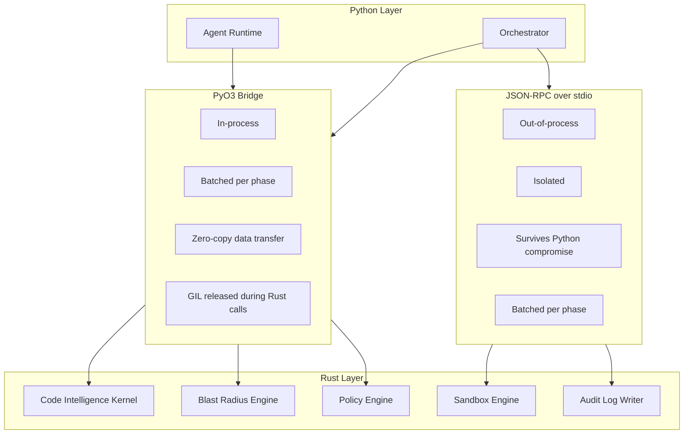

| Bridge | Used For | Rationale |
|---|---|---|
| **PyO3** | Code Intelligence Kernel, Blast Radius Engine, Policy Engine | Trusted, high-volume, latency-sensitive. Batched calls. Zero-copy data transfer. The Rust parser runs concurrently with Python model calls because the GIL is released. |
| **JSON-RPC over stdio** | Sandbox Engine, Audit Log Writer | Untrusted input or tamper-evidence requirement. Must survive a Python compromise. Separate process boundary. |

**Why both:** PyO3 is fast but in-process — a Rust panic can crash Python. JSON-RPC is slower but isolated — a crashed subprocess is detectable and restartable. The choice is determined by the zone's trust and isolation requirements.

---

## 6. Orchestration

| Component | Technology | Why |
|---|---|---|
| **Orchestrator** | LangGraph, behind an abstract `Orchestrator` interface | LangGraph provides durable execution, per-phase subgraphs, human-in-the-loop interrupt points, streaming, and checkpointing. The abstract interface means LangGraph can be replaced without changing the core. |
| **Observability** | LangSmith | Framework-agnostic tracing. Captures LangGraph nodes, OpenAI SDK calls, Anthropic SDK calls, and custom Python uniformly. |
| **Agent execution within nodes** | OpenAI Agents SDK, Anthropic SDK, or custom Python | LangGraph orchestrates. Other frameworks execute within nodes. This gives each agent the best framework for its job without coupling the core to any single framework. |

### 6.1 Orchestration Diagram

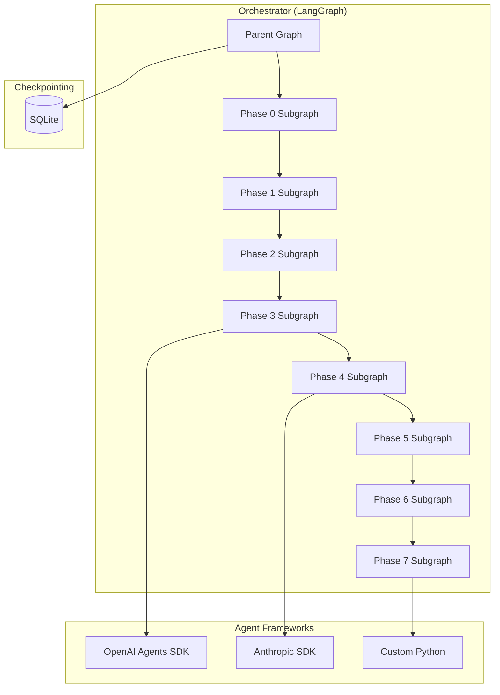

**Checkpointing:** LangGraph's checkpointer uses SQLite. A crash frees the lease and another worker continues from the last successful checkpoint. Pending writes from the failed step are preserved so successful nodes do not re-run.

---

## 7. Code Intelligence

| Component | Technology | Why |
|---|---|---|
| **Universal parser** | Tree-sitter | Supports 100+ languages with one interface. Incremental parsing: full parse is ~1–2ms per 1000 lines, incremental parse after a small edit is ~0.1–0.2ms. Parser instances are reused across files. |
| **Code Property Graph** | Binary columnar, memory-mapped (flatgraph pattern) | Merges AST, CFG, and PDG into one model. ~40% less memory and ~40% faster traversal than alternative layouts. Metadata lives in SQLite; the graph lives in the binary file. |
| **Graph construction** | Rust | The Code Intelligence Kernel is Rust-owned. It builds the graph, updates it incrementally, and exposes it to Python via PyO3. |

### 7.1 Code Intelligence Diagram

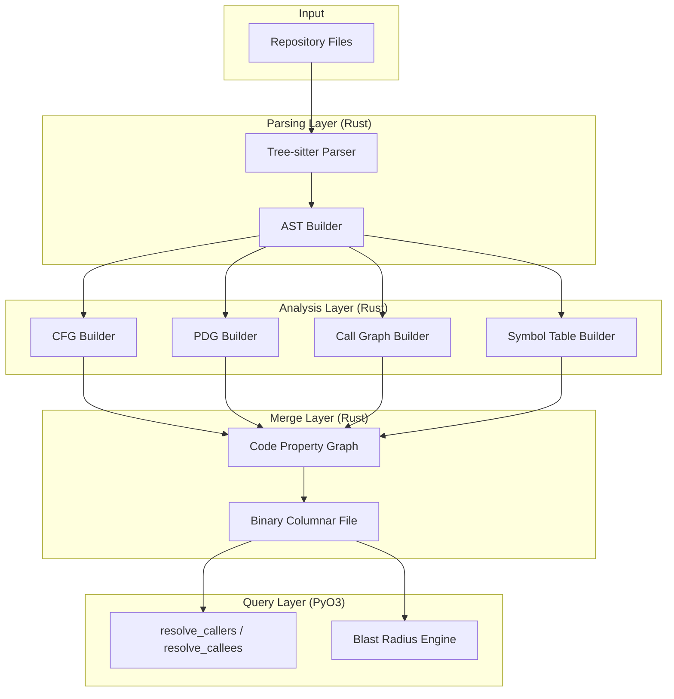

**Incremental construction:**

| Operation | Cost | When |
|---|---|---|
| Full CPG build | Minutes for large repos | First run per commit, or on cache miss |
| Incremental update | Milliseconds per changed file | After a file change |

---

## 8. Sandbox Backends

| Backend | Platform | Isolation | When Used |
|---|---|---|---|
| **Bubblewrap** | Linux | OS-level (namespaces) | Local CLI on Linux. Fast, lightweight, no daemon required. |
| **Seatbelt** | macOS | OS-level (SBPL policy) | Local CLI on macOS. |
| **Firecracker** | Linux (KVM) | Hardware-level (microVM) | Cloud or multi-tenant. Each execution gets its own kernel. |
| **Docker** | Linux, macOS, Windows | OS-level (namespaces, cgroups) | CI, Windows, or fallback when other backends are unavailable. |

### 8.1 Sandbox Architecture

```mermaid
flowchart TB
    subgraph CodeGuardian["CodeGuardian"]
        Orchestrator[Orchestrator]
        SandboxEngine[Sandbox Engine (Rust)]
    end

    subgraph Backends["Sandbox Backends"]
        B[LocalBubblewrapBackend]
        S[SeatbeltBackend]
        F[CloudFirecrackerBackend]
        D[DockerBackend]
    end

    subgraph Interface["SandboxBackend Interface"]
        I1[create]
        I2[execute]
        I3[destroy]
        I4[supports_language]
        I5[get_resource_limits]
    end

    Orchestrator --> SandboxEngine
    SandboxEngine --> Interface
    Interface --> B
    Interface --> S
    Interface --> F
    Interface --> D
```

**Resource limits enforced by all backends:**

| Resource | Mechanism | Default |
|---|---|---|
| Memory | cgroups v2, rlimit, or VM quotas | 1 GiB |
| CPU | cgroups v2, rlimit, or VM quotas | 2 cores |
| Processes | cgroups v2 or rlimit | 256 |
| Swap | Disabled | 0 |
| Network | Isolated except during dependency resolution | Off |

---

## 9. Storage

| Layer | Technology | What It Holds | Why |
|---|---|---|---|
| **Structured index** | SQLite with WAL mode | Run history, checkpoints, skills index, blast radius metadata, MCP call log | Concurrent-safe, embedded, fast reads, atomic transactions. WAL mode allows readers alongside one writer. |
| **Graph store** | Binary columnar file, memory-mapped | The Code Property Graph per repository per commit | The graph is too large for SQLite blobs. Columnar memory-mapped layout gives fast traversal and low memory usage. |
| **Immutable artifacts** | Filesystem (JSON, JSONL, Markdown) | Reconnaissance manifest, blast radius report, context packs, diffs, audit logs, summaries | Append-only, portable, human-readable. |
| **Skill source** | Filesystem (Markdown with YAML frontmatter) | The source of truth for every skill | Human-readable, editable by hand, trackable in version control. |
| **Secrets** | OS Keychain | API keys, tokens | Encrypted at OS level, never in config files. |

### 9.1 Storage Architecture

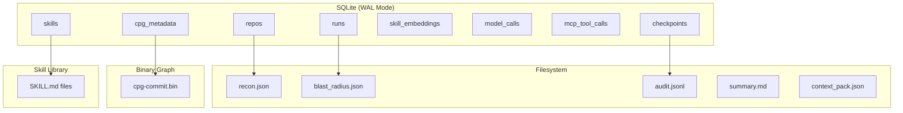

**SQLite PRAGMAs applied on every connection:**

```sql
PRAGMA journal_mode = WAL;
PRAGMA synchronous = NORMAL;
PRAGMA wal_autocheckpoint = 10000;
PRAGMA mmap_size = 268435456;
PRAGMA busy_timeout = 5000;
PRAGMA cache_size = -64000;
```

---

## 10. Model Layer

| Component | Technology | Why |
|---|---|---|
| **Cloud providers** | Anthropic, OpenAI, DeepSeek, Google, any OpenAI-compatible endpoint | Provider-agnostic. The user picks the model per role. |
| **Local models** | Ollama, vLLM, llama.cpp, LM Studio via OpenAI-compatible endpoints | No API keys required. Cost becomes electricity, not tokens. |
| **Per-role selection** | Configuration or CLI | Analyst uses a cheap model. Writer uses a frontier model. Verifiers use a different frontier model. |
| **Per-run verification prompt** | Orchestrator layer | Every run asks: "Verify with a second model? (y/N)". Default is no. |

### 10.1 Model Provider Diagram

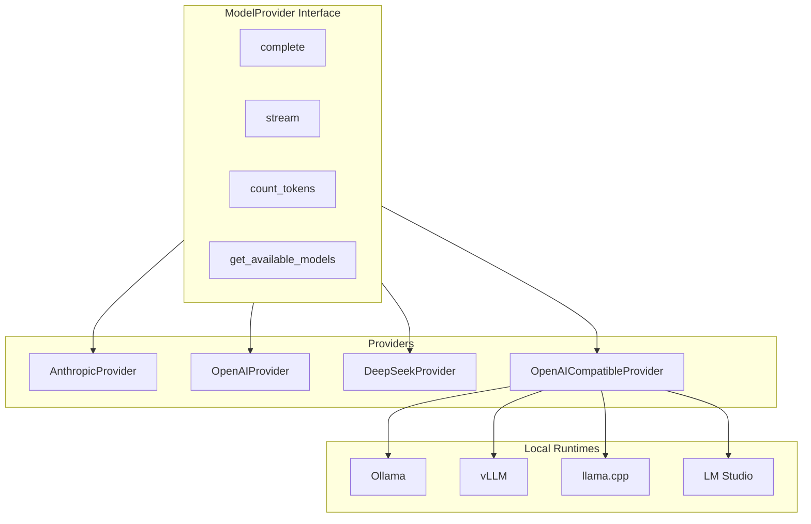

---

## 11. Plugin System

| Component | Technology | Why |
|---|---|---|
| **Plugin discovery** | Python entry points (`importlib.metadata`) | Standard mechanism. Plugins declare themselves in `pyproject.toml`. No hardcoded imports. No import cascades. Adding a plugin is a `pip install`, not a code change. |
| **Plugin contract** | Protocol classes and shared contract test suites | Every plugin type has a defined interface and a contract test. A plugin that fails is rejected at load time. |

### 11.1 Plugin Architecture Diagram

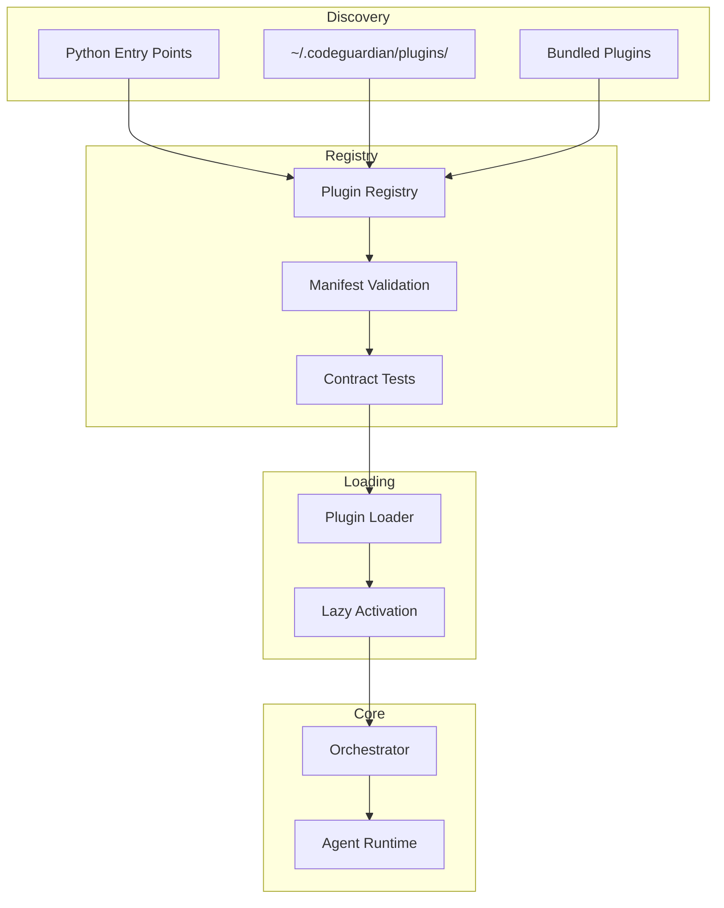

### 11.2 Plugin Types

| Plugin Type | Contribution Point | Contract Test |
|---|---|---|
| Language | `codeguardian.languages` | `LanguagePluginContract` |
| Provider | `codeguardian.providers` | `RepositoryProviderContract` |
| Tool | `codeguardian.tools` | `ToolPluginContract` |
| Verifier | `codeguardian.verifiers` | `VerifierPluginContract` |
| Reporter | `codeguardian.reporters` | `ReporterPluginContract` |
| Sandbox | `codeguardian.sandboxes` | `SandboxBackendContract` |

---

## 12. MCP Integration

| Direction | Technology | Why |
|---|---|---|
| **As client** | MCP protocol over stdio or Streamable HTTP | Consumes existing MCP tools with dynamic discovery and progressive loading. |
| **As server** | MCP protocol over stdio or Streamable HTTP | Exposes CodeGuardian's refactoring capability to IDEs, other agents, and orchestrators. |

### 12.1 MCP Architecture Diagram

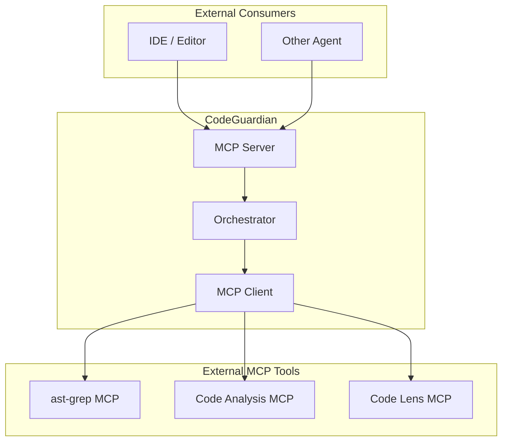

---

## 13. CLI and TUI

| Component | Technology | Why |
|---|---|---|
| **Formatted output** | Rich | Panels, markdown, syntax highlighting, progress bars. |
| **Full-screen TUI** | Textual | CSS-like styling, multi-pane dashboards, interactive exploration. |
| **Advanced input** | prompt_toolkit | History, completion, key bindings, multi-line editing. |
| **Output modes** | Human, JSON, SARIF | Human for interactive use. JSON for scripting. SARIF for CI integration. |

### 13.1 CLI Architecture Diagram

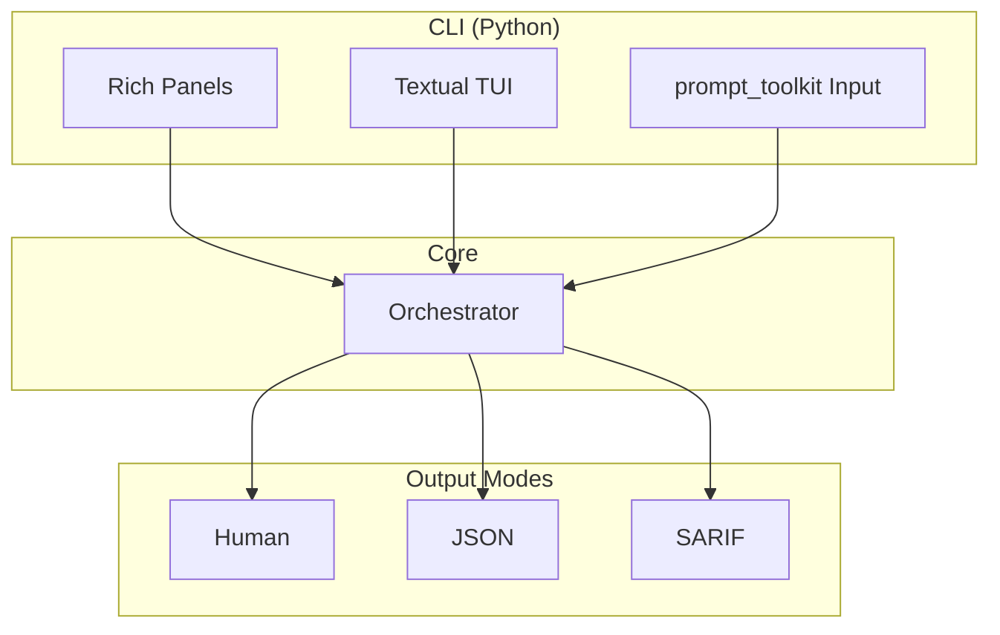

---

## 14. Testing and CI

| Layer | Technology | Why |
|---|---|---|
| **Unit tests** | pytest | Standard. Fast. Well-supported. |
| **Contract tests** | pytest + shared suites | Every interface has a shared contract test suite. Every implementation must pass it. |
| **Integration tests** | pytest + sandbox | End-to-end pipeline tests run in the sandbox. |
| **E2E tests** | pytest + real repository | Full pipeline on a curated repository. |
| **CI matrix** | Linux, macOS, Windows | The system must run on all three. |
| **Linting** | ruff (Python), clippy (Rust) | Fast, comprehensive. |
| **Type checking** | mypy (Python), rustc (Rust) | Catch type errors before runtime. |

### 14.1 Testing Architecture Diagram

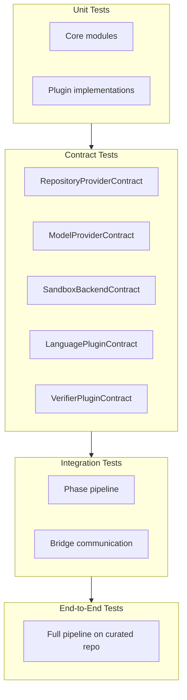

---

## 15. The Modular Development Workflow

This is the **most important section** for how you will actually build the project.

Every module follows the same workflow. No module is integrated until it passes its contract tests. No framework is adopted until its module works in isolation.

### 15.1 The Workflow

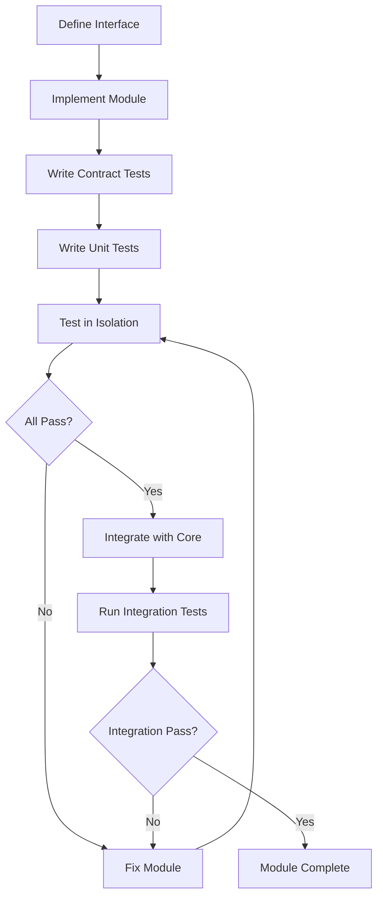

### 15.2 The Rules

| # | Rule | Consequence |
|---|---|---|
| **1** | **Define the interface first.** | Every module starts with an abstract interface (Protocol in Python, Trait in Rust). The interface is the contract. The implementation conforms to it. |
| **2** | **Implement the module in isolation.** | The module does not import the core. It imports only its own dependencies and the interface it implements. |
| **3** | **Write contract tests before integration.** | Every module has a contract test suite. The module must pass it before it is integrated. |
| **4** | **Write unit tests for the module.** | Every module has unit tests covering its own logic. |
| **5** | **Test in isolation.** | The module is tested standalone. No core dependencies. No other modules. |
| **6** | **Integrate only after passing.** | Integration happens after the module passes its contract tests and unit tests. |
| **7** | **Run integration tests.** | After integration, the module must pass the integration test suite. |
| **8** | **A module failure does not crash the core.** | Plugins are wrapped in a fault barrier. On failure, the plugin is disabled for the run and the failure is logged. |
| **9** | **A change to one module does not require changes to unrelated modules.** | Locality of change. No import cascades. No global mutable state. |

### 15.3 Example: Building the Sandbox Backend

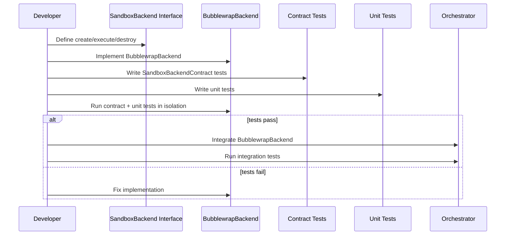

### 15.4 Example: Adding a New Language Plugin

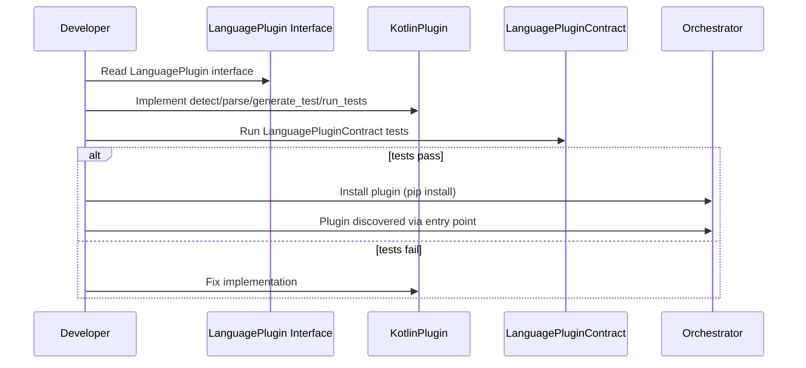

---

## 16. Summary Table

| Layer | Technology | Rationale |
|---|---|---|
| **Orchestration language** | Python | AI ecosystem is Python-first. Iteration speed matters more than raw execution speed. |
| **Safety language** | Rust | Memory safety, determinism, and speed where untrusted code is parsed or executed. |
| **In-process bridge** | PyO3 | Trusted, high-volume, latency-sensitive calls. Batched per phase. Zero-copy. |
| **Out-of-process bridge** | JSON-RPC over stdio | Untrusted input or tamper-evidence requirement. Separate process boundary. |
| **Orchestration** | LangGraph | Durable execution, per-phase subgraphs, checkpointing, human-in-the-loop. |
| **Observability** | LangSmith | Framework-agnostic tracing. |
| **Parser** | Tree-sitter | 100+ languages. Incremental parsing. Fast. |
| **Code Property Graph** | Binary columnar, memory-mapped | Merges AST, CFG, PDG. ~40% less memory, ~40% faster traversal. |
| **Local sandbox (Linux)** | Bubblewrap | Fast, lightweight, no daemon. |
| **Local sandbox (macOS)** | Seatbelt | Fast, lightweight. |
| **Cloud sandbox** | Firecracker | Hardware-level isolation. Each execution gets its own kernel. |
| **Fallback sandbox** | Docker | Portability. CI, Windows. |
| **Index** | SQLite + WAL | Concurrent-safe, embedded, atomic transactions. |
| **Audit log** | JSONL, hash-chained | Append-only, portable, tamper-evident. |
| **Skill library** | Markdown + SQLite FTS5 + sqlite-vec | Markdown is truth. SQLite and vectors are derived indexes. |
| **Model layer** | Provider-agnostic | Cloud and local via OpenAI-compatible endpoints. |
| **Plugin discovery** | Python entry points | Standard. No import cascades. No core changes. |
| **CLI** | Rich + Textual + prompt_toolkit | Human, JSON, SARIF output modes. |
| **Testing** | pytest + contract tests | Every interface has a shared contract suite. |

---

## 17. Rejected Alternatives

| Technology | Why It Was Rejected |
|---|---|
| **Go** | GC pauses drag down throughput. Staticcheck has narrower security coverage than Rust's clippy. For a security-critical sandbox and parser, Rust is the correct choice. |
| **TypeScript** | Great for full-stack, not for systems work. No agent resolves a TypeScript task in one benchmark. |
| **Java / Kotlin** | Enterprise path, but verbose, heavy runtime, not suitable for sandbox or parser hot path. |
| **C / C++** | Rust gives the same performance with memory safety. 70% of high-severity security bugs trace to memory-safety issues — Rust eliminates that class. |
| **Zig** | Promising, but ecosystem is immature. No mature PyO3 equivalent. |
| **Python-only** | The parser and sandbox need memory safety and deterministic speed. Python cannot provide this. |
| **Rust-only** | The AI ecosystem is Python-first. LangGraph, LLM SDKs, and plugin discovery are Python-native. |
| **Docker-only sandbox** | Slower than Bubblewrap (150–500ms vs 43ms). Requires a daemon. Not ideal for local CLI. |
| **Database server (Postgres)** | Overkill for a local-first tool. Requires running a service. Breaks the no-container, no-network principle. |
| **Single model provider** | The verification architecture requires cross-model independence. Locking to one provider undermines the core differentiator. |

---

## 18. Related Documents

- `03-requirements.md` — functional and non-functional requirements
- `04-architecture.md` — components that implement these technologies
- `05-data-model.md` — schemas and storage
- `06-api-contracts.md` — interfaces and contract tests
- `08-repository-structure.md` — directory layout and modularity conventions
- `10-testing-cicd-deployment.md` — testing strategy and CI pipeline
- `14-model-strategy.md` — model roles and provider selection
- `15-verification-architecture.md` — verifier independence
- `16-context-engineering.md` — Context Pack construction
