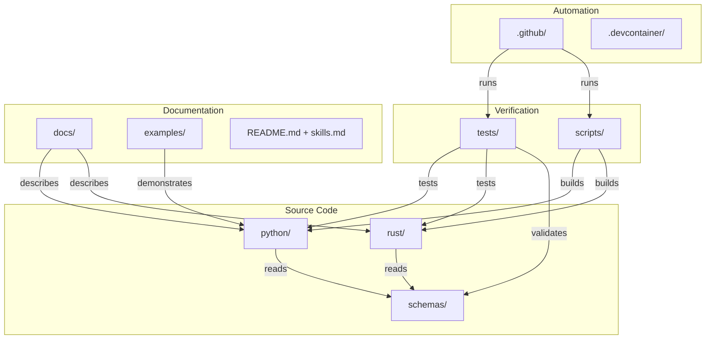
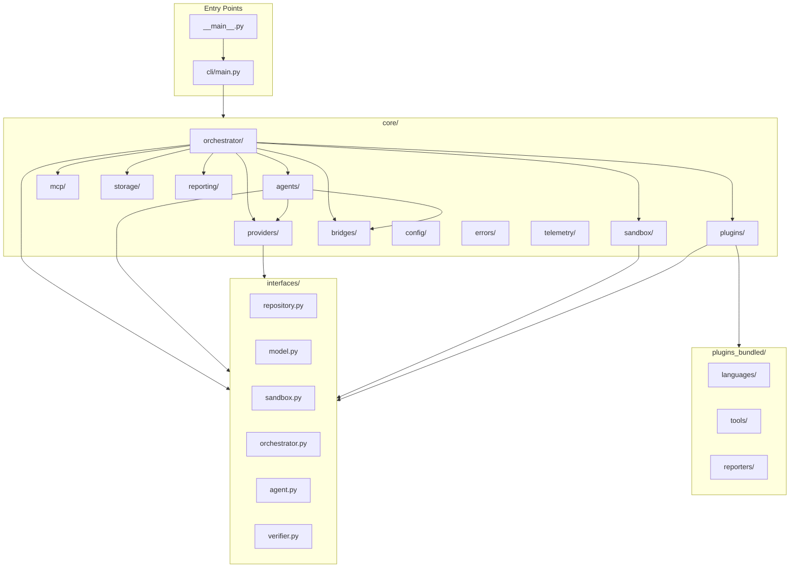
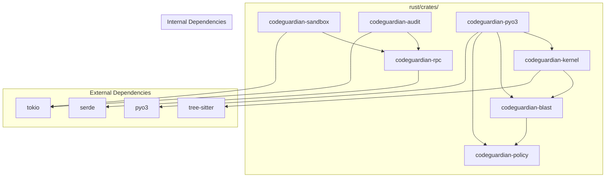
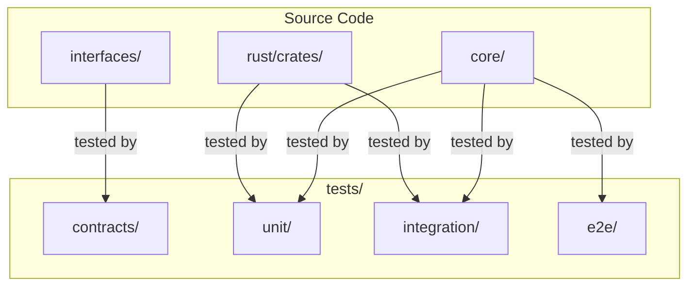
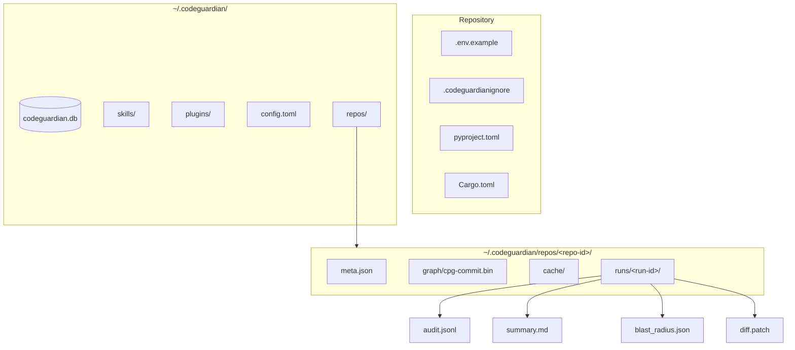
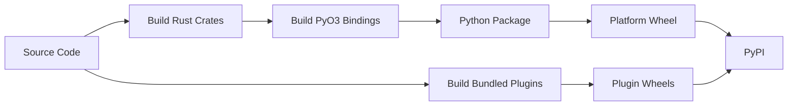

# 08 — Repository Structure

---

## 1. Purpose

This document defines the complete directory layout of the CodeGuardian repository, the naming conventions used across the codebase, and the modularity rules that keep the system maintainable. It answers three questions:

1. **Where does every file live?**
2. **What is every file named?**
3. **How do the directories relate to each other?**

Every module is tested in isolation before integration. Every interface lives in its own file. Every implementation lives in a separate directory from its interface. The core never imports a concrete plugin. A change to one module never requires a change to an unrelated module.

---

## 2. The Complete Directory Tree

```
codeguardian/
│
├── README.md                              # Project front door
├── skills.md                              # Agent operating manual
├── LICENSE                                # Apache 2.0
├── CONTRIBUTING.md                        # Contribution guide
├── CODE_OF_CONDUCT.md                     # Community guidelines
├── SECURITY.md                            # Security policy and disclosure
├── CHANGELOG.md                           # Release history
├── pyproject.toml                         # Python project metadata and dependencies
├── Cargo.toml                             # Rust workspace metadata
├── Cargo.lock                             # Rust dependency lock file
├── justfile                               # Cross-platform task runner
├── .gitignore                             # Git exclusions
├── .codeguardianignore                    # CodeGuardian's own exclusion patterns
├── .editorconfig                          # Editor consistency
├── .pre-commit-config.yaml                # Pre-commit hooks
├── .env.example                           # Environment variable template
├── .python-version                        # Python version pin
├── rust-toolchain.toml                    # Rust toolchain pin
│
├── docs/                                  # Documentation set
│   ├── 00-index.md
│   ├── 01-project-overview.md
│   ├── 02-goals-non-goals-metrics.md
│   ├── 03-requirements.md
│   ├── 04-architecture.md
│   ├── 05-data-model.md
│   ├── 06-api-contracts.md
│   ├── 07-tech-stack.md
│   ├── 08-repository-structure.md
│   ├── 09-environment-setup.md
│   ├── 10-testing-cicd-deployment.md
│   ├── 11-security-performance-observability.md
│   ├── 12-roadmap.md
│   ├── 13-risks-assumptions-decisions.md
│   ├── 14-model-strategy.md
│   ├── 15-verification-architecture.md
│   └── 16-context-engineering.md
│
├── python/                                # Python layer
│   ├── pyproject.toml                     # Package metadata
│   │
│   └── codeguardian/                      # Main Python package
│       ├── __init__.py
│       ├── __main__.py                    # Entry point for `python -m codeguardian`
│       ├── version.py                     # Version string
│       │
│       ├── interfaces/                    # Abstract interfaces (Protocols)
│       │   ├── __init__.py
│       │   ├── repository.py              # RepositoryProvider Protocol
│       │   ├── apply.py                   # ApplyProvider Protocol
│       │   ├── model.py                   # ModelProvider Protocol
│       │   ├── sandbox.py                 # SandboxBackend Protocol
│       │   ├── orchestrator.py            # Orchestrator Protocol
│       │   ├── agent.py                   # Agent Protocol
│       │   ├── tool.py                    # ToolPlugin Protocol
│       │   ├── verifier.py                # VerifierPlugin Protocol
│       │   ├── reporter.py                # ReporterPlugin Protocol
│       │   ├── language.py                # LanguagePlugin Protocol
│       │   ├── mcp_client.py              # MCPClient Protocol
│       │   └── mcp_server.py              # MCPServer Protocol
│       │
│       ├── core/                          # Core engine (never imports plugins)
│       │   ├── __init__.py
│       │   ├── orchestrator/
│       │   │   ├── __init__.py
│       │   │   ├── langgraph_orchestrator.py   # LangGraph implementation
│       │   │   ├── phase_gates.py              # Entry/exit conditions
│       │   │   ├── checkpointing.py            # Resume-from-last-checkpoint
│       │   │   ├── consent.py                  # Plan approval + apply consent
│       │   │   └── verification_prompt.py      # Per-run verification prompt
│       │   │
│       │   ├── agents/
│       │   │   ├── __init__.py
│       │   │   ├── recon.py                    # Deterministic Recon Agent
│       │   │   ├── blast.py                    # Deterministic Blast Radius Agent
│       │   │   ├── analyst.py                  # Analyst Agent
│       │   │   ├── tester.py                   # Tester Agent
│       │   │   ├── writer.py                   # Writer Agent
│       │   │   ├── correctness_verifier.py     # Correctness Verifier
│       │   │   ├── security_verifier.py        # Security Verifier
│       │   │   ├── contract_verifier.py        # Contract Verifier
│       │   │   └── skill_curator.py            # Skill Curator Agent
│       │   │
│       │   ├── providers/
│       │   │   ├── __init__.py
│       │   │   ├── local_repository.py         # LocalProvider
│       │   │   ├── github_repository.py        # GitHubProvider
│       │   │   ├── gitlab_repository.py        # GitLabProvider
│       │   │   ├── apply_provider.py           # ApplyProvider
│       │   │   ├── anthropic_model.py          # AnthropicProvider
│       │   │   ├── openai_model.py             # OpenAIProvider
│       │   │   ├── deepseek_model.py           # DeepSeekProvider
│       │   │   └── openai_compatible.py        # OpenAICompatibleProvider
│       │   │
│       │   ├── sandbox/
│       │   │   ├── __init__.py
│       │   │   ├── backend_selector.py         # Chooses backend by language/platform
│       │   │   ├── bubblewrap_backend.py       # Bubblewrap
│       │   │   ├── seatbelt_backend.py         # Seatbelt
│       │   │   ├── firecracker_backend.py      # Firecracker
│       │   │   └── docker_backend.py           # Docker
│       │   │
│       │   ├── mcp/
│       │   │   ├── __init__.py
│       │   │   ├── client.py                   # MCP client with dynamic discovery
│       │   │   ├── server.py                   # MCP server
│       │   │   ├── tools.py                    # Exposed tool definitions
│       │   │   └── transports.py               # stdio, Streamable HTTP
│       │   │
│       │   ├── plugins/
│       │   │   ├── __init__.py
│       │   │   ├── loader.py                   # Entry point discovery
│       │   │   ├── registry.py                 # Plugin registry
│       │   │   ├── manifest.py                 # Manifest validation
│       │   │   ├── fault_barrier.py            # Isolates plugin failures
│       │   │   └── versioning.py               # N and N-1 compatibility
│       │   │
│       │   ├── bridges/
│       │   │   ├── __init__.py
│       │   │   ├── pyo3_bridge.py              # Batched PyO3 calls
│       │   │   ├── jsonrpc_bridge.py           # JSON-RPC over stdio
│       │   │   └── protocol.py                 # Message schemas
│       │   │
│       │   ├── storage/
│       │   │   ├── __init__.py
│       │   │   ├── sqlite_store.py             # SQLite operations
│       │   │   ├── filesystem_store.py         # Artifact storage
│       │   │   ├── graph_store.py              # Binary CPG access
│       │   │   ├── skill_store.py              # Markdown + FTS5 + sqlite-vec
│       │   │   ├── cache.py                    # LRU and disk cache
│       │   │   ├── cleanup.py                  # Background cleanup thread
│       │   │   └── migrations.py               # Schema migrations
│       │   │
│       │   ├── reporting/
│       │   │   ├── __init__.py
│       │   │   ├── diff.py                     # Diff generation
│       │   │   ├── pr_description.py           # PR/MR description
│       │   │   ├── blast_summary.py            # Blast Radius Report summary
│       │   │   ├── run_summary.py              # AI-generated summary
│       │   │   ├── json_reporter.py            # JSON output
│       │   │   ├── sarif_reporter.py           # SARIF output
│       │   │   └── markdown_reporter.py        # Markdown output
│       │   │
│       │   ├── config/
│       │   │   ├── __init__.py
│       │   │   ├── loader.py                   # TOML config loader
│       │   │   ├── schema.py                   # Config schema
│       │   │   ├── defaults.py                 # Default values
│       │   │   └── secrets.py                  # OS keychain access
│       │   │
│       │   ├── errors/
│       │   │   ├── __init__.py
│       │   │   ├── taxonomy.py                 # Error categories
│       │   │   ├── codes.py                    # All error codes
│       │   │   ├── retry.py                    # Retry semantics
│       │   │   └── redaction.py                # Secret redaction
│       │   │
│       │   └── telemetry/
│       │       ├── __init__.py
│       │       ├── langsmith.py                # LangSmith integration
│       │       ├── metrics.py                  # Metrics collection
│       │       └── tracing.py                  # Trace correlation
│       │
│       ├── cli/                           # CLI layer
│       │   ├── __init__.py
│       │   ├── main.py                         # CLI entry point
│       │   ├── commands/
│       │   │   ├── __init__.py
│       │   │   ├── run.py                      # codeguardian run
│       │   │   ├── recon.py                    # codeguardian recon
│       │   │   ├── blast.py                    # codeguardian blast
│       │   │   ├── verify.py                   # codeguardian verify
│       │   │   ├── skill.py                    # codeguardian skill
│       │   │   ├── serve.py                    # codeguardian serve
│       │   │   └── config.py                   # codeguardian config
│       │   ├── views/
│       │   │   ├── __init__.py
│       │   │   ├── recon_view.py               # Reconnaissance dashboard
│       │   │   ├── blast_view.py               # Blast radius visualization
│       │   │   ├── plan_view.py                # Plan approval view
│       │   │   ├── diff_view.py                # Diff preview
│       │   │   └── verify_view.py              # Verification report
│       │   ├── ui/
│       │   │   ├── __init__.py
│       │   │   ├── rich_output.py              # Rich panels and formatting
│       │   │   ├── textual_app.py              # Full-screen TUI
│       │   │   ├── prompts.py                  # prompt_toolkit input
│       │   │   └── progress.py                 # Progress bars
│       │   └── output/
│       │       ├── __init__.py
│       │       ├── human.py                    # Human-readable output
│       │       ├── json.py                     # JSON output
│       │       └── sarif.py                    # SARIF output
│       │
│       └── plugins_bundled/               # Bundled plugins (optional install)
│           ├── __init__.py
│           ├── languages/
│           │   ├── __init__.py
│           │   ├── python/
│           │   │   ├── plugin.py
│           │   │   └── pyproject.toml
│           │   └── typescript/
│           │       ├── plugin.py
│           │       └── pyproject.toml
│           ├── tools/
│           │   ├── __init__.py
│           │   ├── ast_grep/
│           │   │   ├── plugin.py
│           │   │   └── pyproject.toml
│           │   └── code_analysis/
│           │       ├── plugin.py
│           │       └── pyproject.toml
│           └── reporters/
│               ├── __init__.py
│               └── sarif_reporter/
│                   ├── plugin.py
│                   └── pyproject.toml
│
├── rust/                                  # Rust layer
│   ├── Cargo.toml                         # Rust workspace
│   │
│   └── crates/
│       ├── codeguardian-kernel/           # Code Intelligence Kernel
│       │   ├── Cargo.toml
│       │   └── src/
│       │       ├── lib.rs
│       │       ├── parser.rs              # Tree-sitter integration
│       │       ├── ast.rs                 # AST builder
│       │       ├── cfg.rs                 # Control Flow Graph builder
│       │       ├── pdg.rs                 # Program Dependence Graph builder
│       │       ├── call_graph.rs          # Call graph builder
│       │       ├── symbol_table.rs        # Symbol extraction
│       │       ├── cpg.rs                 # Code Property Graph merge
│       │       ├── incremental.rs         # Incremental updates
│       │       └── query.rs               # Graph query interface
│       │
│       ├── codeguardian-blast/            # Blast Radius Engine
│       │   ├── Cargo.toml
│       │   └── src/
│       │       ├── lib.rs
│       │       ├── callers.rs             # Direct and transitive callers
│       │       ├── contracts.rs           # Contract violation detection
│       │       ├── coverage.rs            # Coverage gap identification
│       │       ├── score.rs               # Blast score computation
│       │       └── recommendation.rs      # Proceed/review/block
│       │
│       ├── codeguardian-sandbox/          # Sandbox Engine
│       │   ├── Cargo.toml
│       │   └── src/
│       │       ├── lib.rs
│       │       ├── backend.rs             # SandboxBackend trait
│       │       ├── bubblewrap.rs          # Bubblewrap backend
│       │       ├── seatbelt.rs            # Seatbelt backend
│       │       ├── firecracker.rs         # Firecracker backend
│       │       ├── docker.rs              # Docker backend
│       │       ├── pool.rs                # Warm container pool
│       │       ├── quotas.rs              # CPU, memory, process limits
│       │       └── network.rs             # Network isolation
│       │
│       ├── codeguardian-audit/            # Audit Log Writer
│       │   ├── Cargo.toml
│       │   └── src/
│       │       ├── lib.rs
│       │       ├── writer.rs              # Append-only writer
│       │       ├── hash_chain.rs          # Hash chain
│       │       ├── verify.rs              # Chain verification
│       │       └── export.rs              # Export formats
│       │
│       ├── codeguardian-policy/           # Policy Engine
│       │   ├── Cargo.toml
│       │   └── src/
│       │       ├── lib.rs
│       │       ├── sandbox_policy.rs      # Sandbox policy enforcement
│       │       ├── plugin_permissions.rs  # Plugin permission enforcement
│       │       └── resource_limits.rs     # Resource limit enforcement
│       │
│       ├── codeguardian-rpc/              # JSON-RPC protocol
│       │   ├── Cargo.toml
│       │   └── src/
│       │       ├── lib.rs
│       │       ├── protocol.rs            # Message schemas
│       │       ├── server.rs              # Server side
│       │       └── client.rs              # Client side
│       │
│       └── codeguardian-pyo3/             # PyO3 bindings
│           ├── Cargo.toml
│           └── src/
│               ├── lib.rs
│               ├── kernel.rs              # Kernel bindings
│               ├── blast.rs               # Blast engine bindings
│               └── policy.rs              # Policy engine bindings
│
├── tests/                                 # All tests
│   ├── __init__.py
│   ├── conftest.py                        # Shared fixtures
│   │
│   ├── contracts/                         # Contract tests for every interface
│   │   ├── __init__.py
│   │   ├── test_repository_contract.py    # RepositoryProviderContract
│   │   ├── test_apply_contract.py         # ApplyProviderContract
│   │   ├── test_model_contract.py         # ModelProviderContract
│   │   ├── test_sandbox_contract.py       # SandboxBackendContract
│   │   ├── test_language_contract.py      # LanguagePluginContract
│   │   ├── test_tool_contract.py          # ToolPluginContract
│   │   ├── test_verifier_contract.py      # VerifierPluginContract
│   │   ├── test_reporter_contract.py      # ReporterPluginContract
│   │   ├── test_mcp_client_contract.py    # MCPClientContract
│   │   └── test_mcp_server_contract.py    # MCPServerContract
│   │
│   ├── unit/                              # Unit tests
│   │   ├── __init__.py
│   │   ├── core/
│   │   │   ├── test_orchestrator.py
│   │   │   ├── test_phase_gates.py
│   │   │   ├── test_checkpointing.py
│   │   │   ├── test_consent.py
│   │   │   ├── test_agents.py
│   │   │   ├── test_providers.py
│   │   │   ├── test_storage.py
│   │   │   └── test_errors.py
│   │   ├── cli/
│   │   │   ├── test_commands.py
│   │   │   ├── test_views.py
│   │   │   └── test_output.py
│   │   └── rust/                          # Rust unit tests
│   │       ├── test_kernel.py
│   │       ├── test_blast.py
│   │       ├── test_sandbox.py
│   │       └── test_audit.py
│   │
│   ├── integration/                       # Integration tests
│   │   ├── __init__.py
│   │   ├── test_phase_pipeline.py
│   │   ├── test_pyo3_bridge.py
│   │   ├── test_jsonrpc_bridge.py
│   │   ├── test_plugin_loading.py
│   │   └── test_mcp_integration.py
│   │
│   ├── e2e/                               # End-to-end tests
│   │   ├── __init__.py
│   │   ├── test_full_pipeline.py
│   │   ├── test_legacy_refactor.py
│   │   ├── test_blast_radius.py
│   │   └── fixtures/
│   │       ├── sample_python_repo/
│   │       ├── sample_typescript_repo/
│   │       └── sample_multi_language_repo/
│   │
│   └── fixtures/                          # Shared test data
│       ├── __init__.py
│       ├── repositories.py
│       ├── models.py
│       └── sandboxes.py
│
├── scripts/                               # Development and release scripts
│   ├── build_rust.py                      # Build Rust crates
│   ├── build_pyo3.py                      # Build PyO3 bindings
│   ├── package.py                         # Package distribution
│   ├── release.py                         # Release automation
│   ├── benchmark.py                       # Performance benchmarks
│   └── migrate.py                         # Schema migration runner
│
├── schemas/                               # JSON schemas (source of truth)
│   ├── cpg.json
│   ├── runtime-contract-map.json
│   ├── recon.json
│   ├── blast-radius.json
│   ├── contract-assertions.json
│   ├── context-pack.json
│   ├── verification.json
│   ├── plan-approval.json
│   ├── consent.json
│   ├── checkpoint.json
│   ├── audit-entry.json
│   ├── plugin-manifest.json
│   ├── skill.json
│   └── run-summary.json
│
├── examples/                              # Example configurations and use cases
│   ├── configs/
│   │   ├── minimal.toml
│   │   ├── local_models.toml
│   │   ├── multi_provider.toml
│   │   └── enterprise.toml
│   └── skills/
│       ├── python-add-type-hints/
│       │   └── SKILL.md
│       └── typescript-extract-interface/
│           └── SKILL.md
│
├── .github/                               # GitHub configuration
│   ├── workflows/
│   │   ├── ci.yml                         # CI pipeline
│   │   ├── release.yml                    # Release pipeline
│   │   ├── security.yml                   # Security scanning
│   │   └── docs.yml                       # Documentation build
│   ├── ISSUE_TEMPLATE/
│   │   ├── bug_report.md
│   │   ├── feature_request.md
│   │   └── plugin_proposal.md
│   └── PULL_REQUEST_TEMPLATE.md
│
└── .devcontainer/                         # Development container
    ├── devcontainer.json
    └── Dockerfile
```

---

## 3. Directory Relationships

This diagram shows how the top-level directories depend on each other.



---

## 4. Python Layer Structure

The Python layer is organized by responsibility. Each responsibility is a separate directory. The core never imports from `plugins_bundled`.



**Rules:**

- `interfaces/` contains only Protocol definitions. No implementations.
- `core/` contains the core engine. It never imports from `plugins_bundled/`.
- `plugins_bundled/` contains optional plugins. They are loaded via entry points, exactly like third-party plugins.
- `cli/` is the only layer that talks to the user.

---

## 5. Rust Layer Structure

The Rust layer is a workspace with multiple crates. Each crate has one responsibility. The crates are compiled into a single shared library that Python loads via PyO3.



| Crate | Responsibility | Bridge |
|---|---|---|
| `codeguardian-kernel` | Tree-sitter parsing, CPG construction, incremental updates | PyO3 |
| `codeguardian-blast` | Caller resolution, contract detection, blast score | PyO3 |
| `codeguardian-sandbox` | Sandbox backends, warm pool, quotas | JSON-RPC |
| `codeguardian-audit` | Append-only log, hash chain | JSON-RPC |
| `codeguardian-policy` | Policy enforcement, permissions | PyO3 |
| `codeguardian-rpc` | JSON-RPC protocol implementation | Shared |
| `codeguardian-pyo3` | PyO3 bindings that Python imports | Bridge |

---

## 6. Test Structure

Tests mirror the source structure. Every interface has a contract test. Every module has unit tests. The pipeline has integration tests. The full system has end-to-end tests.



| Test Type | Location | What It Tests |
|---|---|---|
| **Contract** | `tests/contracts/` | Every implementation of an interface passes the shared contract suite. |
| **Unit** | `tests/unit/` | Individual modules in isolation. |
| **Integration** | `tests/integration/` | Cross-module communication, bridge protocols, plugin loading. |
| **E2E** | `tests/e2e/` | Full pipeline on a curated repository. |

---

## 7. Storage and Configuration Layout

Storage lives outside the repository, in the user's home directory. Configuration lives both in the repository (as `.example` files) and in the user's home directory.



---

## 8. Naming Conventions

### Python

| Element | Convention | Example |
|---|---|---|
| Modules | `snake_case` | `blast_radius.py` |
| Packages | `snake_case` | `codeguardian_kernel` |
| Classes | `PascalCase` | `BlastRadiusEngine` |
| Protocols | `PascalCase` ending in `Provider` or `Plugin` | `RepositoryProvider`, `LanguagePlugin` |
| Functions | `snake_case` | `compute_blast_radius` |
| Constants | `UPPER_SNAKE_CASE` | `DEFAULT_RETRY_LIMIT` |
| Private | Leading underscore | `_internal_helper` |

### Rust

| Element | Convention | Example |
|---|---|---|
| Crates | `kebab-case` | `codeguardian-kernel` |
| Modules | `snake_case` | `call_graph` |
| Types | `PascalCase` | `BlastRadiusReport` |
| Traits | `PascalCase` | `SandboxBackend` |
| Functions | `snake_case` | `compute_callers` |
| Constants | `UPPER_SNAKE_CASE` | `MAX_RETRIES` |

### Files

| Type | Convention | Example |
|---|---|---|
| Markdown docs | `NN-kebab-case.md` | `04-architecture.md` |
| JSON schemas | `kebab-case.json` | `blast-radius.json` |
| Test files | `test_<module>.py` | `test_blast_radius.py` |
| Config files | `kebab-case.toml` | `local-models.toml` |
| Skill files | `SKILL.md` in a named directory | `python-add-type-hints/SKILL.md` |

### Git

| Type | Convention | Example |
|---|---|---|
| Branch | `<type>/<short-description>` | `feat/blast-radius-engine` |
| Commit | Conventional Commits | `feat(blast): add contract violation detection` |
| Commit types | `feat`, `fix`, `docs`, `test`, `refactor`, `chore`, `perf` | — |

---

## 9. Modularity Rules

These rules are enforced by the directory structure and by lint rules.

| # | Rule | Enforcement |
|---|---|---|
| **M1** | Every interface lives in `interfaces/`. No implementation lives there. | Directory convention. CI check for implementation symbols. |
| **M2** | The core never imports from `plugins_bundled/`. | Import lint rule. CI check. |
| **M3** | Every module has a contract test in `tests/contracts/`. | CI check: every file in `interfaces/` has a matching contract test. |
| **M4** | Every module has unit tests in `tests/unit/`. | Coverage requirement. |
| **M5** | A change to one module does not require changes to unrelated modules. | Locality-of-change test. |
| **M6** | No global mutable state. | Lint rule. |
| **M7** | Every dependency is injectable. | Constructor injection pattern. Lint rule for direct imports in core. |
| **M8** | Public APIs are explicit and small. | `__all__` in Python, `pub` in Rust. |
| **M9** | Imports do not cascade. | Moving or renaming an internal module does not require edits outside it. |
| **M10** | Every schema in `schemas/` is the source of truth. | CI validates that generated types match. |

---

## 10. Where a New File Goes

| If you are adding… | It goes in… |
|---|---|
| A new interface | `python/codeguardian/interfaces/` |
| A new core module | `python/codeguardian/core/<area>/` |
| A new agent | `python/codeguardian/core/agents/` |
| A new provider | `python/codeguardian/core/providers/` |
| A new sandbox backend | `python/codeguardian/core/sandbox/` |
| A new MCP tool (consumed) | Registered in `config.toml`. No file. |
| A new MCP tool (exposed) | `python/codeguardian/core/mcp/tools.py` |
| A new bundled plugin | `python/codeguardian/plugins_bundled/<type>/<name>/` |
| A new Rust crate | `rust/crates/codeguardian-<name>/` |
| A new schema | `schemas/<name>.json` |
| A new contract test | `tests/contracts/test_<interface>_contract.py` |
| A new unit test | `tests/unit/<area>/test_<module>.py` |
| A new integration test | `tests/integration/test_<topic>.py` |
| A new e2e test | `tests/e2e/test_<scenario>.py` |
| A new skill example | `examples/skills/<skill-name>/SKILL.md` |
| A new doc | `docs/NN-<name>.md` |
| A new CI workflow | `.github/workflows/<name>.yml` |
| A new script | `scripts/<name>.py` |

---

## 11. Build and Distribution

The repository produces three distribution artifacts.

| Artifact | Built From | Distributed As |
|---|---|---|
| **Python package** | `python/codeguardian/` plus PyO3 bindings | PyPI wheel (platform-specific) |
| **Rust binaries** | `rust/crates/` | Standalone binaries for CLI-only use |
| **Bundled plugins** | `python/codeguardian/plugins_bundled/` | Separate PyPI packages, installed on demand |

**Build pipeline:**



---

## 12. Related Documents

- `04-architecture.md` — components that live in these directories
- `05-data-model.md` — schemas in `schemas/`
- `06-api-contracts.md` — interfaces in `interfaces/` and contract tests in `tests/contracts/`
- `07-tech-stack.md` — language and framework decisions
- `09-environment-setup.md` — prerequisites and setup
- `10-testing-cicd-deployment.md` — how tests run in CI
