# 08A — Module Relationships

---

## 1. Purpose

This document defines how every module in CodeGuardian connects to every other module. Where `08-repository-structure.md` says where files live, this document says how they talk to each other.

It answers one question: **"If I change X, what else is affected?"**

The document has seven sections:

1. Python module dependency graph
2. Rust crate dependency graph
3. Interface → Implementation → Contract test map
4. Agent → Data contract map
5. Phase → Component map
6. Bridge map
7. Call flow diagrams

Every relationship is at the module level or interface level. No function signatures. No line numbers. Those change too often. This document stays stable.

---

## 2. Python Module Dependency Graph

The Python layer is organized by responsibility. Dependencies flow in one direction: entry points depend on core, core depends on interfaces, core does not depend on bundled plugins.

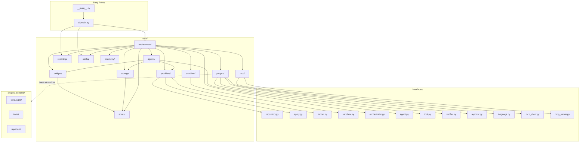

**Enforced rules:**

| Rule | What It Means |
|---|---|
| **Core never imports bundled plugins** | `core/` has zero imports from `plugins_bundled/`. Plugins are loaded at runtime via entry points. |
| **Interfaces have no dependencies** | `interfaces/` imports nothing from `core/` or `plugins_bundled/`. |
| **Bridges are the only way to Rust** | Nothing in `core/` calls Rust directly. All Rust access goes through `bridges/`. |
| **Errors is a leaf** | `errors/` imports nothing from `core/`. Everything can import from `errors/`. |
| **Config is a leaf** | `config/` imports nothing from `core/`. Everything can import from `config/`. |

### 2.1 Core Module Internal Dependencies

Inside `core/`, dependencies flow from high-level orchestration to low-level utilities.

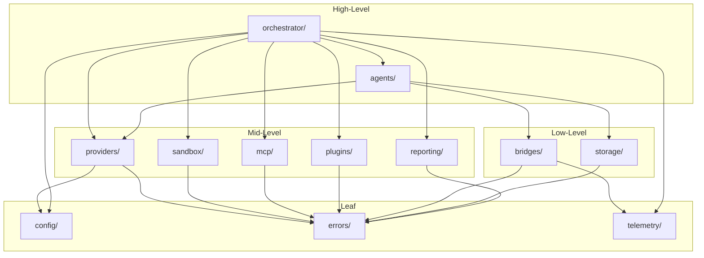

**Rule:** Dependencies flow downward. A low-level module never imports a high-level module.

---

## 3. Rust Crate Dependency Graph

The Rust layer is a workspace with seven crates. Each crate has one responsibility. Dependencies flow inward.

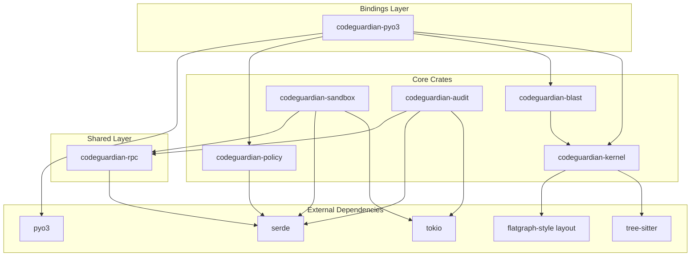

### 3.1 Crate Responsibilities

| Crate | Responsibility | Depends On | Used By |
|---|---|---|---|
| **codeguardian-kernel** | Tree-sitter parsing, CPG construction, incremental updates | tree-sitter, flatgraph layout | blast, pyo3 |
| **codeguardian-blast** | Caller resolution, contract detection, blast score | kernel | pyo3 |
| **codeguardian-sandbox** | Sandbox backends, warm pool, quotas | tokio, serde, rpc | rpc consumers |
| **codeguardian-audit** | Append-only log, hash chain | tokio, serde, rpc | rpc consumers |
| **codeguardian-policy** | Policy enforcement, permissions | serde | pyo3 |
| **codeguardian-rpc** | JSON-RPC protocol | serde | sandbox, audit |
| **codeguardian-pyo3** | PyO3 bindings | pyo3, kernel, blast, policy | Python layer |

### 3.2 Crate ↔ Python Module Mapping

| Rust Crate | Python Bridge | Python Consumer |
|---|---|---|
| codeguardian-kernel | PyO3 | `core/bridges/pyo3_bridge.py` |
| codeguardian-blast | PyO3 | `core/bridges/pyo3_bridge.py` |
| codeguardian-policy | PyO3 | `core/bridges/pyo3_bridge.py` |
| codeguardian-sandbox | JSON-RPC | `core/bridges/jsonrpc_bridge.py` |
| codeguardian-audit | JSON-RPC | `core/bridges/jsonrpc_bridge.py` |
| codeguardian-rpc | Shared protocol | Both bridges |
| codeguardian-pyo3 | Built into the Python package | Loaded at import |

---

## 4. Interface → Implementation → Contract Test Map

Every interface has at least one implementation and one contract test. This table shows the full mapping.

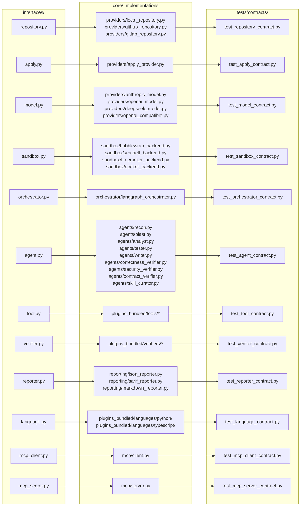

### 4.1 Full Mapping Table

| Interface | Implementations | Contract Test |
|---|---|---|
| `RepositoryProvider` | `LocalProvider`, `GitHubProvider`, `GitLabProvider` | `test_repository_contract.py` |
| `ApplyProvider` | `ApplyProvider` | `test_apply_contract.py` |
| `ModelProvider` | `AnthropicProvider`, `OpenAIProvider`, `DeepSeekProvider`, `OpenAICompatibleProvider` | `test_model_contract.py` |
| `SandboxBackend` | `BubblewrapBackend`, `SeatbeltBackend`, `FirecrackerBackend`, `DockerBackend` | `test_sandbox_contract.py` |
| `Orchestrator` | `LangGraphOrchestrator` | `test_orchestrator_contract.py` |
| `Agent` | `Recon`, `Blast`, `Analyst`, `Tester`, `Writer`, `CorrectnessVerifier`, `SecurityVerifier`, `ContractVerifier`, `SkillCurator` | `test_agent_contract.py` |
| `ToolPlugin` | Bundled tools, user-installed tools | `test_tool_contract.py` |
| `VerifierPlugin` | Bundled verifiers, user-installed verifiers | `test_verifier_contract.py` |
| `ReporterPlugin` | `JSONReporter`, `SARIFReporter`, `MarkdownReporter` | `test_reporter_contract.py` |
| `LanguagePlugin` | `PythonPlugin`, `TypeScriptPlugin`, user-installed plugins | `test_language_contract.py` |
| `MCPClient` | `MCPClient` | `test_mcp_client_contract.py` |
| `MCPServer` | `MCPServer` | `test_mcp_server_contract.py` |

**Rule:** Adding a new implementation requires it to pass the existing contract test. No exceptions. This is what keeps the plugin architecture honest.

---

## 5. Agent → Data Contract Map

Every agent reads specific schemas and produces specific schemas. This table shows the full data flow per agent.

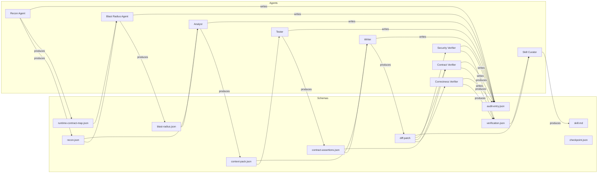

### 5.1 Agent Input/Output Table

| Agent | Reads | Produces | Writes to Audit |
|---|---|---|---|
| **Recon Agent** | Repository | `recon.json`, `runtime-contract-map.json`, CPG metadata | Yes |
| **Blast Radius Agent** | `recon.json`, `runtime-contract-map.json`, target | `blast-radius.json` | Yes |
| **Analyst** | `recon.json`, `blast-radius.json`, target | `context-pack.json` | Yes |
| **Tester** | `context-pack.json` | `contract-assertions.json`, test files | Yes |
| **Writer** | `context-pack.json`, `contract-assertions.json`, directive | `diff.patch` | Yes |
| **Correctness Verifier** | `diff.patch` only | `verification.json` (correctness) | Yes |
| **Security Verifier** | `diff.patch` only | `verification.json` (security) | Yes |
| **Contract Verifier** | `diff.patch`, `contract-assertions.json` | `verification.json` (contract) | Yes |
| **Skill Curator** | `diff.patch`, `verification.json`, run trajectory | `SKILL.md` proposals | Yes |

**Rule:** Verifiers read the diff only. They never read the original file, the Context Pack, or the Writer's reasoning. This is the independence guarantee.

---

## 6. Phase → Component Map

Each of the eight phases activates a specific set of components. Components not listed are dormant during that phase.

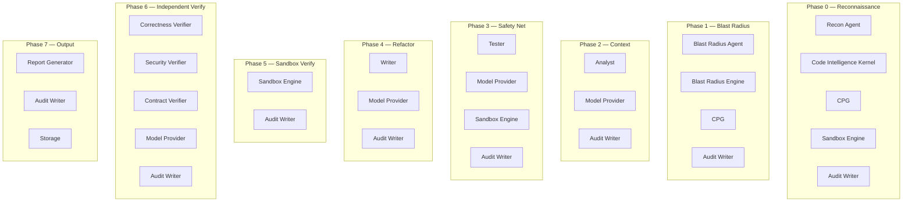

### 6.1 Full Phase Component Table

| Phase | Active Agents | Active Engines | Bridges Used |
|---|---|---|---|
| **0 — Reconnaissance** | Recon | Code Intelligence Kernel, Sandbox Engine | PyO3, JSON-RPC |
| **1 — Blast Radius** | Blast Radius | Blast Radius Engine | PyO3 |
| **2 — Context** | Analyst | — | — |
| **3 — Safety Net** | Tester | Sandbox Engine | JSON-RPC |
| **4 — Refactor** | Writer | — | — |
| **5 — Sandbox Verify** | — | Sandbox Engine | JSON-RPC |
| **6 — Independent Verify** | Correctness, Security, Contract Verifiers | — | — |
| **7 — Output** | Report Generator | — | JSON-RPC (audit) |

### 6.2 Phase Gate Enforcement

Each phase has an entry condition and an exit condition. The orchestrator enforces them.

```mermaid
flowchart LR
    P0[Phase 0] -->|recon.json + CPG| P1[Phase 1]
    P1 -->|blast-radius.json| P2[Phase 2]
    P2 -->|context-pack.json| P3[Phase 3]
    P3 -->|tests pass on old code| P4[Phase 4]
    P4 -->|diff.patch| P5[Phase 5]
    P5 -->|tests pass in sandbox| P6[Phase 6]
    P6 -->|verifier verdicts| P7[Phase 7]
    P7 -->|user consent| Apply[Apply]
```

No phase runs until the previous phase's exit condition is satisfied.

---

## 7. Bridge Map

Two bridges connect Python and Rust. The choice is determined by trust and isolation requirements.

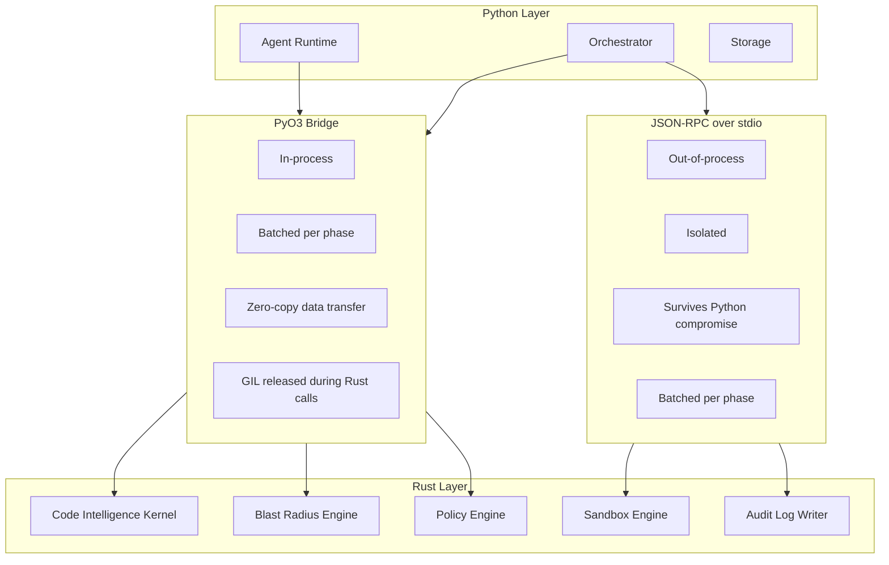

### 7.1 Bridge Selection Table

| Zone | Bridge | Why | Batching Rule |
|---|---|---|---|
| **Code Intelligence Kernel** | PyO3 | Trusted, high-volume, latency-sensitive | Batch per phase. Parse 500 files in one call, not 500 calls. |
| **Blast Radius Engine** | PyO3 | Trusted, high-volume, latency-sensitive | Batch per query type. |
| **Policy Engine** | PyO3 | Trusted, frequent calls | Batch per phase. |
| **Sandbox Engine** | JSON-RPC | Untrusted input. Must survive Python compromise. | Batch per phase. |
| **Audit Log Writer** | JSON-RPC | Tamper-evidence requires isolation. Python must not have a file handle to the log. | Batch per phase. |

### 7.2 Cross-Boundary Call Flow

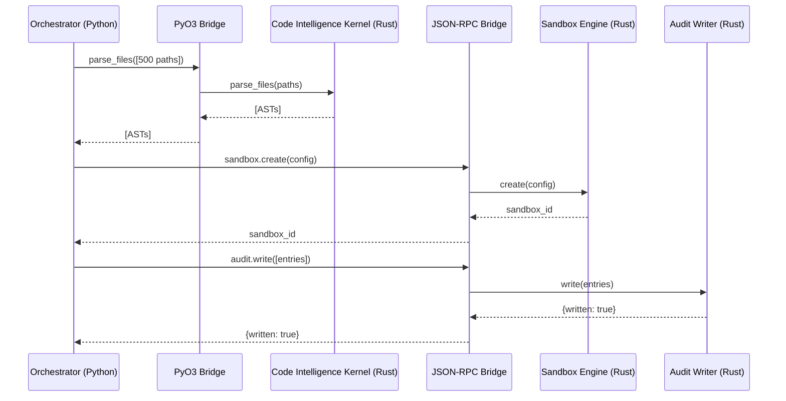

**Rule:** Cross the boundary once per phase, not once per operation.

---

## 8. Call Flow Diagrams

Four key flows. Each shows the full sequence of modules involved.

### 8.1 Reconnaissance Flow

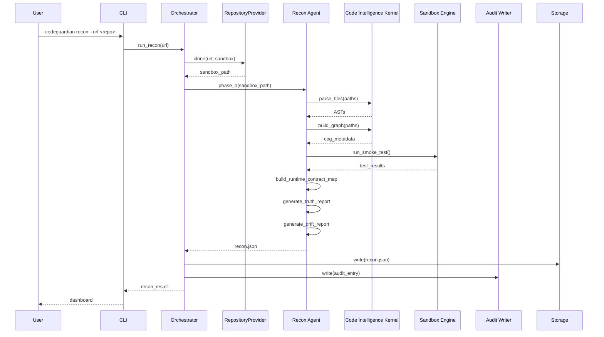

### 8.2 Blast Radius Flow

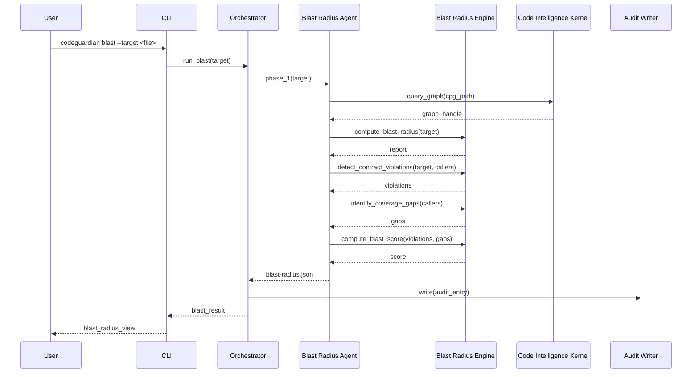

### 8.3 Refactor with Verification Flow

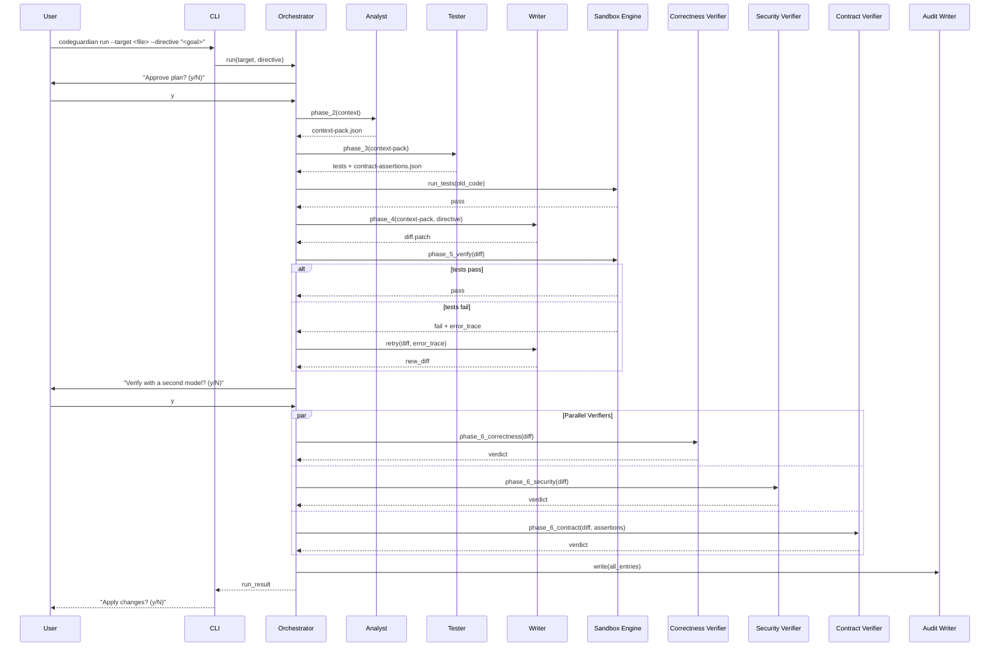

### 8.4 Apply Flow

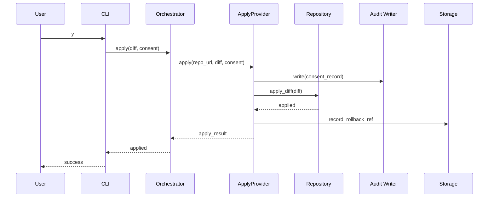

---

## 9. The "What Breaks If I Change X" Map

This table answers the question directly.

| If you change… | These modules are affected |
|---|---|
| **A schema in `schemas/`** | Every agent that reads or produces it. Every contract test that validates it. |
| **An interface in `interfaces/`** | Every implementation. Every contract test. |
| **A core module** | Modules that import it. Module-level dependency graph in §2 shows the downstream set. |
| **A Rust crate** | Crates that depend on it. Python modules that call it through a bridge. |
| **The orchestrator** | Every phase. Every agent. The CLI. |
| **A model provider** | Every agent that uses a model. The verification prompt logic. |
| **A sandbox backend** | The sandbox selector. Every phase that runs code in the sandbox. |
| **The audit writer** | Every phase. The tamper-evidence guarantee. |
| **A plugin** | Only that plugin. The core is unaffected. |
| **The verification prompt** | The orchestrator. Phase 6. |

### 9.1 Locality-of-Change Guarantee

The modularity rules from `03` and `08` ensure that:

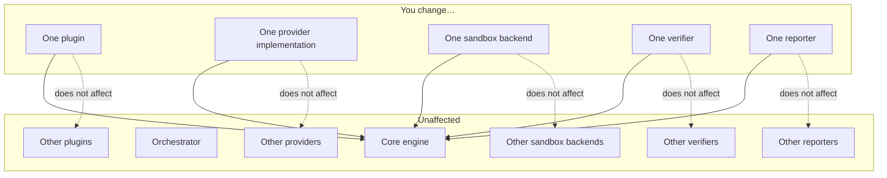

**Rule:** A change to one plugin does not require a change to the core, another plugin, or any other plugin type. This is enforced by the interface boundaries and the contract tests.

---

## 10. Related Documents

- `03-requirements.md` — modularity requirements (NFR-MT1 through MT11)
- `04-architecture.md` — components described here
- `05-data-model.md` — schemas referenced in the agent-data map
- `06-api-contracts.md` — interfaces and contract tests
- `07-tech-stack.md` — bridge technologies
- `08-repository-structure.md` — directory layout
- `10-testing-cicd-deployment.md` — how contract tests run in CI
