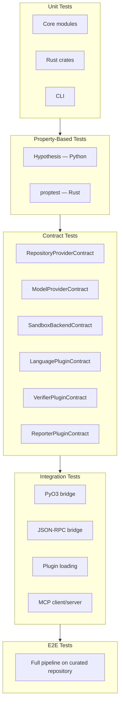
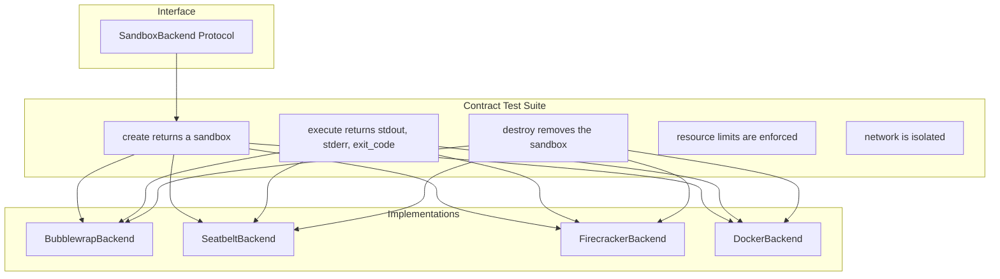
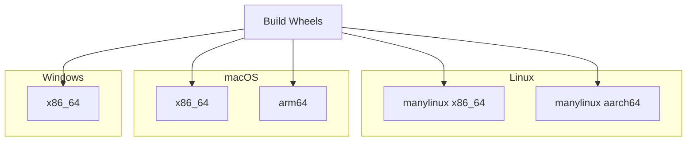
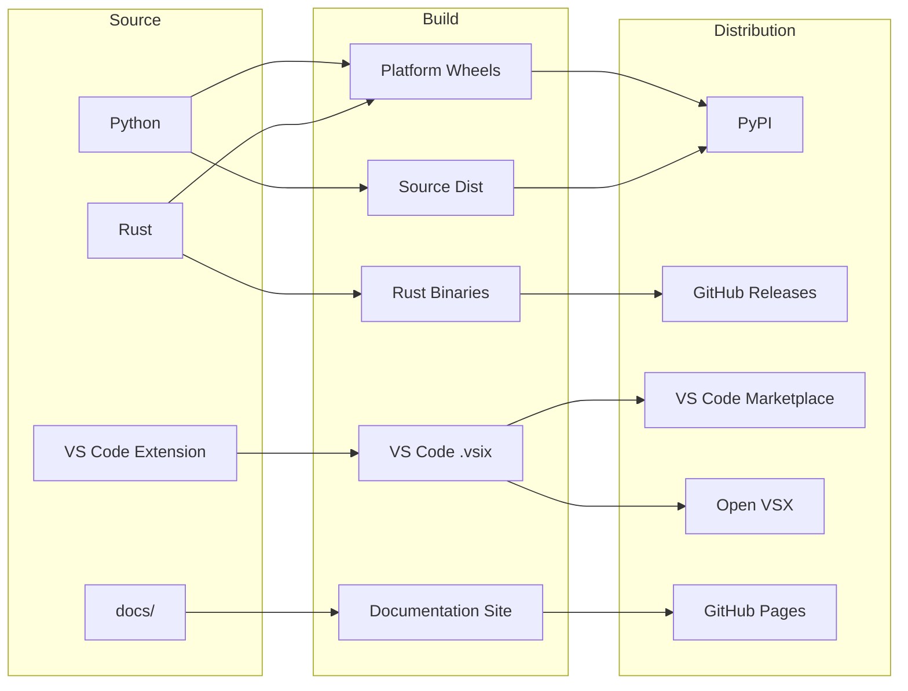
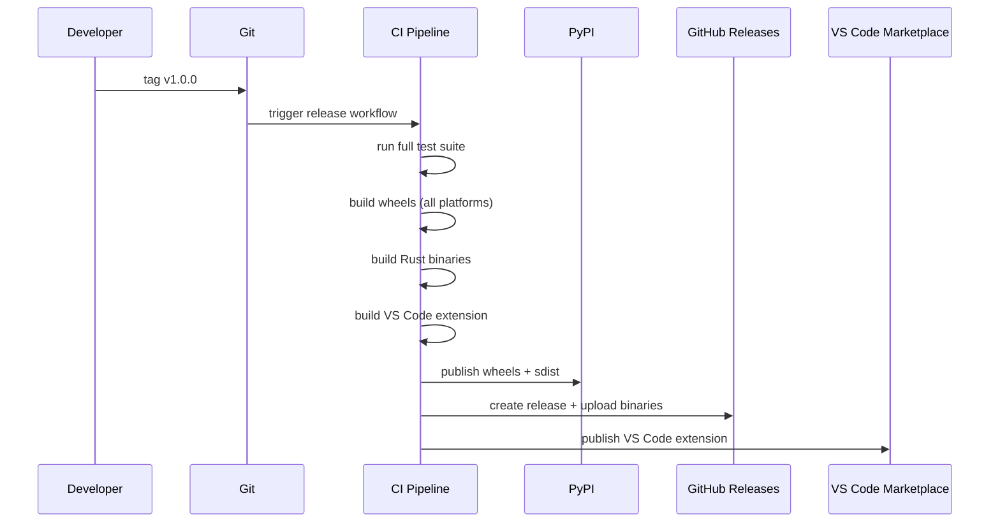
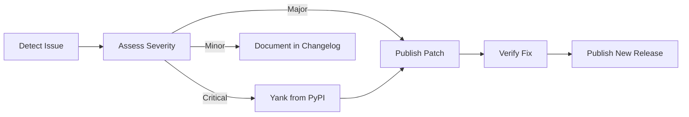

# 10 — Testing, CI/CD, and Deployment

---

## 1. Purpose

This document defines how CodeGuardian is tested, how those tests run automatically, and how releases are built and shipped. It covers the testing strategy, the CI pipeline, the CI matrix, caching, artifact management, packaging, versioning, and rollback.

The goal is simple: **every change is verified before it merges. Every release is reproducible. Every artifact is traceable.**

---

## 2. Testing Philosophy

CodeGuardian is a hybrid Python and Rust system with a plugin architecture, a sandbox, an audit trail, and an MCP server. Each of these has a different failure mode, and each requires a different test strategy.

| Principle | What It Means |
|---|---|
| **Test the contract, not the implementation.** | Every implementation is tested against the interface contract, not against a specific behavior. |
| **Test in isolation, integrate after.** | A module passes its own tests before it touches the core. |
| **Test the failure paths.** | Sandbox timeouts, model rate limits, plugin crashes, and consent denials are tested as first-class scenarios. |
| **Test the hybrid boundary.** | PyO3 and JSON-RPC calls are tested for batching, error propagation, and GIL behavior. |
| **Test the guarantees.** | The consent model, the sandbox isolation, the audit hash chain, and the verifier independence are tested as invariants, not as features. |

---

## 3. Test Pyramid

CodeGuardian uses a five-layer test pyramid. Each layer has a different scope, speed, and purpose.



| Layer | Speed | Scope | Runs On |
|---|---|---|---|
| **Unit** | Milliseconds | One module | Every commit |
| **Property** | Seconds | Invariants over random inputs | Every commit |
| **Contract** | Seconds | Every implementation of an interface | Every commit |
| **Integration** | Minutes | Cross-module communication | Every pull request |
| **E2E** | Minutes to hours | Full pipeline | Nightly and pre-release |

---

## 4. Unit Tests

Unit tests cover individual modules in isolation. They do not touch the network, the sandbox, or the database.

### 4.1 Python Unit Tests

| Target | Framework | Location |
|---|---|---|
| Core modules | pytest | `tests/unit/core/` |
| CLI commands | pytest | `tests/unit/cli/` |
| Providers | pytest | `tests/unit/core/` |
| Storage | pytest | `tests/unit/core/` |
| Error handling | pytest | `tests/unit/core/` |

```python
# tests/unit/core/test_blast_radius.py
import pytest
from codeguardian.core.agents.blast import BlastRadiusAgent

def test_blast_radius_produces_recommendation():
    agent = BlastRadiusAgent(graph=stub_graph, target="utils/parser.py:parse_config")
    report = agent.run()
    assert report.recommendation in {"proceed", "review", "block"}
    assert report.blast_score >= 0
    assert report.blast_score <= 100
```

### 4.2 Rust Unit Tests

| Target | Framework | Location |
|---|---|---|
| Code Intelligence Kernel | `cargo test` | `rust/crates/codeguardian-kernel/src/` |
| Blast Radius Engine | `cargo test` | `rust/crates/codeguardian-blast/src/` |
| Sandbox Engine | `cargo test` | `rust/crates/codeguardian-sandbox/src/` |
| Audit Writer | `cargo test` | `rust/crates/codeguardian-audit/src/` |

```rust
// rust/crates/codeguardian-blast/src/callers.rs
#[cfg(test)]
mod tests {
    use super::*;

    #[test]
    fn blast_score_is_bounded() {
        let score = compute_blast_score(&violations, &gaps, 14);
        assert!(score <= 100);
    }

    #[test]
    fn recommendation_blocks_above_threshold() {
        let rec = recommend(85);
        assert_eq!(rec, Recommendation::Block);
    }
}
```

### 4.3 SQLite WAL Mode Tests

Because CodeGuardian uses SQLite in WAL mode, the WAL configuration must be tested explicitly. In-memory SQLite databases do not support WAL mode, so tests use real filesystem databases.

```python
# tests/unit/core/test_sqlite_wal.py
import pytest
import sqlite3
from pathlib import Path

def test_wal_mode_enabled(tmp_path: Path):
    db_path = tmp_path / "test.db"
    conn = sqlite3.connect(db_path)
    conn.execute("PRAGMA journal_mode = WAL")
    mode = conn.execute("PRAGMA journal_mode").fetchone()[0]
    assert mode == "wal"
    conn.close()

def test_busy_timeout_set(tmp_path: Path):
    db_path = tmp_path / "test.db"
    conn = sqlite3.connect(db_path)
    conn.execute("PRAGMA busy_timeout = 5000")
    timeout = conn.execute("PRAGMA busy_timeout").fetchone()[0]
    assert timeout == 5000
    conn.close()
```

WAL mode tests run on every commit. On Windows, WAL sidecar files (`-wal`, `-shm`) are verified to be created and cleaned up correctly.

---

## 5. Property-Based Tests

Property-based testing verifies invariants over randomly generated inputs. It catches edge cases that example-based tests miss.

### 5.1 Python — Hypothesis

```python
# tests/unit/core/test_blast_score_properties.py
from hypothesis import given, strategies as st
from codeguardian.core.agents.blast import compute_blast_score

@given(
    caller_count=st.integers(min_value=0, max_value=1000),
    violations=st.integers(min_value=0, max_value=100),
    gaps=st.integers(min_value=0, max_value=100),
)
def test_blast_score_is_always_bounded(caller_count, violations, gaps):
    """Property: the blast score is always between 0 and 100."""
    score = compute_blast_score(caller_count, violations, gaps)
    assert 0 <= score <= 100

@given(caller_count=st.integers(min_value=0, max_value=1000))
def test_zero_callers_always_proceeds(caller_count):
    """Property: zero callers always means proceed."""
    if caller_count == 0:
        score = compute_blast_score(0, 0, 0)
        assert score == 0
```

### 5.2 Rust — proptest

```rust
// rust/crates/codeguardian-blast/src/score.rs
#[cfg(test)]
mod tests {
    use super::*;
    use proptest::prelude::*;

    proptest! {
        #[test]
        fn blast_score_is_always_bounded(
            callers in 0usize..1000,
            violations in 0usize..100,
            gaps in 0usize..100,
        ) {
            let score = compute_blast_score(violations, gaps, callers);
            prop_assert!(score <= 100);
        }

        #[test]
        fn zero_callers_proceeds(callers in 0usize..1) {
            let score = compute_blast_score(0, 0, callers);
            prop_assert_eq!(score, 0);
        }
    }
}
```

Property-based tests run on every commit. They are fast enough to be part of the standard test suite.

---

## 6. Contract Tests

Contract tests are the backbone of the plugin architecture. Every implementation of an interface must pass the same shared contract suite. This is what keeps the plugin system honest.

### 6.1 Contract Test Structure



### 6.2 Contract Test Example

```python
# tests/contracts/test_sandbox_contract.py
import pytest
from codeguardian.interfaces.sandbox import SandboxBackend

class SandboxBackendContract:
    """Shared contract test suite for every SandboxBackend implementation."""

    def test_create_returns_sandbox(self, backend: SandboxBackend, config):
        sandbox = backend.create(config)
        assert sandbox is not None
        assert sandbox.id is not None

    def test_execute_returns_result(self, backend: SandboxBackend, sandbox):
        result = backend.execute(sandbox, "echo hello", timeout=10)
        assert result.stdout.strip() == "hello"
        assert result.exit_code == 0

    def test_destroy_removes_sandbox(self, backend: SandboxBackend, sandbox):
        backend.destroy(sandbox)
        with pytest.raises(SandboxNotFound):
            backend.execute(sandbox, "echo hello", timeout=10)

    def test_network_is_isolated(self, backend: SandboxBackend, sandbox):
        result = backend.execute(sandbox, "curl -s https://example.com", timeout=10)
        assert result.exit_code != 0
```

```python
# tests/contracts/test_sandbox_bubblewrap.py
from tests.contracts.test_sandbox_contract import SandboxBackendContract
from codeguardian.core.sandbox.bubblewrap_backend import BubblewrapBackend

class TestBubblewrapBackend(SandboxBackendContract):
    @pytest.fixture
    def backend(self):
        return BubblewrapBackend()
```

### 6.3 Contract Test Coverage

| Contract | Implementations Tested |
|---|---|
| `RepositoryProviderContract` | LocalProvider, GitHubProvider, GitLabProvider |
| `ApplyProviderContract` | ApplyProvider |
| `ModelProviderContract` | AnthropicProvider, OpenAIProvider, DeepSeekProvider, OpenAICompatibleProvider |
| `SandboxBackendContract` | BubblewrapBackend, SeatbeltBackend, FirecrackerBackend, DockerBackend |
| `LanguagePluginContract` | PythonPlugin, TypeScriptPlugin |
| `ToolPluginContract` | ast-grep plugin, Code Analysis plugin |
| `VerifierPluginContract` | CorrectnessVerifier, SecurityVerifier, ContractVerifier |
| `ReporterPluginContract` | JSONReporter, SARIFReporter, MarkdownReporter |
| `MCPClientContract` | MCPClient |
| `MCPServerContract` | MCPServer |

**Rule:** A plugin that fails its contract tests is rejected at load time. No exceptions.

---

## 7. Integration Tests

Integration tests verify that modules talk to each other correctly. They cover the hybrid boundary, plugin loading, and MCP communication.

### 7.1 PyO3 Bridge Tests

```python
# tests/integration/test_pyo3_bridge.py
import pytest
from codeguardian.core.bridges.pyo3_bridge import PyO3Bridge

def test_parse_files_batches_correctly():
    bridge = PyO3Bridge()
    paths = [f"file_{i}.py" for i in range(500)]
    asts = bridge.parse_files(paths, grammar="python")
    assert len(asts) == 500

def test_gil_is_released_during_parse():
    """Verify that Rust parsing releases the GIL."""
    import threading
    bridge = PyO3Bridge()
    paths = [f"file_{i}.py" for i in range(100)]

    results = []
    def parse():
        results.append(bridge.parse_files(paths, grammar="python"))

    t = threading.Thread(target=parse)
    t.start()
    # Python code should run concurrently while Rust is parsing
    t.join()
    assert len(results) == 1
```

### 7.2 JSON-RPC Bridge Tests

```python
# tests/integration/test_jsonrpc_bridge.py
import pytest
from codeguardian.core.bridges.jsonrpc_bridge import JSONRPCBridge

async def test_sandbox_create_and_destroy():
    bridge = JSONRPCBridge()
    sandbox_id = await bridge.call("sandbox.create", {"language": "python"})
    assert sandbox_id is not None
    await bridge.call("sandbox.destroy", {"sandbox_id": sandbox_id})

async def test_audit_write_is_batched():
    bridge = JSONRPCBridge()
    entries = [make_audit_entry() for _ in range(10)]
    result = await bridge.call("audit.write", {"entries": entries})
    assert result["written"] is True
```

### 7.3 Plugin Loading Tests

```python
# tests/integration/test_plugin_loading.py
import pytest
from codeguardian.core.plugins.loader import PluginLoader

def test_plugin_discovered_via_entry_point():
    loader = PluginLoader()
    plugins = loader.discover()
    assert any(p.name == "codeguardian-lang-python" for p in plugins)

def test_faulty_plugin_does_not_crash_core():
    loader = PluginLoader()
    loader.register(StubFaultyPlugin())
    with pytest.raises(PluginDisabled):
        loader.get("stub-faulty")
    # Core continues without the plugin
    assert loader.get("codeguardian-lang-python") is not None
```

### 7.4 MCP Tests

CodeGuardian uses `mcp-pytest`, a pytest plugin for testing MCP servers, and `mcp-test-framework` for lifecycle management and rich assertions.

```python
# tests/integration/test_mcp_server.py
import pytest
from mcp_test_framework import MCPTestServer

@pytest.fixture
def server():
    return MCPTestServer(command="codeguardian", args=["serve", "--transport", "stdio"])

async def test_tools_are_discoverable(server):
    tools = await server.list_tools()
    names = [t.name for t in tools]
    assert "codeguardian.refactor" in names
    assert "codeguardian.blast" in names
    assert "codeguardian.recon" in names

async def test_blast_tool_returns_report(server):
    result = await server.call_tool("codeguardian.blast", {
        "repo_url": "https://github.com/example/repo",
        "file_path": "utils/parser.py",
    })
    assert result["blast_score"] is not None
    assert result["recommendation"] in {"proceed", "review", "block"}
```

**MCP conformance testing:** CodeGuardian's MCP server is validated against the MCP specification using `mcp-probe` and `@modelcontextprotocol/conformance`. These tools verify the initialize handshake, JSON Schema validation for every tool, and JSON-RPC correctness.

---

## 8. End-to-End Tests

E2E tests run the full pipeline on a curated repository. They are the slowest tests and run nightly, not on every commit.

### 8.1 E2E Test Scenarios

| Scenario | What It Tests |
|---|---|
| **Full legacy refactor** | Recon → Blast → Context → Safety Net → Refactor → Sandbox Verify → Independent Verify → Output |
| **Self-correction loop** | Deliberately break the refactor, verify the agent catches the error and retries |
| **Blast radius accuracy** | Verify that the blast radius report matches a hand-verified ground truth |
| **Consent denial** | Verify that no change is applied when the user denies consent |
| **Blast block** | Verify that the pipeline stops at a block recommendation |
| **Plugin failure** | Verify that a faulty plugin does not crash the pipeline |
| **Sandbox escape attempt** | Verify that the sandbox isolates untrusted code |

### 8.2 E2E Test Structure

```python
# tests/e2e/test_full_pipeline.py
import pytest
from codeguardian.cli.main import run

def test_full_legacy_refactor(tmp_path):
    result = run(
        url="tests/fixtures/sample_python_repo",
        target="utils/parser.py:parse_config",
        directive="add type hints",
        apply=False,  # dry run
    )
    assert result.status == "success"
    assert result.diff is not None
    assert result.verification.correctness.verdict == "pass"
    assert result.verification.security.verdict == "pass"
    assert result.verification.contract.verdict == "pass"

def test_self_correction_loop(tmp_path):
    """Deliberately break the refactor to trigger the retry loop."""
    result = run(
        url="tests/fixtures/sample_python_repo",
        target="utils/parser.py:parse_config",
        directive="add type hints",
        apply=False,
        _inject_failure=True,
    )
    assert result.retries > 0
    assert result.status == "success"
```

### 8.3 E2E Fixtures

Three curated repositories live in `tests/e2e/fixtures/`:

| Fixture | Languages | Purpose |
|---|---|---|
| `sample_python_repo` | Python | Basic legacy refactor |
| `sample_typescript_repo` | TypeScript | Cross-language verification |
| `sample_multi_language_repo` | Python + TypeScript | Multi-language reconnaissance |

Each fixture includes a known set of contract violations, coverage gaps, and documentation drift so that the blast radius report can be validated against ground truth.

---

## 9. Security Tests

Security tests verify the guarantees that CodeGuardian makes.

| Test | What It Verifies |
|---|---|
| **Sandbox escape attempt** | Untrusted code cannot reach the host filesystem, network, or processes. |
| **Network isolation** | The sandbox has no network access except during dependency resolution. |
| **Resource quota enforcement** | A runaway process is terminated when it exceeds memory or CPU limits. |
| **Secret redaction** | API keys, tokens, and passwords are never written to logs or audit entries. |
| **Consent enforcement** | No mutation occurs without explicit user approval. |
| **Read-only enforcement** | The Repository Provider has no write method. |
| **Audit hash chain** | Modifying any audit entry breaks the chain. |
| **Plugin permission enforcement** | A plugin cannot access resources not declared in its manifest. |

### 9.1 Sandbox Escape Test

```python
# tests/e2e/test_sandbox_escape.py
def test_sandbox_cannot_write_host_filesystem():
    result = run_in_sandbox("echo 'malicious' > /tmp/host_file")
    assert result.exit_code != 0
    assert not Path("/tmp/host_file").exists()

def test_sandbox_cannot_read_host_secrets():
    result = run_in_sandbox("cat ~/.ssh/id_rsa")
    assert result.exit_code != 0
    assert "BEGIN RSA" not in result.stdout
```

### 9.2 Consent Enforcement Test

```python
# tests/e2e/test_consent_enforcement.py
def test_no_mutation_without_consent(tmp_path):
    original = read_file(tmp_path / "target.py")
    result = run(url=str(tmp_path), target="target.py", apply=False)
    assert result.status == "dry_run"
    assert read_file(tmp_path / "target.py") == original
```

---

## 10. Performance Tests

Performance tests catch regressions in the hot path.

| Test | Target |
|---|---|
| **CPG build time** | Scoped build completes interactively. Full build completes within a reasonable window. |
| **Incremental update** | After a file change, the graph update is noticeably faster than a full rebuild. |
| **Blast radius computation** | Returns interactively for any target. |
| **Sandbox cold start** | Imperceptible on the local backend. |
| **CLI first response** | Immediate. |

### 10.1 Benchmark Tracking

Performance benchmarks run on every pull request. Regressions above a threshold block the merge.

```python
# scripts/benchmark.py
import time
from codeguardian.core.bridges.pyo3_bridge import PyO3Bridge

def benchmark_parse():
    bridge = PyO3Bridge()
    paths = load_benchmark_files()  # 500 files, ~50k lines
    start = time.perf_counter()
    bridge.parse_files(paths, grammar="python")
    elapsed = time.perf_counter() - start
    return elapsed

if __name__ == "__main__":
    elapsed = benchmark_parse()
    print(f"parse_500_files: {elapsed:.3f}s")
    # CI compares against baseline and fails on regression > 20%
```

---

## 11. CI Pipeline

The CI pipeline runs on GitHub Actions. It is triggered on every push and pull request.

### 11.1 Pipeline Stages

```mermaid
flowchart LR
    subgraph Stage1["Stage 1 — Validate"]
        L1[Lint Python]
        L2[Lint Rust]
        L3[Type Check]
        L4[Schema Validation]
    end

    subgraph Stage2["Stage 2 — Build"]
        B1[Build Rust Crates]
        B2[Build PyO3 Bindings]
        B3[Build Wheels]
    end

    subgraph Stage3["Stage 3 — Test"]
        T1[Unit Tests]
        T2[Property Tests]
        T3[Contract Tests]
        T4[Integration Tests]
    end

    subgraph Stage4["Stage 4 — Verify"]
        V1[Security Tests]
        V2[Benchmark Regression]
        V3[Coverage Report]
    end

    Stage1 --> Stage2
    Stage2 --> Stage3
    Stage3 --> Stage4
```



### 11.2 CI Workflow

```yaml
# .github/workflows/ci.yml
name: CI

on:
  push:
    branches: [main]
  pull_request:
    branches: [main]

env:
  CARGO_TERM_COLOR: always
  RUST_BACKTRACE: 1

jobs:
  lint:
    runs-on: ubuntu-latest
    steps:
      - uses: actions/checkout@v4
      - uses: actions/setup-python@v5
        with:
          python-version: "3.12"
      - uses: dtolnay/rust-toolchain@stable
        with:
          components: clippy, rustfmt
      - name: Install Python dependencies
        run: pip install ruff mypy
      - name: Lint Python
        run: ruff check python/
      - name: Type check Python
        run: mypy python/
      - name: Format check Rust
        run: cargo fmt --all -- --check
      - name: Lint Rust
        run: cargo clippy --all-targets -- -D warnings
      - name: Validate schemas
        run: python scripts/validate_schemas.py

  test:
    needs: lint
    strategy:
      matrix:
        os: [ubuntu-latest, macos-latest, windows-latest]
        python-version: ["3.12"]
    runs-on: ${{ matrix.os }}
    steps:
      - uses: actions/checkout@v4
      - uses: actions/setup-python@v5
        with:
          python-version: ${{ matrix.python-version }}
      - uses: dtolnay/rust-toolchain@stable
      - uses: PyO3/maturin-action@v1
        with:
          command: develop
          args: --release
      - name: Run unit tests
        run: pytest tests/unit/ -v
      - name: Run property tests
        run: pytest tests/unit/ -v -m property
      - name: Run contract tests
        run: pytest tests/contracts/ -v
      - name: Run integration tests
        run: pytest tests/integration/ -v

  rust-test:
    needs: lint
    runs-on: ubuntu-latest
    steps:
      - uses: actions/checkout@v4
      - uses: dtolnay/rust-toolchain@stable
      - name: Run Rust tests
        run: cargo test --workspace --all-features
      - name: Run Rust property tests
        run: cargo test --workspace --all-features -- --include-ignored
```

### 11.3 Conditional Job Execution

Not every change requires the full pipeline. The CI determines which subsets to run based on the files changed.

```yaml
# .github/workflows/ci.yml (excerpt)
jobs:
  detect-changes:
    runs-on: ubuntu-latest
    outputs:
      python: ${{ steps.filter.outputs.python }}
      rust: ${{ steps.filter.outputs.rust }}
    steps:
      - uses: actions/checkout@v4
      - uses: dorny/paths-filter@v3
        id: filter
        with:
          filters: |
            python:
              - 'python/**'
            rust:
              - 'rust/**'
```

This follows the pattern used by Polars, where "each workflow is triggered only when relevant files are modified."

### 11.4 Caching

| Cache | Key | What It Speeds Up |
|---|---|---|
| **Cargo registry** | `Cargo.lock` hash | Rust dependency downloads |
| **Cargo target** | `Cargo.lock` + source hash | Rust compilation |
| **pip cache** | `pyproject.toml` hash | Python dependency installs |
| **maturin build** | Rust source hash | PyO3 compilation |

```yaml
- uses: Swatinem/rust-cache@v2
  with:
    workspaces: rust/
- uses: actions/cache@v4
  with:
    path: ~/.cache/pip
    key: ${{ runner.os }}-pip-${{ hashFiles('**/pyproject.toml') }}
```

---

## 12. CI Matrix

The CI matrix ensures CodeGuardian works across platforms and configurations.

### 12.1 Test Matrix

| Dimension | Values |
|---|---|
| **Operating System** | Ubuntu, macOS, Windows |
| **Python Version** | 3.12 (only supported version in v1) |
| **Rust Toolchain** | Stable |
| **Sandbox Backend** | Platform default (Bubblewrap on Linux, Seatbelt on macOS, Docker on Windows) |

### 12.2 Build Matrix (Wheels)

Platform-specific wheels are built for every release.



| Platform | Target | Runner |
|---|---|---|
| Linux x86_64 | `x86_64-unknown-linux-gnu` | `ubuntu-latest` |
| Linux aarch64 | `aarch64-unknown-linux-gnu` | Cross-compile |
| macOS Intel | `x86_64-apple-darwin` | `macos-13` |
| macOS Apple Silicon | `aarch64-apple-darwin` | `macos-14` |
| Windows x86_64 | `x86_64-pc-windows-msvc` | `windows-latest` |

Cross-compilation for Linux aarch64 uses the `PyO3/maturin-action` with cross-compilation support. On macOS, `actions/setup-python` can be used to select the target Python version.

---

## 13. Artifact Management

### 13.1 Artifacts Produced

| Artifact | Built From | Distributed To |
|---|---|---|
| **Python wheel** (platform-specific) | `python/` + PyO3 bindings | PyPI |
| **Source distribution** | Full repository | PyPI |
| **Rust binaries** (CLI-only) | `rust/` | GitHub Releases |
| **Bundled plugin wheels** | `python/codeguardian/plugins_bundled/` | PyPI |
| **VS Code extension** (`.vsix`) | `codeguardian-vscode/` | VS Code Marketplace, Open VSX |
| **Documentation** | `docs/` | GitHub Pages |

### 13.2 Artifact Flow



### 13.3 Artifact Retention

| Artifact | Retention |
|---|---|
| **CI test artifacts** | 7 days |
| **Benchmark results** | 90 days |
| **Release artifacts** | Forever (GitHub Releases) |
| **Coverage reports** | 30 days |

---

## 14. Deployment

### 14.1 Release Triggers

| Trigger | Action |
|---|---|
| **Tag `v*`** | Build and publish all artifacts |
| **Tag `vscode-v*`** | Build and publish the VS Code extension only |
| **Manual dispatch** | Build and publish a specific artifact |

### 14.2 Release Workflow



### 14.3 Release Workflow YAML

```yaml
# .github/workflows/release.yml
name: Release

on:
  push:
    tags: ["v*"]

jobs:
  build-wheels:
    strategy:
      matrix:
        include:
          - os: ubuntu-latest
            target: x86_64
          - os: ubuntu-latest
            target: aarch64
          - os: macos-13
            target: x86_64
          - os: macos-14
            target: aarch64
          - os: windows-latest
            target: x86_64
    runs-on: ${{ matrix.os }}
    steps:
      - uses: actions/checkout@v4
      - uses: PyO3/maturin-action@v1
        with:
          command: build
          args: --release --out dist --find-interpreter
          target: ${{ matrix.target }}
      - uses: actions/upload-artifact@v4
        with:
          name: wheels-${{ matrix.target }}
          path: dist/

  publish-pypi:
    needs: build-wheels
    runs-on: ubuntu-latest
    steps:
      - uses: actions/download-artifact@v4
      - uses: PyO3/maturin-action@v1
        with:
          command: upload
          args: --skip-existing dist/*
        env:
          MATURIN_PYPI_TOKEN: ${{ secrets.PYPI_TOKEN }}

  publish-vscode:
    needs: build-wheels
    runs-on: ubuntu-latest
    steps:
      - uses: actions/checkout@v4
      - run: npm ci
        working-directory: codeguardian-vscode
      - run: npx vsce publish -p ${{ secrets.VSCE_PAT }}
        working-directory: codeguardian-vscode
```

### 14.4 Deployment Environments

| Environment | Purpose | Trigger |
|---|---|---|
| **Development** | Internal testing | Every push to `main` |
| **Staging** | Pre-release validation | Every release candidate tag |
| **Production** | Public release | Every `v*` tag |

---

## 15. Release Versioning

### 15.1 Versioning Scheme

CodeGuardian uses semantic versioning. The core version and the extension version are independent.

| Component | Version Source | Example |
|---|---|---|
| **Core** | `python/codeguardian/version.py` | `1.0.0` |
| **Rust crates** | `rust/Cargo.toml` (workspace) | `1.0.0` |
| **VS Code extension** | `codeguardian-vscode/package.json` | `1.0.0` |
| **Bundled plugins** | Each plugin's `pyproject.toml` | `1.0.0` |

### 15.2 Compatibility Matrix

The extension declares a minimum and maximum compatible core version.

```json
{
  "codeguardian": {
    "minCoreVersion": "1.0.0",
    "maxCoreVersion": "2.0.0"
  }
}
```

### 15.3 Changelog Discipline

Every release has a changelog entry. The changelog follows the Keep a Changelog format.

```markdown
## [1.0.0] — 2027-01-15

### Added
- Legacy mode refactoring pipeline.
- Code Property Graph with incremental construction.
- Blast radius analysis with contract detection.
- Independent correctness, security, and contract verifiers.
- Tiered sandbox backends (Bubblewrap, Seatbelt, Docker).
- MCP client and server.
- VS Code extension.

### Changed
- Nothing.

### Fixed
- Nothing.
```

---

## 16. Rollback Plan

### 16.1 Rollback Triggers

| Trigger | Action |
|---|---|
| **Critical bug in release** | Yank the release from PyPI. Publish a patch release. |
| **Security vulnerability** | Yank the release. Publish a security advisory. |
| **Performance regression** | Publish a patch release with the fix. |
| **Breaking change in plugin API** | Revert the plugin interface. Publish a patch release. |

### 16.2 Rollback Workflow



### 16.3 Yanking a Release

```bash
# Yank a release from PyPI
twine yank codeguardian==1.0.0 --reason "Critical bug in blast radius computation"

# Publish a patch release
git tag v1.0.1
git push origin v1.0.1
```

---

## 17. Benchmark Tracking

### 17.1 Benchmarks Tracked

| Benchmark | Metric | Threshold |
|---|---|---|
| **CPG build (scoped)** | Time | < 30 seconds |
| **CPG build (full)** | Time | < 5 minutes |
| **Incremental update** | Time | < 500 ms |
| **Blast radius computation** | Time | < 2 seconds |
| **Sandbox cold start** | Time | < 100 ms |
| **CLI first response** | Time | < 500 ms |
| **Memory during CPG build** | Peak RSS | < 2 GB |

### 17.2 Benchmark CI

Benchmarks run on every pull request. A regression above 20% blocks the merge.

```yaml
# .github/workflows/benchmark.yml
name: Benchmark

on:
  pull_request:
    branches: [main]

jobs:
  benchmark:
    runs-on: ubuntu-latest
    steps:
      - uses: actions/checkout@v4
      - uses: actions/setup-python@v5
        with:
          python-version: "3.12"
      - uses: PyO3/maturin-action@v1
        with:
          command: develop
          args: --release
      - name: Run benchmarks
        run: python scripts/benchmark.py --output benchmark.json
      - name: Compare against baseline
        run: python scripts/compare_benchmarks.py benchmark.json baseline.json
```

---

## 18. Test Coverage Requirements

| Layer | Minimum Coverage |
|---|---|
| **Core modules** | 80% |
| **Rust crates** | 80% |
| **CLI commands** | 70% |
| **Providers** | 80% |
| **Storage** | 80% |
| **Plugins** | 70% |

Coverage is measured on every pull request. A pull request that lowers coverage below the minimum is blocked.

```yaml
- name: Run tests with coverage
  run: pytest tests/ --cov=codeguardian --cov-report=xml --cov-fail-under=80
```

---

## 19. CI Secrets

| Secret | Purpose |
|---|---|
| `PYPI_TOKEN` | Publish wheels to PyPI |
| `VSCE_PAT` | Publish the VS Code extension |
| `OPEN_VSX_TOKEN` | Publish to Open VSX |
| `CODECOV_TOKEN` | Upload coverage reports |
| `LANGSMITH_API_KEY` | Enable LangSmith tracing in CI |

Secrets are stored in GitHub Actions secrets and are never printed to logs.

---

## 20. Related Documents

- `03-requirements.md` — testability requirements (NFR-T1 through T4)
- `06-api-contracts.md` — contract tests for every interface
- `07-tech-stack.md` — testing frameworks
- `08-repository-structure.md` — where tests live
- `08A-module-relationships.md` — which modules the tests cover
- `11-security-performance-observability.md` — security tests and benchmarks
