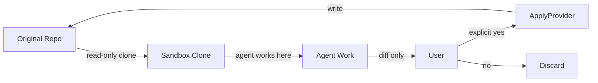

# 11 — Security, Performance, and Observability

---

## 1. Purpose

This document defines how CodeGuardian stays safe, stays fast, and stays inspectable. It covers the threat model, the sandbox isolation guarantees, the consent enforcement mechanism, the audit trail, secret redaction, plugin permissions, the performance architecture, the performance budgets, the structured logging, the tracing, the metrics, and the health checks.

Every claim in this document is backed by a mechanism. Every mechanism is testable. Every guarantee is enforced architecturally, not by convention.

---

## 2. Security

### 2.1 Threat Model

The threat model covers four categories of adversary.

| Adversary | What They Control | What They Want |
|---|---|---|
| **Malicious target code** | The code being refactored | Escape the sandbox, exfiltrate secrets, corrupt the host |
| **Malicious plugin** | A user-installed plugin | Access resources beyond its declared permissions |
| **Compromised model** | The output of an LLM call | Inject harmful code into the refactor |
| **Malicious repository** | The repository being cloned | Trick the agent into reading or writing unintended files |

For each threat, there is a mitigation and a test that verifies it.

| Threat | Mitigation | Test |
|---|---|---|
| **Sandbox escape** | Tiered sandbox backends with hardware or OS-level isolation | `tests/e2e/test_sandbox_escape.py` |
| **Secret exfiltration** | Secret redaction at the logging boundary | `tests/unit/core/test_redaction.py` |
| **Unauthorized mutation** | Read-only Repository Provider. Separate Apply Provider. | `tests/e2e/test_consent_enforcement.py` |
| **Audit log tampering** | Hash-chained JSONL written by a separate Rust process | `tests/unit/core/test_audit_chain.py` |
| **Plugin privilege escalation** | Manifest-declared permissions, enforced by the Policy Engine | `tests/integration/test_plugin_permissions.py` |
| **Path traversal** | All paths validated against the repository root. Symlinks resolved. | `tests/unit/core/test_path_validation.py` |
| **Network egress** | Sandbox network isolated except during dependency resolution | `tests/contracts/test_sandbox_contract.py` |
| **Resource exhaustion** | CPU, memory, and process quotas enforced by the sandbox | `tests/contracts/test_sandbox_contract.py` |

### 2.2 Sandbox Isolation

The sandbox is the safety boundary. Untrusted code never executes on the host. The architecture abstracts the isolation technology behind a single `SandboxBackend` interface. The same pipeline runs on any backend.

| Backend | Platform | Isolation Boundary | Escape Resistance |
|---|---|---|---|
| **Bubblewrap** | Linux | Linux namespaces (user, mount, PID, network) | High. Drops all capabilities. Unprivileged. No daemon. |
| **Seatbelt** | macOS | SBPL policy profiles, kernel-enforced | High. Writes restricted to workspace and temp dirs. Credential store reads denied. |
| **Firecracker** | Linux (KVM) | Hardware virtualization. Dedicated guest kernel per microVM. | Highest. Each microVM has its own kernel. The jailer provides a second line of defense. |
| **Docker** | Linux, macOS, Windows | OS-level namespaces and cgroups | Medium. Shares the host kernel. Vulnerable to kernel exploits. |

**Bubblewrap** uses Linux namespaces to launch unprivileged containers. It drops all capabilities within the sandbox, so child tasks cannot gain greater privileges than the parent. It is the engine behind Flatpak and is used by Claude Code for local bash sandboxing. No daemon is required. It is the default local backend on Linux.

**Seatbelt** is macOS's built-in confinement primitive. It uses the `sandbox-exec` command and a Scheme-like profile generated at runtime. Writes are restricted to the workspace and temp directories. Reads of credential stores are denied. Enforcement is at the kernel level, so obfuscated commands cannot bypass it. It is the default local backend on macOS.

**Firecracker** is a microVM technology that provides hardware-level isolation. Each Firecracker microVM runs with its own guest kernel, and only 5 emulated devices. It is further isolated by a companion program called the jailer, which sets up system resources requiring elevated permissions, drops privileges, and then `exec()`s into the Firecracker binary. Seccomp filters limit the system calls the Firecracker process can use. It is the industry standard for high-security agent sandboxing and is used by AWS Lambda and Fly.io. It is the cloud and multi-tenant backend.

**Docker** shares the host kernel. It uses Linux namespaces, cgroups, capability dropping, seccomp, and SELinux or AppArmor to isolate containers. It is not the recommended backend for untrusted code, but it is available for CI, Windows, and fallback scenarios where Bubblewrap and Seatbelt are unavailable.

**Defense in depth:** Every backend enforces network isolation (except during a controlled dependency-resolution phase), CPU quotas, memory quotas, process limits, and swap disabled. The sandbox is destroyed after each run. The workspace is reset between targets.

### 2.3 Consent Enforcement

The consent model is non-negotiable. It is enforced architecturally, not by convention.

| Guarantee | Mechanism |
|---|---|
| **No mutation without explicit approval** | The `RepositoryProvider` interface has no write method. Applying changes is a separate `ApplyProvider` that requires explicit consent. |
| **Dry-run is the default** | Without an explicit apply flag, the system produces a diff and exits. |
| **Consent is recorded** | The consent record is written to the audit log with a timestamp, scope, and session identity. |
| **Applying is atomic and reversible** | A rollback reference is recorded before apply. |
| **No file is written until every phase passes** | The Apply Provider is never instantiated during agent execution. It runs only after all phases complete and the user approves. |



### 2.4 Audit Trail

Every run produces a structured, tamper-evident log. The log is written by a separate Rust process that the Python orchestrator never has a file handle to.

#### 2.4.1 Format

The audit log is newline-delimited JSON (JSONL). Each line is one JSON object. The format is append-only, tail-friendly, and transport-agnostic.

#### 2.4.2 Hash Chain

Each entry includes a hash of its own content and the hash of the previous entry. The chain uses SHA-256 over canonical JSON (RFC 8785 / JCS-1). If any entry is modified, its `entry_hash` no longer matches the next entry's `prev_hash`, and the chain breaks.

```
entry_1: prev_hash = "GENESIS", entry_hash = SHA-256("GENESIS" + payload_hash_1)
entry_2: prev_hash = entry_1.entry_hash, entry_hash = SHA-256(entry_1.entry_hash + payload_hash_2)
entry_n: prev_hash = entry_(n-1).entry_hash, entry_hash = SHA-256(entry_(n-1).entry_hash + payload_hash_n)
```

This follows the standard hash-chain pattern used by production audit systems. Each record carries its own digest, SHA-256 over JCS-1 canonical JSON with the digest field omitted. Editing any stored record breaks the chain and is detectable.

#### 2.4.3 Isolation

The audit writer runs as a separate Rust process. Communication is JSON-RPC over stdio. The Python process never has a file handle to the audit log. A compromised Python process cannot modify the log.

#### 2.4.4 Export

The log can be exported as JSONL for external analysis. The `codeguardian audit export` command produces a portable file. The hash chain can be verified independently with `codeguardian audit verify`.

### 2.5 Secret Redaction

API keys, tokens, passwords, and other secrets are never written to logs or audit entries.

#### 2.5.1 Redaction Layers

| Layer | Where It Runs | What It Redacts |
|---|---|---|
| **Pre-log filter** | Python, before any write | Key-based redaction (dictionary keys matching known secret names) |
| **Pattern filter** | Python, before any write | Value-based redaction (regex patterns for API keys, tokens, JWTs, connection strings) |
| **Rust masking engine** | Rust, in the audit writer | Final pass before the entry is written to disk |

The Rust masking engine follows the pattern used by `slpy-log`, `redact-secret`, and `velatus`: a fast Rust core with a Python fallback, same rules, same output, locked by a shared parity test.

#### 2.5.2 What Is Redacted

| Category | Examples |
|---|---|
| **API keys** | Anthropic, OpenAI, DeepSeek, GitHub, GitLab tokens |
| **Passwords** | Any value under a key named `password`, `passwd`, `secret` |
| **Tokens** | Bearer tokens, JWTs, session tokens |
| **Connection strings** | Database URLs with embedded credentials |
| **Cloud credentials** | AWS, GCP, Azure keys |
| **SSH keys** | Private key material |

#### 2.5.3 Verification

Redaction is verified by tests. A test suite injects known secrets into every logging path and asserts that the secret does not appear in the output.

### 2.6 Plugin Permissions

Every plugin declares its capabilities and permissions in a manifest. The Policy Engine enforces them.

| Permission | Values | Meaning |
|---|---|---|
| `filesystem` | `none`, `sandbox_only`, `read_only`, `full` | What the plugin can access on the filesystem |
| `network` | `true`, `false` | Whether the plugin can make network requests |
| `process_spawn` | `true`, `false` | Whether the plugin can spawn processes |
| `env_read` | List of variable names | Which environment variables the plugin can read |

A plugin cannot access resources not declared in its manifest. The Policy Engine intercepts every access attempt and blocks undeclared ones. This is enforced in-process by the Rust Policy Engine, which is exposed to Python via PyO3.

### 2.7 Workspace Trust

When the workspace is untrusted (VS Code workspace trust), the extension disables all commands that execute code. The CLI checks the trust state before running the pipeline. Read-only commands (`codeguardian showAudit`, `codeguardian showSkills`) remain available.

### 2.8 Supply Chain Security

| Concern | Mitigation |
|---|---|
| **Dependency vulnerabilities** | Automated dependency auditing (Dependabot, `cargo audit`, `pip-audit`) in CI |
| **Malicious package** | Lock files with integrity hashes (`Cargo.lock`, `uv.lock`) |
| **Compromised build** | Reproducible builds. Signed releases. |
| **SBOM** | Generated per release. CycloneDX or SPDX format. |
| **Signed artifacts** | PyPI wheels and VS Code extension signed with Sigstore |

---

## 3. Performance

### 3.1 Four-Process Model

CodeGuardian runs as four cooperating processes, not one monolith. Isolation without contention.

| Process | Language | Responsibility | Memory Budget |
|---|---|---|---|
| **Orchestrator** | Python | LangGraph state machine, model calls, plugin loading, CLI | ~200 MB |
| **Sandbox Engine** | Rust | Backend lifecycle, quota enforcement, process kill | ~10 MB |
| **Audit Writer** | Rust | Append-only JSONL, hash chain | ~5 MB |
| **MCP Server** | Python | IDE integration, thin client | ~100 MB (shared) |

**Why separate processes:**
- A Python crash (OOM, unhandled exception) does not kill the sandbox or corrupt the audit log.
- The Rust sandbox engine has no GIL, no GC pauses, no interpreter overhead.
- The audit writer is isolated. A compromised Python process cannot touch the log file.

### 3.2 Event Loop Rules

| Rule | Implementation | Why |
|---|---|---|
| **One event loop, no blocking calls.** | All I/O is `async`. No `time.sleep()`, no synchronous `requests`, no blocking file reads. | A single `time.sleep()` stalls every concurrent agent. |
| **CPU-bound work goes to Rust or a dedicated process pool.** | Tree-sitter parsing, graph construction, diff computation — all in Rust. | The GIL serializes CPU-bound Python threads. |
| **Model calls are fully async and parallelized.** | Multiple model calls (verifiers) run concurrently via `asyncio.gather()`. | Verifiers are independent. No reason to run them sequentially. |
| **Dedicated thread pools per concern.** | One pool for model I/O, one for filesystem I/O, one for MCP tool calls. | Long-running tasks starve short I/O operations when sharing a pool. |
| **PyO3 calls release the GIL.** | Every `#[pyfunction]` that does non-trivial work uses `Python::detach()`. | The Rust parser runs concurrently with Python model calls. |

### 3.3 SQLite Tuning

SQLite is configured with WAL mode and performance PRAGMAs on every connection.

```sql
PRAGMA journal_mode = WAL;           -- readers alongside one writer
PRAGMA synchronous = NORMAL;         -- only last transaction lost on power failure
PRAGMA wal_autocheckpoint = 10000;   -- checkpoint every ~40 MB
PRAGMA mmap_size = 268435456;        -- 256 MB memory-mapped I/O
PRAGMA busy_timeout = 5000;          -- 5 second wait instead of immediate error
PRAGMA cache_size = -64000;          -- 64 MB page cache
```

`synchronous = NORMAL` in WAL mode gives the same crash-safety guarantees as `FULL` for committed transactions while halving the fsync cost. `wal_autocheckpoint = 10000` reduces checkpoint frequency by ~10×, cutting fsync overhead. `mmap_size = 256 MB` reduces `read()` syscall overhead for repeated queries. `busy_timeout = 5000` prevents "database is locked" errors under concurrent access.

### 3.4 Batched Bridges

Cross-boundary calls are batched. The rule: **cross the boundary once per phase, not once per operation.**

| Bad | Good |
|---|---|
| Parse one file, return AST. Repeat 500 times. | Parse 500 files in one call, return all ASTs. |
| Check policy for one tool call. | Check policy for all tool calls in a phase. |
| Write one audit entry. | Write all audit entries for a phase in one JSON-RPC call. |

A single PyO3 call from Python to Rust and back, doing nothing useful, costs roughly the same as 200 floating-point multiplies on a modern CPU. Batching eliminates this overhead. PyO3 calls also release the GIL during long computations, allowing Python threads to run in parallel.

### 3.5 Warm Sandbox Pool

Docker's cold-start is the single biggest latency source. A `docker run` against an already-pulled image still takes 150–500 ms because the daemon must build the cgroup, set up the network, attach storage, and start the container process.

**The solution: a warm container pool.**

| Path | Latency |
|---|---|
| Cold start (no pool) | ~150 ms |
| Warm claim (pool ready) | ~1 ms |
| Speedup | 100–300× |

The pool is refilled asynchronously. Each pool entry is reset via a tmpfs overlay. The container is warm; the workspace is clean.

### 3.6 Incremental Code Property Graph

The CPG is built incrementally. The full graph is built once per commit. Subsequent file changes update only the affected portions.

| Operation | Cost |
|---|---|
| Full CPG build (100k lines) | 3–6 minutes |
| Incremental update (single file) | < 500 ms |

Tree-sitter's incremental parsing reuses unchanged subtrees. The graph update is proportional to the edit size, not the file size.

### 3.7 MCP Intelligent Caching

The research shows an **88.89% reduction in latency** when an MCP server has a built-in caching layer. Semantic caching cuts MCP client token usage by ~98% on cached reads.

| Cache | Key | TTL | Invalidation |
|---|---|---|---|
| **Recon cache** | `repo_id + commit_hash` | Until commit changes | New commit → new key |
| **AST cache** | `file_hash + grammar_version` | Session lifetime | File edit → new hash |
| **Dependency graph** | `repo_id + commit_hash` | Until commit changes | New commit → rebuild |
| **MCP tool responses** | `tool_name + input_hash` | 5 minutes | Explicit invalidation |

### 3.8 Performance Budgets

| Phase | Target | Dominated By | Optimization |
|---|---|---|---|
| **CLI first response** | ≤ 500 ms | Python startup + plugin load | Lazy plugin activation |
| **Recon — detect languages** | ≤ 2 s | Tree-sitter parse | Parser reuse, parallelism |
| **Recon — dependency graph** | ≤ 30 s (50k lines) | Rust graph construction | Batch PyO3, zero-copy |
| **Recon — smoke test** | Project-dependent | Sandbox execution | Warm pool, cached images |
| **Blast radius per target** | ≤ 2 s | Graph traversal | Bounded BFS |
| **Context Pack build** | ≤ 2 s | AST query + filter | In-memory AST cache |
| **Refactor per file** | ≤ 10 min | Model latency | Async, streaming |
| **Sandbox verify** | ≤ 1 min | Test execution | Warm container |
| **Independent verification** | ≤ 2 min | Three model calls | Parallel via `asyncio.gather()` |
| **Output + audit** | ≤ 1 s | File write | Batched JSON-RPC |

### 3.9 Anti-Patterns

| Anti-Pattern | Consequence | Fix |
|---|---|---|
| Blocking call in async path | Event loop stalls | `asyncio.sleep()`, async I/O, Rust for CPU work |
| Shared thread pool | Long tasks starve short I/O | Dedicated pools per concern |
| PyO3 per-file calls | 500 × 200ns overhead | Batch: one call per phase |
| SQLite default PRAGMAs | "Database is locked" errors | WAL + tuned PRAGMAs |
| No MCP caching | 88.89% unnecessary latency | Built-in cache layer |
| Cold Docker start every run | 150–500 ms per run | Warm pool |
| Loading all MCP tools upfront | Wasted tokens, increased latency | Progressive discovery |
| Unbounded artifact growth | Filesystem slows, queries slow | Background cleanup, 30-day retention |
| Unbounded WAL growth | Disk fills, reads slow | `wal_autocheckpoint = 10000` |
| No parser reuse | Allocates buffers per file | One parser per language |

---

## 4. Observability

### 4.1 Structured Logging

Every log entry is a JSON object with correlated fields.

| Field | Description |
|---|---|
| `run_id` | Correlates all logs from one run |
| `phase_id` | Correlates all logs from one phase |
| `agent_name` | Which agent produced the log |
| `level` | `debug`, `info`, `warning`, `error` |
| `timestamp` | ISO 8601 UTC |
| `message` | Human-readable message |
| `details` | Structured key-value context |
| `trace_id` | LangSmith trace correlation ID |

Logs are written to stderr in human mode and to a file in JSONL mode. The `--json` flag switches to machine-readable output.

### 4.2 LangSmith Tracing

LangSmith provides framework-agnostic tracing. Every phase, every agent, every model call, and every tool call is traced. LangSmith integrates smoothly with LangGraph and captures graph state, LLM prompts, and tool invocations.

| What Is Traced | Fields |
|---|---|
| **Phase execution** | Phase name, start, end, duration, status |
| **Agent execution** | Agent name, input schema, output schema, duration |
| **Model call** | Model ID, provider, prompt hash, tokens in, tokens out, cost, duration |
| **Tool call** | Tool name, input hash, output hash, duration, status |
| **MCP call** | Server, tool name, input hash, output hash, duration |

Tracing is enabled by setting environment variables. No code changes are required.

```bash
export LANGSMITH_TRACING=true
export LANGSMITH_API_KEY=<your-api-key>
```

### 4.3 Audit Trail

The audit trail is the compliance artifact. It is structured, tamper-evident, and retained forever. See §2.4 for the full specification.

### 4.4 Metrics

Metrics are collected per run and per phase.

| Metric | Description | Aggregation |
|---|---|---|
| **Duration** | Wall-clock time per phase | p50, p95, p99 |
| **Retries** | Retries per phase | count |
| **Cost** | Model cost per run | sum |
| **Tokens in** | Input tokens per model call | sum |
| **Tokens out** | Output tokens per model call | sum |
| **Cache hit rate** | Cache hits per cache type | ratio |
| **Verifier agreement** | Correctness, security, contract verdicts | ratio |
| **Blast score** | Blast score per target | distribution |
| **Recommendation** | Proceed, review, block | distribution |

Metrics are available in the run summary and via `codeguardian metrics`.

### 4.5 Health Checks

#### 4.5.1 `codeguardian doctor`

The `doctor` command checks every prerequisite and reports the status.

```
CodeGuardian Doctor
───────────────────
✓ Python 3.12.4
✓ Git 2.43.0
✓ Sandbox: Bubblewrap 0.8.0
✓ SQLite 3.45.0 (WAL mode)
✓ Tree-sitter grammars: python, typescript, javascript
✗ Rust toolchain: not found (only needed for source builds)
✓ Config: ~/.codeguardian/config.toml
✓ Database: ~/.codeguardian/codeguardian.db
```

#### 4.5.2 MCP Server Health

The MCP server exposes a health endpoint.

```json
{
  "status": "healthy",
  "uptime_seconds": 3600,
  "pool_size": 2,
  "active_runs": 1,
  "version": "1.0.0"
}
```

### 4.6 Alerting

| Condition | Severity | Action |
|---|---|---|
| Sandbox unavailable | Error | Disable commands that require the sandbox |
| Model rate limited | Warning | Retry with backoff |
| Blast score above block threshold | Warning | Require explicit override |
| Verification failed | Warning | Report verdicts, offer to view diff |
| Audit chain broken | Critical | Halt the run, report tampering |
| Database locked | Warning | Retry with busy_timeout |

### 4.7 Dashboards

#### CLI Dashboard

The CLI dashboard shows live progress during a run.

```
CodeGuardian Run
────────────────
Phase 0 — Reconnaissance.............. ✓ 2m 14s
Phase 1 — Blast Radius Analysis....... ✓ 28s
Phase 2 — Context Gathering........... ✓ 1m 02s
Phase 3 — Safety Net.................. ✓ 2m 41s
Phase 4 — Refactor.................... ✓ 3m 18s
Phase 5 — Sandbox Verification........ ✓ 1m 07s
Phase 6 — Independent Verification.... ⏳ 1m 12s
Phase 7 — Output......................
```

#### Run Summary

The run summary is a Markdown file with the headline, key findings, blast radius headline, skill proposals, and next steps.

#### LangSmith Dashboard

LangSmith provides a web UI for inspecting traces, token usage, and latency.

---

## 5. Related Documents

- `03-requirements.md` — security requirements (NFR-SE1 through SE9), performance requirements (NFR-PE1 through PE8), observability requirements (NFR-O1 through O5)
- `04-architecture.md` — components that implement these guarantees
- `05-data-model.md` — audit entry schema, checkpoint schema
- `06-api-contracts.md` — error taxonomy, retry semantics
- `07-tech-stack.md` — sandbox backends, SQLite, PyO3, LangSmith
- `08-repository-structure.md` — where security and observability code lives
- `10-testing-cicd-deployment.md` — security tests, performance benchmarks
