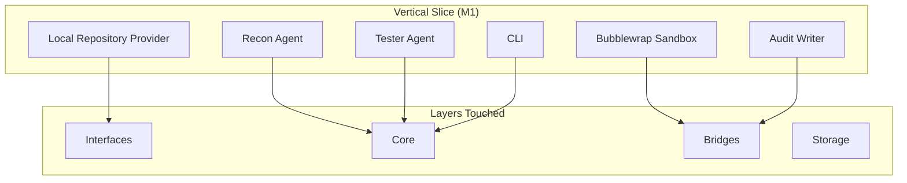
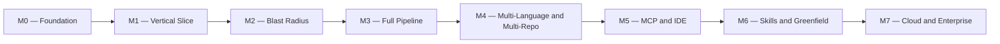
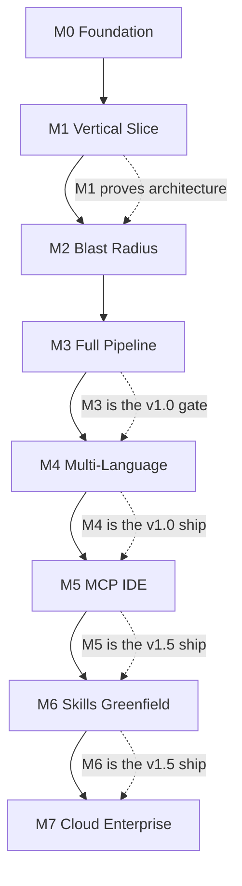
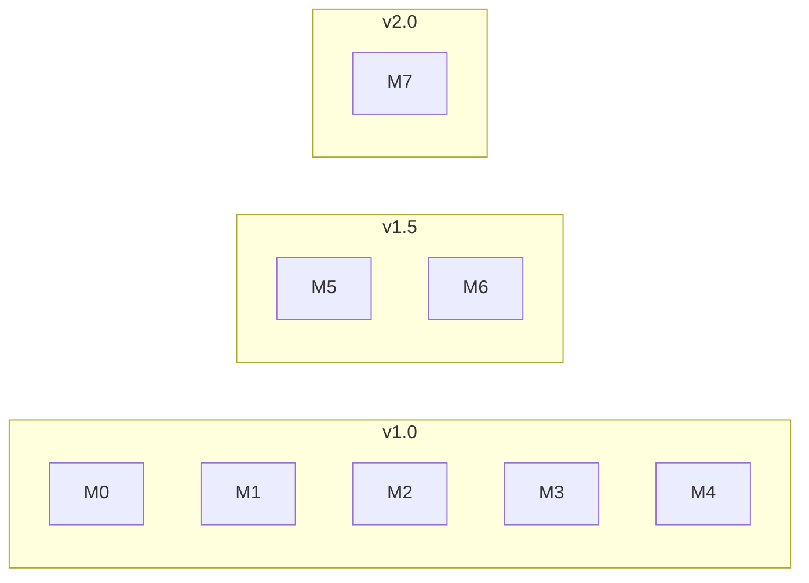

# 12 — Roadmap

---

## 1. Purpose

This document defines the build plan for CodeGuardian. It answers four questions:

1. **What gets built?**
2. **In what order?**
3. **What depends on what?**
4. **What ships in v1, v1.5, and v2?**

The roadmap is organized around **evidence gates**, not elapsed time. A milestone is complete when its exit criteria are met, not when a date passes. This follows the pattern used by production agentic AI projects, where the roadmap is organized around evidence gates rather than elapsed time alone.

The strategy is **vertical slices**. Each milestone delivers a usable, end-to-end capability. We do not build horizontal layers (all interfaces, then all providers, then all agents). We build thin slices that prove the architecture works before expanding.

---

## 2. The Vertical Slice Principle

A vertical slice is a thin, complete path through the system. It touches every layer — interface, core, bridge, sandbox, storage — but only for one narrow capability.

**Why vertical slices:** A horizontal layer approach (build all interfaces, then all providers, then all agents) delays integration until the end. By then, the architecture's assumptions are untested. A vertical slice tests the architecture on day one. If PyO3 batching does not work, or the sandbox does not isolate correctly, we find out in M1, not M6.

---

## 3. Milestone Overview

| Milestone | Name | Core Capability | Ships In |
|---|---|---|---|
| **M0** | Foundation | Scaffold, interfaces, config, storage, error taxonomy | — |
| **M1** | Vertical Slice | Recon + Tester + sandbox + audit, end-to-end on one file | — |
| **M2** | Blast Radius | CPG, caller resolution, contract detection, blast score | **v1.0** |
| **M3** | Full Pipeline | Analyst, Writer, three verifiers, checkpointing, consent | **v1.0** |
| **M4** | Multi-Language + Multi-Repo | TypeScript, GitHub, GitLab | **v1.0** |
| **M5** | MCP + IDE | MCP client, MCP server, VS Code extension | **v1.5** |
| **M6** | Skills + Greenfield | Skill library, Skill Curator, greenfield mode | **v1.5** |
| **M7** | Cloud + Enterprise | Firecracker, Bitbucket, Azure DevOps, signed audit | **v2.0** |

---

## 4. M0 — Foundation

**Goal:** Every module has an interface. Every interface has a contract test. The storage layer is configured. The error taxonomy is defined. The CLI skeleton runs.

This milestone produces **no user-visible capability**. It produces the skeleton that every subsequent milestone fills.

### 4.1 Tasks

| # | Task | Depends On | Exit Criterion |
|---|---|---|---|
| **M0-1** | Create the repository structure per `08-repository-structure.md` | — | All directories exist. |
| **M0-2** | Define all interfaces in `python/codeguardian/interfaces/` | M0-1 | 12 Protocol files exist. |
| **M0-3** | Create the Rust workspace with seven crates | M0-1 | `cargo build --workspace` succeeds. |
| **M0-4** | Set up PyO3 bindings skeleton | M0-3 | `maturin develop` succeeds. |
| **M0-5** | Configure SQLite with WAL mode and PRAGMAs | M0-1 | WAL mode verified by test. |
| **M0-6** | Define the error taxonomy and error codes | M0-1 | All error codes documented. |
| **M0-7** | Create the config loader and schema | M0-1 | `codeguardian config init` works. |
| **M0-8** | Create the CLI skeleton with `doctor` command | M0-1 | `codeguardian doctor` reports prerequisites. |
| **M0-9** | Set up CI pipeline (lint, type check, schema validation) | M0-1 | CI passes on a trivial commit. |
| **M0-10** | Write the first contract test suite (`RepositoryProviderContract`) | M0-2 | The contract test exists and fails (no implementation yet). |

### 4.2 Exit Criteria

| Criterion | How It Is Verified |
|---|---|
| All interfaces defined | Directory inspection. |
| Rust workspace builds | `cargo build --workspace` passes. |
| PyO3 bindings load | `python -c "import codeguardian"` passes. |
| SQLite WAL mode active | `PRAGMA journal_mode` returns `wal`. |
| `codeguardian doctor` runs | Command exits with status 0. |
| CI pipeline passes | GitHub Actions green. |

### 4.3 Risks

| Risk | Mitigation |
|---|---|
| PyO3 build fails on one platform | Test on all three platforms in M0-4. |
| Interface design is wrong | Interfaces are versioned. Changing them is expected. |
| Over-engineering the skeleton | Keep M0 minimal. No business logic. |

---

## 5. M1 — Vertical Slice

**Goal:** Run the pipeline end-to-end on one file. Prove that the architecture works: interface → core → bridge → sandbox → audit → CLI.

This milestone produces the **first working capability**: given a local repository and a target file, the agent writes characterization tests, runs them on the old code, and reports the result.

### 5.1 Tasks

| # | Task | Depends On | Exit Criterion |
|---|---|---|---|
| **M1-1** | Implement `LocalProvider` | M0-2 | Passes `RepositoryProviderContract`. |
| **M1-2** | Implement `Recon Agent` (Python only) | M1-1, M0-4 | Produces `recon.json` with languages and dependency graph. |
| **M1-3** | Implement Tree-sitter parsing in `codeguardian-kernel` | M0-3 | Parses Python files. Returns ASTs. |
| **M1-4** | Implement `BubblewrapBackend` (Linux) and `DockerBackend` (fallback) | M0-3 | Both pass `SandboxBackendContract`. Bubblewrap is the local Linux default. Docker is the fallback for Windows, CI, and Linux systems without user namespaces. |
| **M1-5** | Implement `Audit Writer` (JSON-RPC) | M0-3 | Writes hash-chained JSONL. |
| **M1-6** | Implement `Tester Agent` | M1-2 | Writes characterization tests for a target. |
| **M1-7** | Implement `JSONRPCBridge` | M0-4 | Sandbox and audit calls work. |
| **M1-8** | Implement `PyO3Bridge` (batched) | M0-4 | Parse files in one call. |
| **M1-9** | Wire the pipeline: Recon → Tester → Sandbox → Report | M1-5, M1-6, M1-7, M1-8 | End-to-end run on one file. |
| **M1-10** | Implement basic CLI output (Rich panels) | M1-9 | User sees recon output and test results. |

### 5.2 Exit Criteria

| Criterion | How It Is Verified |
|---|---|
| End-to-end run on a Python file | `codeguardian run --target utils/parser.py --directive "write tests"` completes. |
| Characterization tests pass on old code | Sandbox reports `passed`. |
| Audit log is written | `audit.jsonl` exists. Hash chain is valid. |
| Bubblewrap isolates the sandbox on Linux | Network is disabled. Host filesystem is inaccessible. User namespaces enforced. |
| Docker fallback works | Docker backend passes contract tests. Used when Bubblewrap is unavailable. |
| PyO3 batches correctly | 500 files parsed in one call. |
| CLI renders output | User sees Rich panels. |

### 5.3 Risks

| Risk | Mitigation |
|---|---|
| Bubblewrap unavailable on some Linux distros | Fallback to Docker backend. |
| Tree-sitter grammar missing | Bundle Python grammar. |
| PyO3 build complexity | Use `maturin`. Test on all platforms. |
| Sandbox isolation fails | Security tests catch it. |

### 5.4 What This Proves

M1 proves that the architecture works. It is the **gate**: if M1 succeeds, the rest is expansion. If M1 fails, the architecture needs rethinking before any more code is written.

---

## 6. M2 — Blast Radius

**Goal:** Compute the blast radius for any target. Build the Code Property Graph. Detect contract violations. Produce the blast score and recommendation.

This milestone adds the **structural intelligence** layer that no other coding agent has.

### 6.1 Tasks

| # | Task | Depends On | Exit Criterion |
|---|---|---|---|
| **M2-1** | Extend `codeguardian-kernel` to build CFG and PDG | M1-3 | CPG contains AST, CFG, and PDG edges. |
| **M2-2** | Implement incremental CPG updates | M2-1 | File change updates only the affected portion. |
| **M2-3** | Implement `Blast Radius Agent` | M1-2, M2-1 | Computes direct and transitive callers. |
| **M2-4** | Implement contract violation detection | M2-3 | Flags callers with semantic assumptions. |
| **M2-5** | Implement coverage gap identification | M2-3 | Flags callers with no test coverage. |
| **M2-6** | Implement blast score computation | M2-4, M2-5 | Score 0–100 with recommendation. |
| **M2-7** | Implement the runtime contract map (instrumented smoke test) | M1-4 | Captures call frequency and ordering. |
| **M2-8** | Add blast radius rendering to the CLI | M2-6 | User sees the Blast Radius Report. |

### 6.2 Exit Criteria

| Criterion | How It Is Verified |
|---|---|
| CPG built for a 50k-line repo | Full build completes. |
| Incremental update under 500ms | Timed test after a file change. |
| Blast radius computed for a target | `codeguardian blast --target utils/parser.py` completes. |
| Contract violations detected | On a curated benchmark, known violations are flagged. |
| Blast score is bounded | Property-based test: score is always 0–100. |
| Recommendation gate enforced | Pipeline stops at a block recommendation. |

### 6.3 Risks

| Risk | Mitigation |
|---|---|
| CPG build too slow | Incremental construction. Scoped graphs by default. |
| Contract detection false positives | Calibrate on a curated benchmark. |
| Blast score miscalibrated | Validate against actual breakage. |
| Graph memory usage too high | Columnar memory-mapped layout. |

---

## 7. M3 — Full Pipeline

**Goal:** Complete the pipeline. Add Analyst, Writer, three verifiers, checkpointing, and consent gates.

This milestone produces the **full refactoring capability** with independent verification.

### 7.1 Tasks

| # | Task | Depends On | Exit Criterion |
|---|---|---|---|
| **M3-1** | Implement `Analyst Agent` | M1-2 | Builds Context Pack. Expands when blast score is high. |
| **M3-2** | Implement `Writer Agent` | M3-1 | Produces diff according to directive. |
| **M3-3** | Implement `Correctness Verifier` | M3-2 | Fresh context. Diff only. |
| **M3-4** | Implement `Security Verifier` | M3-2 | Fresh context. Diff only. |
| **M3-5** | Implement `Contract Verifier` | M3-2, M2-4 | Checks contract assertions. |
| **M3-6** | Implement checkpointing with LangGraph | M3-1 | Resume from last checkpoint after crash. |
| **M3-7** | Implement plan approval gate | M3-1 | User approves scope before execution. |
| **M3-8** | Implement apply consent gate | M3-2 | User approves diff before apply. |
| **M3-9** | Implement per-run verification prompt | M3-3 | "Verify with a second model? (y/N)" |
| **M3-10** | Implement self-correction loop (max 3 retries) | M3-2 | Writer retries on test failure. |
| **M3-11** | Add three-verifier rendering to CLI | M3-3, M3-4, M3-5 | User sees all verdicts. |
| **M3-12** | Implement `ApplyProvider` | M3-8 | Applies diff after consent. Records rollback ref. |

### 7.2 Exit Criteria

| Criterion | How It Is Verified |
|---|---|
| Full pipeline runs end-to-end | `codeguardian run --target utils/parser.py --directive "add type hints"` completes. |
| Checkpointing resumes after crash | Kill the process mid-run. Restart. Resume from last checkpoint. |
| Plan approval gate works | Pipeline stops before Phase 0. Waits for approval. |
| Apply consent gate works | Pipeline produces diff. Waits for approval before apply. |
| Three verifiers run | Correctness, security, and contract verdicts recorded. |
| Self-correction loop works | Deliberately break refactor. Agent catches error. Retries. Succeeds. |
| No mutation without consent | Original repo unchanged after dry run. |

### 7.3 Risks

| Risk | Mitigation |
|---|---|
| Checkpointing bugs | Test crash-resume explicitly. |
| Verifier context leakage | Enforce fresh context construction. Test for independence. |
| Retry loop runaway | Hard cap at 3 retries. |
| Apply conflicts | Atomic apply with rollback reference. |

---

## 8. M4 — Multi-Language and Multi-Repo

**Goal:** Add TypeScript support. Add GitHub and GitLab providers.

This milestone makes CodeGuardian usable on real-world repositories.

### 8.1 Tasks

| # | Task | Depends On | Exit Criterion |
|---|---|---|---|
| **M4-1** | Implement `TypeScriptPlugin` | M1-3 | Parses TypeScript. Runs vitest. |
| **M4-2** | Implement `GitHubProvider` | M1-1 | Clones from GitHub. Passes contract. |
| **M4-3** | Implement `GitLabProvider` | M1-1 | Clones from GitLab. Passes contract. |
| **M4-4** | Add TypeScript sandbox environment | M1-4 | Node.js environment with npm. |
| **M4-5** | Implement `.codeguardianignore` parsing | M1-2 | Excludes node_modules, .venv, etc. |
| **M4-6** | Add multi-language detection to Recon | M1-2 | Detects Python + TypeScript in one repo. |
| **M4-7** | Add best-effort language warning to CLI | M4-6 | Warns when targeting best-effort language. |
| **M4-8** | Implement `SeatbeltBackend` (macOS) | M1-4 | Passes `SandboxBackendContract` on macOS. Becomes the default macOS backend. |

### 8.2 Exit Criteria

| Criterion | How It Is Verified |
|---|---|
| TypeScript refactor works | Full pipeline on a TypeScript file. |
| GitHub clone works | `codeguardian recon --url https://github.com/...` completes. |
| GitLab clone works | Same for GitLab. |
| Exclusions applied | `node_modules/` never scanned. |
| Multi-language repo detected | Detects both languages. |

### 8.3 Risks

| Risk | Mitigation |
|---|---|
| TypeScript reliability lower than Python | Label as best-effort. Warn at point of action. |
| GitHub rate limits | Handle with backoff. |
| GitLab self-hosted auth | Support PAT and OAuth. |

---

## 9. M5 — MCP and IDE

**Goal:** Expose CodeGuardian as an MCP server. Build the VS Code extension. Consume external MCP tools.

This milestone makes CodeGuardian a first-class citizen in the agent ecosystem.

### 9.1 Tasks

| # | Task | Depends On | Exit Criterion |
|---|---|---|---|
| **M5-1** | Implement MCP server (stdio + Streamable HTTP) | M3-1 | Tools are discoverable. |
| **M5-2** | Expose `codeguardian.refactor`, `.recon`, `.blast`, `.verify` | M5-1 | Each tool returns correct schema. |
| **M5-3** | Implement MCP client with dynamic discovery | M3-1 | Consumes ast-grep MCP. |
| **M5-4** | Implement progressive tool loading | M5-3 | Tools loaded on first use. |
| **M5-5** | Build VS Code extension skeleton | M5-1 | Extension activates. Connects to MCP server. |
| **M5-6** | Implement blast radius sidebar view | M5-5 | Renders blast report. |
| **M5-7** | Implement diff preview webview | M5-5 | Renders diff with verdict badges. |
| **M5-8** | Implement consent dialogs | M5-5 | Native VS Code modals. |
| **M5-9** | Package and publish extension | M5-5 | Extension available on Marketplace and Open VSX. |

### 9.2 Exit Criteria

| Criterion | How It Is Verified |
|---|---|
| MCP server responds | A third-party MCP client calls `codeguardian.blast`. |
| MCP client consumes tools | At least two external MCP tools integrated. |
| VS Code extension works | User right-clicks a function. Blast radius appears. |
| Consent dialogs work | User approves plan. Pipeline runs. |

### 9.3 Risks

| Risk | Mitigation |
|---|---|
| MCP protocol changes | Abstract behind `MCPClient` and `MCPServer` interfaces. |
| VS Code API changes | Use only public extension APIs. |
| Extension publish rejected | Follow Marketplace guidelines. Test in Open VSX first. |

---

## 10. M6 — Skills and Greenfield

**Goal:** Add the skill library and the Skill Curator. Add greenfield mode.

This milestone adds self-improvement and expands the use case beyond legacy code.

### 10.1 Tasks

| # | Task | Depends On | Exit Criterion |
|---|---|---|---|
| **M6-1** | Implement skill library (Markdown + SQLite FTS5 + sqlite-vec) | M3-1 | Skills stored, indexed, searchable. |
| **M6-2** | Implement `Skill Curator` agent | M6-1 | Proposes skills after successful runs. |
| **M6-3** | Implement skill approval gate | M6-2 | User approves before skill is stored. |
| **M6-4** | Implement skill retrieval | M6-1 | Skills retrieved by semantic similarity. |
| **M6-5** | Implement greenfield mode | M3-1 | Pipeline runs spec → plan → implement → test → verify. |
| **M6-6** | Add greenfield mode to CLI | M6-5 | `codeguardian run --mode greenfield` works. |

### 10.2 Exit Criteria

| Criterion | How It Is Verified |
|---|---|
| Skill stored after approval | `codeguardian skill list` shows the skill. |
| Skill retrieved and applied | Later run uses the skill. |
| Skill library rebuildable | Delete SQLite. Rebuild from Markdown. |
| Greenfield mode works | Full pipeline on a specification. |

### 10.3 Risks

| Risk | Mitigation |
|---|---|
| Skill quality low | User approval gate. Effectiveness scoring. |
| Skill library drifts | Markdown is the truth. Indexes are rebuildable. |
| Greenfield mode scope creep | Keep it simple. Spec → implement → verify. |

---

## 11. M7 — Cloud and Enterprise

**Goal:** Add Firecracker backend. Add Bitbucket and Azure DevOps. Add cryptographic audit signing.

This milestone makes CodeGuardian deployable in enterprise and multi-tenant environments.

### 11.1 Tasks

| # | Task | Depends On | Exit Criterion |
|---|---|---|---|
| **M7-1** | Implement `FirecrackerBackend` | M1-4 | Hardware isolation. Each execution gets its own kernel. |
| **M7-2** | Implement warm microVM pool | M7-1 | Warm claim under 10ms. |
| **M7-3** | Implement Bitbucket provider | M4-2 | Clones from Bitbucket. |
| **M7-4** | Implement Azure DevOps provider | M4-2 | Clones from Azure DevOps. |
| **M7-5** | Implement cryptographic audit signing | M1-5 | Each audit entry signed with GPG or Sigstore. |
| **M7-6** | Implement multi-tenant isolation | M7-1 | Tenants cannot see each other's data. |
| **M7-7** | Generate SBOM per release | M0-9 | CycloneDX or SPDX format. |
| **M7-8** | Implement signed releases | M0-9 | All artifacts signed with Sigstore. |

### 11.2 Exit Criteria

| Criterion | How It Is Verified |
|---|---|
| Firecracker isolates correctly | Security test: sandbox escape attempted. Fails. |
| Bitbucket clone works | Full pipeline on a Bitbucket repo. |
| Azure DevOps clone works | Same for Azure DevOps. |
| Audit entries signed | `codeguardian audit verify --signature` passes. |
| SBOM generated | Release artifact includes SBOM. |

### 11.3 Risks

| Risk | Mitigation |
|---|---|
| Firecracker requires KVM | Detect and warn. Fallback to Docker. |
| Multi-tenant complexity | Isolate at the microVM level. |
| Signing key management | Use Sigstore. No long-lived keys. |

---

## 12. Milestone Dependencies

**Critical path:** M0 → M1 → M2 → M3 → M4. This is the v1.0 path. Nothing in M5, M6, or M7 can start until M4 is complete.

**Parallel work opportunities:**

| Milestone | Parallel Work Possible |
|---|---|
| **M2** | Contract detection and coverage gap identification can be built in parallel. |
| **M3** | The three verifiers can be built in parallel. |
| **M4** | GitHub and GitLab providers can be built in parallel. |
| **M5** | MCP server and VS Code extension can be built in parallel. |
| **M6** | Skill library and greenfield mode can be built in parallel. |
| **M7** | Firecracker, Bitbucket, and Azure DevOps can be built in parallel. |

---

## 13. Release Mapping

| Release | Milestones | What Ships |
|---|---|---|
| **v1.0** | M0–M4 | Legacy refactoring, Python + TypeScript, local + GitHub + GitLab, blast radius, three verifiers, checkpointing, consent, audit trail. |
| **v1.5** | M5–M6 | MCP server and client, VS Code extension, skill library, Skill Curator, greenfield mode. |
| **v2.0** | M7 | Firecracker backend, Bitbucket, Azure DevOps, signed audit logs, multi-tenant isolation. |

---

## 14. Task Breakdown Summary

| Milestone | Tasks | Estimated Complexity |
|---|---|---|
| **M0** | 10 | Low. Skeleton and interfaces. |
| **M1** | 10 | High. Proves the architecture. PyO3, sandbox, first agent. |
| **M2** | 8 | High. CPG, blast radius, contract detection. |
| **M3** | 12 | High. Full pipeline, checkpointing, three verifiers. |
| **M4** | 7 | Medium. TypeScript, GitHub, GitLab. |
| **M5** | 9 | Medium. MCP, extension. |
| **M6** | 6 | Medium. Skills, greenfield. |
| **M7** | 8 | High. Firecracker, enterprise. |
| **Total** | **70** | |

---

## 15. Definition of Done Per Milestone

A milestone is complete when:

| # | Criterion |
|---|---|
| **1** | Every task in the milestone has an exit criterion that passes. |
| **2** | Every new interface has a contract test. |
| **3** | Every new implementation passes its contract test. |
| **4** | Every new module has unit tests with 80% coverage. |
| **5** | Every new schema validates. |
| **6** | The CI pipeline is green. |
| **7** | The changelog has an entry for the milestone. |
| **8** | The demo for the milestone works. |

---

## 16. What Is Explicitly Deferred

| Capability | Deferred To | Why |
|---|---|---|
| Bitbucket | v2.0 | Provider interface supports it. Adapter is v2. |
| Azure DevOps | v2.0 | Same. |
| Firecracker | v2.0 | Not needed for local CLI. Cloud and enterprise only. |
| Cryptographic audit signing | v2.0 | Structured provenance is sufficient for v1. |
| Multi-tenant isolation | v2.0 | Cloud-only requirement. |
| Edge-case verifier | Post-v2 | Two verifiers are sufficient for v1. |
| Simplicity verifier | Post-v2 | Same. |
| Formal verification | Post-v2 | Research-grade. Not a v1 requirement. |
| Cross-repo refactor | Post-v2 | Out of scope. |
| Production runtime instrumentation | Post-v2 | Sandbox smoke test is the v1 mechanism. |

---

## 17. The v1.0 Gate

**v1.0 ships when M4 is complete.** The gate is:

| # | Gate Criterion |
|---|---|
| **1** | Full pipeline runs end-to-end on Python and TypeScript. |
| **2** | Blast radius computed for every target. |
| **3** | Contract violations detected. |
| **4** | Three verifiers run. |
| **5** | Checkpointing works. |
| **6** | Consent gates enforced. |
| **7** | Audit trail written. |
| **8** | Self-correction loop demonstrated. |
| **9** | Local, GitHub, and GitLab providers work. |
| **10** | `.codeguardianignore` excludes node_modules. |
| **11** | Bubblewrap is the default local Linux backend. Docker is the fallback. Both pass contract tests. |

If any gate criterion fails, v1.0 does not ship. No exceptions.

---

## 18. Related Documents

- `03-requirements.md` — requirements that each milestone satisfies
- `04-architecture.md` — components built in each milestone
- `05-data-model.md` — schemas produced in each milestone
- `06-api-contracts.md` — interfaces implemented in each milestone
- `07-tech-stack.md` — technologies used in each milestone
- `08-repository-structure.md` — where each milestone's code lives
- `10-testing-cicd-deployment.md` — how each milestone is verified
- `13-risks-assumptions-decisions.md` — risks for each milestone
