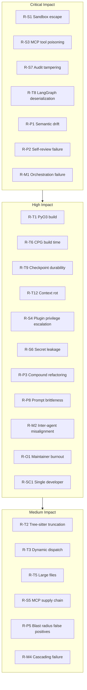

# 13 — Risks, Assumptions, and Decisions

---

## 1. Purpose

This document is the institutional memory of CodeGuardian. It records what could go wrong, what we are treating as true without proof, and what we decided and why.

Without this document, the same arguments happen twice. With it, every choice has a traceable reason, every assumption is flagged, and every risk has a named mitigation.

The document has four parts:

1. **Risk Register** — every identified risk, its category, probability, impact, and mitigation.
2. **Assumptions** — every unproven belief, what depends on it, and what happens if it is false.
3. **Open Questions** — every unresolved question, with a placeholder for the answer.
4. **Decision Log** — every significant decision, with its rationale and alternatives.

---

## 2. Risk Register

Risks are organized into six categories: Technical, Security, Product, Multi-Agent, Open-Source, and Schedule.

Each risk has an ID, a description, a probability (Low / Medium / High), an impact (Low / Medium / High / Critical), and a mitigation.

### 2.1 Technical Risks

These are risks arising from the hybrid Python/Rust architecture, the parsing layer, the graph, and the tooling.

| ID | Risk | Probability | Impact | Mitigation |
|---|---|---|---|---|
| **R-T1** | **PyO3 build fails on one platform.** Cross-platform wheels, Python ABI, macOS universal binaries. Most "works on my machine, fails in CI" boundary bugs originate at the PyO3 boundary. | High | High | Test on all three platforms in M0. Use `maturin`. Pin `target-dir`. CI matrix covers Linux, macOS (Intel + Apple Silicon), Windows. |
| **R-T2** | **Tree-sitter parsing silently truncates.** A null byte in source causes Tree-sitter's C binding to treat it as a null-terminated C-string terminator, silently dropping methods from the index with no warning. | Medium | High | Detect null bytes before parsing. Fail loudly, not silently. Validate parse results against expected node counts. |
| **R-T3** | **Tree-sitter cannot resolve dynamic dispatch.** Tree-sitter sees a call to `handler` but cannot resolve which function `handlers[req.method]` points to. Static call graphs miss dynamic dispatch, dependency injection, event handlers, and framework routing. | High | High | Supplement with the runtime contract map from the instrumented smoke test. Document known limitations. |
| **R-T4** | **Tree-sitter is too simple for some domains.** Kernel struct definitions, embedded HTML/Vue symbols, and complex DSLs fail to parse accurately. | Medium | Medium | Label these languages as best-effort. Exclude unsupported constructs. Warn the user. |
| **R-T5** | **Large files crash Tree-sitter.** Native Tree-sitter in some runtimes requires callback-based parsing for files larger than 32KB, causing crashes or incorrect classifications. | Medium | Medium | Set parse timeouts. Split large files. Cache parse trees keyed by `(filePath, contentHash)`. |
| **R-T6** | **CPG build is too slow.** A full CPG build for a large repository takes minutes. If incremental updates do not work correctly, every run pays the full cost. | Medium | High | Incremental construction. Scoped graphs by default. Cache graphs per commit. Benchmark on every PR. |
| **R-T7** | **CPG memory usage too high.** The graph is large. If the columnar memory-mapped layout does not deliver the expected memory reduction, large repositories will exhaust memory. | Medium | High | Use the flatgraph pattern. Monitor peak RSS in CI. Fall back to scoped graphs when memory is constrained. |
| **R-T8** | **LangGraph checkpoint deserialization is unsafe.** LangGraph's `JsonPlusSerializer` and msgpack checkpointers can reconstruct Python objects from JSON payloads, enabling arbitrary code execution if an attacker can modify checkpoint data in the backing store. | Medium | Critical | Treat checkpoints as untrusted input. Validate before deserialization. Restrict write access to the checkpoint store. Pin the LangGraph version. |
| **R-T9** | **LangGraph checkpointing is not durable execution.** LangGraph saves state but does not detect whether the process running the next node is still active, restart the run if that process terminates, or prevent duplicate execution. A process crash during an OOM kill leaves checkpoints stranded without automated resume. | High | High | Add a supervisor/watchdog. Detect crashed runs. Resume from the last successful checkpoint. Prevent duplicate execution with leases. |
| **R-T10** | **Bridge batching is not enough.** If cross-boundary calls are not batched correctly, PyO3 overhead dominates. A single PyO3 call costs roughly the same as 200 floating-point multiplies. | Medium | Medium | Enforce batching in the bridge interface. Test with 500-file batches. Benchmark per phase. |
| **R-T11** | **SQLite WAL mode fails on network filesystems.** WAL mode requires shared memory. On NFS or SMB, it silently fails or corrupts. | Low | High | Detect network filesystems. Fall back to `journal_mode = DELETE`. Document the limitation. |
| **R-T12** | **Context rot degrades model output.** Production data from leading AI coding tools shows models begin failing at around 25–30k tokens, far below their advertised context windows. Context rot takes four shapes: poisoning, distraction, confusion, and clash. | High | High | Enforce a strict Context Pack budget. Curate context, not volume. Never send the full repository. |

### 2.2 Security Risks

| ID | Risk | Probability | Impact | Mitigation |
|---|---|---|---|---|
| **R-S1** | **Sandbox escape via kernel exploit.** Docker and Bubblewrap share the host kernel. A kernel vulnerability can be exploited to escape the sandbox. Bubblewrap and rootless Podman may actually open a bigger attack surface through user namespaces. | Medium | Critical | Tiered backends. Firecracker for untrusted code. Defense in depth: network isolation, CPU/memory quotas, process limits, drop all capabilities, seccomp filters. |
| **R-S2** | **Firecracker escape CVE.** Two of three microVM engines now carry escape-class CVEs on public record within a ~4-month period. Firecracker's jailer had a symlink-based host file overwrite vulnerability (CVE-2026-1386). Cloud Hypervisor had an escape-class CVE (CVE-2026-45782). | Medium | Critical | Keep Firecracker patched. Use the jailer. Treat microVMs as one layer, not the only layer. Defense in depth. |
| **R-S3** | **MCP tool poisoning.** Malicious instructions embedded within a tool's metadata (name, schema, description) without execution. Evaluation on 20 prominent LLM agents revealed a widespread vulnerability, with one model achieving an attack success rate of 72.8%. The harmful actions occur only after a seemingly correct tool has been invoked. | High | Critical | Validate every MCP tool description and schema. Use `mcp-scan` or equivalent. Treat tool descriptions as untrusted input. Human approval for new MCP servers. |
| **R-S4** | **MCP plugin privilege escalation.** Insufficient privilege separation enables privilege escalation, misinformation propagation, and data tampering. Less popular plugins often contain disproportionately high-risk operations. | High | High | Manifest-declared permissions. Enforce at the Policy Engine. Reject undeclared access. Audit every plugin. |
| **R-S5** | **MCP supply chain attack.** The system installs MCP connectors or plugins without signing or provenance checks. Plugin code is allowed to perform network calls without review. | Medium | Critical | Sign plugins. Verify provenance. Sandbox plugin execution. Require network declarations. |
| **R-S6** | **Secret leakage in logs or audit entries.** API keys, tokens, and passwords written to logs or audit entries. | Medium | High | Three-layer redaction: pre-log filter, pattern filter, Rust masking engine. Tests inject known secrets into every logging path. |
| **R-S7** | **Audit log tampering.** A compromised Python process modifies the audit log. | Low | Critical | Audit writer runs as a separate Rust process. Python never has a file handle. Hash-chained JSONL. Chain verification. |
| **R-S8** | **Malicious target code escapes the sandbox and reads secrets.** | Medium | Critical | Network isolation. Credential store reads denied. Host filesystem inaccessible. Secret redaction. |
| **R-S9** | **Path traversal.** A malicious repository tricks the agent into reading or writing unintended files. | Medium | High | Validate every path against the repository root. Resolve and check symlinks. |
| **R-S10** | **Model generates malicious code.** A compromised or misaligned model injects harmful code into the refactor. | Low | High | Independent verification. Security verifier. Consent gate. Diff preview. |

### 2.3 Product Risks

| ID | Risk | Probability | Impact | Mitigation |
|---|---|---|---|---|
| **R-P1** | **Semantic drift is not caught by tests.** All six LLMs struggle to preserve program semantics during refactoring, even when explicitly instructed to avoid unsafe rewriting. Approximately 26% of refactorings introduce substantial risk of semantic deviation. | High | Critical | Contract assertions. Independent verifiers. Blast radius analysis. Property-based testing. Document that tests passing does not guarantee behavior preservation. |
| **R-P2** | **Self-review is not a safety net.** Self-review by the producing model catches only ~68% of semantic drift. The dangerous outcome is the model declaring behavior preserved when it is not. | High | Critical | Independent verifiers on a different model family. Fresh context. Diff-only input. No access to the original or the writer's reasoning. |
| **R-P3** | **Compound refactorings fail.** SWE-Refactor shows that an OpenAI Codex agent achieves only 39.4% success on compound refactorings. Complex and compound refactorings remain the primary source of failures. | High | High | Break compound refactorings into smaller targets. Document the limitation. Warn the user. |
| **R-P4** | **Reliability varies sharply across languages.** Even the strongest agent resolves a fraction of tasks in Java, Go, and C/C++ compared to Python. | High | Medium | Tiered reliability. Python and TypeScript are high-reliability. Other languages are best-effort. Warn at the point of action. |
| **R-P5** | **Blast radius false positives.** Counting all callers equally creates false positives. A function with 90 callers where 85 are tests is not a high-risk change target. | Medium | Medium | Classify callers by type. Weight by test coverage. Calibrate the blast score on a curated benchmark. |
| **R-P6** | **Blast radius false negatives.** A contract violation that the blast radius report misses is caught later by a runtime test. | Medium | High | Runtime contract map. Property-based testing. Coverage gap identification. Anti-metric: this is a release blocker. |
| **R-P7** | **Documentation drift.** The docs claim a capability the code does not deliver. This is the failure the project exists to prevent. | Medium | High | Truth Report. Anti-metric: this is a release blocker. Docs are validated against the code in CI. |
| **R-P8** | **Prompt brittleness and model drift.** A prompt that works today might work less reliably tomorrow because the underlying model's weight distribution shifted. Prompt decay accounts for 29% of agent failures. | High | High | Version prompts. Test against multiple model versions. Track prompt effectiveness. Use structured schemas, not free-form text. |
| **R-P9** | **Prompt debt.** Hand-tuning natural-language prompts accrues technical debt — brittle, repetition-laden instructions that slow iteration and lock the system to one model. | High | Medium | Structured schemas over natural language. Version prompts. Test against multiple models. Document why each prompt change was made. |
| **R-P10** | **Context poisoning.** A malicious or incorrect fact enters the context and influences the model's behavior. | Medium | High | Curate context. Validate every fact. Never trust unverified input. |

### 2.4 Multi-Agent Risks

| ID | Risk | Probability | Impact | Mitigation |
|---|---|---|---|---|
| **R-M1** | **Orchestration failure dominates.** Failure analyses across seven frameworks and 1,600+ execution traces show that plan abandonment, state corruption, and tool-management errors dominate. The dominant failure mode is orchestration, not reasoning. | High | Critical | Centralized orchestrator. Structured artifacts. Phase gates. Checkpointing. Test orchestration explicitly. |
| **R-M2** | **Inter-agent misalignment.** 36.9% of failures in the MAST taxonomy stem from inter-agent misalignment, including role boundary violations, information withholding, and reasoning-action mismatches. | High | High | Strict role boundaries. Structured handoffs. No peer-to-peer delegation. Single writer. Fresh verifier context. |
| **R-M3** | **Task verification failure.** 21.3% of failures stem from task verification failures. | High | High | Independent verifiers. Contract assertions. Property-based testing. Three verification lenses. |
| **R-M4** | **Cascading failure.** The same message passing that lets agents collaborate also lets a single agent's mistake spread. | Medium | High | Fault barrier. Plugin isolation. Phase gates. Validation at every boundary. |
| **R-M5** | **Coordination deadlock.** Two agents enter a coordinated search deadlock, repeatedly covering overlapping regions while missing unexplored areas. | Medium | Medium | Centralized orchestrator. No peer-to-peer delegation. Bounded phases. Timeouts. |
| **R-M6** | **Groupthink and shared blind spots.** Agents converge on the same wrong answer because they share the same context or the same model. | Medium | High | Cross-model verification. Different model families for writer and verifiers. Independent context construction. |

### 2.5 Open-Source Risks

| ID | Risk | Probability | Impact | Mitigation |
|---|---|---|---|---|
| **R-O1** | **Maintainer burnout.** The burden of maintenance falls on the maintainer's free time, eventually leading to burnout. Knowledge concentration is limited to one or a very few individuals. | High | High | Modular architecture. Plugin system. Contract tests that make contributions safe. Documentation that lets others contribute. Clear governance. |
| **R-O2** | **Contributor onboarding fails.** A new contributor cannot understand the project from the documentation alone. | Medium | Medium | Skills.md. Docs written for a fresh reader. Onboarding path. Contract tests as a contribution guide. |
| **R-O3** | **Plugin ecosystem fragments.** Incompatible plugin versions. No shared contract. | Medium | Medium | Semantic versioning of interfaces. Contract tests. N and N-1 compatibility. |
| **R-O4** | **Governance ambiguity.** Open-source AI agent projects face urgent questions around cybersecurity, accountability, liability, and human oversight. | Medium | Medium | Clear governance model. Decision log. License clarity. Code of conduct. |
| **R-O5** | **Fork stalls.** Even well-funded forks can stall. | Medium | Medium | Ship incrementally. Prove value at each milestone. Build a user base before expanding scope. |

### 2.6 Schedule Risks

| ID | Risk | Probability | Impact | Mitigation |
|---|---|---|---|---|
| **R-SC1** | **Single developer.** A solo developer cannot sustain the full scope. | High | High | Vertical slices. Cut scope ruthlessly. Ship v1 with M0–M4 only. Defer M5–M7. |
| **R-SC2** | **Integration surprises.** PyO3, Firecracker, Bubblewrap, LangGraph checkpointing, CPG incremental updates, and MCP all have sharp edges. Each takes days to debug. | High | High | Test in isolation before integration. Contract tests. CI matrix. Build the vertical slice first. |
| **R-SC3** | **External dependency breaks.** A model provider changes its API. A framework releases a breaking change. | Medium | Medium | Abstract behind interfaces. Pin versions. Test against multiple providers. |
| **R-SC4** | **Scope creep.** The project grows beyond what one person can build. | High | High | This document. Non-goals. Release mapping. The v1.0 gate. |
| **R-SC5** | **Model cost exceeds budget.** Token consumption is unpredictable. | Medium | Medium | Context Pack budget. Retry cap. Cost visibility in run summary. Local model support. |

---

## 3. Assumptions

Assumptions are things we are treating as true without proof. Each assumption has an ID, a statement, what depends on it, and what happens if it turns out false.

| ID | Assumption | What Depends On It | If False |
|---|---|---|---|
| **A-1** | Tree-sitter covers the languages we need (Python, TypeScript, JavaScript, and 100+ others). | Multi-language reconnaissance and parsing. | Fall back to language-specific parsers. Narrow the language scope. |
| **A-2** | PyO3 batching is fast enough for the hot path. | Code Intelligence Kernel, Blast Radius Engine, Policy Engine. | Move to subprocess with JSON-RPC for more zones. Accept higher latency. |
| **A-3** | Models can write usable characterization tests. | Safety net, Tester agent. | Lower the safety net to example-based tests only. Add human review. |
| **A-4** | Users want opt-in verification, not forced. | Per-run verification prompt. | Make cross-model verification default-on. Accept higher cost. |
| **A-5** | The local sandbox is the primary use case, not cloud. | Bubblewrap and Seatbelt backends. | Prioritize Firecracker. Change the default backend. |
| **A-6** | Scoped graphs are sufficient for most targets. | Default CPG construction mode. | Default to full-repo graphs. Accept longer reconnaissance time. |
| **A-7** | The skill library should be global, not per-repo. | Skill storage and retrieval. | Add per-repo overrides. Merge retrieval results. |
| **A-8** | LangGraph is the right orchestrator. | Orchestrator implementation. | Abstract interface already exists. Swap the implementation. |
| **A-9** | SQLite is sufficient for the index, checkpoints, and skills. | Storage architecture. | Add PostgreSQL for multi-tenant deployments. |
| **A-10** | Markdown is the right source of truth for skills. | Skill library. | Migrate to a structured format. Add a converter. |
| **A-11** | The MCP server should start on demand, not automatically. | CLI lifecycle. | Start it with the CLI. Accept the overhead. |
| **A-12** | Users will approve the plan before execution. | Plan approval gate. | Add an auto-approve mode for trusted repositories. |
| **A-13** | Contract assertions catch enough implicit contracts. | Contract verifier, blast radius accuracy. | Supplement with property-based testing. Add more lenses. |
| **A-14** | The runtime contract map from the smoke test is representative. | Blast radius accuracy. | Supplement with production telemetry (requires user opt-in). |
| **A-15** | `.codeguardianignore` is sufficient for exclusions. | Reconnaissance speed, graph correctness. | Add per-language built-in exclusions. Expand Tier 1. |

---

## 4. Open Questions

Open questions are tracked so nothing is forgotten. Each has a placeholder for the answer and a date when it was resolved.

| ID | Question | Status | Answer | Date Resolved |
|---|---|---|---|---|
| **Q-1** | Should the default CPG be scoped or full-repo? | Resolved | Scoped by default. Full-repo on request. | 2026-10-06 |
| **Q-2** | Should cross-model verification be default-on for the first run? | Open | — | — |
| **Q-3** | Should the skill library be per-repo, global, or both? | Resolved | Global. Per-repo conventions live in `recon.json`. | 2026-10-06 |
| **Q-4** | What is the minimum supported terminal for the CLI? | Open | — | — |
| **Q-5** | Should the MCP server auto-start with the CLI? | Resolved | On demand. Not automatic. | 2026-10-06 |
| **Q-6** | Should the audit log include a Merkle root at the end of each run? | Open | — | — |
| **Q-7** | Should cache entries store the full payload or just a pointer? | Open | — | — |
| **Q-8** | Should the plugin registry persist across sessions? | Open | — | — |
| **Q-9** | How strict should behavioral equivalence be in v1? | Open | — | — |
| **Q-10** | Which specific cloud models are the default recommendations? | Open | — | — |
| **Q-11** | Is there a per-run or per-file budget ceiling? | Open | — | — |
| **Q-12** | Should the audit log be cryptographically signed in v1? | Resolved | No. Structured provenance and hash chaining only. | 2026-10-06 |
| **Q-13** | Should the default sandbox backend on Windows be Docker or WSL2? | Open | — | — |
| **Q-14** | Should the Blast Radius Report include a confidence interval? | Open | — | — |
| **Q-15** | Should the Skill Curator run after every run or on a schedule? | Resolved | On user approval, after the run completes. | 2026-10-06 |

---

## 5. Decision Log

Every significant decision, with its rationale, alternatives, and status. Nothing is deleted. When a decision is reversed or updated, the log records the change.

| ID | Date | Decision | Rationale | Alternatives Considered | Status |
|---|---|---|---|---|---|
| **D-001** | 2026-10-03 | Python + Rust hybrid architecture. | Python for AI ecosystem and iteration speed. Rust for memory safety and deterministic performance. | Python-only (rejected: parser and sandbox need memory safety). Rust-only (rejected: AI ecosystem is Python-first). Go (rejected: GC pauses, narrower security coverage). | Active |
| **D-002** | 2026-10-04 | PyO3 for trusted, high-volume calls. JSON-RPC over stdio for untrusted or isolation-critical calls. | PyO3 is fast but in-process. JSON-RPC is isolated but slower. The choice is determined by the zone's trust requirements. | PyO3 only (rejected: a Rust panic can crash Python). JSON-RPC only (rejected: too slow for the hot path). | Active |
| **D-003** | 2026-10-04 | Code Property Graph built incrementally. Scoped by default. Full-repo on request. | Full CPG build for a large repository takes minutes. Incremental updates take milliseconds. Scoped graphs keep the first run interactive. | Always full-repo (rejected: too slow for the first run). No CPG (rejected: loses structural understanding). | Active |
| **D-004** | 2026-10-04 | Independent verifiers, out-of-graph, fresh context. | Self-review catches only ~68% of semantic drift. A fresh model instance with diff-only context catches more. | In-graph verifiers (rejected: inherit context and blind spots). Single verifier (rejected: three lenses catch more). | Active |
| **D-005** | 2026-10-04 | Markdown + SQLite FTS5 + sqlite-vec for the skill library. | Markdown is the truth. SQLite and vector indexes are derived and rebuildable. No external vector database. | SQLite-only (rejected: not human-readable). External vector DB (rejected: adds a service dependency). | Active |
| **D-006** | 2026-10-05 | Tiered sandbox backends behind one interface. | Bubblewrap for local Linux. Seatbelt for local macOS. Firecracker for cloud. Docker for CI and Windows. | Docker-only (rejected: slower, requires a daemon). Bubblewrap-only (rejected: Linux-only). | Active |
| **D-007** | 2026-10-05 | LangGraph behind an abstract Orchestrator interface. | LangGraph provides durable execution, per-phase subgraphs, and checkpointing. The abstract interface means LangGraph can be replaced. | LangGraph directly (rejected: couples the core to a framework). No framework (rejected: reinventing checkpointing). | Active |
| **D-008** | 2026-10-05 | Read-only Repository Provider. Separate Apply Provider. | The trust contract. The agent never touches real code without explicit consent. | Single provider with a write method (rejected: violates the consent model). | Active |
| **D-009** | 2026-10-05 | Per-run verification prompt. Default is no. | Transparency over coercion. The user decides when the extra safety is worth the extra cost. | Default-on (rejected: multiplies cost on every run). Default-off with no prompt (rejected: hides the option). | Active |
| **D-010** | 2026-10-06 | User approval for every skill before it enters the library. | The consent principle applies to knowledge, not just code. | Auto-store (rejected: risk of skill pollution). | Active |
| **D-011** | 2026-10-06 | Greenfield mode deferred to v1.5. | Legacy mode is the harder problem. Get it right first. | Ship both in v1 (rejected: scope too large). | Active |
| **D-012** | 2026-10-06 | Apache 2.0 license. | Permissive, patent-protected, enterprise-friendly. | MIT (rejected: no patent protection). GPL (rejected: blocks proprietary forks). | Active |
| **D-013** | 2026-10-06 | Three verifiers in v1: correctness, security, contract. | Three lenses catch most real problems without exploding cost. | One verifier (rejected: misses security and contract issues). Four verifiers (rejected: adds edge-case and simplicity, deferred). | Active |
| **D-014** | 2026-10-06 | Blast radius analysis before any change. | The target function is never the unit of safety. The target and its callers are the unit of safety. | Skip blast radius (rejected: cross-file context blindness is the most dangerous failure mode). | Active |
| **D-015** | 2026-10-06 | Runtime contract map from the instrumented smoke test. | Static analysis cannot see dynamic dispatch, dependency injection, event handlers, or framework routing. | Static-only (rejected: misses runtime-only dependencies). | Active |
| **D-016** | 2026-10-06 | Full clone before any analysis. Phase gates. No writes until every phase passes and the user approves. | Creates a hard boundary between the agent's world and the user's world. | Partial clone (rejected: risks missing dependencies). | Active |
| **D-017** | 2026-10-06 | Checkpointing with resume-from-last-checkpoint. Never restart. | Preserves expensive LLM tokens and time. A run can be paused for hours or days and resumed. | No checkpointing (rejected: every failure restarts from scratch). | Active |
| **D-018** | 2026-10-06 | VS Code extension, not a fork. | A fork requires maintaining 2 million lines of TypeScript. An extension ships in weeks, works in all VS Code-based editors, and doesn't require forking. | Fork VS Code (rejected: months of work, constant rebasing, high risk of stalling). | Active |
| **D-019** | 2026-10-06 | MCP both as client and server. | Positions CodeGuardian as a first-class citizen in the agent ecosystem, not a silo. | Client-only (rejected: doesn't expose capability). Server-only (rejected: doesn't consume existing tools). | Active |
| **D-020** | 2026-10-06 | Dynamic MCP tool discovery with progressive loading. | Loading all tool definitions upfront wastes tokens, increases latency, and degrades model performance. | Static tool list (rejected: doesn't scale, requires documentation updates). | Active |
| **D-021** | 2026-10-06 | `.codeguardianignore` plus Tier 1 built-in exclusions. | `node_modules`, `.venv`, `vendor`, `dist`, `build`, `target`, and `.env` are never scanned. For a typical Node.js project, this reduces the file count by ~99%. | No exclusions (rejected: scanning `node_modules` would burst the system). | Active |
| **D-022** | 2026-10-06 | Local model support via OpenAI-compatible endpoints. | Ollama, vLLM, llama.cpp, and LM Studio all expose this interface. No custom adapter required. | Custom adapters per runtime (rejected: unnecessary duplication). | Active |
| **D-023** | 2026-10-06 | Audit log: JSONL, hash-chained, written by a separate Rust process. | Tamper-evidence requires isolation. Python never has a file handle to the log. | SQLite audit table (rejected: not append-only, not portable). | Active |
| **D-024** | 2026-10-06 | Structured provenance, not cryptographic signing, in v1. | Open source means anyone can fork and modify the logging. Structured provenance is honest about what it is. Signing is a v2 enhancement. | GPG signing in v1 (rejected: complexity not justified for v1). | Active |
| **D-025** | 2026-10-06 | Skill library is global, not per-repo. | Language patterns are universal. Cross-project learning is the point. Per-repo conventions live in `recon.json`. | Per-repo only (rejected: no cross-project transfer). | Active |
| **D-026** | 2026-10-06 | No third language. Python + Rust only. | Go is the only contender, and it loses to Rust on sandbox security and parser performance. | Go for orchestration (rejected: GC pauses, narrower security coverage). | Active |
| **D-027** | 2026-10-07 | Vertical slices, not horizontal layers. | A horizontal approach delays integration until the end. A vertical slice tests the architecture on day one. | Horizontal layers (rejected: architecture assumptions untested until late). | Active |
| **D-028** | 2026-10-07 | v1.0 ships with M0–M4 only. | Legacy refactoring, Python + TypeScript, local + GitHub + GitLab, blast radius, three verifiers, checkpointing, consent, audit trail. | Include M5–M7 in v1 (rejected: scope too large for a solo developer). | Active |
| **D-029** | 2026-10-07 | Blast radius gate: proceed, review, block. | A raw count of callers is not a risk assessment. A calibrated score with an explicit recommendation turns the analysis into a decision. | No gate (rejected: high blast radius changes proceed silently). | Active |
| **D-030** | 2026-10-07 | Contract assertions: natural language + test expression. | Natural language captures the assumption. A test expression makes it checkable. Both are required. | Natural language only (rejected: not checkable). Test expression only (rejected: misses the human-readable assumption). | Active |

---

## 6. Risk Heat Map

---

## 7. Mitigation Priority

Mitigations are prioritized by risk severity.

| Priority | Risk | Mitigation | Milestone |
|---|---|---|---|
| **P0** | R-S1 Sandbox escape | Tiered backends. Firecracker for untrusted code. Defense in depth. | M1, M7 |
| **P0** | R-P1 Semantic drift | Contract assertions. Independent verifiers. Blast radius analysis. | M2, M3 |
| **P0** | R-P2 Self-review failure | Independent verifiers on a different model family. Fresh context. Diff-only. | M3 |
| **P0** | R-M1 Orchestration failure | Centralized orchestrator. Phase gates. Checkpointing. | M3 |
| **P0** | R-S3 MCP tool poisoning | Validate every MCP tool description and schema. Human approval for new servers. | M5 |
| **P1** | R-T1 PyO3 build | CI matrix. Maturin. Pin `target-dir`. | M0 |
| **P1** | R-T9 Checkpoint durability | Supervisor. Detect crashed runs. Resume. Prevent duplicate execution. | M3 |
| **P1** | R-T12 Context rot | Strict Context Pack budget. Curate context, not volume. | M2 |
| **P1** | R-P8 Prompt brittleness | Version prompts. Test against multiple model versions. | M3 |
| **P1** | R-SC1 Single developer | Vertical slices. Cut scope. Ship v1 with M0–M4. | All |
| **P2** | R-T2 Tree-sitter truncation | Detect null bytes. Fail loudly. | M1 |
| **P2** | R-T6 CPG build time | Incremental construction. Scoped graphs. | M2 |
| **P2** | R-P3 Compound refactoring | Break into smaller targets. Document the limitation. | M3 |
| **P2** | R-P5 Blast radius false positives | Classify callers by type. Weight by test coverage. | M2 |
| **P2** | R-S4 Plugin privilege escalation | Manifest-declared permissions. Enforce at the Policy Engine. | M1 |
| **P2** | R-S6 Secret leakage | Three-layer redaction. Tests inject known secrets. | M1 |

---

## 8. Related Documents

- `01-project-overview.md` — vision and positioning
- `02-goals-non-goals-metrics.md` — goals, non-goals, and anti-metrics
- `03-requirements.md` — requirements derived from these risks
- `04-architecture.md` — components that implement the mitigations
- `10-testing-cicd-deployment.md` — how mitigations are verified
- `11-security-performance-observability.md` — the security and performance architecture
- `12-roadmap.md` — milestones where mitigations are implemented
