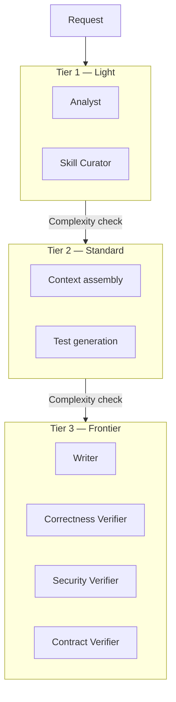
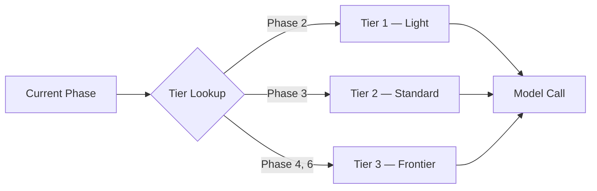
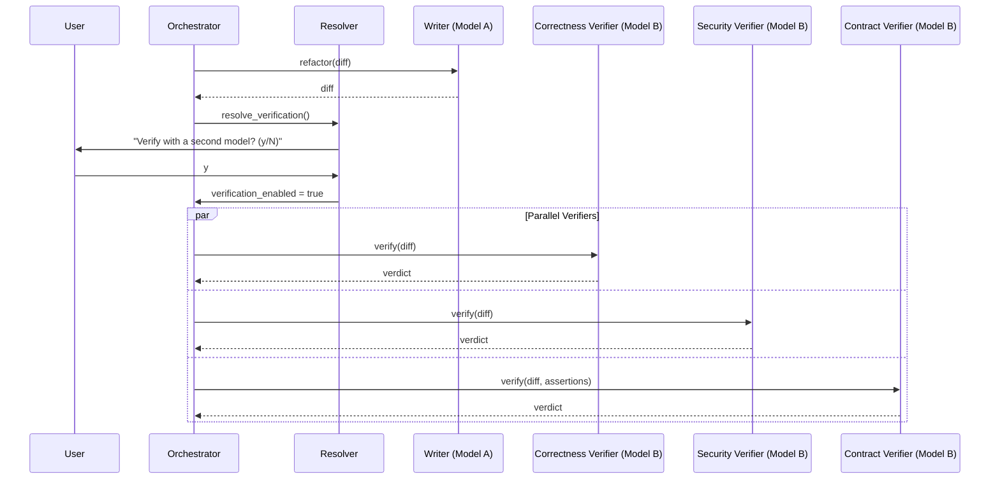
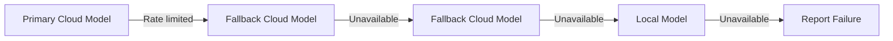

# 14 — Model Strategy

---

## 1. Purpose

This document defines how CodeGuardian selects, routes, verifies, and manages language models. It covers the seven model roles, the model cascade architecture, the single-model default, the cross-model verification option, provider abstraction, local model support, cost optimization, fallback and retry strategy, prompt versioning, and capability requirements per role.

Specific model names are not hardcoded. Model versions change monthly. This document defines the **roles**, the **selection rules**, and the **abstraction layer** that keeps CodeGuardian provider-agnostic.

---

## 2. Design Principles

| # | Principle | Consequence |
|---|---|---|
| **M1** | **Provider-agnostic.** | No single vendor is required. Every model role is defined by capability, not by brand. |
| **M2** | **Single-model default.** | The default configuration runs all roles on one model. Setup is simple. Cost is low. |
| **M3** | **Cross-model verification is opt-in.** | The user decides when the extra safety is worth the extra cost. |
| **M4** | **Local models are first-class.** | No API keys required. Cost is electricity, not tokens. |
| **M5** | **Prompts are versioned artifacts.** | Prompts live in source control with semantic versioning. No string literals in code. |
| **M6** | **Fallback is automatic.** | Rate limits, provider outages, and transient failures trigger automatic fallback. |
| **M7** | **Cost is visible.** | Every model call records tokens and cost. The run summary shows the total. |
| **M8** | **Cost is bounded.** | Retry caps, context budgets, and model routing prevent runaway costs. |

---

## 3. Model Roles

CodeGuardian uses seven model roles. Two are deterministic and do not use a language model. Five use a language model.

| Role | Type | Purpose | Model Required |
|---|---|---|---|
| **Recon Agent** | Deterministic | Builds the Code Property Graph, runs the smoke test, produces the Truth and Drift reports | No LLM |
| **Blast Radius Agent** | Deterministic | Computes callers, contract violations, coverage gaps, blast score | No LLM |
| **Analyst** | LLM | Reads the target, builds the Context Pack | Yes |
| **Tester** | LLM | Writes characterization tests and contract assertions | Yes |
| **Writer** | LLM | Refactors code according to the directive | Yes |
| **Correctness Verifier** | LLM | Independently checks behavioral equivalence | Yes |
| **Security Verifier** | LLM | Independently checks for introduced vulnerabilities | Yes |
| **Contract Verifier** | LLM | Independently checks that caller contracts are preserved | Yes |
| **Skill Curator** | LLM | Extracts reusable patterns from successful runs | Yes |

### 3.1 Role Competence Requirements

Each role has a defined competence requirement. This is what lets the user pick the right model without the docs naming a specific model.

| Role | Context Need | Code Reasoning | Precision | Structured Output | Cost Sensitivity |
|---|---|---|---|---|---|
| **Analyst** | Medium | Medium | Medium | High | High. Cheap model is fine. |
| **Tester** | High | High | High | High | Low. Frontier model required. |
| **Writer** | High | High | High | High | Low. Frontier model required. |
| **Correctness Verifier** | Medium | High | Critical | High | Medium. Different family from Writer. |
| **Security Verifier** | Medium | High | Critical | High | Medium. Different family from Writer. |
| **Contract Verifier** | Medium | High | Critical | High | Medium. Different family from Writer. |
| **Skill Curator** | Low | Medium | Medium | High | High. Cheap model is fine. |

**Why the Writer needs a frontier model:** SWE Refactor Bench, a benchmark of whole-repository migrations, shows that even the best model (Claude Opus 5) scores only 47.0/100 on composite refactoring tasks. Only 28 of 520 runs (5.4%) pass all three stages. The Writer's task is the hardest in the pipeline. A cheap model will fail.

**Why the verifiers need a different model family:** Self-review by the producing model catches only ~68% of semantic drift. The dangerous outcome is the model declaring behavior preserved when it is not. A different model family has different training data, different biases, and different blind spots. This is the single strongest mitigation against the 31.7% silent-endorsement problem.

**Why the Analyst and Skill Curator can use cheap models:** The Analyst's job is context assembly, not code generation. The Skill Curator's job is pattern extraction from a completed run. Both are simpler tasks. A cheap model handles them adequately.

---

## 4. The Model Cascade

CodeGuardian uses a **routed model cascade**. Instead of sending every request to the strongest (and most expensive) model, the cascade routes each request to the cheapest model that can handle it.

### 4.1 Why Cascades Work

Research shows that hybrid orchestration resolves 84% of queries at the small-model level, resulting in an **83% cost reduction** and a latency improvement of over 60% compared to using the large model alone. FrugalGPT demonstrated up to 98% cost reduction through cascade routing, where cheap models handle most queries and expensive ones only see the hard ones. RouteNLP achieves 40–85% cost reduction while retaining 96–100% quality on structured tasks.

### 4.2 The Three Tiers



| Tier | Roles | Model Class | Why |
|---|---|---|---|
| **Tier 1 — Light** | Analyst, Skill Curator | Cheap cloud model or local model | Context assembly and pattern extraction are simpler tasks. |
| **Tier 2 — Standard** | Test generation | Mid-tier cloud model | Writing characterization tests requires code understanding but not the same precision as refactoring. |
| **Tier 3 — Frontier** | Writer, three Verifiers | Frontier cloud model | Refactoring and independent verification require the strongest available models. |

### 4.3 The Cascade Decision

The cascade does not use a separate routing model. It uses the **phase** to determine the tier. The Analyst always uses Tier 1. The Writer always uses Tier 3. The verifiers always use Tier 3 with a different family from the Writer.

This is simpler than semantic routing and more predictable. The phase is a known quantity. There is no routing model to maintain.



---

## 5. The Single-Model Default

The default configuration runs **every LLM role on one model**. The user picks that model. This keeps cost low and setup simple.

### 5.1 How It Works

| Role | Default Model |
|---|---|
| Analyst | The user's chosen model |
| Tester | The user's chosen model |
| Writer | The user's chosen model |
| Correctness Verifier | The user's chosen model |
| Security Verifier | The user's chosen model |
| Contract Verifier | The user's chosen model |
| Skill Curator | The user's chosen model |

### 5.2 When Single-Model Is Appropriate

- The user is exploring the tool for the first time.
- The target repository is small or low-risk.
- The user is using local models with zero API cost.
- The user wants the fastest possible run.

### 5.3 What Single-Model Gives Up

| Dimension | Single-Model | Cross-Model |
|---|---|---|
| **Cost** | Lower | Higher (2–3x for verifiers) |
| **Speed** | Faster | Slower (sequential or parallel verifier calls) |
| **Setup** | One API key | Two or more API keys |
| **Verification strength** | Self-review only | Independent review on a different family |
| **Silent endorsement risk** | Present | Mitigated |

**The honest trade-off:** Single-model is cheaper and faster, but the verifiers share the Writer's blind spots. Cross-model verification is the mitigation for the 31.7% silent-endorsement problem.

---

## 6. The Cross-Model Verification Option

Every run prompts: **"Verify with a second model? (y/N)"**. The default is no. The user decides.

### 6.1 What Changes When Enabled

| Role | Single-Model | Cross-Model |
|---|---|---|
| Analyst | Model A | Model A |
| Tester | Model A | Model A |
| Writer | Model A | Model A |
| Correctness Verifier | Model A | Model B |
| Security Verifier | Model A | Model B |
| Contract Verifier | Model A | Model B |
| Skill Curator | Model A | Model A |

**Model B must be a different family from Model A.** If Model A is Anthropic, Model B should be OpenAI or DeepSeek. A fresh instance of the same model is better than nothing, but a different family is the strongest guarantee.

### 6.2 The Verification Flow



### 6.3 Independence Enforcement

Each verifier is a **fresh model instance**. Its context is constructed from scratch — only the diff and the relevant contract assertions. It never receives the original file, the Context Pack, or the Writer's chain of thought.

| Guarantee | Mechanism |
|---|---|
| **Fresh context** | Verifier context is built explicitly, not inherited from the graph |
| **Diff-only input** | Verifier receives only the diff, never the original |
| **No Writer reasoning** | Verifier never receives the Writer's chain of thought |
| **Different family** | Verifier model family differs from Writer model family |
| **Out-of-graph** | Verifiers run as separate calls, not as graph nodes |

---

## 7. Provider Abstraction

The `ModelProvider` interface abstracts cloud and local LLM APIs. Adding a provider is a plugin.

### 7.1 The Interface

```python
class ModelProvider(Protocol):
    async def complete(self, prompt: str, model: str, options: ModelOptions) -> ModelResponse: ...
    async def stream(self, prompt: str, model: str, options: ModelOptions) -> AsyncIterator[ModelChunk]: ...
    def count_tokens(self, text: str, model: str) -> int: ...
    def get_available_models(self) -> list[ModelInfo]: ...
```

### 7.2 Implementations

| Provider | Protocol | Models |
|---|---|---|
| **AnthropicProvider** | Anthropic API | Claude family |
| **OpenAIProvider** | OpenAI API | GPT family |
| **DeepSeekProvider** | DeepSeek API | DeepSeek family |
| **GoogleProvider** | Google AI API | Gemini family |
| **OpenAICompatibleProvider** | OpenAI-compatible | Ollama, vLLM, llama.cpp, LM Studio, OpenRouter, any OpenAI-compatible endpoint |

### 7.3 Why Provider-Agnostic Matters

The verification architecture requires cross-model independence. Locking to one provider undermines the core differentiator. The provider abstraction ensures that any user can point CodeGuardian at any provider — cloud or local — and the verification guarantee still holds.

This follows the pattern used by production systems: a single `Provider` interface, with each provider implementing the same three-method protocol (`complete`, `stream`, `count_tokens`). Streaming is the load-bearing path; non-streaming is derivable.

---

## 8. Local Model Support

Local models are accessed via **OpenAI-compatible endpoints**. Ollama, vLLM, llama.cpp, and LM Studio all expose this interface. No custom adapter is required.

### 8.1 Local Runtimes

| Runtime | Default Endpoint | Notes |
|---|---|---|
| **Ollama** | `http://localhost:11434/v1` | Easiest setup. Good for development. |
| **vLLM** | `http://localhost:8000/v1` | High-throughput serving. Good for production. |
| **llama.cpp** | `http://localhost:8080/v1` | CPU-optimized. No GPU required. |
| **LM Studio** | `http://localhost:1234/v1` | GUI-based. Good for non-technical users. |
| **LocalAI** | User-configured | Drop-in OpenAI replacement. |

All of these expose the same OpenAI-compatible `/v1/chat/completions` endpoint. Changing the `base_url` is the only configuration required.

### 8.2 What Local Models Can Do

| Role | Local Model Viable? | Notes |
|---|---|---|
| **Analyst** | Yes | Context assembly is a simpler task. |
| **Skill Curator** | Yes | Pattern extraction is a simpler task. |
| **Tester** | Partially | Smaller models may produce incomplete tests. |
| **Writer** | No (for production) | Refactoring requires frontier-level code reasoning. |
| **Verifiers** | No (for production) | Independent verification requires a strong model. |

### 8.3 The Cost Story

For local-model users, cost is electricity, not tokens. The run summary reports zero cloud cost. Token count is still recorded for observability.

---

## 9. Cost Optimization

### 9.1 Cost Levers

| Lever | Impact | How |
|---|---|---|
| **Cascade routing** | 40–85% cost reduction | Route each phase to the cheapest adequate tier |
| **Context Pack budget** | Fewer tokens per call | Only send the target and direct dependencies |
| **Retry cap** | Prevents runaway costs | Hard cap at 3 retries |
| **Prompt caching** | Up to 90% reduction on repeated context | Cache reads cost 10% of input price |
| **Batch API** | 50% discount on non-urgent runs | Use batch endpoints where available |
| **Local models** | Zero cloud cost | Electricity only |
| **Model routing** | Match cost to task | Cheap model for Analyst, frontier for Writer |

### 9.2 Cost Visibility

Every model call records:

| Field | Description |
|---|---|
| `model_id` | The model used |
| `provider` | The provider |
| `tokens_in` | Input tokens |
| `tokens_out` | Output tokens |
| `cost_usd` | Estimated cost |
| `prompt_hash` | Hash of the prompt |
| `context_hash` | Hash of the context |

The run summary shows the total cost. The audit trail records every call.

---

## 10. Fallback and Retry Strategy

### 10.1 Fallback Triggers

| Trigger | Action | Retryable? |
|---|---|---|
| **Rate limit (429)** | Fall back to the next model in the chain | Yes |
| **Provider outage (5xx)** | Fall back to the next model in the chain | Yes |
| **Network timeout** | Retry with exponential backoff | Yes |
| **Context exceeded** | Report to user. Do not retry. | No |
| **Auth failure** | Report to user. Do not retry. | No |
| **Content moderation** | Fall back to the next model | Yes |

### 10.2 Fallback Chain

Each role has a primary model and one or more fallback models. The fallback chain is configured per role.

```toml
[models.writer]
provider = "anthropic"
model = "claude-opus-5.5"
fallbacks = [
  { provider = "openai", model = "gpt-6-astra" },
  { provider = "deepseek", model = "deepseek-v4-pro" },
  { provider = "local", model = "qwen3-coder" }
]
```

### 10.3 Retry Semantics

| Error Category | Retry Behavior |
|---|---|
| **Rate limit** | Retry up to 3 times with exponential backoff. Then fall back. |
| **Provider outage** | Fall back immediately. |
| **Network timeout** | Retry up to 5 times with exponential backoff. |
| **Context exceeded** | Never retry. Report to user. |
| **Auth failure** | Never retry. Report to user. |

**The key insight from production systems:** a rate-limited model is healthy, not failing. Defer it, don't trip its circuit. This distinction moved a throttled model from 3/10 to 10/10 availability in production.

### 10.4 Local Model Fallback

When cloud providers fail, the fallback chain can route to a local model. This is the pattern used by `routeme`, which enables Ollama fallback when cloud providers fail.



---

## 11. Prompt Versioning

Prompts are **versioned artifacts**, not string literals in code. They live in source control with semantic versioning.

### 11.1 Why Prompt Versioning Matters

In 2026, prompt changes are the most common cause of silent LLM regressions. Prompts in source code are a regression machine. Treating prompts as configuration with versions, not as string literals, is the 2026 production standard.

### 11.2 Prompt Storage

```
prompts/
├── analyst/
│   ├── v1.0.0.md
│   ├── v1.1.0.md
│   └── current -> v1.1.0.md
├── tester/
│   ├── v1.0.0.md
│   └── current -> v1.0.0.md
├── writer/
│   ├── v1.0.0.md
│   ├── v1.1.0.md
│   └── current -> v1.1.0.md
├── correctness_verifier/
│   └── v1.0.0.md
├── security_verifier/
│   └── v1.0.0.md
├── contract_verifier/
│   └── v1.0.0.md
└── skill_curator/
    └── v1.0.0.md
```

### 11.3 Semantic Versioning Rules

| Change Type | Version Bump | Example |
|---|---|---|
| **Breaking change** | Major (1.x.x → 2.x.x) | New reasoning structure, different output format, expanded scope |
| **Capability improvement** | Minor (1.0.x → 1.1.0) | Better instructions, additional examples |
| **Small fix** | Patch (1.0.0 → 1.0.1) | Typo fix, formatting change |

This follows the pattern recommended by production prompt management systems: store prompts as versioned artifacts in source control, use semantic versioning to communicate the scope and significance of each change.

### 11.4 Prompt Metadata

Every prompt version includes:

| Field | Description |
|---|---|
| `version` | Semantic version |
| `hash` | Hash of the rendered prompt |
| `change_notes` | What changed and why |
| `creator` | Who made the change |
| `stage` | dev, staging, prod |
| `eval_results` | Test results for this version |

### 11.5 Prompt A/B Testing

Prompt versions are compared quantitatively. The evaluation compares prompt variants on the same tasks and reports the delta in success rate, token usage, and latency. This follows the pattern recommended by Microsoft Foundry: run A/B tests to compare prompt variants quantitatively.

---

## 12. Capability Requirements Per Role

This table defines what each role needs from a model. It lets the user pick the right model without the docs naming a specific model.

| Role | Minimum Context | Minimum Reasoning | Structured Output | Determinism | Cost Sensitivity |
|---|---|---|---|---|---|
| **Analyst** | 32K tokens | Medium | JSON required | Low | High |
| **Tester** | 64K tokens | High | JSON required | Medium | Medium |
| **Writer** | 128K tokens | Critical | Diff required | High | Low |
| **Correctness Verifier** | 32K tokens | High | JSON verdict | Critical | Medium |
| **Security Verifier** | 32K tokens | High | JSON verdict | Critical | Medium |
| **Contract Verifier** | 32K tokens | High | JSON verdict | Critical | Medium |
| **Skill Curator** | 16K tokens | Medium | Markdown | Low | High |

### 12.1 What "Critical" Reasoning Means

The Writer's task is the hardest in the pipeline. It must understand the original code, understand the test file, understand the directive, and produce a refactor that preserves behavior. Research shows that even the best models struggle with this: GPT-6 Astra achieves only 49.2% success on full-app reconstruction tasks, and Claude Opus 5 scores 47.0/100 on SWE Refactor Bench.

### 12.2 What "Critical" Determinism Means

Verifiers must produce consistent verdicts. If the same diff is verified twice, the verdict must be the same both times. This is why verifiers use a fresh context and a defined schema, not free-form reasoning.

---

## 13. Model Selection Guide

### 13.1 For First-Time Users

Use the single-model default with a frontier cloud model. One API key. Lowest setup friction.

### 13.2 For Production Use

Enable cross-model verification. Use a frontier model for Tester and Writer. Use a different frontier family for the three verifiers.

### 13.3 For Offline Use

Use local models via OpenAI-compatible endpoints. The Analyst and Skill Curator can run on local models. The Writer and Verifiers will have lower reliability but zero cost.

### 13.4 For Cost-Sensitive Use

Use the cascade: cheap model for Analyst and Skill Curator, mid-tier for Tester, frontier for Writer and Verifiers. Disable cross-model verification when the target is low-risk.

### 13.5 For Maximum Safety

Use the cascade with cross-model verification. Enable all three verifiers. Use the strongest available models for Writer and Verifiers. Accept the cost.

---

## 14. Related Documents

- `04-architecture.md` — agent roles and phase pipeline
- `06-api-contracts.md` — `ModelProvider` interface and contract tests
- `07-tech-stack.md` — technology decisions for the model layer
- `11-security-performance-observability.md` — secret redaction, cost visibility
- `15-verification-architecture.md` — verifier independence and behavioral equivalence
