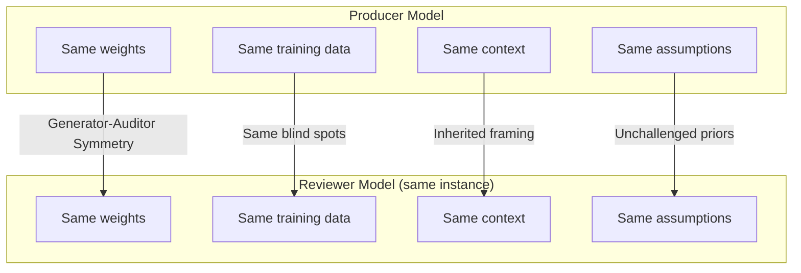
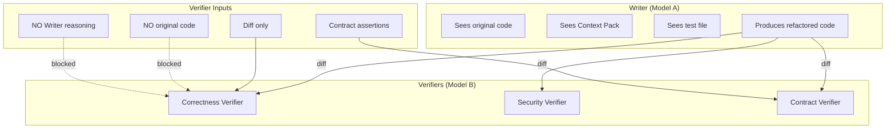
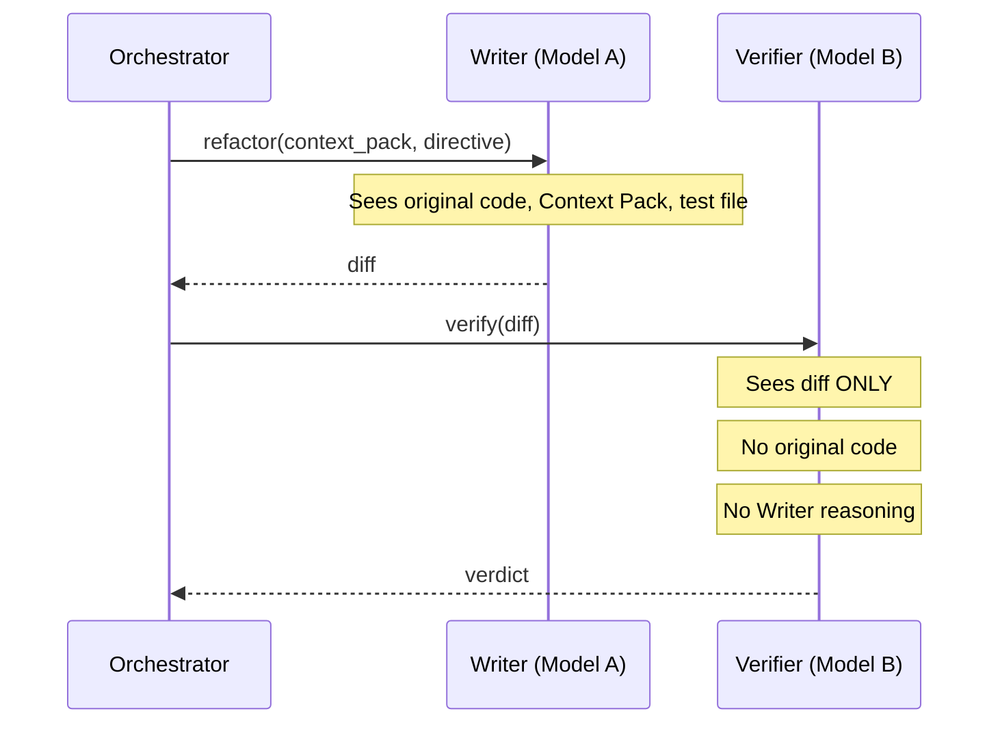
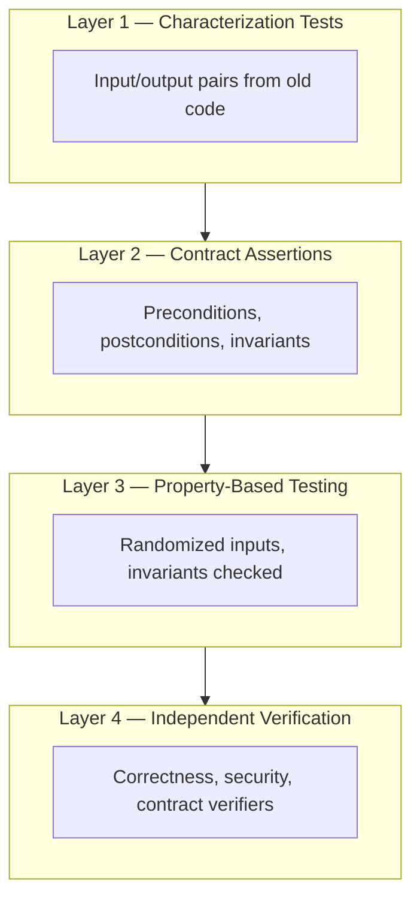
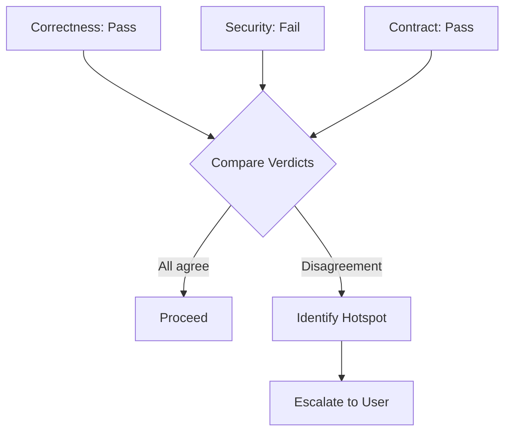
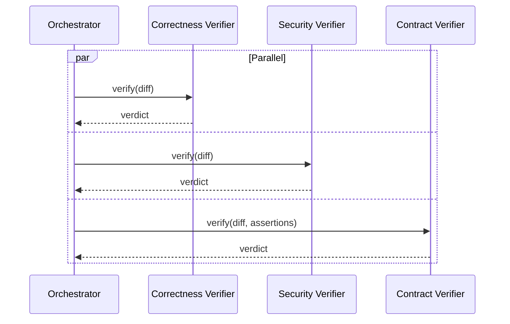
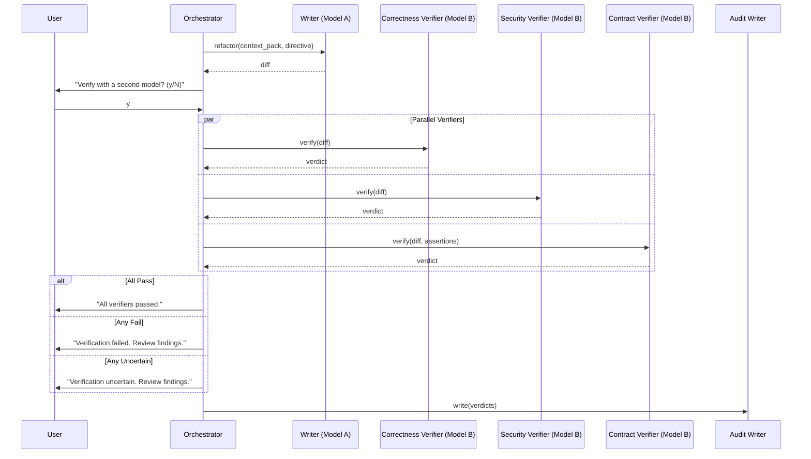

# 15 — Verification Architecture

---

## 1. Purpose

This document defines how CodeGuardian verifies that a refactor is safe. It covers the problem that makes verification necessary, the three independent verifiers, the independence guarantee, behavioral equivalence, the verifier contract, conflict resolution, and the limits of what verification can prove.

This is the document that answers the question: **"How do I know the refactor is safe?"**

---

## 2. The Problem: Self-Review Does Not Work

### 2.1 The Evidence

When the same model writes code and then reviews it, it misses its own errors at a measurable and structural rate. Research across 11 production language models, 980 real modernization calls, and 262 confirmed semantic drift cases found:

| Finding | Result |
|---|---|
| **Self-review silently endorses semantic drift** | 31.7% of drift cases are silently endorsed by the same model that produced them (83/262). |
| **Self-review miss rate** | The per-model self-miss rate is strongly bimodal — ranging from 0% on some models to 46.7% on others. |
| **Model capability does not help** | The miss rate is independent of model capability or cost. Frontier models fail alongside cheap ones. |
| **Errors pass self-review** | 75 of 207 (36%) of errors pass self-review. |
| **Blind spot rate** | Research from Self-Correction Bench measured a 64.5% blind spot rate when models review their own output. |
| **Self-approval bias** | A 2026 self-attribution study found models were 5x more likely to approve their own output, including prompt-injected content. |

### 2.2 Why It Fails

Self-review fails for structural reasons, not because of model quality.



**Generator-Auditor Symmetry (GAS):** When an LLM generates code and audits it from the same direction, it routes through the same compressed manifold, activating the same attractor basins. Same weights, same manifold, same blind spots.

**Shared context and assumptions:** The reviewing model reasons from the same understanding that produced the code. If that understanding was wrong, the review inherits the error. The failures cluster: shared context, shared assumptions, shared blind spots.

**Anchoring bias:** A verifier that reads the implementer's plan inherits its framing. The reviewer sees the problem through the producer's eyes, not as an independent observer.

**Same-session self-review is not independent:** An agent that implements code in one turn and reviews it in the next turn of the same session shares priors, blind spots, and confirmation bias within that context window.

### 2.3 What This Means for CodeGuardian

If CodeGuardian used a single model for writing and reviewing, it would inherit the 31.7% silent endorsement problem. The refactor would pass review, but the behavior would have drifted. This is the failure the project exists to prevent.

The solution is **independent verification**: a fresh model instance, on a different model family, with no shared context, that sees only the diff.

---

## 3. The Three Verifiers

CodeGuardian uses three independent verifiers. Each has a different lens. Each runs on a fresh model instance with no shared context.



### 3.1 Correctness Verifier

| Attribute | Value |
|---|---|
| **Lens** | Behavioral equivalence |
| **Question** | Does the refactored code produce the same outputs as the original? |
| **Input** | Diff only |
| **Output** | Verdict: pass, fail, uncertain |
| **Model** | Frontier model, different family from Writer |

The Correctness Verifier checks that the refactor preserves observable behavior. It does not see the original code. It reasons about the diff and the contract assertions. If the diff changes a return type, a data shape, or a side effect ordering in a way that callers depend on, the verifier flags it.

### 3.2 Security Verifier

| Attribute | Value |
|---|---|
| **Lens** | Introduced vulnerabilities |
| **Question** | Did the refactor introduce a security vulnerability? |
| **Input** | Diff only |
| **Output** | Verdict: pass, fail, uncertain |
| **Model** | Frontier model, different family from Writer |

The Security Verifier checks for injection flaws, unsafe deserialization, credential exposure, path traversal, and other security regressions. It has a separate lens from the Correctness Verifier. A refactor can be behaviorally equivalent and still introduce a vulnerability.

### 3.3 Contract Verifier

| Attribute | Value |
|---|---|
| **Lens** | Caller contract preservation |
| **Question** | Do the callers still work? |
| **Input** | Diff, contract assertions |
| **Output** | Verdict: pass, fail, uncertain |
| **Model** | Frontier model, different family from Writer |

The Contract Verifier checks that every caller's implicit contract is preserved. It reads the contract assertions generated by the Tester and verifies that the diff does not break any of them.

**Contract assertions** capture:
- Preconditions: what must be true before the function is called
- Postconditions: what must be true after the function returns
- Invariants: what must remain unchanged

This follows the Refactoring by Contract (RbC) pattern: contracts consist of preconditions, postconditions, and invariants.

### 3.4 Why Three Lenses, Not One

| Verifier | What It Catches | What It Misses |
|---|---|---|
| **Correctness** | Behavioral drift, output shape changes, side-effect ordering | Security regressions, caller contract breaks |
| **Security** | Injection, unsafe patterns, credential exposure | Behavioral drift, caller contract breaks |
| **Contract** | Caller assumption breaks, implicit contract violations | Security regressions, internal behavioral drift |

A single verifier has a single lens. Three verifiers with different lenses catch a broader class of defects. Each verifier runs on the same diff, but asks a different question.

---

## 4. The Independence Guarantee

Independence is enforced architecturally, not by convention.

### 4.1 The Five Rules of Independence

| # | Rule | Enforcement |
|---|---|---|
| **1** | **Fresh model instance.** | Each verifier is a new model call. No shared session, no shared context. |
| **2** | **Diff-only input.** | The verifier receives only the diff. No original code. No Context Pack. No test file. |
| **3** | **No Writer reasoning.** | The verifier never receives the Writer's chain of thought. |
| **4** | **Different model family.** | When cross-model verification is enabled, the verifier runs on a different model family from the Writer. |
| **5** | **Out-of-graph.** | Verifiers run as separate calls, not as nodes inside the LangGraph pipeline. |

### 4.2 How Independence Is Enforced



**Context construction:** The verifier's context is built explicitly from scratch. It is not inherited from the graph state. The orchestrator constructs a new prompt containing only the diff and the relevant contract assertions.

**Model selection:** When cross-model verification is enabled, the verifier model is resolved from a different family than the Writer. If the Writer is Anthropic, the verifier is OpenAI or DeepSeek. If the Writer is OpenAI, the verifier is Anthropic or DeepSeek.

**Why out-of-graph matters:** If the verifier ran as a LangGraph node, it would inherit the graph state, which includes the Writer's context. Running out-of-graph ensures the verifier's context is constructed explicitly, not accumulated.

### 4.3 What the Verifier Cannot See

| Input | Verifier Access |
|---|---|
| Diff | Yes |
| Contract assertions | Yes (Contract Verifier only) |
| Original code | No |
| Context Pack | No |
| Test file | No |
| Writer's chain of thought | No |
| Graph state | No |
| Previous verifier verdicts | No |

**Rule:** The verifier sees only the diff and the contract assertions. Nothing else.

### 4.4 The Honest Limitation

Even with independent verification, there is a residual risk. The verifier is still a language model. It can miss defects. Independent verification reduces the silent endorsement rate, it does not eliminate it.

The 31.7% silent endorsement rate is for **self-review** (same model, same context). Independent verification on a different model family with fresh context reduces this, but the exact reduction is not yet measured in production for this specific architecture. The architecture is designed to minimize the risk, not to claim zero risk.

---

## 5. Behavioral Equivalence

### 5.1 What "Behavior Preserved" Means

Behavior preservation means: given the same input, the program produces the same output before and after refactoring. This is the definition from Griswold and Opdyke: behavior preservation means that given the same input, a program will compute the same output before and after refactoring.

### 5.2 The Layers of Verification

CodeGuardian verifies behavioral equivalence in four layers.



| Layer | What It Checks | Strength | Limitation |
|---|---|---|---|
| **Characterization tests** | Same inputs produce same outputs | Concrete, evidence-backed | Only covers tested inputs |
| **Contract assertions** | Preconditions, postconditions, invariants preserved | Catches implicit contracts | Only covers declared contracts |
| **Property-based testing** | Invariants hold over random inputs | Broader input coverage | Requires property specification |
| **Independent verification** | Semantic reasoning over the diff | Catches what tests miss | Model-dependent |

### 5.3 Property-Based Testing

Property-based testing generalizes example-based testing. Instead of checking specific input/output pairs, it checks that a property holds for all inputs generated by a strategy.

The EquivcheckEr tool applies this to refactoring verification: it detects places where the code has changed, then compares the old and new versions of all functions that depend on the changed code by applying them to randomly generated inputs.

**For CodeGuardian:** Property-based testing is used for functions with clear input/output contracts. The Tester agent generates both example-based characterization tests and property-based tests where applicable.

### 5.4 Sound Behavior Equivalence

Selfsame is a sound behavior-equivalence checker for Python. It captures the real arguments that tests or the application feed the code, replays two versions in isolated subprocesses, and compares the results structurally.

**For CodeGuardian:** This is the pattern for runtime output comparison. If the characterization tests capture the actual arguments used in practice, the sandbox can replay both versions and compare outputs structurally.

### 5.5 What Behavioral Equivalence Does Not Cover

| Not Covered | Why | Mitigation |
|---|---|---|
| **Timing** | Refactors can change performance characteristics | Performance benchmarks in CI |
| **Concurrency** | Race conditions may not appear in tests | Best-effort. Document the limitation. |
| **Environment-dependent behavior** | Behavior may vary by platform, locale, or config | Test on all supported platforms |
| **Undefined behavior** | If the original behavior is undefined, there is nothing to preserve | Report and stop |
| **Untested code paths** | Coverage gaps are invisible to tests | Coverage gap identification in the blast radius report |

---

## 6. The Verifier Contract

Every verifier implements the same interface.

### 6.1 Interface Definition

```python
class Verifier(Protocol):
    async def verify(self, diff: str, context: VerifierContext) -> VerifierVerdict: ...
```

### 6.2 Verifier Context

```python
@dataclass
class VerifierContext:
    diff: str
    contract_assertions: list[ContractAssertion] | None
    change_kind: str  # syntactic, semantic, contract, signature
    blast_score: int
```

### 6.3 Verifier Verdict

```python
@dataclass
class VerifierVerdict:
    verifier_type: str  # correctness, security, contract
    verdict: str        # pass, fail, uncertain
    confidence: float   # 0.0 to 1.0
    findings: list[Finding]
    context_hash: str
    model: ModelInfo
    timestamp: str
```

### 6.4 Verdict Values

| Verdict | Meaning | Action |
|---|---|---|
| **Pass** | The verifier confirms the property holds. | Proceed. |
| **Fail** | The verifier confirms the property does not hold. | Report the failure. Do not apply. |
| **Uncertain** | The verifier cannot confirm or deny. | Escalate to the user. |

**Three-valued verdict status:** Unknown is never optimistically folded to pass. If the verifier cannot determine whether the property holds, the verdict is uncertain, not pass. This is the conservative principle: an uncertain verdict is a lead, not a confirmed finding, but it is also not a pass.

### 6.5 Finding Schema

```python
@dataclass
class Finding:
    severity: str      # info, warning, critical
    message: str
    location: str      # file:line if applicable
    evidence_hash: str
```

### 6.6 Verdict Validation

A verdict is valid if:

| # | Condition |
|---|---|
| **1** | The verifier type is one of: correctness, security, contract |
| **2** | The verdict is one of: pass, fail, uncertain |
| **3** | The confidence is between 0.0 and 1.0 |
| **4** | The context_hash matches the hash of the diff the verifier received |
| **5** | The model identity is recorded |
| **6** | The timestamp is present |

Invalid verdicts are rejected. The orchestrator treats a rejected verdict as uncertain.

---

## 7. Conflict Resolution

### 7.1 When Verifiers Disagree

The three verifiers can disagree. Correctness says pass, security says fail. Contract says uncertain, correctness says pass. The orchestrator must resolve the conflict.

### 7.2 Conflict Resolution Rules

| Scenario | Resolution |
|---|---|
| **All pass** | Proceed to output. |
| **Any fail** | Report the failure. Do not apply. Offer the user the option to override with explicit consent. |
| **Any uncertain, no fail** | Escalate to the user. Show the uncertain verdict and the finding. |
| **Pass and fail** | The fail takes precedence. The orchestrator reports both verdicts and asks the user to decide. |
| **All uncertain** | Escalate to the user. The diff is inconclusive. |

### 7.3 Conflict-Aware Meta-Verification

CodeGuardian uses a conflict-aware approach: when verifiers disagree, the orchestrator allocates additional computation only to the disagreement hotspot.



The conflict is treated as an informative diagnostic signal, not as noise. The disagreement itself is evidence that the change carries risk.

### 7.4 Escalation to the User

When the verifiers disagree or return uncertain, the orchestrator presents a structured summary to the user.

```
Verification Conflict
─────────────────────
Correctness Verifier: PASS (confidence 0.92)
Security Verifier:    FAIL (confidence 0.87)
Contract Verifier:    PASS (confidence 0.88)

Security finding:
  ⚠ Potential injection in refactored function
    Location: utils/parser.py:47
    Severity: warning

The verifiers disagree. Review the finding before proceeding.
  [View Diff]  [Override and Apply]  [Discard]
```

**Override requires explicit consent.** The override is recorded in the audit log with the user's identity and the reason.

### 7.5 Why Not Majority Vote

Majority vote is not used. Two verifiers passing does not mean the diff is safe. If the security verifier flags a real vulnerability, the fact that correctness and contract verifiers passed is not a reason to ignore it. The fail takes precedence.

---

## 8. Verification Failure Modes

### 8.1 Verifier Unavailable

If a verifier is unavailable (model outage, rate limit, timeout):

| Situation | Action |
|---|---|
| **Single verifier unavailable** | Report the failure. The run continues with the available verifiers. |
| **All verifiers unavailable** | Report the failure. The run stops. The user decides whether to continue without verification. |
| **Verifier timeout** | Treat as uncertain. Escalate to the user. |

### 8.2 Verifier Returns Invalid Output

If the verifier returns output that does not validate against the verdict schema:

| Situation | Action |
|---|---|
| **Malformed JSON** | Retry once with a stricter prompt. If it fails again, treat as uncertain. |
| **Missing required fields** | Treat as uncertain. |
| **Invalid verdict value** | Treat as uncertain. |

### 8.3 Verifier Disagrees with Itself

If the same verifier returns different verdicts on the same diff:

| Situation | Action |
|---|---|
| **Same diff, different verdicts** | Run the verifier a third time. If the third verdict differs from both, treat as uncertain. |

This is rare but possible with temperature > 0. CodeGuardian sets temperature to 0 for verifiers to minimize this.

---

## 9. Cost and Latency

### 9.1 The Cost of Verification

| Configuration | Per 500-Line File | Relative Cost |
|---|---|---|
| **Single-model (no verification)** | Base cost | 1.0x |
| **Cross-model verification (3 verifiers)** | Base + verifier cost | ~2.1x |

The verification premium is roughly 2.1x. This buys independent correctness, security, and contract verification on a different model family.

### 9.2 Latency

The three verifiers run in parallel via `asyncio.gather()`. The wall-clock time is the duration of the slowest verifier, not the sum of all three.



### 9.3 When to Skip Verification

Verification is prompted per run. The user can skip it when:

- The target is low-risk.
- The change is purely syntactic.
- The user is exploring the tool.
- The user is using local models where cost is zero but latency matters.

The user cannot skip verification when the blast score is above the block threshold. High blast scores always require verification.

---

## 10. Verifier Independence Metrics

CodeGuardian tracks verification quality over time.

| Metric | Description | Target |
|---|---|---|
| **Verifier agreement rate** | How often all three verifiers agree | Track. Investigate disagreement. |
| **Verifier disagreement rate** | How often verifiers disagree | Track. Disagreement is a signal. |
| **Uncertain rate** | How often verifiers return uncertain | Track. High uncertain rate indicates ambiguity. |
| **Self-review catch rate** | How often independent verifiers catch something the Writer missed | Track. This is the value of independence. |
| **False positive rate** | How often a verifier flags a safe refactor | Track. Calibrate. |
| **False negative rate** | How often a verifier approves a broken refactor | Track. This is the critical metric. |

**Anti-metric:** A verifier approving a change that breaks a caller's contract is a release blocker. This is tracked as A-9 in `02-goals-non-goals-metrics.md`.

---

## 11. The Verification Flow



---

## 12. Related Documents

- `02-goals-non-goals-metrics.md` — verification metrics and anti-metrics
- `04-architecture.md` — agent roles and phase pipeline
- `05-data-model.md` — verification result schema
- `06-api-contracts.md` — verifier interface and contract tests
- `10-testing-cicd-deployment.md` — how verification is tested
- `11-security-performance-observability.md` — security verifier scope, performance budget
- `14-model-strategy.md` — model roles and cross-model verification
