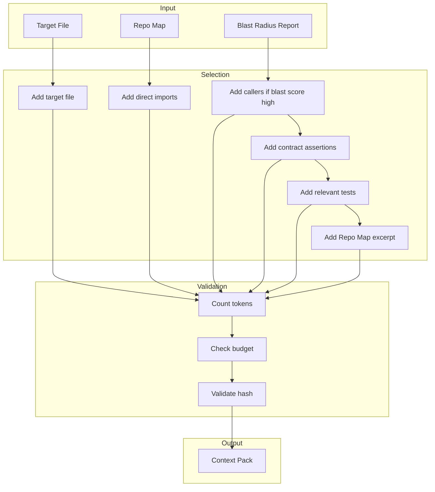
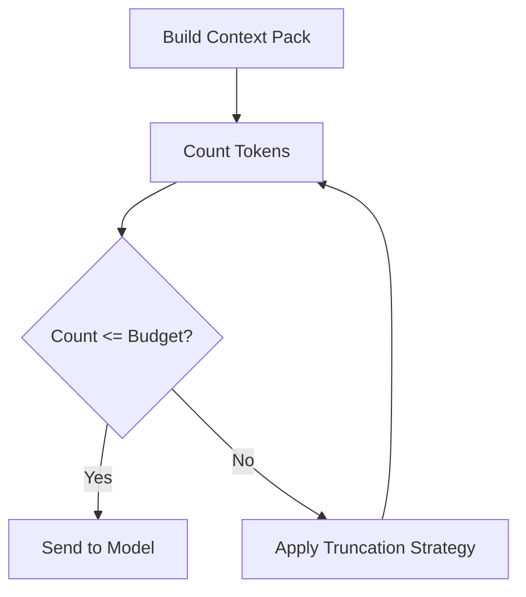
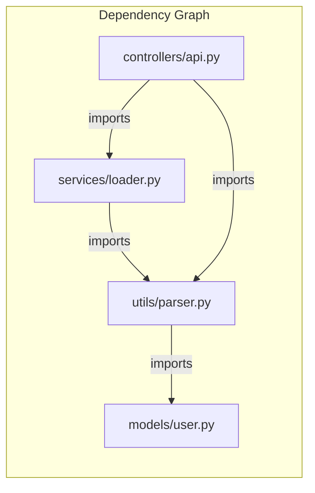
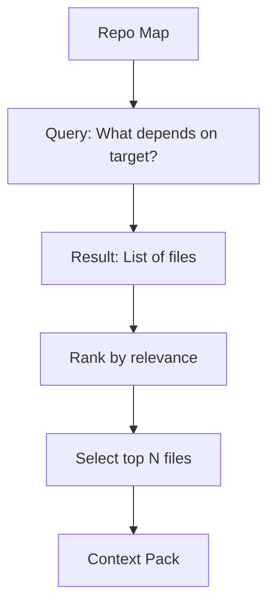
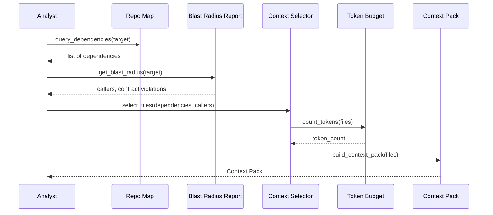
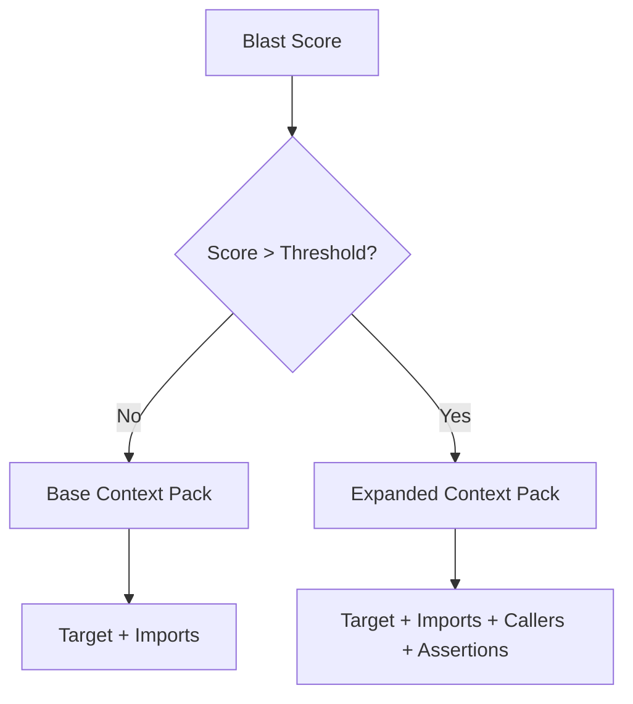
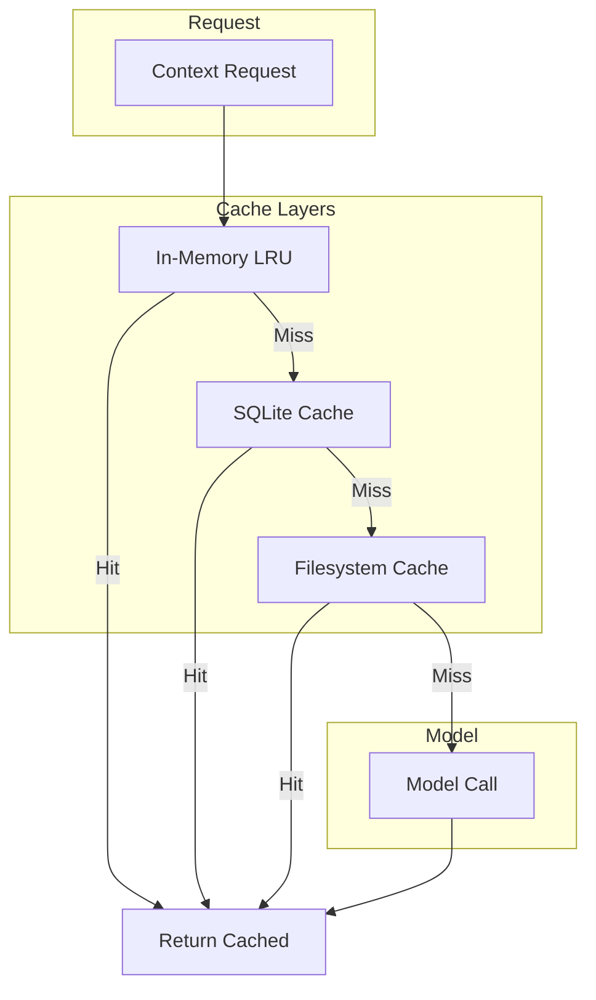
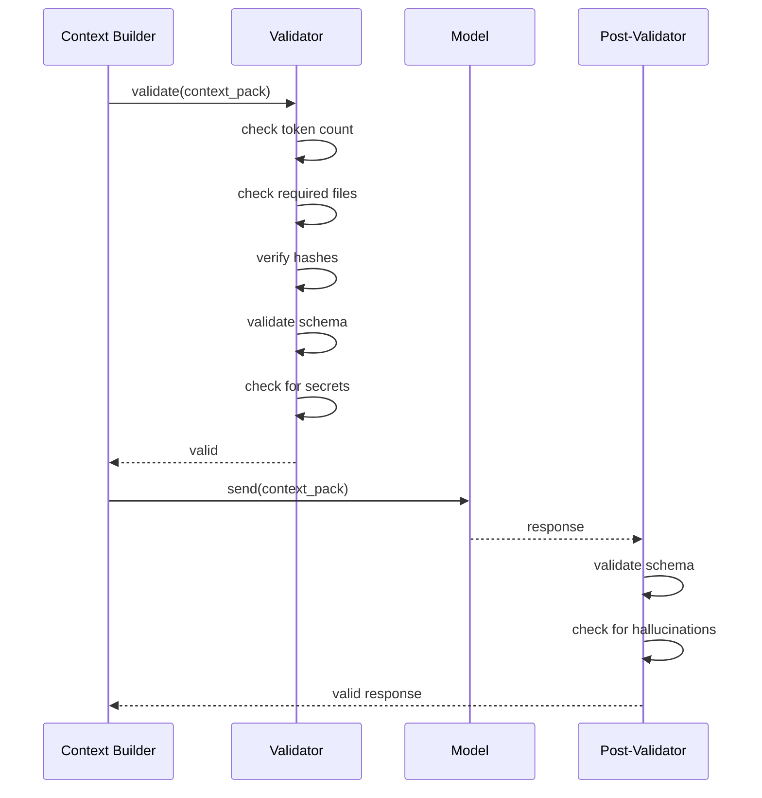

# 16 — Context Engineering

---

## 1. Purpose

This document defines how CodeGuardian manages the context it sends to language models. It covers the problem of context rot, the Context Pack, token budgeting, the Repo Map, context assembly rules, progressive disclosure, caching, and context validation.

This is the document that answers: **"How does CodeGuardian keep context small, relevant, and correct?"**

Context engineering is the discipline of designing and building dynamic systems that provide the right information and tools, in the right format, at the right time. It is now recognized as the real bottleneck in building reliable AI agents. Research shows that as context length grows, the probability of a correct answer drops — the curve is not flat, it is steep. More context is not better. The right context is better.

---

## 2. The Problem: Context Rot

### 2.1 The Evidence

Production data from leading AI coding tools shows models begin failing at around 25–30k tokens, far below their advertised context windows. The effective context window is measured in tens of thousands, not millions, of tokens.

| Finding | Source |
|---|---|
| **Models begin failing at 25–30k tokens** | Production data from Chroma research, cited in context engineering literature. |
| **Context degradation is not uniform** | The model's ability to recall information from its context degrades long before the window is full, regardless of the claimed context window size. |
| **Most coding tasks fall into the "complex" band** | Most real coding tasks need more than 8k tokens but less than 128k. |
| **Context is a finite resource with diminishing marginal returns** | Just like humans, LLMs have limited attention budgets. Every token consumes capacity. |

### 2.2 The Four Shapes of Context Failure

Drew Breunig identifies four distinct ways context can fail:

| Failure Mode | Description |
|---|---|
| **Context Poisoning** | A hallucination or error enters the context and gets repeatedly referenced, compounding the error. |
| **Context Distraction** | The context becomes so long that the model focuses on the context itself rather than the task. |
| **Context Confusion** | Superfluous content in the context influences the model's response, even if it is not relevant. |
| **Context Clash** | New information added to the context contradicts existing information, causing the model to reason incorrectly. |

### 2.3 The Economic Dimension

A million-token prompt is not just slow — it is expensive. A 10-million-token window can require 10–100x more compute for a single inference than a 100k-token call. Cost scales super-linearly with context length. For a tool that runs many calls per refactor, this is prohibitive.

### 2.4 The Implication

Sending the full repository to a model is not viable. It is slow, expensive, and unreliable. CodeGuardian must send only what the model needs, when it needs it.

---

## 3. The Context Pack

The Context Pack is the minimal set of files sent to a model for a single task. It contains the target and its required dependencies — nothing more.

### 3.1 What the Context Pack Contains

| Component | Default | When Blast Score Is High |
|---|---|---|
| **Target file** | Yes | Yes |
| **Direct imports** | Yes | Yes |
| **Callers** | No | Yes |
| **Callees** | No | Yes |
| **Contract assertions** | No | Yes |
| **Relevant tests** | No | Yes |
| **Repo Map excerpt** | Yes | Yes |
| **Config files** | No | No |
| **Full repository** | Never | Never |

### 3.2 Context Pack Schema

```json
{
  "$schema": "https://json-schema.org/draft/2020-12/schema",
  "$id": "https://codeguardian.dev/schemas/context-pack/v1.1.json",
  "title": "Context Pack",
  "type": "object",
  "required": ["schema_version", "target", "files", "token_budget", "token_count", "blast_aware"],
  "properties": {
    "schema_version": {"type": "string", "const": "1.1"},
    "target": {
      "type": "object",
      "required": ["path", "language"],
      "properties": {
        "path": {"type": "string"},
        "language": {"type": "string"},
        "symbol": {"type": "string"},
        "line_range": {
          "type": "array",
          "items": {"type": "integer"},
          "minItems": 2,
          "maxItems": 2
        }
      }
    },
    "blast_aware": {"type": "boolean"},
    "files": {
      "type": "array",
      "items": {
        "type": "object",
        "required": ["path", "content_hash", "reason"],
        "properties": {
          "path": {"type": "string"},
          "content_hash": {"type": "string"},
          "reason": {"type": "string", "enum": ["target", "direct_import", "caller", "callee", "test", "config", "contract"]},
          "content": {"type": "string"}
        }
      }
    },
    "contract_assertions": {
      "type": "array",
      "items": {"type": "object"}
    },
    "token_budget": {"type": "integer", "minimum": 1},
    "token_count": {"type": "integer", "minimum": 0},
    "truncated": {"type": "boolean", "default": false},
    "truncation_strategy": {"type": "string", "enum": ["none", "summarize", "drop_oldest", "sliding_window"]}
  }
}
```

### 3.3 Context Pack Construction



---

## 4. Token Budgeting

### 4.1 Budget Per Role

Each model role has a token budget. The budget is the maximum number of tokens the Context Pack may contain. The budget is enforced before the pack is sent.

| Role | Budget | Rationale |
|---|---|---|
| **Analyst** | 32K | Context assembly is a simpler task. Less context is needed. |
| **Tester** | 64K | Test generation requires understanding the target and its dependencies. |
| **Writer** | 128K | Refactoring requires the most context — target, dependencies, callers, tests. |
| **Correctness Verifier** | 32K | The verifier sees only the diff. Minimal context. |
| **Security Verifier** | 32K | Same. |
| **Contract Verifier** | 32K | Diff plus contract assertions. |
| **Skill Curator** | 16K | Pattern extraction from a completed run. Minimal context. |

### 4.2 Budget Enforcement



### 4.3 Truncation Strategies

When the Context Pack exceeds the budget, truncation is applied in priority order.

| Strategy | Description | When Used |
|---|---|---|
| **Drop oldest** | Remove the oldest files first | When the target is at the end of the pack |
| **Summarize** | Replace file content with a summary | When a file is large but only partially relevant |
| **Sliding window** | Keep the first and last N lines | When a file is large and the middle is less relevant |
| **Drop least relevant** | Remove files with the lowest relevance score | When the pack has many files |

**Rule:** The target file is never truncated. If the target itself exceeds the budget, the target is split into smaller targets.

### 4.4 Context Budget by Phase

| Phase | Role | Context Sources | Budget |
|---|---|---|---|
| **Phase 2 — Context Gathering** | Analyst | Repo Map, blast radius, target | 32K |
| **Phase 3 — Safety Net** | Tester | Context Pack, test conventions | 64K |
| **Phase 4 — Refactor** | Writer | Context Pack, directive, test file | 128K |
| **Phase 6 — Independent Verify** | Correctness Verifier | Diff only | 32K |
| **Phase 6 — Independent Verify** | Security Verifier | Diff only | 32K |
| **Phase 6 — Independent Verify** | Contract Verifier | Diff, contract assertions | 32K |
| **Post-run** | Skill Curator | Run trajectory, verdicts | 16K |

---

## 5. The Repo Map

The Repo Map is the compressed structural index of the codebase. It has two layers: a dependency graph and a hierarchical index. The Repo Map is what makes context assembly possible without reading the whole repository.

### 5.1 Two Layers

| Layer | Question It Answers | Structure |
|---|---|---|
| **Dependency graph** | What depends on this? What does this depend on? | Nodes = files, edges = imports/calls |
| **Hierarchical index** | Where is this symbol? | Directory → file → symbol |

### 5.2 Dependency Graph



### 5.3 Hierarchical Index

```json
{
  "utils/": ["parser.py", "helpers.py", "validators.py"],
  "models/": ["user.py", "session.py", "config.py"],
  "services/": ["loader.py", "processor.py"],
  "controllers/": ["api.py", "web.py"]
}
```

### 5.4 Repo Map Construction

The Repo Map is built by the Code Intelligence Kernel during reconnaissance. It is cached per commit hash. When a file changes, only the affected portions are updated.

| Operation | Cost | When |
|---|---|---|
| Full Repo Map build | Minutes for large repos | First run per commit |
| Incremental update | Milliseconds per changed file | After a file change |

### 5.5 Repo Map as Context Source

The Repo Map is not sent to the model directly. It is used to select which files to include in the Context Pack.



---

## 6. Context Assembly Rules

### 6.1 Selection Rules

| Rule | Description | Priority |
|---|---|---|
| **Target first** | The target file is always included. | 1 |
| **Direct imports** | Files imported by the target are included. | 2 |
| **Callers** | Files that call the target are included when blast score is high. | 3 |
| **Callees** | Files called by the target are included when blast score is high. | 4 |
| **Contract assertions** | Generated assertions are included for the Contract Verifier. | 5 |
| **Relevant tests** | Tests covering the target and callers are included. | 6 |
| **Repo Map excerpt** | A compressed excerpt of the Repo Map is included for orientation. | 7 |

### 6.2 Exclusion Rules

| Rule | Description |
|---|---|
| **No node_modules** | Never included. Tier 1 exclusion. |
| **No .venv** | Never included. Tier 1 exclusion. |
| **No build output** | Never included. Tier 1 exclusion. |
| **No lock files** | Never included. Not source code. |
| **No .env files** | Never included. Secrets. |
| **No full repository** | Never included. Too large. |

### 6.3 Context Assembly Flow



### 6.4 Context Relevance Scoring

When the pack has more files than the budget allows, files are ranked by relevance.

| Factor | Weight | Description |
|---|---|---|
| **Direct dependency** | High | The file is imported by the target |
| **Caller** | High | The file calls the target |
| **Contract violation** | Critical | The file has a contract violation |
| **Coverage gap** | High | The file has no test coverage |
| **Test file** | Medium | The file tests the target |
| **Distance in graph** | Medium | How many hops from the target |

### 6.5 Dynamic Context Expansion

When the blast score is above the warn threshold, the Context Pack expands to include callers and their contract assertions.



---

## 7. Progressive Disclosure and Caching

### 7.1 Progressive Disclosure

Context is loaded on demand, not all at once.

| Component | Loading Strategy |
|---|---|
| **MCP tool definitions** | Loaded on first use, not at startup |
| **Model capabilities** | Loaded on first call, not at startup |
| **Plugin schemas** | Loaded on first use, not at startup |
| **Repo Map** | Loaded when needed, not at startup |

**Why progressive disclosure:** Loading everything upfront wastes tokens, increases latency, and degrades model performance. The research on MCP tool loading shows that "loading every tool definition into the model's context window upfront wastes tokens, increases latency, and degrades model performance."

### 7.2 Caching Layers

| Cache | Key | TTL | Invalidation |
|---|---|---|---|
| **Recon cache** | `repo_id + commit_hash` | Until commit changes | New commit → new key |
| **AST cache** | `file_hash + grammar_version` | Session lifetime | File edit → new hash |
| **Dependency graph** | `repo_id + commit_hash` | Until commit changes | New commit → rebuild |
| **MCP tool responses** | `tool_name + input_hash` | 5 minutes | Explicit invalidation |
| **Context Pack** | `target + commit_hash + blast_score` | Until commit changes | New commit → rebuild |

### 7.3 Semantic Caching

Semantic caching matches semantically similar queries to cached responses, not just exact string matches. This is the standard production pattern:

| Approach | How It Works |
|---|---|
| **Exact matching** | Hash the prompt, look up the hash |
| **Semantic matching** | Embed the prompt, find similar prompts in the cache |

**Impact:** Semantic caching cuts MCP client token usage by ~98% on cached reads. A well-designed cache can handle most repeated queries without hitting the model.

### 7.4 Cache Architecture



---

## 8. Context Validation

### 8.1 Validation Before Send

Before the Context Pack is sent to a model, it is validated.

| Check | Description | Failure Action |
|---|---|---|
| **Token count** | Token count is within budget | Apply truncation |
| **Required files** | Target file is present | Fail. Target is always required. |
| **Hash verification** | File hashes match the current state | Rebuild pack |
| **Schema validation** | Pack validates against schema | Fail. Report the error. |
| **No secrets** | No API keys, tokens, or passwords | Redact and rebuild |

### 8.2 Validation After Response

After the model responds, the response is validated.

| Check | Description | Failure Action |
|---|---|---|
| **Schema validation** | Response validates against the expected schema | Retry with a stricter prompt |
| **No hallucinated files** | The model did not invent file paths | Flag and report |
| **No hallucinated symbols** | The model did not invent function names | Flag and report |

### 8.3 Context Validation Flow



---

## 9. Context Engineering Metrics

CodeGuardian tracks context quality over time.

| Metric | Description | Target |
|---|---|---|
| **Average token count** | Tokens per Context Pack | Track. Compare to budget. |
| **Truncation rate** | How often the pack is truncated | Track. High rate indicates budget too tight. |
| **Cache hit rate** | Cache hits per cache type | Track. Higher is better. |
| **Context rot rate** | How often the model fails to use context correctly | Track. High rate indicates context quality issue. |
| **Hallucination rate** | How often the model invents files or symbols | Track. High rate indicates context is incomplete. |

---

## 10. Related Documents

- `04-architecture.md` — components that build and consume the Context Pack
- `05-data-model.md` — Context Pack schema
- `07-tech-stack.md` — AST caching, SQLite caching
- `11-security-performance-observability.md` — performance budgets, secret redaction
- `14-model-strategy.md` — model roles and context requirements
- `15-verification-architecture.md` — diff-only context for 